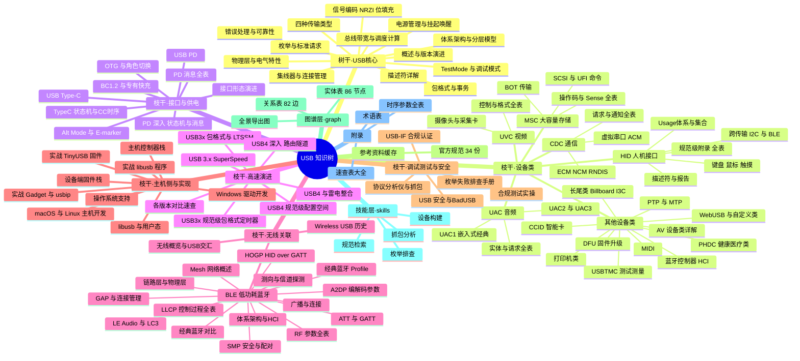
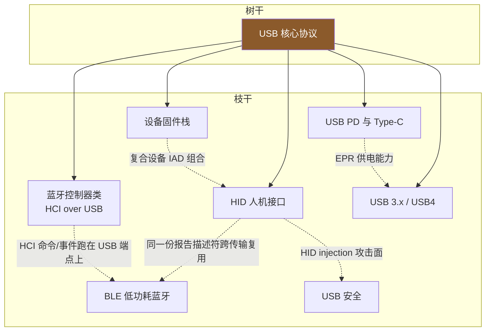

# USB 知识树 · 总图

> 🌳 本文件是整棵知识树的地图。树干 = USB 核心协议；枝干 = 依赖/关联 USB 的协议族；分枝 = 子协议模块；叶 = 具体知识点。
> 📌 本库定位：**USBTree · USB/BLE 领域知识系统** —— 知识树 × 关系图谱 × 可执行技能 × 官方规范缓存。图谱层（`graph/`，80 实体/76 边）与技能层（`skills/`，4 个技能包）已建成，见 [README](README.md) 的 Agent 使用指南。

## 一、树的比喻：如何使用这棵树

| 树的部位 | 对应内容 | 目录 |
|---|---|---|
| **树根** | 概述、历史与全景 | `00-知识树总图.md`、`README.md` |
| **树干** | USB 核心协议（一切枝干的基础） | `10-树干-USB核心/` |
| **主枝（枝干）** | 设备类、接口与供电、高速演进、无线关联、主机实现、调试安全 | `20~70` 各目录 |
| **分枝** | HID、CDC、MSC、UAC、UVC、BLE 等协议族内部的子模块 | 各枝干目录下的子目录 |
| **树叶** | 具体知识点：一个描述符、一条命令、一次配对、一个电阻值 | 各文件内的小节 |
| **果实/枯枝** | 工具速查、术语表、失败的历史协议（Wireless USB） | `90-附录/`、`50/99-*.md` |

阅读规则：**自底向上**——先读懂树干（USB 核心协议），任何枝干上的问题最终都会落回树干的某个知识点（描述符、传输类型、枚举流程）。

## 二、全景图（Mermaid 思维导图）

## 三、枝干之间的"嫁接点"（交叉关系）

知识树不是严格分层的——有些枝干彼此嫁接，这是理解全树的关键：

| 嫁接点 | 说明 | 涉及文件 |
|---|---|---|
| HID ↔ BLE | USB-HID 与 HOGP 共用同一套 Usage / 报告描述符体系，一套描述符两处使用 | HID 子树与 [HOGP](50-枝干-无线关联/BLE-低功耗蓝牙/07-HOGP-HIDoverGATT.md) |
| USB ↔ 蓝牙 | 蓝牙适配器 = HCI 命令/事件/数据流跑在 USB 批量端点上 | [蓝牙控制器类](20-枝干-设备类协议/其他设备类/05-蓝牙控制器类-HCIoverUSB.md) |
| Type-C ↔ 一切 | Type-C 是 3.x/USB4 的物理载体，PD 决定供电，Alt Mode 决定显示 | [接口与供电](30-枝干-接口与供电/02-USBType-C详解.md) |
| 枚举 ↔ 一切 | 任何设备类的第一步都是树干的枚举流程 | [枚举流程](10-树干-USB核心/08-枚举流程与标准请求.md) |

## 四、三条推荐阅读路径

1. **驱动/内核工程师**：树干 01→02→05→06→07→08→09 → [主机侧 01/02](60-枝干-主机侧与实现/01-主机控制器栈全景.md) → [抓包](70-枝干-调试测试与安全/01-协议分析仪与抓包.md)
2. **嵌入式固件工程师**：树干 06→07→08 → 目标设备类（如 [HID](20-枝干-设备类协议/HID-人机接口设备/00-HID概述与定位.md)、[CDC-ACM](20-枝干-设备类协议/CDC-通信设备类/01-虚拟串口ACM.md)）→ [固件栈](60-枝干-主机侧与实现/03-设备端固件栈.md) → [排查手册](70-枝干-调试测试与安全/02-枚举失败排查手册.md)
3. **硬件/充电/线缆工程师**：树干 03→10 → [接口形态](30-枝干-接口与供电/01-接口形态演进.md) → [Type-C](30-枝干-接口与供电/02-USBType-C详解.md) → [USB PD](30-枝干-接口与供电/04-USBPD协议.md) → [高速演进](40-枝干-高速演进/01-USB3x与SuperSpeed.md)

## 五、声明

本知识库基于公开规范整理：USB-IF 各版规范（USB 2.0 / 3.2 / Type-C / PD / 各设备类规范）与 Bluetooth SIG（Bluetooth Core Spec）。规范原文是唯一权威来源，本库用于学习与速查；个别未确定的编码细节均已标注"见规范原文"。
