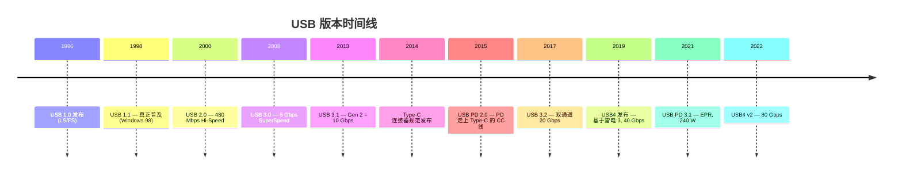

# 概述与版本演进

> 🌳 知识树位置: 树干 → 叶
> 相邻叶子: [02-体系架构与分层模型.md](02-体系架构与分层模型.md)

## 1. USB 是什么

USB（Universal Serial Bus，通用串行总线）是 1990 年代由 Intel、Microsoft、Compaq 等 7 家公司联合发起的**主机centric 外设总线标准**，目标是取代当时 PC 背后杂乱的串口、并口、PS/2、游戏口。今天它同时承担四件事：

1. **数据通信**——设备与主机间的分层数据传输；
2. **供电**——5V 基础供电，经 Type-C/PD 扩展到最高 240W；
3. **设备描述与驱动绑定**——即插即用（Plug and Play）的协议化；
4. **扩展生态载体**——通过 Alt Mode/隧道承载显示（DP）、PCIe（雷电）等其它协议。

核心设计原则：**主机轮询（Host-centric / polled bus）**。设备永远不能主动发数据，一切事务由主机发起；设备唯一的"主动性"是挂起状态下的远程唤醒信号。这一原则贯穿全树，是理解后续所有机制（NAK、中断传输、PING）的前提。

## 2. 设计目标与被取代者

| 被取代的接口 | 缺点 | USB 的对应优势 |
|---|---|---|
| RS-232 串口 | 速率低、无即插即用、接口针脚不规范 | 统一连接器 + 枚举自描述 |
| PS/2 键鼠 | 不支持热插拔（早期） | 热插拔 + 枚举 |
| 并口（LPT） | 体积大、速率低 | 高速双向传输 |
| 游戏口（Game Port） | 模拟、校准复杂 | HID 类标准化（见 [HID 子树](../20-枝干-设备类协议/HID-人机接口设备/00-HID概述与定位.md)） |
| 软盘/CD 刻录分发 | — | 大容量存储（MSC） |

关键能力清单：统一连接器与线缆、热插拔（Hot-plug）、即插即用（枚举自动加载驱动）、总线供电（无需外接电源）、可扩展速率、多设备级联（集线器，最多 127 个可寻址设备）。

## 3. 版本演进时间线

### 版本与速率总表

| 规范版本 | 发布 | 速率模式 | 标称速率 | 编码后有效速率 | 备注 |
|---|---|---|---|---|---|
| USB 1.0 | 1996-01 | LS (Low Speed) | 1.5 Mbit/s | — | 首版，鲜有产品 |
| USB 1.1 | 1998-09 | LS / FS (Full Speed) | 1.5 / 12 Mbit/s | — | 真正普及的起点 |
| USB 2.0 | 2000-04 | HS (High Speed) | 480 Mbit/s | ≈ 414 Mbit/s（8b/10b 无关，位填充+帧开销） | 引入微帧与事务转换器 |
| USB 3.0 | 2008-11 | SS Gen1 | 5 Gbit/s | 4 Gbit/s（8b/10b） | 全双工双 Simplex |
| USB 3.1 | 2013-07 | SS Gen2 | 10 Gbit/s | ≈ 9.77 Gbit/s（128b/132b） | 新编码方案 |
| USB 3.2 | 2017-09 | Gen 1×1 / 1×2 / 2×1 / 2×2 | 5 / 10 / 20 Gbit/s | ×2 模式双通道并发 | ×2 仅限 Type-C |
| USB4 | 2019-08 | Gen 2×2 / Gen 3×2 | 20 / 40 Gbit/s | 隧道化架构 | 兼容雷电 3 |
| USB4 v2 | 2022-10 | Gen 4 | 80 Gbit/s（非对称可达 120） | PAM-3 调制 | USB 80Gbps |

### 命名混乱澄清表（重要叶子）

USB-IF 的市场命名在 2019 年彻底重编，"USB 3.0/3.1"的说法已被官方废弃，但民间仍在混用。查任何资料先对齐下表：

| 规范名称（现行） | 旧称 1 | 旧称 2 | 现行营销名 | 速率 |
|---|---|---|---|---|
| USB 3.2 Gen 1 | USB 3.0 | USB 3.1 Gen 1 | SuperSpeed USB 5Gbps | 5 Gbit/s |
| USB 3.2 Gen 2 | — | USB 3.1 Gen 2 | SuperSpeed USB 10Gbps | 10 Gbit/s |
| USB 3.2 Gen 2×2 | — | — | SuperSpeed USB 20Gbps | 20 Gbit/s |
| USB4 Gen 3×2 | — | — | USB 40Gbps | 40 Gbit/s |
| USB4 Gen 4 | — | — | USB 80Gbps | 80 Gbit/s |

识别口诀：**看速率别看版本号**——"USB 3.2"设备可能是 5/10/20 Gbps 中任何一个。

## 4. 供电能力演进

| 时代 | 机制 | 最大能力 |
|---|---|---|
| USB 1.x/2.0 | 单位负载 (Unit Load) 100 mA，配置后高功耗 500 mA | 2.5 W (5V×0.5A) |
| USB 3.x | 150 mA 单位负载，配置后 900 mA | 4.5 W |
| BC 1.2（充电规范） | DCP/CDP 端口 | 7.5 W (1.5A) |
| Type-C 电阻编码 | Rp 声明电流 | 15 W (5V×3A) |
| USB PD 2.0/3.0 | CC 线数字协商 | 100 W (20V×5A) |
| USB PD 3.1 EPR | 扩展功率范围 | 240 W (48V×5A) |

详见枝干 [接口与供电](../30-枝干-接口与供电/02-USBType-C详解.md) 与 [USB PD 协议](../30-枝干-接口与供电/04-USBPD协议.md)。

## 5. 组织与规范体系

- **USB-IF**（USB Implementers Forum）：拥有者与认证机构。规范原文在 usb.org 发布，开发者注册后免费下载。
- 规范族结构（树干层面）：
  - *Universal Serial Bus Specification rev 2.0* —— LS/FS/HS 的圣经，第 5/8/9 章是核心（信号/框架/设备框架）；
  - *USB 3.2 Specification*（含 3.0/3.1 历史合并）、*USB4 Specification*；
  - *Universal Serial Bus Type-C Cable and Connector Specification*；
  - *USB Power Delivery Specification*；
  - 各设备类规范（Device Class Specs），构成本树的所有枝干，见[设备类索引](../20-枝干-设备类协议/00-设备类索引.md)。
- 认证与合规见 [USB-IF 合规认证](../70-枝干-调试测试与安全/03-USB-IF合规认证.md)。

## 6. 与其它总线的坐标系

| 总线 | 关系 |
|---|---|
| RS-232 / PS/2 / LPT | 被 USB 取代的对象 |
| IEEE 1394 (FireWire) | 同代竞争者，高成本致败 |
| PCIe | USB4 通过隧道承载它（[USB4 与雷电](../40-枝干-高速演进/02-USB4与雷电整合.md)） |
| I²C / SPI | 板内低速总线；HID 可跨传输运行（[HID 跨传输](../20-枝干-设备类协议/HID-人机接口设备/10-HID跨传输I2C与BLE.md)） |
| 蓝牙 BLE | 与 USB 平行的无线总线，交汇于 HCI-over-USB 与 HID（[无线概览](../50-枝干-无线关联/00-无线概览与USB交汇.md)） |

## 相关节点

- 下一叶: [02-体系架构与分层模型.md](02-体系架构与分层模型.md)
- 枝干: [各版本对比速查](../40-枝干-高速演进/03-各版本对比速查.md)
- 枝干: [接口形态演进](../30-枝干-接口与供电/01-接口形态演进.md)
