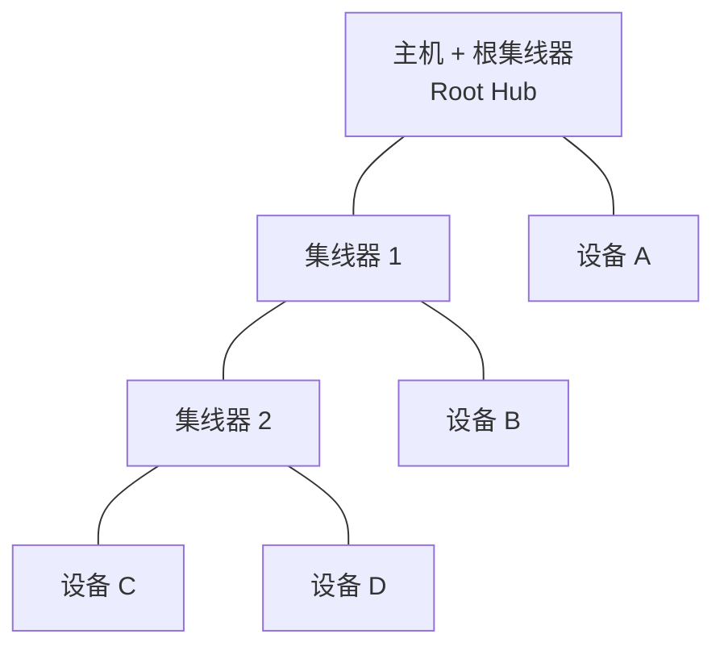

# 体系架构与分层模型

> 🌳 知识树位置: 树干 → 叶
> 上一叶: [01-概述与版本演进.md](01-概述与版本演进.md) · 下一叶: [03-物理层与电气特性.md](03-物理层与电气特性.md)

## 1. 三种角色

| 角色 | 英文 | 职责 |
|---|---|---|
| 主机 | Host | 唯一的调度者：发起一切事务、分配地址、轮询设备、管理带宽与电源。每条 USB 总线**有且只有一个主机**（USB4 的 Host-to-Host 通信是例外，见[高速演进](../40-枝干-高速演进/02-USB4与雷电整合.md)） |
| 设备 | Device | 功能提供者：响应主机请求、上报数据。逻辑上 = 一个 USB 逻辑设备（唯一地址）+ 若干接口（功能） |
| 集线器 | Hub | 扩展器：一个上行口 + N 个下行口，转发事务并管理端口（详见[集线器与连接管理](09-集线器与连接管理.md)） |

USB 集线器在协议层也是一种设备（类代码 0x09），所以"设备"是广义概念。

## 2. 拓扑：物理星型，逻辑点对点



- 物理上是以主机为根的**星型树**，集线器只能级联。
- 逻辑上主机把每个设备当作**点对点**连接对待：主机的"客户软件"只看得到自己的设备，集线器对功能层透明。
- 规模上限：
  - 7 位设备地址，0 保留作默认地址 → 最多 **127 个设备**（含集线器）；
  - 含根集线器最多 **7 层**；主机与设备之间的链路上最多串联 **5 个非根集线器**（剩余层次留给设备/集线器本身），这是传播延迟约束。
- USB 3.x 引入路由字符串后，高速包不再向所有下行口广播（见[高速演进](../40-枝干-高速演进/01-USB3x与SuperSpeed.md)）。

## 3. 分层模型（树干的主心骨）

主机与设备两端**层与层垂直对应**，水平通信只在物理层真实发生，上层是逻辑对等体：

```mermaid
graph LR
    subgraph 主机 Host
        A1[客户软件 / 类驱动<br/>Function Layer] 
        A2[USB 系统软件<br/>USBD + HCD, Device Layer]
        A3[主机控制器 + 根集线器<br/>Bus Interface Layer]
    end
    subgraph 设备 Device
        B3[SIE + 收发器 PHY<br/>Bus Interface Layer]
        B2[USB 逻辑设备<br/>端点0, 枚举, Device Layer]
        B1[功能 Function<br/>接口 + 端点组, Function Layer]
    end
    A1 <-. 逻辑通道/管道 .-> B1
    A2 <-. 默认管道 端点0 .-> B2
    A3 === 总线 | D+ D- VBUS | === B3
```

| 层 | 主机侧 | 设备侧 | 树内对应知识 |
|---|---|---|---|
| 功能层 (Function Layer) | 类驱动 / 客户软件 | 功能固件（接口+端点组合） | 全部设备类枝干（[索引](../20-枝干-设备类协议/00-设备类索引.md)） |
| 设备层 (USB Device Layer) | USBD：枚举、标准请求、地址/配置管理 | 端点 0、描述符、默认管道 | [描述符详解](07-描述符详解.md)、[枚举流程](08-枚举流程与标准请求.md) |
| 总线接口层 (Bus Interface) | 主机控制器（UHCI/OHCI/EHCI/xHCI） | SIE（串行接口引擎）+ PHY | [信号编码](04-信号编码与比特流.md)、[包格式](05-包格式与事务.md)、[主机控制器栈](../60-枝干-主机侧与实现/01-主机控制器栈全景.md) |

**SIE（Serial Interface Engine）** 是设备端硬件状态机，自动完成：NRZI 编解码、位填充/删除、SYNC/EOP 生成检测、CRC 校验、地址比对、PID 解析。固件只在 SIE 校验通过的包之后介入——调试时记住：**SIE 层的问题（时钟偏差、位填充）在固件日志里是看不见的**。

## 4. 端点与管道：一切通信的落点

- **端点 (Endpoint)**：设备端的数据收发缓冲区，用 4 位编号（0~15）+ 1 位方向（IN=设备→主机，OUT=主机→设备）标识。**IN/OUT 以主机视角命名**。
- **端点 0**：每个设备必有，双向，专用于控制传输（枚举与标准请求），也叫**默认控制管道**。
- **管道 (Pipe)**：主机端软件对"某端点+传输类型+带宽+特性"的逻辑抽象：
  - **消息管道 (Message Pipe)**：仅端点 0，有固定格式（Setup/Data/Status）；
  - **流管道 (Stream Pipe)**：中断/批量/同步端点，无结构约定。
- 端点必须在描述符中声明（[描述符详解](07-描述符详解.md)），主机按声明分配带宽与调度。

## 5. 设备状态机（USB 2.0 视角）

```mermaid
stateDiagram-v2
    [*] --> Attached: 插入, VBUS 上电
    Attached --> Powered: 上电完成
    Powered --> Default: 复位, 得到默认地址0
    Default --> Addressed: SET_ADDRESS 成功
    Addressed --> Configured: SET_CONFIGURATION 成功
    Configured --> Suspended: 总线空闲≥3ms
    Suspended --> Configured: 恢复信号
    Configured --> [*]: 拔出
```

要点：

1. **Attached→Powered**：设备检测到 VBUS 即上电，但必须等到总线复位才可响应（上电后除端点 0 的基本电路外不得乱拉总线）。
2. **Default**：所有设备初始都用地址 0，主机用它与设备完成第一次描述符读取，再分配唯一地址（见[枚举流程](08-枚举流程与标准请求.md)）。
3. **Addressed**：SET_ADDRESS 的新地址在**该请求状态阶段完成后**生效——常见固件错误是提前切换导致主机收到无应答。
4. **Configured**：只有进入 Configured 态，功能端点才开始工作；高功耗设备此时才可取用超过 100 mA 的电流（150 mA on 3.x）。
5. **Suspended** 与上述状态正交：任何工作态都可以被挂起（见[电源管理](10-电源管理与挂起唤醒.md)）。

## 6. 数据流模型：客户—功能对等

一次数据交换的逻辑路径（以"应用读取 U 盘"为例）：

```
应用 → 文件系统 → MSC 类驱动 → USB 核心(构造 URB/IRP) → HCD(排入调度)
→ 主机控制器(打包/编码) → 总线 → 设备 SIE(解码/CRC) → 端点缓冲 → MSC 固件 → 闪存
```

反向返回数据走同样路径的镜像。理解这条链路后，[错误处理](11-错误处理与可靠性.md)中每一环如何报告错误就都有了位置感：电气错误在 PHY/SIE 被 CRC 捕获，协议错误在设备层表现为 STALL，类语义错误由类驱动翻译。

## 7. 速度与"多速并存"的架构处理

- HS 设备接入时先以 FS 检测，再通过 **Chirp 握手**升级到 HS（详见[信号编码](04-信号编码与比特流.md)）。
- USB 3.x 设备走独立的 SS 双 Simplex 线对枚举，同时保留 D+/D- 用于向后兼容与首次检测。
- 一个 3.x 集线器内部同时包含 3.x 集线器与 2.0 集线器两套逻辑——低速设备插在 3.x 集线器上实际挂在它的 2.0 半区。

## 相关节点

- 下一叶: [03-物理层与电气特性.md](03-物理层与电气特性.md)
- 主机侧展开: [主机控制器栈全景](../60-枝干-主机侧与实现/01-主机控制器栈全景.md)
- 设备侧展开: [设备端固件栈](../60-枝干-主机侧与实现/03-设备端固件栈.md)
