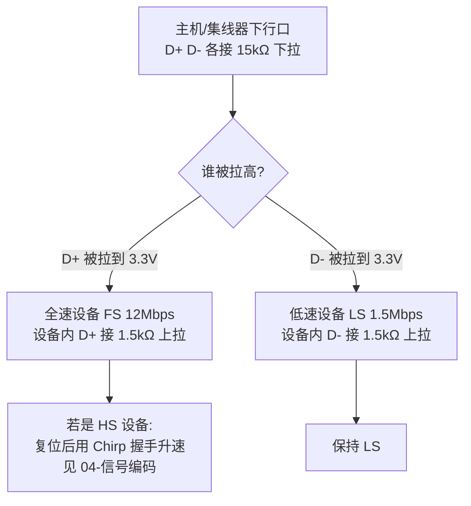

# 物理层与电气特性

> 🌳 知识树位置: 树干 → 叶
> 上一叶: [02-体系架构与分层模型.md](02-体系架构与分层模型.md) · 下一叶: [04-信号编码与比特流.md](04-信号编码与比特流.md)

## 1. USB 2.0 的四根线

| 线 | 名称 | 电气规格 | 功能 |
|---|---|---|---|
| 1 | VBUS | 4.75~5.25 V（源端），最坏情形设备端可低至 4.4 V | 总线供电 |
| 2 | D− | 90 Ω 差分阻抗双绞线，与 D+ 成对 | 差分数据 |
| 3 | D+ | 同上 | 差分数据 |
| 4 | GND | — | 参考地 / 回流 |

Mini/Micro 接口增加第 5 根 **ID** 线，用于 OTG 角色判定（详见[接口形态演进](../30-枝干-接口与供电/01-接口形态演进.md)）。

## 2. 供电模型（USB 2.0 时代）

- **单位负载 (Unit Load) = 100 mA**：
  - 未配置设备（枚举未完成/未 SET_CONFIGURATION）最多取 1 个单位负载；
  - 配置为高功耗 (bMaxPower > 100 mA) 后最多 **500 mA**；
  - 低功耗设备永远不超过 100 mA，且不能被远程唤醒负载例外。
- 集线器下行口按端口供电（每口 1 单位负载待机 + 5 单位负载满配）或 ganged 分组供电，必须支持过流检测与报告（见[集线器](09-集线器与连接管理.md)）。
- 挂起态限流 **2.5 mA**——注意这个数字比一个单位负载还小，做低功耗设备时挂起路径要独立核算。
- 3.x 时代：单位负载 150 mA，最大 900 mA；Type-C/PD 体系彻底另起炉灶（[Type-C](../30-枝干-接口与供电/02-USBType-C详解.md)、[USB PD](../30-枝干-接口与供电/04-USBPD协议.md)）。

## 3. 速度检测：上拉/下拉的博弈

这是全树最重要的电气"握手"，发生在任何数据包之前：

固件启示：**D+/D- 的 1.5 kΩ 上拉何时接入由固件控制**（很多 MCU 是"使能 USB 外设"这个动作）。固件初始化完成后再使能上拉，主机才能看到"设备插入"——这就是软件模拟热插拔的电气基础。

## 4. 线缆与连接器

### 4.1 引脚定义（公头，从接触面看）

| 连接器 | 1 | 2 | 3 | 4 | 5 |
|---|---|---|---|---|---|
| Type-A / Type-B | VBUS | D− | D+ | GND | — |
| Mini-B / Micro-B | VBUS | D− | D+ | **ID** | GND |
| Type-A/B (3.0 版加宽) | VBUS | D− | D+ | GND | + SSTX±/SSRX± 共 9 针 |

3.0 的 SSTX/SSRX 与 D+/D- 物理隔离——3.x 高速通信与 2.0 共用连接器但不用同一对线。

### 4.2 线缆规格要点

| 参数 | FS | LS | HS/SS |
|---|---|---|---|
| 最大长度（规范建议） | 5 m | 3 m | 5 m（HS）/ 主动线缆延长（SS/USB4） |
| 差分阻抗 | 90 Ω ±15% | 同左 | 90 Ω ±15%（SS 更严） |
| 结构 | 非屏蔽可用（LS） | — | 必须屏蔽双绞 + 地线 |

常见故障源头：仅充电线（没有 D+/D- 线对）、超长劣质线（差分阻抗失控→眼图闭合）、接头氧化。系统性排查见[枚举失败排查手册](../70-枝干-调试测试与安全/02-枚举失败排查手册.md)。

## 5. 信号幅度与阈值（FS/LS）

| 参数 | FS | LS |
|---|---|---|
| 驱动幅度 | 0 / 3.3 V 单端摆幅（差分） | 同 FS |
| 差分接收器灵敏度 | |VID| ≥ 200 mV | 同 |
| 单端阈值 | 0.8 / 2.0 V 之间 | 同 |
| 上升/下降时间 | 4~20 ns | 75~300 ns |

**J/K 状态极性相反**是 LS 的著名坑：

| 总线状态 | FS 含义 | LS 含义 |
|---|---|---|
| Differential 1 | **J**（空闲态） | **K** |
| Differential 0 | K | J |
| SE0（两线均低） | 复位/EOP 用 | 同 |
| SE1（两线均高） | 非法 | 非法 |

## 6. USB 3.x 的物理层变化

- 每方向一对独立差分线（SSTX+/− 主机→设备，SSRX+/− 设备→主机），**全双工**，与 2.0 的半双工轮询根本不同。
- 8b/10b（Gen1，5 Gbps→有效 4 Gbps）→ 128b/132b（Gen2，10 Gbps，效率 97.7%）。
- 幅度降到约 800~1200 mV 峰峰值（Gen1），通过均衡 (Equalization) 补偿通道损耗。
- 线缆认证分级、主动线缆（红光雷电线/光纤）与 E-marker 详见 [AlternateMode 与 E-marker](../30-枝干-接口与供电/05-AlternateMode与E-marker.md)。
- 信号完整性验证手段：眼图 (Eye Diagram)、TDR 阻抗测量——属于[合规认证](../70-枝干-调试测试与安全/03-USB-IF合规认证.md)的电气测试项。

## 7. 插入检测与上电时序

1. 主机/集线器持续驱动 15 kΩ 下拉，轮询检测任一数据线被拉高 → 判定有设备接入；
2. 主机读端口状态，稳定去抖（通常 100 ms 量级的软件延时）后对端口复位；
3. 设备侧：检测 VBUS 有效 → 初始化 SIE → 使能 D+/D- 上拉 → 等待复位；
4. ESD 防护（TVS 阵列）是量产设备标配，注意其结电容对高速信号的影响（选低容 TVS）。

## 相关节点

- 下一叶: [04-信号编码与比特流.md](04-信号编码与比特流.md)
- 枝干: [Type-C 详解](../30-枝干-接口与供电/02-USBType-C详解.md)
- 枝干: [高速演进](../40-枝干-高速演进/01-USB3x与SuperSpeed.md)
- 应用: [枚举失败排查手册](../70-枝干-调试测试与安全/02-枚举失败排查手册.md)
