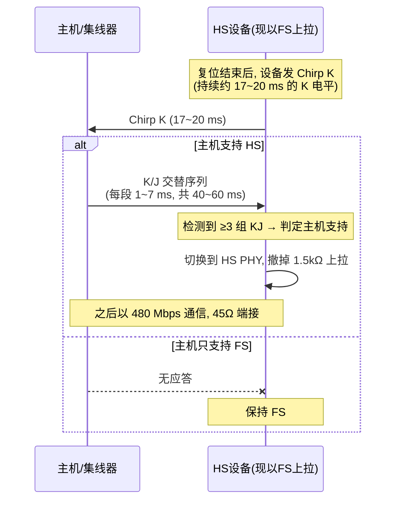

# 信号编码与比特流

> 🌳 知识树位置: 树干 → 叶
> 上一叶: [03-物理层与电气特性.md](03-物理层与电气特性.md) · 下一叶: [05-包格式与事务.md](05-包格式与事务.md)

## 1. NRZI 编码：0 翻转，1 保持

USB 2.0 线上不传时钟，靠 **NRZI（Non-Return-to-Zero Inverted）** 编码携带时序信息：

| 数据位 | NRZI 动作 |
|---|---|
| 0 | 电平翻转（J↔K） |
| 1 | 电平保持 |

示例：设初始态为 J，发送比特流 `1 1 1 0 1 0 0 1`：

```
数据:  1    1    1    0    1    0    0    1
NRZI:  J    J    J    K    K    J    K    K
```

风险：长串 1 → 长时间无翻转 → 接收端时钟漂移失锁。解决方案就是位填充。

## 2. 位填充 (Bit Stuffing)

规则：**每连续 6 个 1 之后，无论下一位是什么，强制插入一个 0**（保证至少每 7 位一次翻转）。

```
原始:   0111111 0 ...      → 连续六个 1 后插入 0
发送:   01111110 ...
```

- 填充发生在**整个包内**（PID 到 CRC，不含 SYNC 与 EOP 的特殊电平序列）；
- 接收端自动删除填充位；若在数据区收到 7 个连续 1，即**位填充错误 (Bit Stuff Error)** → 丢弃整包、不应答（发送方超时重传，见[错误处理](11-错误处理与可靠性.md)）；
- 位填充让实际总线占用率与数据内容相关——理论带宽计算时按最坏情形留余量（FS 每帧有效位时间约 12000 个）。

## 3. SYNC 域：每个包的开胃菜

接收端需要用 SYNC 对齐每位采样时钟：

| 速率 | SYNC 长度 | NRZI 波形 | 比特 |
|---|---|---|---|
| FS/LS | 8 位 | KJKJKJKK | `00000001` |
| HS | 32 位 | (KJ)×15 后接 KK | 32 位 |

主机与设备都用 SYNC 的跳变沿做时钟恢复；HS 需要更长 SYNC 是因为 480 Mbps 下锁相更快更严。

## 4. EOP（包结束）与总线特殊状态

| 状态/序列 | 定义 | 用途 |
|---|---|---|
| EOP (FS/LS) | SE0 持续 2 位时间 + J 持续 1 位 | 正常包结束标记 |
| EOP (HS) | 故意制造的 NRZI 位错误（无填充违规错） | HS 用电气特征替代 |
| 复位信号 | **SE0 ≥ 10 ms** | 主机复位端口/设备 |
| 空闲 (Idle) | FS: J 态 / LS: J 态（各自极性） | 无包时的静默态 |
| 挂起 (Suspend) | 空闲 ≥ 3 ms | 设备进入低功耗（[电源管理](10-电源管理与挂起唤醒.md)） |
| 恢复 (Resume) | **K 态 ≥ 20 ms** + 低速 EOP | 唤醒 |
| 连接指示 | D+（FS/HS）或 D-（LS）被拉高 | 速度检测（[物理层](03-物理层与电气特性.md)） |

记忆口诀：**复位看 SE0 十毫秒，挂起看空闲三毫秒，唤醒看 K 态二十毫秒**。

## 5. HS Chirp 握手：从全速升到高速

HS 设备接入时先被识别为 FS（D+ 上拉），复位信号结束后发生"谈判"：



排查联想：**HS 设备始终以 FS 运行**，多半是 Chirp 握手环节失败（PHY 供电不足、时钟偏差、上拉未按规范撤除）。更多见[排查手册](../70-枝干-调试测试与安全/02-枚举失败排查手册.md)。

## 6. 时钟与容差

| 项目 | FS/LS | HS |
|---|---|---|
| 数据速率容差 | ±0.25%（FS 从设备），主机更严 | ±500 ppm |
| 每帧抖动要求 | 帧间隔 1 ms ±若千 ns | 微帧 125 µs |
| 帧长 | 1 ms（每帧一个 SOF） | 125 µs 微帧 ×8（每微帧一个 SOF） |

晶振选型教训：内部 RC 振荡器通常达不到 ±0.25%，必须用晶体或经时钟恢复——用内部 RC 的设备枚举失败是经典案例。

## 7. 3.x 的编码（速览）

USB 3.x 放弃 NRZI/位填充，改用：
- **Gen1**: 8b/10b 分组编码（保证直流平衡与时钟内容），加扰 (Scrambling) 扩频；
- **Gen2**: 128b/132b 块编码（效率 97.7%）+ 更强加扰；
- 训练与对齐交给有序集 (Ordered Sets) 与 LFPS 信令，详见 [USB3x 与 SuperSpeed](../40-枝干-高速演进/01-USB3x与SuperSpeed.md)。

## 相关节点

- 上一叶: [03-物理层与电气特性.md](03-物理层与电气特性.md) · 下一叶: [05-包格式与事务.md](05-包格式与事务.md)
- 错误路径: [11-错误处理与可靠性.md](11-错误处理与可靠性.md)
- 实战: [枚举失败排查手册](../70-枝干-调试测试与安全/02-枚举失败排查手册.md)
