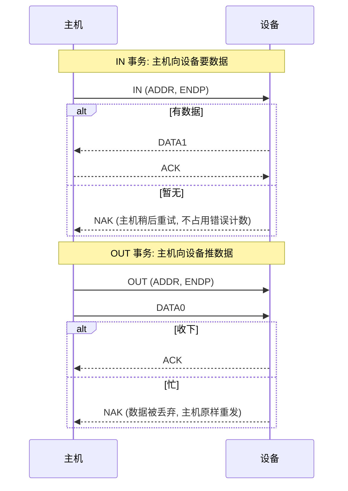

# 包格式与事务

> 🌳 知识树位置: 树干 → 叶
> 上一叶: [04-信号编码与比特流.md](04-信号编码与比特流.md) · 下一叶: [06-四种传输类型.md](06-四种传输类型.md)

## 1. 三个尺度：包、事务、传输

| 尺度 | 定义 | 例子 |
|---|---|---|
| **包 (Packet)** | 线上一个不可分割的传输单元 | Token 包、Data 包、Handshake 包 |
| **事务 (Transaction)** | 完成一次数据搬运的包序列：**令牌 → (数据) → 握手** | 一次批量 OUT = OUT+DATA1+ACK |
| **传输 (Transfer)** | 逻辑上有意义的一次应用数据流，由多个事务构成 | 一次控制传输（三阶段）、一个 1 MB 文件的批量传输 |

记忆：传输 = 事务×N，事务 = 包×2~3。

## 2. PID：包的身份牌

每包以 8 位 PID 开头：低 4 位是类型，高 4 位是低 4 位的取反（自校验）。按功能分四组：

| 组 | PID（名称 = 编码） |
|---|---|
| Token（令牌） | OUT=0001, IN=1001, SOF=0101, SETUP=1101 |
| Data（数据） | DATA0=0011, DATA1=1011, HS 专有: DATA2=0111, MDATA=1111 |
| Handshake（握手） | ACK=0010, NAK=1010, STALL=1110, HS 专有: NYET=0110 |
| Special（特殊） | PRE=1100(前导,LS), ERR=1100(split), SPLIT=1000, PING=0100(HS) |

## 3. 三种包的格式

### 3.1 Token 包（令牌：宣布"我要跟谁干什么"）

```
| SYNC | PID(8) | ADDR(7) | ENDP(4) | CRC5(5) | EOP |
```

- ADDR：7 位设备地址（0 = 枚举期默认地址）；
- ENDP：4 位端点号；
- CRC5：仅覆盖 ADDR+ENDP，生成多项式 x⁵+x²+1；
- IN = 主机要收，OUT = 主机要发，SETUP = 控制传输的第一拍（只发给端点 0）；
- SOF：帧起始包，ADDR 字段改放 11 位**帧号**。

### 3.2 Data 包（数据：货）

```
| SYNC | PID(8) | PAYLOAD(0~1023 字节) | CRC16(2) | EOP |
```

- CRC16 覆盖全部载荷，多项式 x¹⁶+x¹⁵+x²+1；
- DATA0/DATA1 交替用于**去重**（重传后接收方靠 toggle 识别"这是新数据还是旧数据重放"）；
- DATA2/MDATA 仅用于 HS 高带宽同步传输的每微帧多包场景。

### 3.3 Handshake 包（握手：收货确认）

```
| SYNC | PID(8) | EOP |     （无 CRC —— 8 位 PID 自校验足够）
```

| 握手 | 含义 | 谁发出 |
|---|---|---|
| ACK | 收到了，校验通过 | 接收方 |
| NAK | 忙/暂无数据，**不是错误**，稍后再来 | 设备 |
| STALL | 端点挂起/请求非法，需要主机干预（ClearHalt 或下一个 SETUP） | 设备 |
| NYET | 本次收下了，但下个 OUT 之前请先 PING（HS 批量 OUT 流控） | 设备 |

## 4. 事务模板



- SETUP 事务：`SETUP → DATA0(8 字节请求) → ACK`，设备**必须**接受（不允许 NAK？——规范上设备用 STALL 拒绝后续，SETUP 本身必须确认）。
- PING 事务（HS 批量 OUT 优化）：`PING → ACK/NYET`，先探路再发大包，避免白白占用带宽发一个被 NAK 的 OUT。

## 5. 帧与微帧：总线的心跳

| | FS/LS | HS |
|---|---|---|
| 帧长 | 1 ms | 125 µs 微帧 ×8 = 1 ms |
| 心跳包 | SOF（含 11 位帧号） | 每微帧一个 SOF |
| 调度粒度 | 每帧预留同步/中断带宽 | 每微帧 8 次机会 |

全设备共享这 1 ms 心跳：同步传输在中断/同步预留后，剩余带宽全给批量；批量没有任何保证，但"有空就吃"（见[四种传输类型](06-四种传输类型.md)）。

## 6. 数据触发 (Data Toggle)：重传不重复

- 每个端点方向维护 1 位 toggle，成功收发一次在 DATA0/DATA1 间翻转；
- 接收方收到的 PID 与本地期望不符 → 视为**旧包重放**，丢弃但**仍回 ACK**（告诉对方"我知道你重发了，我已有这份数据"）；
- 控制传输特殊规则：数据阶段以 DATA1 起步，状态阶段恒为 DATA1；
- ClearFeature(ENDPOINT_HALT) 清除 STALL 时 **toggle 复位为 DATA0**——驱动清 halt 后与设备重新对齐的细节（[错误处理](11-错误处理与可靠性.md)）。

## 7. 带宽账本（估算叶子）

一次 FS 64 字节批量 IN 事务的线上开销（位时间）：

```
Token: SYNC8+PID8+ADDR7+ENDP4+CRC5+EOP3 ≈ 35 bit
Data : SYNC8+PID8+512(64B)+CRC16+EOP3 ≈ 547 bit
HSK  : SYNC8+PID8+EOP3 ≈ 19 bit
合计 ≈ 601 bit ≈ 75 字节时间  → 协议开销 ≈ 17%
```

| 速率/类型 | 理论上限（数据） | 典型实测 |
|---|---|---|
| FS 批量 | ≈ 1.216 MB/s | ≈ 1 MB/s |
| HS 批量 | 13×512B/微帧 ≈ 53.2 MB/s | 35~45 MB/s |
| SS 批量 | ≈ 500 MB/s（Gen1 流） | 350~450 MB/s |
| FS 同步 | 1023 B/ms ≈ 1.023 MB/s | — |
| HS 同步 | 1024B×3/微帧 ≈ 24.576 MB/s | — |

## 8. 分裂事务（Split，HS 集线器服务 FS/LS 设备）

HS 集线器后面的 FS/LS 设备不能让慢速事务占住 HS 总线。主机把一次 FS 事务拆成两半，经 HS 集线器的**事务转换器 (TT)** 执行：

- `SSPLIT`（开始分裂）：主机把请求交给 TT 就走；
- TT 在 FS 总线上慢速执行真实事务；
- `CSPLIT`（完成分裂）：主机回来取结果（数据/握手），带 `ERR` 握手报告 TT 层错误。

详细机制与 TT 结构见[集线器与连接管理](09-集线器与连接管理.md)。

## 相关节点

- 上一叶: [04-信号编码与比特流.md](04-信号编码与比特流.md) · 下一叶: [06-四种传输类型.md](06-四种传输类型.md)
- 错误与重传: [11-错误处理与可靠性.md](11-错误处理与可靠性.md)
- 抓包实战: [协议分析仪与抓包](../70-枝干-调试测试与安全/01-协议分析仪与抓包.md)
