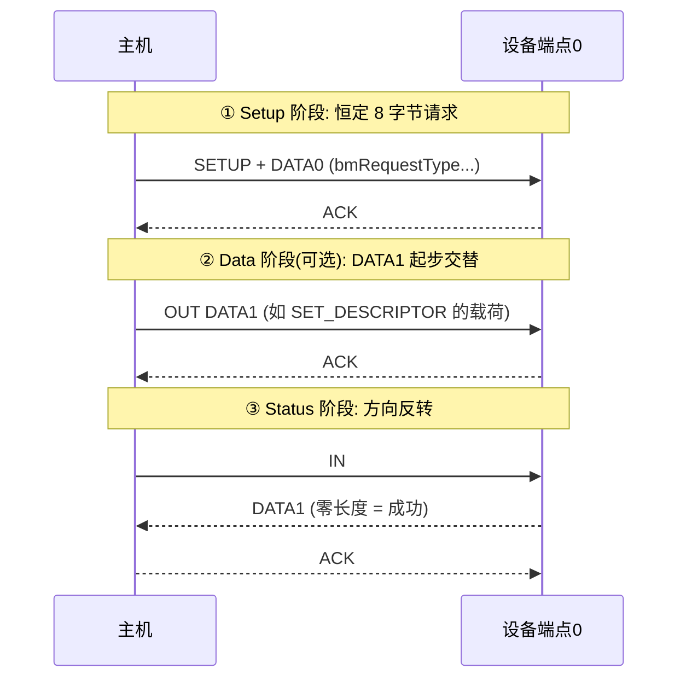

# 四种传输类型

> 🌳 知识树位置: 树干 → 叶
> 上一叶: [05-包格式与事务.md](05-包格式与事务.md) · 下一叶: [07-描述符详解.md](07-描述符详解.md)

主机与设备约定"怎么传"只有四种选项，端点在描述符中声明自己属于哪种（[端点描述符 bmAttributes](07-描述符详解.md)）。四种类型是**可靠性 × 时延 × 带宽保证**三角的不同折中：

| 传输类型 | 带宽保证 | 时延保证 | 可靠性 | 典型应用 |
|---|---|---|---|---|
| 控制 Control | 保留份额（EP0） | 无 | 有重传 | 枚举、配置、类请求——一切设备的起点 |
| 批量 Bulk | 无（"有空就传"） | 无 | 有重传，零差错 | U 盘、串口、网卡 |
| 中断 Interrupt | 有（每 interval 保证一个事务） | 有（≤ interval） | 有重传 | 键鼠、手柄、传感器、通知 |
| 同步 Isochronous | 有（独占带宽） | 有（每帧/微帧） | **无重传**，容忍丢包 | 摄像头、音频 |

## 1. 控制传输 (Control Transfer)

唯一被规范详细规定**格式**的传输——三个阶段：



- 端点 0 最大包长：LS 8；FS 8/16/32/64；HS 64（由设备描述符 bMaxPacketSize0 声明）；
- 设备拒绝请求 → 数据/状态阶段回 **STALL**（控制 STALL 在收到下一个 SETUP 时自动清除，这是它与其他端点 STALL 的区别）；
- 作用：**枚举（[下一叶](07-描述符详解.md)）+ 标准请求 + 类请求**（各设备类枝干大量使用，如 HID 的 SET_REPORT）。

## 2. 批量传输 (Bulk Transfer)

- 目标：在"不影响同步/中断预留"的剩余带宽里尽快搬完数据，且**保证数据正确**（CRC + 重传 + toggle 去重）；
- 无带宽/时延承诺：总线空闲时独吃，繁忙时可能每毫秒只抢到几个事务；
- 端点最大包长：FS 64；HS 512（LS 无批量）；
- HS 专有的 **PING/NYET 流控**：设备说 NYET 后，主机下次先发 PING 探测，得到 ACK 才真正发 OUT——避免大包白跑一趟；
- 实战语义：**批量可靠 ≠ 及时**。U 盘拷贝时键鼠卡顿，就是调度上批量挤占的直观表现（实际上是主机调度策略，协议保证中断优先）。

## 3. 中断传输 (Interrupt Transfer)

- 名字里的"中断"指**主机保证以不超过 bInterval 的周期轮询该端点**——设备挂起中断、主机软件侧产生事件，本质仍是轮询；
- 用最小的事务搬运小数据：键鼠报告几字节到几十字节；
- 端点最大包长：LS 8；FS 64；HS 1024；
- **bInterval 语义**（重要且易错）：

| 速率/类型 | bInterval 含义 |
|---|---|
| FS/LS 中断 | 帧数（1~255 ms，LS 最低 10 ms） |
| HS 中断 | 2^(bInterval−1) 微帧（1~16 µ 帧，即 125 µs~256 ms） |
| HS 同步 | 同上指数语义（1~16） |
| FS 同步 | 每帧一次（bInterval=1） |

- 错误重试与批量相同（ACK/NAK/重传），**保证送达**；
- 鼠标 1000 Hz 回报率 = bInterval 取 HS 指数 1（125 µs）+ 微帧内多次事务的实现，或直接声称为每微帧多事务的高带宽中断端点（HID 高回报率实现，见[鼠标详解](../20-枝干-设备类协议/HID-人机接口设备/06-鼠标详解.md)）。

## 4. 同步传输 (Isochronous Transfer)

- 目标：**每帧准时交付**（实时流丢不起等不起），代价是放弃重传；
- 无握手包：接收方不回 ACK/NAK，CRC 错误的数据也交付上层（上层自行插值/丢帧）；
- 带宽在配置时预留：FS ≤ 1023 B/帧；HS ≤ 1024 B/事务 ×(1~3 事务/微帧)（高带宽，wMaxPacketSize 的 bit12:11 声明事务数）；
- 端点对 (IN+OUT) + 可选反馈端点构成音频时钟闭环（异步音频为什么准，见 [UAC 概述](../20-枝干-设备类协议/Audio-UAC/00-UAC概述.md)）；
- 视频流同理：UVC 在同步与批量之间做选择（[UVC 详解](../20-枝干-设备类协议/Video-UVC/00-UVC详解.md)）。

## 5. 带宽预算（每帧/微帧怎么分）

HS 微帧（125 µs）的典型账本：

```
总预算: 8 个事务时隙/微帧
同步预留: 已配置的同步端点(最多 3 事务×1024B)
中断预留: 各中断端点按 2^(bInterval-1) 的节拍占位
剩余时间: 全部让给批量(每微帧理论最多 13 个 512B 批量事务)
```

FS 帧（1 ms）同理。设计启示：
1. 设备端点越多、间隔越密，留给批量的越少——多接口复合设备要算总账；
2. 同步端点声明多少主机就**预留**多少，声明过大 = 永久浪费（配置描述符审查项）。

## 6. 选型决策表

| 你的需求 | 选择 |
|---|---|
| 命令/状态/配置 | 控制传输（端点 0） |
| 大块数据、不计时延 | 批量 |
| 小数据、周期性、要时延上限 | 中断 |
| 实时流（音视频） | 同步（或 HS 批量承载压缩流，如部分 UVC/UAS 场景） |

## 相关节点

- 上一叶: [05-包格式与事务.md](05-包格式与事务.md) · 下一叶: [07-描述符详解.md](07-描述符详解.md)
- 应用: [HID 传输与类特定请求](../20-枝干-设备类协议/HID-人机接口设备/04-传输与类特定请求.md)
- 应用: [MSC 概述与 BOT](../20-枝干-设备类协议/MSC-大容量存储/00-MSC概述与BOT.md)
