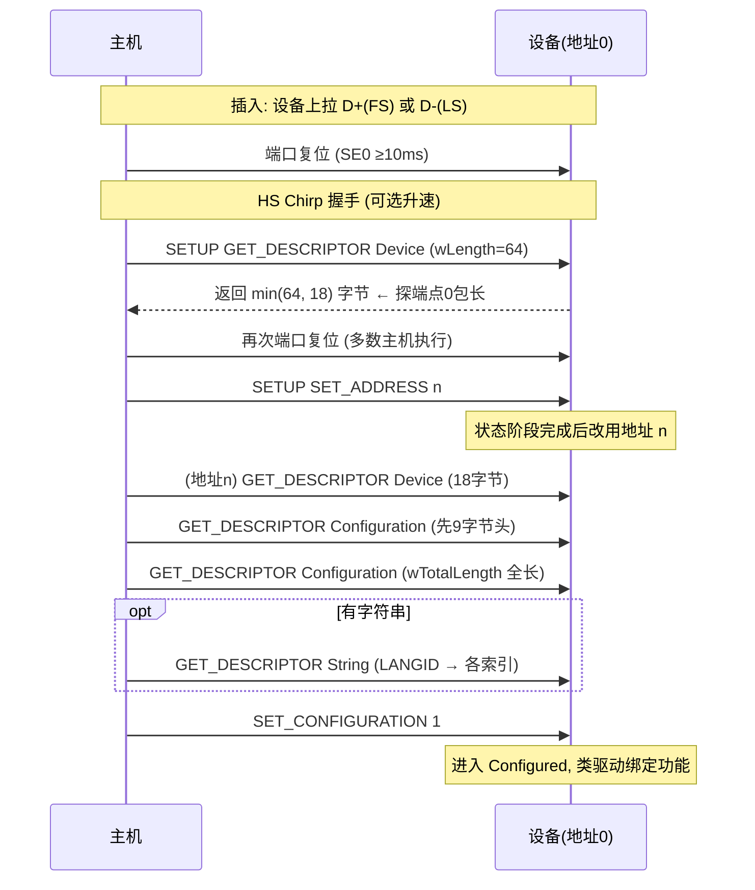

# 枚举流程与标准请求

> 🌳 知识树位置: 树干 → 叶
> 上一叶: [07-描述符详解.md](07-描述符详解.md) · 下一叶: [09-集线器与连接管理.md](09-集线器与连接管理.md)

## 1. Setup 包：8 字节定乾坤

一切标准/类/厂商请求都用 8 字节 Setup 数据承载（控制传输 Setup 阶段，恒 DATA0）：

| 偏移 | 字段 | 分解 |
|---|---|---|
| 0 | bmRequestType | D7=方向(1=IN 设备→主机)；D6~5=类型(00 标准/01 类/10 厂商/11 保留)；D4~0=接收者(00000 设备/00001 接口/00010 端点/00011 其他) |
| 1 | bRequest | 请求号（标准请求见下表） |
| 2 | wValue | 2 字节，含义随请求（如描述符类型<<8 \| 索引） |
| 4 | wIndex | 2 字节，通常接口号或端点地址 |
| 6 | wLength | 数据阶段长度（IN：设备最多发这么多；OUT：主机将发这么多） |

例：读设备描述符 = `80 06 00 01 00 00 40 00`（IN、标准、设备 / GET_DESCRIPTOR / 类型 0x01 索引 0 / LANGID 0 / 读 64 字节）。

## 2. 十一个标准请求

| bRequest | 名称 | 方向 | 接收者 | wValue | wIndex | 备注 |
|---|---|---|---|---|---|---|
| 0x00 | GET_STATUS | IN | 设备/接口/端点 | 0 | 0 或接口/端点 | 自供电/远程唤醒位；端点=HALT 位 |
| 0x01 | CLEAR_FEATURE | OUT | 同上 | 特征号 | — | 0=ENDPOINT_HALT，1=DEVICE_REMOTE_WAKEUP，2=TEST_MODE |
| 0x03 | SET_FEATURE | OUT | 同上 | 同上 | — | 唤醒授权=SET_FEATURE(REMOTE_WAKEUP) |
| 0x05 | SET_ADDRESS | OUT | 设备 | 地址 1~127 | 0 | **状态阶段完成后生效** |
| 0x06 | GET_DESCRIPTOR | IN | 设备 | 类型<<8 \| 索引 | LANGID(字符串时) | 0x01 设备/0x02 配置/0x03 字符串/0x06 限定符/0x0F BOS + 类级(如 0x22 报告) |
| 0x07 | SET_DESCRIPTOR | OUT | 设备 | 同上 | 同上 | 可选，极少用 |
| 0x08 | GET_CONFIGURATION | IN | 设备 | 0 | 0 | 返回当前配置值 |
| 0x09 | SET_CONFIGURATION | OUT | 设备 | 配置值(0=去配置) | 0 | 枚举终点，功能由此激活 |
| 0x0A | GET_INTERFACE | IN | 接口 | 0 | 接口号 | 返回当前备用设置 |
| 0x0B | SET_INTERFACE | OUT | 接口 | 备用设置 | 接口号 | 带宽换挡（UVC 零带宽切换） |
| 0x0C | SYNCH_FRAME | IN | 端点 | 0 | 端点 | 同步端点帧号同步，极少用 |

## 3. 枚举全流程（背下来）

固件视角的义务清单：

1. 复位后 10 ms 内准备好在地址 0 上响应；
2. 端点 0 恒可用，SETUP 与状态阶段不得 NAK 到卡死；
3. GET_DESCRIPTOR 支持**截断返回**与类级描述符路由（0x22 报告描述符由 HID 接口应答）；
4. SET_ADDRESS 在状态阶段后切换地址；
5. 大端点 0 包长按 bMaxPacketSize0 分包发送长描述符；
6. 每个不认识的请求 → 正确地 STALL（别挂死）。

## 4. 每一步失败的典型现象

| 卡住的步骤 | 现象 | 常见根因 |
|---|---|---|
| 检测插入 | 主机毫无反应 | 仅充电线、上拉未使能、VBUS 欠压 |
| 复位/Chirp | 设备以 FS 慢速工作 | Chirp 失败，HS 回落 |
| 第一个 GET_DESCRIPTOR | "无法识别的 USB 设备" | 时钟偏差、EP0 包长声明错误 |
| SET_ADDRESS 后 | 枚举中断 | 提前/滞后切换地址 |
| 读配置 | 报描述符错误/代码 43 | wTotalLength、bLength、bNumEndpoints 不一致 |
| SET_CONFIGURATION 后 | 设备在但无功能 | 接口类代码错误、端点方向写反 |

完整故障树与工具对应见[枚举失败排查手册](../70-枝干-调试测试与安全/02-枚举失败排查手册.md)。

## 5. 类请求与厂商请求：同一管道的延伸

- 枚举完成后，**类驱动用同一根默认管道继续发类特定请求**（bmRequestType 的类型位=01），如 HID 的 SET_REPORT(0x09)、MSC 的 GET_MAX_LUN(0xFE)、CDC 的 SET_LINE_CODING(0x20)；
- 厂商请求（类型位=10）留给私有协议，配合 WinUSB/WebUSB 在用户态直发（[WebUSB 与自定义类](../20-枝干-设备类协议/其他设备类/06-WebUSB与厂商自定义类.md)）；
- 接收者位决定 wIndex 语义（接口 vs 端点）——类规范里每个请求表都以此为准绳。

## 6. 复合设备 (Composite Device) 的枚举

- 单个物理设备、设备级类代码 0x00/0xEF，多个接口各自挂类驱动；
- **IAD** 把"同一功能的多个接口"（如 CDC 的控制+数据接口对）捆在一起，避免 Windows 拆开装错驱动（[描述符](07-描述符详解.md)）；
- 各接口的类驱动独立 claim 各自的端点——互不越界是复合设备固件的纪律。

## 相关节点

- 上一叶: [07-描述符详解.md](07-描述符详解.md) · 下一叶: [09-集线器与连接管理.md](09-集线器与连接管理.md)
- 类级延伸: [HID 传输与类特定请求](../20-枝干-设备类协议/HID-人机接口设备/04-传输与类特定请求.md)
- 实战: [枚举失败排查手册](../70-枝干-调试测试与安全/02-枚举失败排查手册.md)
