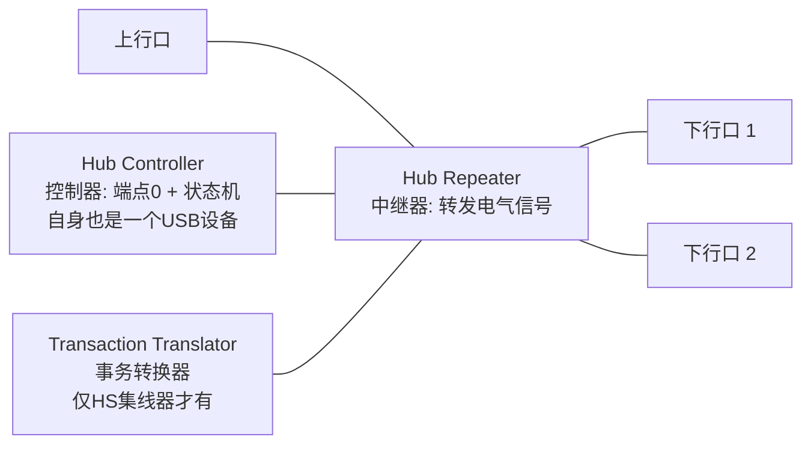
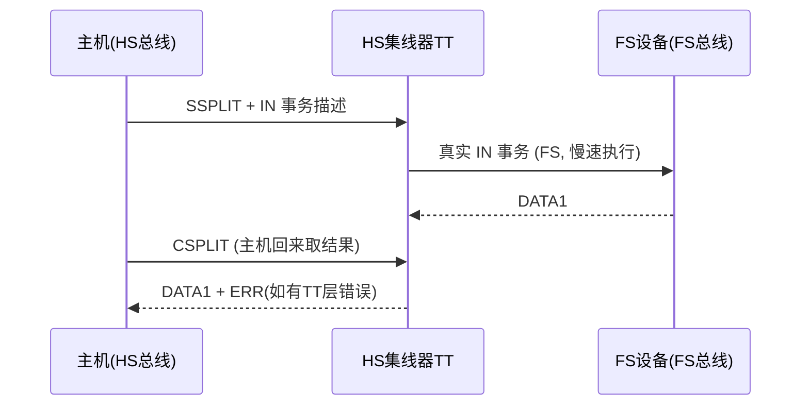

# 集线器与连接管理

> 🌳 知识树位置: 树干 → 叶
> 上一叶: [08-枚举流程与标准请求.md](08-枚举流程与标准请求.md) · 下一叶: [10-电源管理与挂起唤醒.md](10-电源管理与挂起唤醒.md)

## 1. 集线器的三件套

- **Hub Repeater**：电气层中继，做连接检测、速率隔离、帧边界转发；
- **Hub Controller**：集线器自己的 USB 设备部分——默认地址 0 → 枚举 → 端点 0 → 类代码 **0x09**；
- **Transaction Translator (TT)**：USB 2.0 集线器独有，把 HS 下行事务转换为 FS/LS 事务（分裂事务）。

## 2. 端口状态与变更位

集线器暴露两类寄存器式请求（类请求，接口=0）：

- `GET_STATUS(端口)`：连接、使能、挂起、过流、复位、供电 + **高速已连接/低速已连接** 位；
- `GET/CLEAR_FEATURE(端口)`：变更位 C_PORT_CONNECTION / C_PORT_RESET / C_PORT_OVER_CURRENT 等——**写 1 清除**（写后自清）模型。

插入流程：设备上拉数据线 → 下行口 15kΩ 下拉检测到变化 → 控制器置 C_PORT_CONNECTION → 集线器驱动（主机）轮询发现 → 复位端口 → 开始[枚举](08-枚举流程与标准请求.md)。**热插拔的协议实现就是这一条轮询链**。

## 3. 端口电源与过流

| 机制 | 说明 |
|---|---|
| 每口独立供电 (per-port) | 可单独开关下行口电源（SET_FEATURE PORT_POWER） |
| 分组供电 (ganged) | 多口同开同关，省成本 |
| 过流检测 | 电流超限 → 置过流位 → 主机可关端口；BC1.2/Type-C 时代由硬件保护接管（[供电枝干](../30-枝干-接口与供电/03-BC1.2与专有快充.md)） |
| 复位后状态 | 复位完成端口进入 enabled；失败则反复复位若干次后放弃（设备"假死"的一种） |

## 4. 事务转换器 (TT) 与分裂事务

HS 集线器下方挂着 FS/LS 设备时，主机不能让慢速设备占住 480 Mbps 总线。解法是**分裂事务 (Split Transaction)**：

- 主机侧把 FS/LS 设备的带宽按**开销预算**排进微帧（TT 有自己的 FS 帧时域）；
- **单 TT (Single TT)**：所有下行口共享一个 TT → 一个慢设备拖累全 hub；**多 TT (Multi TT)**：每口独立 TT——好集线器的卖点，设备描述符里 bDeviceProtocol=0x02 声明；
- 排查联想：多口 hub 上 U 盘突然掉速/失联，优先怀疑单 TT hub 的 FS/LS 设备干扰。

## 5. 集线器描述符速览

- 标准描述符之外有**集线器类描述符**（类型 0x29）：bNbrPorts、wHubCharacteristics（供电方式/过流模式）、bPwrOn2PwrGood、bHubContrCurrent、每个口的可移除位图 (DeviceRemovable)；
- 类请求：`GET_STATUS/CLEAR_FEATURE/SET_FEATURE` 作用于端口（PORT_RESET/PORT_POWER/PORT_SUSPEND 等特征号）；
- 主机的集线器驱动（Windows usbhub、Linux usbcore 的 hub.c）就是围着这些位转的。

## 6. 挂起/恢复在集线器上的传播

- **全局挂起**：主机停发 SOF，整棵树顺次进入挂起（[电源管理](10-电源管理与挂起唤醒.md)）；
- **选择性挂起**：主机 SET_FEATURE(PORT_SUSPEND) 只挂起某口子树，其余照常；
- **恢复**：主机对端口发恢复信号（PORT_RESUME），集线器向下游转发 K 序列；设备远程唤醒时向上行转发（每级集线器要能"中继唤醒"）；
- 集线器在挂起期间必须保持端口供电与检测电路，且自己消耗 ≤2.5 mA（自供电 hub 有例外计算规则）。

## 7. 层级限制回顾

- 最多 **7 层**（含根集线器）：根(1) + 最多 5 个串联非根集线器 + 设备(7)；
- 127 个地址含沿途所有集线器——一层 6 口 hub×5 级就吃掉 30 个地址；
- 超限的表现：多插的设备不枚举（地址/层级耗尽），无报错——排查外设问题时别忽略。

## 8. USB 3.x 的集线器变化

- 3.x 集线器 = 3.x 半区（包路由、链路训练中继）+ 2.0 半区（含 TT）双逻辑并立；
- 3.x 不再需要分裂事务：3.x 域内没有"慢速设备混跑高速总线"的问题（FS/LS 设备由 2.0 半区处理）；
- 路由字符串 (Routing String) 让 3.x 包沿路径直达端口，不再广播——与 2.0 中继模型的本质差异（[USB3x](../40-枝干-高速演进/01-USB3x与SuperSpeed.md)）。

## 相关节点

- 上一叶: [08-枚举流程与标准请求.md](08-枚举流程与标准请求.md) · 下一叶: [10-电源管理与挂起唤醒.md](10-电源管理与挂起唤醒.md)
- 枝干: [USB Type-C（集线器的现代形态: Dock）](../30-枝干-接口与供电/02-USBType-C详解.md)
- 调试: [枚举失败排查手册](../70-枝干-调试测试与安全/02-枚举失败排查手册.md)
