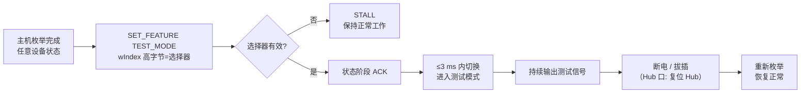

# Test Mode 与调试模式

> 🌳 知识树位置: 树干 → 叶
> ⬆️ 兄弟: [11-错误处理与可靠性.md](11-错误处理与可靠性.md) · [10-电源管理与挂起唤醒.md](10-电源管理与挂起唤醒.md) · [09-集线器与连接管理.md](09-集线器与连接管理.md)
> 规范原文缓存索引: [80-参考资料/README.md](../80-参考资料/README.md)

协议是否正确可以靠抓包验证，但**电气波形是否合格**必须让设备发出"已知、可控、可重复"的信号，示波器/误码仪才有测量基准。USB 2.0 在规范 §7.1.20 定义了 Test Mode（测试模式），USB 3.x 用 LTSSM 的 Compliance/Loopback 状态承担同等职责；另有独立于合规测试的调试通道（Debug Descriptor / Debug Mode），用于系统最底层的固件调试。本叶汇总这三层机制。

## 1. 测试模式的定位

| 维度 | Test Mode (USB 2.0) | Compliance Mode (USB 3.x) | Debug Mode |
|---|---|---|---|
| 服务对象 | 电气合规测量 | 电气合规测量 | 软件调试 |
| 由谁发起 | 主机软件（SET_FEATURE 请求） | 测试夹具/测试仪（LFPS 图样） | 主机调试端口（EHCI/xHCI DbC） |
| 强制范围 | 所有 HS-capable 设备/Hub/主机控制器 | 所有 SuperSpeed 链路 | 可选 |
| 退出方式 | 上行口断电（power cycle） | 复位/断电 | 软件退出 |

## 2. 入口：SET_FEATURE(TEST_MODE)

设备测试模式由标准请求进入。请求字段（对照 [08-枚举流程与标准请求.md](08-枚举流程与标准请求.md) 的 Setup 包格式）：

| 字段 | 取值 | 说明 |
|---|---|---|
| bmRequestType | 0x00 | 接收者=设备（TEST_MODE 仅对设备接收者定义），Host→Device，无数据阶段 |
| bRequest | 0x03 | SET_FEATURE |
| wValue | 0x0002 | 特性选择器 TEST_MODE = 2（Table 9-6） |
| wIndex 高字节 | 测试选择器 | Test_J=01H、Test_K=02H、Test_SE0_NAK=03H、Test_Packet=04H、Test_Force_Enable=05H |
| wIndex 低字节 | 0x00 | 必须为 0 |
| wLength | 0 | 无数据阶段 |

进入条件与行为要点（规范 §9.4.9 / §7.1.20）：

- **状态要求**：高速设备在 Default、Address、Configured 三种设备状态下都必须能接受该请求——不要求必须先完成配置（这一点常被误解为"必须配置态"）；
- 仅高速能力设备强制支持；**非高速设备不支持**（返回 STALL）；
- 无效测试选择器 → 设备以请求错误（STALL）应答；wLength 非 0 时行为未定义；
- 状态阶段完成后设备回 ACK，**测试模式切换必须在状态阶段完成后 3 ms 内完成**，且切换不得早于状态阶段（否则主机误以为请求失败）；
- **退出**：上行口的测试模式只能靠**设备断电（power cycle，含拔插）**退出——没有"软件退出"请求，这是排障时"插回设备才恢复"的原因；
- **集线器下行口**走 Hub 类请求 SetPortFeature(PORT_TEST)（§11.24.2.13），选择器同样放 wIndex 高字节，退出方式为**复位集线器**。

### 2.1 集线器下行口的入口差异

集线器的下行口不能对"不存在"的设备发标准请求，改走 Hub 类请求 SetPortFeature(PORT_TEST)（规范 §11.24.2.13）：

| 字段 | 取值 | 说明 |
|---|---|---|
| bmRequestType | 0x23 | 接收者=其他（类），接收者=集线器 |
| bRequest | 0x03 | SET_FEATURE |
| wValue | 0x0015 | 端口特性选择器 PORT_TEST = 21（区别于设备级 TEST_MODE=2） |
| wIndex 低字节 | 端口号 | 1 起编的下行端口号 |
| wIndex 高字节 | 测试选择器 | 与设备级同一套取值（01H~05H，含 Test_Force_Enable） |

两类入口的行为差异总结：设备上行口进入测试模式后"断电才退"；集线器下行口则是"复位集线器才退"，且 Test_Force_Enable 只对下行口有意义（它就是为测 Hub 断开检测阈值设计的）。

## 3. 五种测试模式详解

所有模式下，设备的行为就是把上行口收发器置于指定状态并**保持**，直到退出动作：

| 模式 | 选择器 | 上行口行为 | 测量目标 |
|---|---|---|---|
| Test_J | 01H | 持续发送高速 J 状态 | D+ 线高电平驱动电平 |
| Test_K | 02H | 持续发送高速 K 状态 | D− 线高电平驱动电平 |
| Test_SE0_NAK | 03H | 进入高速接收态，持续 SE0；**对收到的任何 CRC 正确的 IN 令牌回 NAK** | 输出阻抗、低电平输出电压、负载特性、设备 Squelch（静默电平检测）灵敏度 |
| Test_Packet | 04H | 无限重复发送规范定义的固定测试包 | 上升/下降时间、眼图、抖动等全部动态波形指标 |
| Test_Force_Enable | 05H | 仅 Hub 下行口：无设备接入也强制使能（高速），上行口收到的包在该口照常转发 | Hub 断开检测阈值（改变端口负载轮询 disconnect detect 位） |

工程要点：

- Test_J/Test_K 是**直流电平**测量（驱动器强度），Test_SE0_NAK 是"静态+ stimulus/response"混合测量，Test_Packet 才是波形动态测量；
- Test_SE0_NAK 中"回 NAK"的设计让测试仪可以顺带验证设备的基本协议响应能力（通用功能测试激励）；
- 测试模式进入后设备对主机"失联"是正常现象：主机软件发完请求后不应再期待任何响应（USBHSET 类工具即按此工作）。

### 3.1 Test_Packet：眼图与示波器校验的标准信号源

测试包内容由规范以**精确比特串**逐字段定义（规范 §7.1.20 Table 7-9，整包约 53 字节）：SYNC → DATA0 PID → 多段 0/1、交替、最长连 1 等特征序列（含刻意安排的位填充 S 标记）→ CRC-16 → EOP。设计目标是让一条包里同时覆盖：

- 高/低电平保持段（测电平与幅度）；
- 最快翻转段（测上升/下降时间与抖动）；
- 最长连 1 段（测位填充行为与时钟恢复能力）；
- 全 0 段与随机性序列（测眼图张开度）。

发送节奏：重复发送，包间隔不小于最小包间隙（§7.1.18）且**不大于 125 µs**——示波器以无限余辉叠加即可拼出眼图；USB-IF 的 SigTest 软件正是对该波形做模板比对（见第 4 节）。

### 3.2 电气测量项与模式的对应

规范对各电气参数指定了测法（含测试负载条件），合规测试时逐一对应：

| 测量项 | 用哪个模式 | 负载/条件（规范要点） |
|---|---|---|
| 高电平驱动电压 | Test_J / Test_K | 每根数据线对地接 45 Ω 负载分别测 D+ / D− |
| 眼图、上升/下降时间、抖动 | Test_Packet | 规范图示的标准夹具，示波器余辉 + SigTest 模板 |
| 输出阻抗、低电平输出电压、负载特性 | Test_SE0_NAK | 高速接收态持续 SE0 |
| Squelch（静默检测）灵敏度 | Test_SE0_NAK | 测试仪发幅度渐变的合法包，观察设备是否响应 |
| 收发器寄生电容（芯片级） | Test_SE0_NAK | 断电态测线对地电容（die/封装各 ≤5 pF 量级指导值） |
| Hub 断开检测阈值 | Test_Force_Enable | 空载使能端口，改变负载轮询 disconnect detect 位 |

这份对应表就是 [USB-IF 合规认证](../70-枝干-调试测试与安全/03-USB-IF合规认证.md) 电气项的底层剧本；第 6 节的 USB 3.x 机制在高速演进枝干接续同一思路。

## 4. 主机侧工具

| 工具 | 角色 | 典型用法 |
|---|---|---|
| USBHSET | 主机侧高速电气测试工具 | 通过主机控制器向目标端口发 SET_FEATURE(TEST_MODE)，配合测试夹具把端口切到 Test_J/K/SE0_NAK/Packet |
| SigTest (USB-IF) | 信号质量分析软件 | 对示波器采到的 Test_Packet 波形做眼图模板/幅度/抖动自动判定 |
| 测试夹具 (fixture) | 把主板连接器引到同轴口 | 分常规/OTG 等多种夹具，属 [USB-IF 合规认证](../70-枝干-调试测试与安全/03-USB-IF合规认证.md) 设备清单 |

嵌入式/裸机场景没有 USBHSET 时，任何能发出上述标准请求的主机（包括另一块开发板、协议分析仪的流量注入功能）都可以进入测试模式；设备固件侧则必须实现"收到请求→状态阶段 ACK→3 ms 内切换收发器"的完整路径。

## 5. 调试描述符 (0x0A) 与 Debug Mode

Test Mode 服务于产线/实验室，真正的"开发期调试"靠独立机制——USB 2.0 Debug Device 规范（含 Debug 描述符与 Debug Mode）：

- **Debug 描述符**：类型码 `bDescriptorType = 0x0A`，声明调试能力，其中给出调试专用 **IN/OUT 端点号**（bDebugInEndpoint / bDebugOutEndpoint）；主机通过 GetDescriptor(Debug) 读取；
- **Debug Mode 进入**：主机发 SetFeature(DEBUG_MODE)（设备特性选择器 DEBUG_MODE = 6）；此后设备进入特殊状态，只有"调试从机 (debug slave)"保持工作；
- **电气概貌**：调试从机是精简收发器，挂接在 **D+ 一线**上工作，允许目标系统其余部分（主 PHY、CPU 电源域以外的大部分逻辑）处于断电或深度挂起——这正是"系统已死、还能救"的价值；两根**批量管道**用于固件日志与调试器消息的双向搬运（消息粒度与包长等细节见 USB 2.0 Debug Device 规范原文）；
- **主机侧对应物**：EHCI 的 Debug Port 能力（配合 Linux earlyprintk/dbgp 等）；xHCI 时代对应 **xHCI Debug Capability (DbC)**，以 USB 3.x 批量端点跑同样的角色（字段级细节见 xHCI 规范，此处不展开）。

对照记忆：Test Mode 是"设备向示波器单说"，Debug Mode 是"设备向另一台计算机说话"。

## 6. USB 3.x 对应机制

USB 3.x 没有 SET_FEATURE(TEST_MODE)——链路训练由 LTSSM（见 [04-USB3x包格式与LTSSM.md](../40-枝干-高速演进/04-USB3x包格式与LTSSM.md)）接管，合规模式成为状态机的一部分。

### 6.1 Compliance Mode（合规模式）

- **入口**：Polling 阶段，设备收到测试仪/夹具发出的**合规入口 LFPS 图样**（一组频率/时长与正常 Polling 不同的突发序列）后，LTSSM 转入 Compliance 状态；
- **行为**：链路持续发送合规测试图样（Compliance Pattern, CP），供测试仪做眼图、抖动、回损等测量；Gen2 下还涉及接收端均衡（CTLE 等）参数的训练与验证；
- **Compliance Pattern 概览**：规范定义 CP0～CP16 一族图样，CP0 为加扰数据图样（Gen1 眼图/抖动基础图样），CP1 起覆盖回环 BER 与 Gen2 各专用场景（逐图样的编码与用途见规范原文）；
- 与 2.0 的一致性设计：同样是"可控已知信号 + 测量判定"，只是入口从软件请求换成了 LFPS 握手。

### 6.2 Loopback 模式

LTSSM 的 Loopback 状态：训练期间收到带 **Loopback 位**的 TS1 有序集即进入，此后把收到的数据原样回环发送。测试仪借此对 DUT 做**误码率 (BER) 测试**——先发均衡/适配图样，再切换已知图样统计误码。这是 Gen2 接收端裕量测试的基础设施之一。

### 6.3 与 USB 2.0 测试模式对照

| 能力 | USB 2.0 | USB 3.x |
|---|---|---|
| 静态电平（J/K） | Test_J / Test_K | CP 图样中的电平保持段 + Lane Margining |
| 眼图/抖动 | Test_Packet | Compliance Mode + CP0 等 |
| stimulus/response | Test_SE0_NAK（回 NAK） | Loopback（回环 BER） |
| 入口载体 | SET_FEATURE 标准请求 | LTSSM Compliance 入口 LFPS 图样 |

## 7. 在合规认证中的位置

上述模式是 [USB-IF 合规认证](../70-枝干-调试测试与安全/03-USB-IF合规认证.md) 中"电气信号质量"大项的全部测量载体：2.0 眼图测 Test_Packet、驱动电平测 Test_J/K、Squelch 测 Test_SE0_NAK；3.x 眼图/抖动/BER 全部经 Compliance/Loopback 完成。协议一致性项则靠抓包（[协议分析仪与抓包](../70-枝干-调试测试与安全/01-协议分析仪与抓包.md)）与标准请求序列（[枚举流程](08-枚举流程与标准请求.md)）覆盖。

排障提示：设备"进测试模式出不来"的三个高频根因——固件在 ACK 状态阶段后忘记切换收发器（测试仪读不到图样）、把 TEST_MODE 误实现为接口/端点接收者（应 STALL 却行为怪异）、以及在测试模式中响应了本不该响应的流量。

## 相关节点

- 兄弟: [11-错误处理与可靠性.md](11-错误处理与可靠性.md) · [10-电源管理与挂起唤醒.md](10-电源管理与挂起唤醒.md) · [08-枚举流程与标准请求.md](08-枚举流程与标准请求.md) · [09-集线器与连接管理.md](09-集线器与连接管理.md)
- 高速演进: [USB 3.x 包格式与 LTSSM](../40-枝干-高速演进/04-USB3x包格式与LTSSM.md) · [USB3x 与 SuperSpeed](../40-枝干-高速演进/01-USB3x与SuperSpeed.md)
- 实战: [USB-IF 合规认证](../70-枝干-调试测试与安全/03-USB-IF合规认证.md) · [协议分析仪与抓包](../70-枝干-调试测试与安全/01-协议分析仪与抓包.md)
- 返回: [../00-知识树总图.md](../00-知识树总图.md)
