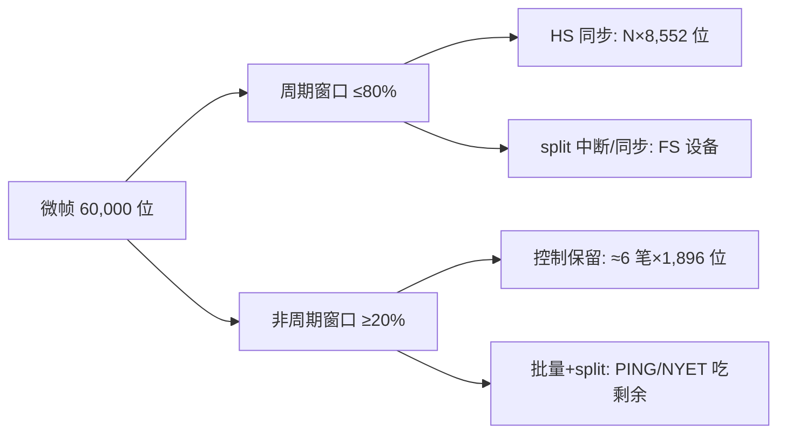

# 总线带宽与调度计算

> 🌳 知识树位置: 树干 → 叶
> 上一叶: [12-TestMode与调试模式.md](12-TestMode与调试模式.md) · 姊妹叶: [05-包格式与事务.md](05-包格式与事务.md) · [06-四种传输类型.md](06-四种传输类型.md) · [11-错误处理与可靠性.md](11-错误处理与可靠性.md)
> 高速侧对照: [../40-枝干-高速演进/01-USB3x与SuperSpeed.md](../40-枝干-高速演进/01-USB3x与SuperSpeed.md)
> 规范原文缓存索引: [../80-参考资料/README.md](../80-参考资料/README.md)

本叶把 [06-四种传输类型](06-四种传输类型.md) 里"定性"的带宽说法落到"逐位"计算上：一个事务到底占多少位时间、一帧能塞多少事务、1.216 MB/s 与 53.248 MB/s 这两个经典数字是怎么算出来的。所有带宽数值表均取自 USB 2.0 规范（2025-06-03 修订版）第 5 章（本地缓存 `80-参考资料/usb-core/USB2.0-Specification.zip` 内 `usb_20.pdf`），出处以"USB 2.0 spec §x.y"标注；推导过程为笔者按规范字段逐位累加。

## 1. 三个尺度：位时间、帧、微帧

| 信号速率 | 1 位时间 (bit time) | 帧结构 | 每帧位时间 |
|---|---|---|---|
| 低速 LS 1.5 Mb/s | 666.67 ns | 1 ms 帧 | —（LS 事务寄生在 FS 帧内） |
| 全速 FS 12 Mb/s | 83.33 ns | 1 ms 帧 | 12,000 |
| 高速 HS 480 Mb/s | 2.0833 ns | 125 µs 微帧 ×8 | 60,000 |

规范口径（USB 2.0 spec §11.2.2）：

- 帧间隔标称值 = **12,000 个全速位时间**；集线器帧定时器允许范围 11,958~12,042 位（即 **±42 位**，用于容纳主机与 hub 的时钟量化/抖动）。
- 高速侧同理：125 µs × 480 Mb/s = 60,000 个高速位时间，每 1 ms 帧含 8 个微帧（SOF 每微帧一个）。

> 注意：网上常见"FS 帧有 12,500 个位时间"的说法**不是规范值**——12 Mb/s × 1 ms 只有 12,000 位。正确算法是 12,000 减去 SOF 开销与位填充余量后得到可用预算（见下节）。

### 1.1 帧预算逐位核算（FS）

一帧内不搬"用户数据"的固定开销：

| 项目 | 位数 | 说明 |
|---|---|---|
| 帧总长 | 12,000 | 12 Mb/s × 1 ms（USB 2.0 spec §11.2.2） |
| SOF 事务 | ≈ 40 | SYNC 8 + PID 8 + 帧号 11 + CRC5 5 = 32 位，加 EOP（SE0 2 位 + J 1 位）与发送翻转余量 |
| 帧定时误差 | ≤ 84 | ±42 位（hub 帧定时器公差，同 §11.2.2） |
| 位填充余量 | ≈ 12~120 | 平均膨胀 <1%（最坏远高于此，取决于数据图案；规范各带宽表均**未计入**位填充，见各表原注） |
| **可用于事务** | **≈ 11,800~11,900** | 工程预算口径（推导值，非规范值） |

高速微帧做同样的账：60,000 位减去 SOF（HS SYNC 为 32 位，SOF 事务 ≈ 32+8+11+5+8(EOP) ≈ 64 位）与位填充，可用 ≈ 59,800 位以上。

## 2. 单事务开销：逐位累加

### 2.1 包级分量

| 分量 | 位数（FS/HS） | 位数（LS） |
|---|---|---|
| SYNC | FS 8 / HS 32 | 按规范开销口径折算 |
| PID | 8 | 8 |
| 令牌地址区 | ADDR 7 + ENDP 4 + CRC5 5 = 16 | 同 16（但按 LS 位时间计时变长） |
| 数据 CRC | CRC16 = 16 | 16 |
| EOP | FS：SE0 2 位 + J 1 位；HS：8 位 | SE0 1 个 LS 位 + J 1 个 LS 位（USB 2.0 spec §7.1.7.4.1） |

LS 的 EOP 与 SYNC 都以低速位时间定义（1 LS 位 = 8 个 FS 位时间），再叠加前置 PRE 包与 hub 重定时，因此**同一个事务在 LS 下开销字节更多**——这就是规范把 LS 中断事务开销定为 19 字节、而 FS 只有 13 字节的原因（USB 2.0 spec §5.7.4 表 5-6/5-7）。

### 2.2 规范口径的单事务/单传输开销总表

规范第 5 章各表给出的"协议开销"已包含 SYNC、PID、地址+CRC5、CRC16 与包间延迟，**不含位填充**。四个速率/类型的组合汇总（出处为各表原注）：

| 传输类型 | LS | FS | HS | 出处（USB 2.0 spec） |
|---|---|---|---|---|
| 控制（按"一次传输"计，含 SETUP 数据 8 B） | 63 B（表 5-1） | 45 B（表 5-2） | 173 B（表 5-3） | §5.5.4 |
| 中断（每事务） | 19 B（表 5-6） | 13 B（表 5-7） | 55 B（表 5-8） | §5.7.4 |
| 批量（每事务） | — | 13 B（表 5-9） | 55 B（表 5-10） | §5.8.4 |
| 同步（每事务） | — | 9 B（表 5-4） | 45 B（表 5-5） | §5.6.3 |

以 FS 批量 64 B 事务为例手工核一遍 13 字节的来历：

```text
令牌包:  SYNC(8) + PID(8) + ADDR(7) + ENDP(4) + CRC5(5)      = 32 bit = 4 B
数据包:  SYNC(8) + PID(8) + DATA(64×8) + CRC16(16)            = 544 bit = 68 B
握手包:  SYNC(8) + PID(8)                                     = 16 bit = 2 B
包间延迟/EOP 余量（三次包边界）                                ≈ 3 B
合计: 4 + 68 + 2 + 3 = 77 B，其中净载荷 64 B → 开销 13 B ✓（与表 5-9 一致）
```

同步事务没有握手包，所以 FS 开销只有 9 B（少 1 个 SYNC+PID 与 2 B 包间延迟）；HS 把"包间延迟"放大为 3×(1+11) 字节（8 位 EOP + 至少 88 位总线翻转，USB 2.0 spec §7.1.18/表 5-10 原注），故 HS 批量开销 55 B、同步 45 B、控制 173 B（三次事务 + SETUP 数据 8 B）。

## 3. 批量带宽推导：1.216 MB/s 与 53.248 MB/s

### 3.1 全速：每帧最多事务数 → 1.216 MB/s

```text
每事务位时间      = (13 B 开销 + 64 B 数据) × 8 = 616 bit
每帧事务数        = 12,000 ÷ 616 = 19.48 → 取整 19（余 496 bit，装不下第 20 笔）
每秒事务数        = 19 × 1,000 帧/s
带宽              = 19 × 64 B × 1,000 = 1,216,000 B/s ≈ 1.216 MB/s
帧占用率          = 19 × 616 / 12,000 ≈ 97.5%
```

与 USB 2.0 spec 表 5-9 完全一致（64 B 载荷行：Max Transfers = 19，1,216,000 B/s）。这就是"全速批量上限 1.216 MB/s"的全过程。同理按更小载荷推：8 B → 107 笔/帧 → 107 kB/s；32 B → 33 笔 → 1.056 MB/s（表 5-9）。

### 3.2 高速：微帧同理 → 53.248 MB/s

```text
每事务位时间      = (55 B 开销 + 512 B 数据) × 8 = 4,536 bit
每微帧事务数      = 60,000 ÷ 4,536 = 13.2 → 13
带宽              = 13 × 512 B × 8,000 微帧/s = 53,248,000 B/s ≈ 53.248 MB/s
微帧占用率        = 13 × 4,536 / 60,000 ≈ 98.3%
```

与表 5-10 的 512 B 行（Max Transfers = 13，53,248,000 B/s）一致。注意三点：

- 这是**单端点**吞吐上限；微帧理论毛速率是 60,000,000 B/s（表 5-10 Max 行），批量永远只能"吃剩余"。
- HS 批量 OUT 必须实现 PING 流控（USB 2.0 spec §5.8.4、§8.5.1）：NYET/PING 握手会额外挤占非周期窗口。
- 批量没有带宽保证：同步/中断/控制排完之后才轮到它（§5.8.4）。


## 4. 同步传输预算

| 速率 | 单事务载荷上限 | 单事务开销 | 每 (微)帧预算 | 极限速率 | 出处 |
|---|---|---|---|---|---|
| FS | 1,023 B（端点级） | 9 B | (1023+9)×8 = 8,256 bit → **1 笔/帧** | 1,023,000 B/s | USB 2.0 spec §5.6.3、表 5-4 |
| HS | 1,024 B×1/2/3（事务/微帧） | 45 B | 1 笔：(1024+45)×8 = 8,552 bit → 7 笔/微帧 → 7×1024 = 7,168 B | 57,344,000 B/s | §5.6.3、表 5-5 |

要点：

- FS 同步端点 wMaxPacketSize 最大 **1023 B**，一帧只能塞一笔 1023 B 事务（8,256 bit，剩余 3,744 bit 装不下第二笔），所以每个 FS 同步端点最多 1.023 MB/s；一帧可以给**多个**同步端点各排一笔小事务（表 5-4：1 B 载荷可排 150 笔）。
- HS 同步端点单笔 ≤1024 B；要更高带宽用**高带宽端点**（high-bandwidth）：每微帧 2~3 笔事务（DATA2/MDATA PID），单端点最高 3,072 B/微帧 = 192 Mb/s（USB 2.0 spec §5.9）。
- 整个微帧所有同步+中断合计不得超过 **80%**（HS）/ **90%**（FS 帧）的周期预算（§5.6.4、§5.7.4）。

## 5. 中断预算表

中断占用 = 事务开销 + 载荷，按 bInterval 周期性出现。规范上限（USB 2.0 spec 表 5-6/5-7/5-8 摘录）：

| 速率 | 载荷 | 每 (微)帧最多事务 | 单端点带宽 | 单笔占用（位） |
|---|---|---|---|---|
| LS | 8 B | 6/帧 | 48,000 B/s | (19+8)×8 = 216 FS 位 |
| FS | 8 B | 71/帧 | 568,000 B/s | (13+8)×8 = 168 位 |
| FS | 64 B | 19/帧 | 1,216,000 B/s | 616 位 |
| HS | 8 B | 119/微帧 | 7,616,000 B/s | (55+8)×8 = 504 位 |
| HS | 64 B | 63/微帧 | 32,256,000 B/s | 944 位 |
| HS | 512 B | 13/微帧 | 53,248,000 B/s | 4,536 位 |
| HS | 1024×1/2/3 | 6/3/2 笔 | 49,152,000 B/s（×1 时） | — |

调度口径换算（占用率 = 单笔位 ÷ 帧预算 ÷ 每帧 (微)帧数 × 频率）：

| 设备 | interval | 占用 | 计算式 |
|---|---|---|---|
| FS 键盘 8 B | 10 ms | 每帧 ≈ 1.4% × 1/10 帧 | 168 ÷ 12,000 |
| FS 鼠标 4 B | 8 ms | ≈ 1.2% × 1/8 | (13+4)×8 ÷ 12,000 |
| HS HID 8 B | 125 µs | ≈ 0.84%/微帧 | 504 ÷ 60,000 |

bInterval 规则：FS 端点可要 1~255 ms；LS 只允许 10~255 ms；HS 按 2^(bInterval-1) × 125 µs，bInterval = 1~16（USB 2.0 spec §5.7.4）。

## 6. 控制传输的保留份额

控制没有"带宽分配"请求，靠**保留时间**保底（USB 2.0 spec §5.5.4）：

| 总线 | 非周期保留 | 单笔控制传输 | 名义保障 | 计算 |
|---|---|---|---|---|
| FS/LS | 每帧 10% = 1,200 位 | LS 8 B：63+8 = 71 B = 568 位 | LS ≈ 2 笔/帧 | 1,200 ÷ 568 |
| FS/LS | 同上 | FS 8 B：45+8 = 53 B = 424 位 | FS ≈ 3 笔/帧 | 1,200 ÷ 424 = 2.8 → **3**（§5.5.4"nominal three"） |
| HS | 每微帧 20% = 12,000 位 | 64 B：173+64 = 237 B = 1,896 位 | ≈ 6.3 → **6 笔/微帧**（§5.5.4"nominally six"） | 12,000 ÷ 1,896 |

物理极限比保留份额高得多：FS 8 B 控制传输理论上可排 13 笔/帧（表 5-2，64 B 行），HS 可排 31 笔/微帧（表 5-3，64 B 行）；保留份额只是"最差情况下仍能轮到"的底座。

## 7. 调度示例：一台 HS hub 下挂 FS 键盘 + HS U 盘 + FS 音箱

**配置**：根集线器 → HS hub；hub 下挂 FS 键盘（中断 IN，8 B/10 ms）、HS U 盘（批量）、FS 音箱（同步 OUT，48 kHz/16 bit/立体声 = 192 B/ms）。FS/LS 设备挂在 HS hub 后，所有 FS 事务都要经 **split 事务**（SSPLIT/CSPLIT，USB 2.0 spec §8.4.2、§11.15~11.21）在高速上游链路上搬运。

开销估算（推导值，非规范表值）：SPLIT 令牌 = SYNC 32 + PID 8 + HUB_ADDR 7 + SC 1 + PORT 7 + S/E 2 + ET 2 = 59 位，加 EOP 8 位与包间隙 ≈ **150~200 位/次**；音箱每微帧一次 SSPLIT-OUT（带 24 B 数据）+ CSPLIT ≈ 900 位。

一张 1 ms 帧（8 个微帧）的手工时间表（U 盘在非周期窗口吃剩余）：

| 微帧 | SOF | FS 音箱（周期，每微帧） | FS 键盘（周期，10 ms 一次→本帧命中） | 控制保留（非周期） | HS U 盘（批量，吃剩余） |
|---|---|---|---|---|---|
| µf0 | ✓ | SSPLIT-OUT 24B + CSPLIT | SSPLIT-IN（µf0）+ CSPLIT-IN 取数（µf2） | 保留 1,200 位 | 4~5 笔 512 B 批量（含 PING/NYET） |
| µf1 | ✓ | SSPLIT-OUT + CSPLIT | — | 保留 | 4~5 笔 |
| µf2 | ✓ | SSPLIT-OUT + CSPLIT | CSPLIT-IN：DATA0/1（8 B）或 ERR | 保留 | 4~5 笔 |
| µf3~µf7 | ✓ | SSPLIT-OUT + CSPLIT ×5 | — | 保留 | 各 4~5 笔 |

核算：音箱 ≈ 900 × 8 = 7,200 位/帧（≈12%，计入周期预算）；键盘每 10 帧多花约 700 位（可忽略）；周期合计仍远低于 80% 上限；U 盘在每微帧剩余 ~4,000 位内搬 4~5 笔 512 B，实际吞吐 ≈ 16~20 MB/s（对 U 盘而言闪存本身才是瓶颈）。若把音箱换成 1023 B 的 FS 同步端点，仅它一个就要 8,256 位/帧，周期预算立刻紧张——这就是端点 wMaxPacketSize 要在配置阶段被调度器检查的原因（§5.6.3）。



## 8. 结结论：设计时留多少余量

| 预算项 | FS/LS | HS | 出处（USB 2.0 spec） |
|---|---|---|---|
| 周期（同步+中断）上限 | 每帧 90% | 每微帧 80% | §5.6.4 / §5.7.4 |
| 非周期（控制+批量）下限 | 每帧 10% | 每微帧 20% | §5.5.4 |
| 控制名义保障 | ≈3 笔/帧 | ≈6 笔/微帧 | §5.5.4 |
| 批量 | 吃剩余 | 吃剩余 | §5.8.4 |
| 位填充 | 各带宽表均未计入 | 同左 | 表 5-1~5-10 原注 |

工程经验（推导建议，非规范条款）：

1. **同步先行、留死账**：同步端点的带宽在配置时一次锁定，按"最坏位填充 + split 开销"预留，不要按平均值排。
2. **周期预算别贴 80% 上限**：split 事务的实际开销是直连 FS 的 2~4 倍（SSPLIT+CSPLIT 两趟），建议周期总占用设计在 60~70% 以内。
3. **控制/批量至少保 20%**：与规范下限一致即可，批量天然吃剩余；但注意 PING/NYET 与 ERR 重试会吃掉非周期窗口。
4. **校核单端点极限**：FS 批量 1.216 MB/s、HS 批量 53.248 MB/s、HS 同步 57.344 MB/s、高带宽端点 192 Mb/s——需求超过这些数字时只能改拓扑或升级速率（[../40-枝干-高速演进/01-USB3x与SuperSpeed.md](../40-枝干-高速演进/01-USB3x与SuperSpeed.md)）。

## 相关节点

- [05-包格式与事务.md](05-包格式与事务.md)：SYNC/PID/CRC/EOP 的逐字段定义
- [06-四种传输类型.md](06-四种传输类型.md)：四种传输的语义与事务序列
- [09-集线器与连接管理.md](09-集线器与连接管理.md)：split 事务与多 TT hub 的调度
- [../40-枝干-高速演进/03-各版本对比速查.md](../40-枝干-高速演进/03-各版本对比速查.md)：各代速率与带宽对照
- [../90-附录/03-时序参数全表.md](../90-附录/03-时序参数全表.md)：帧间隔、超时等定时参数总表
