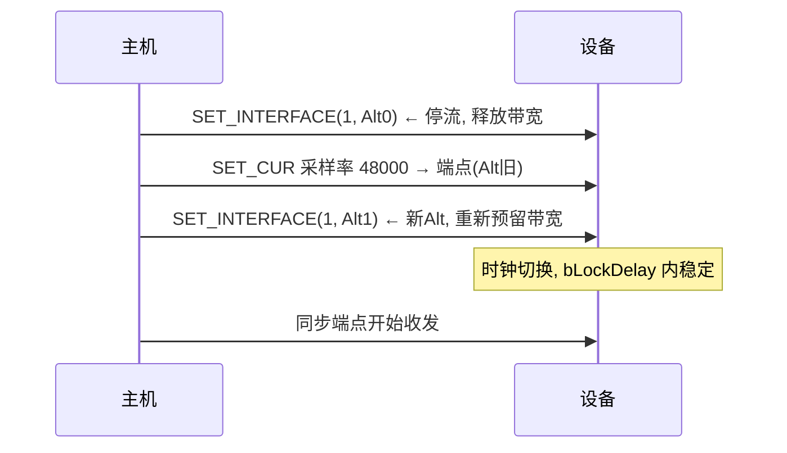

# UAC 1.0 详解

> 🌿 知识树位置: 树干 → 枝干[设备类] → 分枝[UAC] → 叶
> ⬆️ 父节点: [00-UAC概述](00-UAC概述.md)

UAC 1.0（规范修订至 1.0a? 以 USB-IF 发布版为准）诞生于全速时代，至今仍是嵌入式声卡（STM32/ESP32/电视棒/USB 麦克风）的主流选择：描述符简单、所有主机免驱。代价是**全速同步带宽有限**（[带宽账本](../../10-树干-USB核心/06-四种传输类型.md)：FS 同步 ≤1023 B/ms）——16bit/48kHz 立体声（192 KB/ms 的 15%）没问题，7.1/192kHz 就必须上 UAC2。

## 1. 描述符链全景

以"USB 麦克风 + 回放"设备为例，完整骨架（类型码 0x24=CS_INTERFACE，实体描述符都在 AC 接口内）：

```
IAD (0x0B: 捆扎接口0+1)
├── 接口0: AC (0x01/0x01/0x00), 无端点或中断 IN
│   └── CS_AC_INTERFACE:
│       ├── HEADER (8B):  bcdADC=0x0100, wTotalLength, bInCollection=1, baInterfaceNr=[1]
│       ├── INPUT_TERMINAL (12B): ID=1, 类型=0x0201(麦克风), 通道数/掩码
│       ├── FEATURE_UNIT (9B+): ID=2, Source=1, bControlSize=1,
│       │                maControls=[静音|音量位图] ×(通道数+1)
│       └── OUTPUT_TERMINAL (9B): ID=3, Source=2, 类型=0x0101(USB流)
└── 接口1: AS (0x01/0x02/0x00)
    ├── Alt0: 零端点（停流态）
    ├── Alt1:
    │   ├── CS_AS_GENERAL (7B): bTerminalLink=3, bDelay=1, wFormatTag=0x0001(PCM)
    │   ├── CS_FORMAT_TYPE (8B): Type I(0x01): bNrChannels=2, bSubframeSize=2,
    │   │                        bBitResolution=16, bSamFreqType=n, tSamFreq[]×3B
    │   ├── 标准同步端点描述符: FS 1023B? wMaxPacketSize=按最坏采样率算
    │   └── CS_AS_ISO_ENDPOINT (7B): bmAttributes(采样率控制位), bLockDelayUnits, wLockDelay
    └── Alt2: 另一采样率/位深 ...
```

字段精读：

- **Feature Unit 的 maControls**：每通道一组控制位图（bit0=MUTE，bit1=VOLUME…），通道 0 = 主控；bControlSize=1（UAC1 惯例 8 位位图，UAC2 改 16 位）；
- **tSamFreq**：3 字节小端采样率列表（`80 BB 00` = 48000），bSamFreqType=0 表示"连续范围"（配 2 字节上下限）；
- **wMaxPacketSize 按最坏情形**：同步端点声明的是"每帧最大字节数"，主机全额预留——声明过大永久浪费带宽（合规检查项，见[合规认证](../../70-枝干-调试测试与安全/03-USB-IF合规认证.md)）；
- **bLockDelay**：设备从设置采样率到产生稳定数据所需的内部延迟提示（单位：毫秒/PCM 采样帧）。

## 2. 类请求实战

UAC1 请求码（**以规范 Table A-9 为准**；evolve #37 勘误——本节此前误写 GET_CUR=0x02/GET_MIN=0x84 等）：SET_CUR=0x01、**GET_CUR=0x81**、SET_MIN=0x02、**GET_MIN=0x82**、SET_MAX=0x03、**GET_MAX=0x83**、SET_RES=0x04、**GET_RES=0x84**、SET_MEM=0x05、GET_MEM=0x85、GET_STAT=0xFF。寻址：`wValue=(控制选择子<<8)|通道`，`wIndex=(实体ID<<8)|接口`。

| 操作 | 请求打点 |
|---|---|
| 主音量 | SET_CUR(0x02选择子, 通道0) → FeatureUnit(实体2) |
| 左声道静音 | SET_CUR(0x01, 通道1) |
| 音量范围协商 | GET_MIN/GET_MAX/GET_RES → 有符号数，步进由 RES 给出 |
| 换采样率 | SET_CUR(0x01, 0x0100) → **同步端点**（接收者=端点） |
| 读当前采样率 | GET_CUR 同上 |

音量数值为有符号整数，范围与步进完全由设备自报（主机按 MIN/MAX/RES 换算 dB 显示）——不同设备每步 1/256 dB 或 1/100 dB 都合法，主机不做单位假设。

### 换采样率的完整时序



固件义务：每个 Alt Setting 的采样率组合在描述符里自洽；SET_CUR 之后端点参数（包长）必须随之生效。

## 3. 端点与反馈

- **播放（主机→设备）异步模式**：AS 接口额外声明一个同步 IN 反馈端点，UAC1 用 **10.14 定点**报采样率比率（如 48kHz 精确主时钟 → 0x05A000 附近微调）；端点描述符 bRefresh=3 表示 2³ ms 上报一次；
- **录音（设备→主机）异步模式**：设备按自己时钟发送，主机自然跟随，无需反馈端点；
- 同步/自适应设备不设反馈端点——抓包看到"神秘 IN 同步端点"就是异步标志。

## 4. 带宽核算（为何 UAC1 停在全速）

| 配置 | 每毫秒数据量 | FS 同步上限占比 |
|---|---|---|
| 立体声 16bit/44.1kHz | 176.4 B | 17% |
| 立体声 24bit/96kHz | 576 B | 56%（可行但挤占总线） |
| 7.1 24bit/96kHz | 2304 B | **超限，必须 HS+UAC2** |

## 5. 实现与调试清单

- [ ] wTotalLength 与实体描述符总长一致（枚举失败常见根因，[排查手册](../../70-枝干-调试测试与安全/02-枚举失败排查手册.md)）；
- [ ] Feature Unit 至少实现 SET/GET_CUR(MUTE,VOLUME) + MIN/MAX/RES，否则系统音量条无效；
- [ ] Alt0/Alt1 切换时端点启停干净（残留同步包会被判 babble? 最多致告警）；
- [ ] Linux 调试利器：`lsusb -v` 看实体图、`alsa-utils` 的 `alsactl monitor` 盯控制事件、`arecord -D hw:N -f S16_LE` 验证；
- [ ] 常见投诉"有杂音/断续"：先查时钟模式描述与实际实现不符（声称异步却没反馈端点）。

## 相关节点

- 上一叶: [00-UAC概述](00-UAC概述.md) · 下一叶: [02-UAC2与UAC3](02-UAC2与UAC3.md)
- 树干: [描述符详解](../../10-树干-USB核心/07-描述符详解.md) · [IAD](../../10-树干-USB核心/07-描述符详解.md)
- 相邻: [MIDI 类](../其他设备类/07-MIDI类.md)
