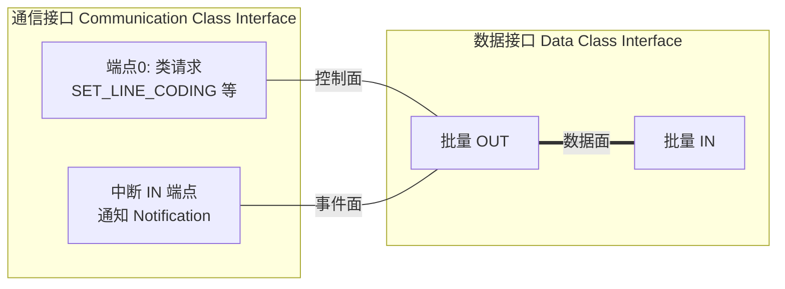

# CDC 概述

> 🌿 知识树位置: 树干 → 枝干[设备类] → 分枝[CDC] → 叶
> ⬆️ 上一级: [00-设备类索引](../00-设备类索引.md) · 树干基础: [描述符详解](../../10-树干-USB核心/07-描述符详解.md)

## 1. CDC 是什么

CDC（Communications Device Class，通信设备类）规范族回答一个问题：**如何用 USB 承载"通信"**——串口线路（调制解调器/RS-232）、以太网帧、电话线路、4G 模组乃至 5G MBIM。它是最古老的设备类规范之一（1.0 与 USB 1.0 同代），也由此背上了"历史包袱"：双接口模型与功能描述符体系在简单场景（虚拟串口）下显得笨重，但却是理解各种"USB 网卡/串口"设备的钥匙。

规范名：《Class definitions for Communication Devices》(CDC) 1.2，配合《PSTN Devices》1.2（串口部分）与《Ethernet/TDM》等子规范。

## 2. 双接口模型：控制与数据分离

CDC 设备的标准形态是**两个接口**组成一个功能：



| 接口 | bInterfaceClass | 端点构成 | 职责 |
|---|---|---|---|
| 通信接口 | 0x02 | 端点 0（类请求）+ 可选中断 IN（事件） | 配置链路参数、上报状态 |
| 数据接口 | 0x0A | 批量 IN + 批量 OUT | 承载业务数据（串口字节流/以太网帧） |

两个接口由 **Union 功能描述符**声明绑为一组（主接口 + 从接口列表）。

## 3. 功能描述符 (Functional Descriptor)

挂在通信接口描述符之后、端点描述符之前的一串**类特定描述符**（bDescriptorType=0x24 CS_INTERFACE），每个以"子类型"区分：

| 子类型 | 名称 | 关键内容 |
|---|---|---|
| 0x00 | Header | bcdCDC 规范版本——功能描述符链的开头 |
| 0x01 | Call Management | 呼叫管理能力位 + 数据接口号 |
| 0x02 | ACM (Abstract Control Management) | 支持的能力位：bit0 请求类命令、bit1 线路编码+串口状态、bit2 Send_Break、bit3 网络连接通知 |
| 0x04 | Direct Line Control | 直线控制模型能力 |
| 0x06 | Union | bMasterInterface + bSlaveInterface[]——把接口捆成一个功能 |
| 0x07 | Country Selection | 国家码列表 |
| 0x0F | Ethernet Networking | ECM 用：MAC 地址、统计能力、段过滤器 |
| 0x1A | NCM | NCM 能力（NTB 格式版本等） |
| 0x1B | MBIM | 移动宽带 |

解析规则与标准描述符一致：bLength + bDescriptorType(0x24) + bDescriptorSubtype + 载荷。

## 4. 子类与协议矩阵

通信接口的 `bInterfaceSubClass` 决定模型，`bInterfaceProtocol` 进一步细化：

| 子类 | 模型 | 本库位置 |
|---|---|---|
| 0x01 | 直线控制（老式调制解调器） | — |
| 0x02 | **ACM** 抽象控制模型（虚拟串口） | [01-虚拟串口ACM](01-虚拟串口ACM.md) |
| 0x03 | 电话控制 | — |
| 0x06 | **ECM** 以太网控制模型 | [02-网络子类](02-网络子类ECM-NCM-RNDIS.md) |
| 0x08 | WHCM 无线手机控制 | — |
| 0x09 | Device Management | 4G 模组管理通道 |
| 0x0B | OBEX | — |
| 0x0C | **EEM** 以太网仿真模型（协议 0x07） | 同上 |
| 0x0D | **NCM** 网络控制模型 | 同上 |
| 0x0E | **MBIM** 移动宽带接口模型 | 同上 |

ACM 的协议字段：0x01 = AT 命令（V.250），0x02 = GSM 07.07 AT，0x00/0xFF = 无/厂商。多数"USB 转串口"设备实际填 0x00 或 0x01，驱动并不强制。

## 5. 类请求与通知：控制面的两个方向

**主机 → 设备**用类请求（bmRequestType=0x21，接口接收者）：

| bRequest | 名称 | 典型载荷 |
|---|---|---|
| 0x20 | SET_LINE_CODING | 7 字节线路编码 |
| 0x21 | GET_LINE_CODING | 返回 7 字节 |
| 0x22 | SET_CONTROL_LINE_STATE | wValue: DTR bit0 / RTS bit1 |
| 0x23 | SEND_BREAK | wValue: break 时长（ms） |

**设备 → 主机**用通知（Notification，经中断 IN 端点）：

```
| bmRequestType=0xA1 | bNotification | wValue | wIndex(接口) | wLength | 数据 |
```

常用通知：SERIAL_STATE (0x20，DCD/DSR/RI/break 状态位图)、RESPONSE_AVAILABLE (0x01)、NETWORK_CONNECTION (0x00)、CONNECTION_SPEED_CHANGE (0x2A)。通知是**硬件事件机制**——没有它，主机就不知道对端状态变化。

## 6. 枚举与驱动的坑

- **复合设备的 IAD**：CDC 的双接口必须用 IAD（接口关联描述符）捆扎，否则 Windows 会把两个接口拆开分别找驱动而失败；老式替代方案是设备级类代码 0xEF/0x02/0x01（Misc/Common/IAD 提示位）。
- **数据接口不挂驱动**：0x0A 接口由所属 CDC 功能的驱动一并接管，操作系统中不会单独出现它的驱动绑定。
- **驱动现状**：Linux `cdc_acm`/`cdc_ether`/`cdc_ncm` 全内置；Windows 10+ 内置 usbser（纯 CDC-ACM 免驱）；Windows 7 需 INF 指向 usbser；macOS 内置。这使 CDC-ACM 成为嵌入式设备"免驱串口"的首选（对比厂商芯片见 [WebUSB 与自定义类](../其他设备类/06-WebUSB与厂商自定义类.md)）。

## 相关节点

- 分枝内: [01-虚拟串口ACM.md](01-虚拟串口ACM.md) · [02-网络子类ECM-NCM-RNDIS.md](02-网络子类ECM-NCM-RNDIS.md)
- 树干: [枚举流程与标准请求](../../10-树干-USB核心/08-枚举流程与标准请求.md)
- 相邻: [HID 跨传输](../HID-人机接口设备/10-HID跨传输I2C与BLE.md)（同为"逻辑协议跑在 USB 上"的思路）
