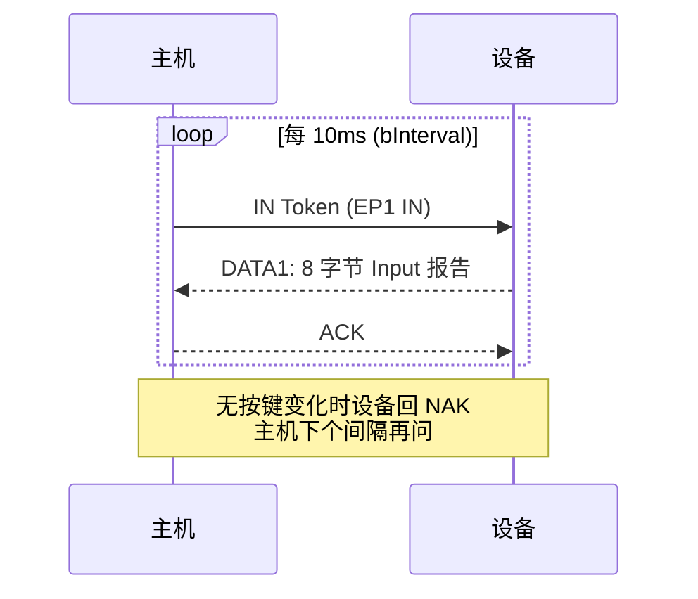

# HID 概述与定位

> 🌿 知识树位置: 树干 → 枝干[设备类] → 分枝[HID] → 根
> ⬆️ 父节点: [07-描述符详解.md](../../10-树干-USB核心/07-描述符详解.md)

## 1. HID 是什么

HID（Human Interface Device，人机接口设备）是 USB 设备类(Class)中最早、最普及的一类，由 USB-IF 在 1996 年随 USB 1.0 时代发布 HID 1.0 规范，现行版本为 **Device Class Definition for Human Interface Devices 1.11**（2001 年发布）。它最初只为解决一个问题：让鼠标(Mouse)和键盘(Keyboard)不需要为每个型号编写专用驱动，插上就能用。

如今 HID 已经远远超出"键鼠"的范畴：

| 领域 | 典型设备 | 利用的 HID 机制 |
|---|---|---|
| 输入 | 键盘、鼠标、轨迹球、触摸板 | Boot 协议、中断端点 |
| 消费电子 | 多媒体键盘、遥控器、耳机线控 | Consumer Usage Page(0x0C) |
| 游戏 | 手柄、摇杆、方向盘、力反馈 | 多轴 + 按钮阵列 + Output/PID |
| 触控 | 触摸屏、精密触摸板、数位板 | Digitizer Page(0x0D)、多点触控 |
| 医疗 | 血压计、血糖仪面板 | Medical Instruments Page(0x40) |
| VR/模拟 | 头显控制器、飞行摇杆 | VR Page(0x03)、Simulation Page(0x02) |
| 传感 | 传感器中枢（I2C 侧） | 传感器 Usage（编码见 HID Usage Tables） |
| 工业 | 扫码枪(Barcode Scanner 0x8C)、电子秤(Scale 0x8D) | 专用 Usage Page |

HID 能"通吃"这些设备的根本原因是：**HID 不定义"设备是什么"，只定义"如何描述数据"**。这正是它在 USB 枚举体系中的位置——HID 属于接口级类定义，挂在接口描述符(Interface Descriptor)上：

```mermaid
flowchart TD
    D["设备描述符 Device Descriptor"] --> C["配置描述符 Configuration Descriptor"]
    C --> I["接口描述符 Interface Descriptor<br/>bInterfaceClass = 0x03 (HID)"]
    I --> HD["HID 类描述符 (0x21)"]
    I --> EP["中断端点描述符"]
    HD -.->|GET_DESCRIPTOR(0x22) 单独获取| RD["报告描述符 Report Descriptor<br/>描述设备的数据格式"]
```

主机看到 `bInterfaceClass=0x03` 后加载通用 HID 类驱动，再解析报告描述符即可知道"这个设备会上报什么格式的数据"，无需厂商驱动。

## 2. 接口级类代码

HID 的类代码全部定义在**接口描述符**中（设备描述符中的 bDeviceClass 保持 0x00，即"各类在接口级声明"）：

| 字段 | 取值 | 含义 |
|---|---|---|
| `bInterfaceClass` | `0x03` | HID 类 |
| `bInterfaceSubClass` | `0x00` | 不支持 Boot 协议（绝大多数设备） |
| `bInterfaceSubClass` | `0x01` | 支持 Boot 协议(Boot Protocol) |
| `bInterfaceProtocol` | `0x00` | 无（SubClass=0 时无意义） |
| `bInterfaceProtocol` | `0x01` | Boot 键盘 |
| `bInterfaceProtocol` | `0x02` | Boot 鼠标 |

注意：

- `bInterfaceProtocol` **仅在 SubClass=1（Boot）时有意义**；普通 HID 设备一律写 0。
- Boot 协议是一套固定的极简报告格式，专为 BIOS/EFI 在没有完整 HID 解析器时操作键盘鼠标而设（详见 [05-键盘详解.md](05-键盘详解.md)、[06-鼠标详解.md](06-鼠标详解.md)）。
- 复合设备（如"键盘+鼠标"）用**多个 HID 接口**实现，每个接口一份 HID 类描述符。

## 3. 自我描述的设计哲学

HID 最核心的设计是**报告描述符(Report Descriptor)**：设备用一段二进制 Item 序列自述"我的报告里有哪些字段、各多少位、取值范围、物理含义"。主机解析一次，之后所有数据交换都按这份"数据字典"进行。

这带来三个结果：

1. **协议与传输无关**。报告描述符只描述数据结构，不绑定 USB——同一份描述符可以跑在 USB、I2C、SPI、蓝牙 GATT 上（见 [10-HID跨传输I2C与BLE.md](10-HID跨传输I2C与BLE.md)）。
2. **一个通用驱动即可服务无限种设备**。Windows/Linux/macOS 的 HID 类驱动都是"描述符驱动的通用解析器"。
3. **扩展零成本**。新设备（如 VR 手柄）不需要新协议，只需要新的 Usage 组合（见 [03-Usage体系与集合.md](03-Usage体系与集合.md)）。

## 4. HID 规范文档族

HID 不是一个文档，而是一个文档族。写 HID 描述符时必须区分"类定义"与"Usage 表"两类规范：

| 文档 | 发布方 | 内容 |
|---|---|---|
| Device Class Definition for Human Interface Devices (HID) 1.11 | USB-IF | 类定义本体：描述符、Item 编码、类请求、Boot 协议 |
| HID Usage Tables（1.x 多个版本） | USB-IF | 全部 Usage Page/Usage ID 分配表（键盘键码、鼠标、Consumer、Digitizer……） |
| HID over I2C Protocol Specification | Microsoft/USB-IF | I2C 传输层（内置触控板/触摸屏） |
| HID over GATT Specification (HOGP) | Bluetooth SIG | BLE 传输层（Report Map 特征复用同一份报告描述符） |
| Device Class Definition for Physical Interface Devices (PID) 1.0 | USB-IF | 力反馈/效果管理（Usage Page 0x0F） |
| HID Sensor Usages | Microsoft | 传感器类 Usage 定义 |

版本细节与最新发布状态请以 usb.org 的 HID 页面为准，本文各数值均以 HID 1.11 与公开的 Usage Tables 为依据。

## 5. 为什么 HID 强制要求中断端点

人机交互数据有两个特点：**数据量小**（每报告几字节到几十字节）、**对延迟敏感**（按下到光标移动必须可感知地"跟手"）。这决定了 HID 不能只靠默认控制管道(Default Control Pipe)：

- 控制传输(Bontrol Transfer)无带宽/服务周期保证，且要和枚举、标准请求、状态轮询共用 EP0，主机软件调度一层叠一层，延迟不可控。
- 中断传输(Interrupt Transfer)的本质是**主机保证以不大于 `bInterval` 的间隔轮询该端点**——给出了一个确定性的最大延迟上限。这正是"低延迟轮询"的含义：不是设备主动打断主机，而是主机周期性地"上门取件"。

因此 HID 1.11 对端点的要求是：

| 端点 | 必选性 | 用途 |
|---|---|---|
| 默认控制端点 EP0 | 必选（USB 通用） | 枚举、类特定请求、Feature 报告 |
| 中断 IN 端点 | **必选**（每个 HID 接口恰好 1 个） | 周期上报 Input 报告（按键/移动） |
| 中断 OUT 端点 | 可选 | 主机向设备推 Output 报告（如键盘 LED）；没有时退化为控制管道上的 `SET_REPORT` |

`bInterval` 与延迟直接挂钩：全速(Full-Speed)下 `bInterval=1ms` 即 1000Hz 轮询，低速率键盘用 10~20ms 也够用。高速(High-Speed)中断端点的 `bInterval` 以微帧(µFrame)为单位按 2^(n−1) 解释。

## 6. 在 USB 事务中的样子

一次典型的键盘按键上报（全速、`bInterval=10ms`）：



设备没有事件时对 IN 令牌回答 NAK，主机按 `bInterval` 周期重试——这就是 HID "永远在线、按需上报"的运行姿态。

## 7. 三类报告模型

HID 的全部数据被组织成三种报告，方向与通道是固定的，所有后续章节都建立在这个模型上：

| 报告类型 | 方向 | 典型内容 | 通道 |
|---|---|---|---|
| Input | 设备 → 主机 | 按键状态、位移、触点、传感器值 | 中断 IN 周期上报；也可 `GET_REPORT` 主动拉取 |
| Output | 主机 → 设备 | LED、背光、马达强度 | 中断 OUT（可选）；无则 `SET_REPORT` |
| Feature | 双向（主机发起） | 配置项：灵敏度、背光档位、协议版本 | 仅控制管道 `GET_REPORT/SET_REPORT` |

三类报告在描述符中分别由 `Input/Output/Feature` Main Item 声明，字段含义与编码规则完全一致，差别只在方向与通道（详见 [02-报告描述符与Item编码.md](02-报告描述符与Item编码.md)、[04-传输与类特定请求.md](04-传输与类特定请求.md)）。

## 8. Boot 协议 vs Report 协议

每个 HID 接口有两种运行协议，通过 `SET_PROTOCOL` 切换、逐接口独立：

| 维度 | Boot 协议 | Report 协议 |
|---|---|---|
| 报告格式 | 规范硬性固定（键盘 8B / 鼠标 3B） | 报告描述符任意定义 |
| Report ID | 无（固定格式不含 ID 字节） | 可用 |
| 进入方式 | 主机显式 `SET_PROTOCOL(0)` | **枚举后的默认状态** |
| 面向场景 | BIOS/EFI、恢复环境、无 HID 解析器 | 现代操作系统 |
| 功能上限 | 6 键无冲、3 按钮、无滚轮 | 任意：NKRO、多轴、多点触控、媒体键 |

设计建议：消费级键盘/鼠标应兼容 Boot（保证进 BIOS 可用）；游戏/多功能设备在 Report 协议下扩展，且扩展字段永远"接在 Boot 布局之后"，保证两协议共用一份描述符（[06-鼠标详解.md](06-鼠标详解.md) 的双协议示例即此套路）。

## 9. 典型形态速查

| 形态 | 描述符组织 | 参考章节 |
|---|---|---|
| 独立 USB 键盘/鼠标 | 单接口单 TLC（Boot 兼容） | [05](05-键盘详解.md) / [06](06-鼠标详解.md) |
| 无线接收器（键鼠一体 dongle） | 单接口多 TLC + Report ID，或多接口 | [11-实战完整报告描述符.md](11-实战完整报告描述符.md) |
| 多媒体键盘 | 键盘 TLC + Consumer TLC | [07-消费控制与多媒体.md](07-消费控制与多媒体.md) |
| 笔记本内置触摸板 | I2C-HID，Touch Pad TLC | [09](09-触摸屏触摸板与数字化仪.md) / [10](10-HID跨传输I2C与BLE.md) |
| BLE 无线鼠标 | HOGP，Report Map 复用 USB 描述符 | [10-HID跨传输I2C与BLE.md](10-HID跨传输I2C与BLE.md) |
| 游戏手柄 | Game Pad TLC 多轴 + Output 振动 | [08-游戏手柄与摇杆.md](08-游戏手柄与摇杆.md) |

## 相关节点

- 父节点：[07-描述符详解.md](../../10-树干-USB核心/07-描述符详解.md)（标准描述符与 GET_DESCRIPTOR）
- 传输机制：[06-四种传输类型.md](../../10-树干-USB核心/06-四种传输类型.md)（中断传输）
- 枚举过程：[08-枚举流程与标准请求.md](../../10-树干-USB核心/08-枚举流程与标准请求.md)
- 本分枝子节点：[01-HID描述符.md](01-HID描述符.md) | [02-报告描述符与Item编码.md](02-报告描述符与Item编码.md) | [03-Usage体系与集合.md](03-Usage体系与集合.md) | [04-传输与类特定请求.md](04-传输与类特定请求.md)
- 键鼠深入：[05-键盘详解.md](05-键盘详解.md) | [06-鼠标详解.md](06-鼠标详解.md)
- 跨传输：[10-HID跨传输I2C与BLE.md](10-HID跨传输I2C与BLE.md)
