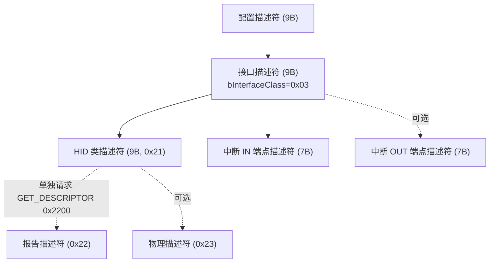
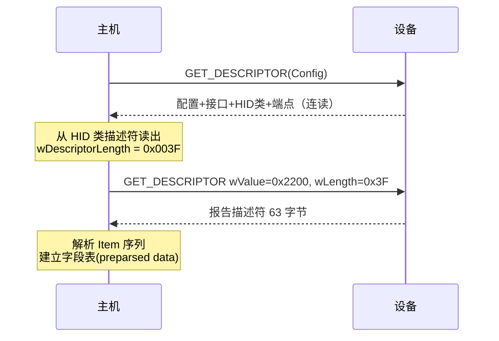

# HID 描述符

> 🌿 知识树位置: 树干 → 枝干[设备类] → 分枝[HID] → 叶[类描述符]
> ⬆️ 父节点: [00-HID概述与定位.md](00-HID概述与定位.md)

## 1. HID 设备的描述符组合

一个 HID 接口由四层描述符叠加描述：**USB 标准描述符**（树干通用）+ **HID 类描述符**(Class Descriptor) + **报告描述符**(Report Descriptor)（不通过配置描述符连读，须单独获取）+ 可选**物理描述符**(Physical Descriptor)。

| 描述符 | 类型码 | 获取方式 | 归属 |
|---|---|---|---|
| 设备描述符 Device | `0x01` | GET_DESCRIPTOR(Device) | USB 标准 |
| 配置描述符 Configuration | `0x02` | GET_DESCRIPTOR(Config)，连读全部下挂描述符 | USB 标准 |
| 接口描述符 Interface | `0x04` | 随配置连读 | USB 标准 |
| **HID 类描述符** | `0x21` | 随配置连读 | HID 类 |
| **报告描述符 Report** | `0x22` | **必须单独 GET_DESCRIPTOR(0x22)** | HID 类 |
| 物理描述符 Physical（可选） | `0x23` | GET_DESCRIPTOR(0x23)，类请求级 | HID 类 |
| 端点描述符 Endpoint | `0x05` | 随配置连读 | USB 标准 |



## 2. HID 类描述符逐字段

HID 类描述符固定挂在接口描述符之后，最常见形态为 9 字节（只有一个报告描述符时）：

| 偏移 | 字段 | 长度 | 示例值 | 说明 |
|---|---|---|---|---|
| 0 | `bLength` | 1 | `0x09` | 本描述符长度（仅报告描述符时为 9） |
| 1 | `bDescriptorType` | 1 | `0x21` | HID 类描述符 |
| 2 | `bcdHID` | 2 | `0x0111` | 类规范版本号 BCD，`0x0111` = HID 1.11 |
| 4 | `bCountryCode` | 1 | `0x00` | 目标国家键盘布局代码，见下表 |
| 5 | `bNumDescriptors` | 1 | `0x01` | 下挂的附属类描述符个数（至少含报告描述符=1） |
| 6 | `bDescriptorType2` | 1 | `0x22` | 第 1 个附属描述符的类型：报告描述符 |
| 7 | `wDescriptorLength` | 2 | 如 `0x003F` | 报告描述符的字节长度（小端） |
| — | （更多附属描述符） | 3/项 | — | 若 bNumDescriptors>1，继续跟 (bDescriptorType, wDescriptorLength) 对 |

### bCountryCode 取值节选

| 值 | 含义 | 值 | 含义 |
|---|---|---|---|
| 0 | Not Supported（绝大多数设备用此值） | 15 | Japan (Katakana) |
| 1 | Arabic | 16 | Korean |
| 3 | Canadian-Bilingual | 19 | Norwegian |
| 7 | Finnish | 25 | Spanish |
| 8 | French | 26 | Swedish |
| 9 | German | 28 | Swiss/German |
| 13 | International (ISO) | 32 | UK |
| 14 | Italian | **33** | **US** |

完整 0~35 的取值表见 HID 1.11 附录。非键盘设备一律填 0。

### 物理描述符(0x23)简介

物理描述符用可选的静态数据描述"数据项与人身体部位的对应关系"（如某个轴对应哪根手指），配合 Input/Output Item 中的 Non-Linear、Physical Min/Max 等语义使用。实际产品极少使用，且它是纯信息性的——主机 HID 解析器不依赖它。绝大多数设备不实现，本文不展开。

## 3. 为什么报告描述符必须单独获取

两个结构性原因：

1. **配置描述符的连读链不含类内部数据**。`GET_DESCRIPTOR(Config)` 返回的是"配置→接口→（类描述符）→端点"这一固定骨架；报告描述符在规范里被定义为**可变的、可能很大的**数据块（几十到上千字节）。把它放进 wTotalLength 会让所有通用主机栈在枚举时被迫解析或缓冲未知长度的类数据。
2. **长度要先知道才能取**。报告描述符的长度只记录在 HID 类描述符的 `wDescriptorLength` 里——主机必须先读到 HID 类描述符，才知道用多大的 `wLength` 去请求报告描述符。这是刻意的两段式设计。

获取报告描述符用的是**标准** GET_DESCRIPTOR 请求（不是类请求），只是定向到接口：

| 字段 | 值 |
|---|---|
| `bmRequestType` | `0x81`（Device-to-Host, Standard, Interface） |
| `bRequest` | `0x06` (GET_DESCRIPTOR) |
| `wValue` | `0x2200`（高字节 0x22=Report，低字节 Index=0） |
| `wIndex` | 接口号 |
| `wLength` | HID 类描述符中给出的 `wDescriptorLength` |



## 4. 端点要求

| 端点 | 要求 | 说明 |
|---|---|---|
| 中断 IN | **必选** | Input 报告周期上报的唯一通道 |
| 中断 OUT | 可选 | 有则 Output 报告走它；无则 Output/Feature 全部走 EP0 上的 `SET_REPORT` |
| 等时/批量 | 禁止 | HID 类设备不得使用 |

中断端点参数速查：

| 速率 | wMaxPacketSize 上限 | bInterval 单位/范围 |
|---|---|---|
| 低速 | 8 字节 | ms，10~255 |
| 全速 | 64 字节 | ms，1~255 |
| 高速 | 64 字节 | µFrame，按 2^(n−1) 解释 |

## 5. 完整示例：USB Boot 键盘的配置描述符

一个最简 Boot 键盘（单接口、无 OUT 端点）的配置描述符总长构成：

```
配置描述符 9 + 接口描述符 9 + HID 类描述符 9 + 中断IN端点描述符 7 = 34 字节
```

逐字节十六进制（`wTotalLength = 0x0022 = 34`）：

```text
09 02 22 00 01 01 00 A0 32   ; 配置描述符: 总长34, 1接口, bConfigurationValue=1,
                             ;   iConfiguration=0, bmAttributes=0xA0(总线供电+远程唤醒),
                             ;   bMaxPower=0x32(100mA)
09 04 00 00 01 03 01 01 00   ; 接口描述符: 接口0, 1端点, Class=0x03,
                             ;   SubClass=0x01(Boot), Protocol=0x01(键盘)
09 21 11 01 00 01 22 3F 00   ; HID 类描述符: bcdHID=0x0111, 国家=0(不支持),
                             ;   1个描述符, 报告描述符长 0x003F=63 字节
07 05 81 03 08 00 0A         ; 端点描述符: EP1 IN, 中断, 8字节包, bInterval=10ms
```

要点核对：

- `wTotalLength`（偏移 2~3，小端 `22 00`）= 9+9+9+7 = **34**。
- 若增加一个中断 OUT 端点，总长变为 41 字节（+7）。
- `wDescriptorLength = 0x003F` 对应 [05-键盘详解.md](05-键盘详解.md) 中那份 63 字节的 Boot 键盘报告描述符——两份描述符的数值互相咬合。
- 多接口复合设备（如键盘+鼠标）则为"每接口一套 接口+HID+端点"，配置描述符的 `bNumInterfaces` 相应增加。

## 6. 描述符之间的数值一致性清单

实现时最常翻车的是跨描述符的一致性，逐项检查：

| 检查项 | 来源 | 去向 |
|---|---|---|
| `wDescriptorLength` | HID 类描述符 | GET_DESCRIPTOR(0x22) 的实际返回长度必须相等 |
| `bNumEndpoints` | 接口描述符 | 实际端点描述符个数（HID 恒为 1 或 2） |
| `bInterfaceProtocol` | 接口描述符 | Boot 描述符的固定报告格式（键盘 8B / 鼠标 3B/4B） |
| `wMaxPacketSize` | 端点描述符 | 报告长度（含 Report ID 字节）不得超过它 |
| `bcdHID` | HID 类描述符 | 描述符中使用的 Item 语法不得超出该版本 |

## 相关节点

- 父节点：[00-HID概述与定位.md](00-HID概述与定位.md)
- 树干基础：[07-描述符详解.md](../../10-树干-USB核心/07-描述符详解.md) | [08-枚举流程与标准请求.md](../../10-树干-USB核心/08-枚举流程与标准请求.md)
- 兄弟节点：[02-报告描述符与Item编码.md](02-报告描述符与Item编码.md)（报告描述符内容解析）
- 报告通道：[04-传输与类特定请求.md](04-传输与类特定请求.md)（GET/SET_REPORT 等类请求）
- 应用实例：[05-键盘详解.md](05-键盘详解.md)（63 字节键盘报告描述符本体）
