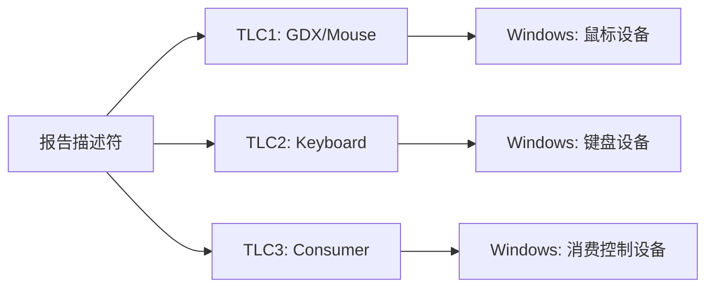

# Usage 体系与集合

> 🌿 知识树位置: 树干 → 枝干[设备类] → 分枝[HID] → 叶[Usage]
> ⬆️ 父节点: [00-HID概述与定位.md](00-HID概述与定位.md)

## 1. Usage = 32 位 = Page + ID

Usage（用法）是 HID 的"语义词汇表"：报告描述符里的每个字段都通过 Usage 告诉主机"这个字段是什么意思"。一个 Usage 是 **32 位**值：

```text
 31              16 15               0
┌──────────────────┬──────────────────┐
│  Usage Page(高)   │   Usage ID(低)   │
└──────────────────┴──────────────────┘
例: 0x00010030 = Generic Desktop 页的 X 轴
```

- Usage Page 是 8 位编码空间（0x00~0xFF），Usage ID 是 16 位空间；
- `Usage Page(Generic Desktop)` 后跟 `Usage(X 0x30)`，等价于完整 Usage `0x00010030`；
- 分配权威是 USB-IF 的《HID Usage Tables》，任何页/ID 都应能在其中查到出处，**禁止私造**——厂商私有功能应使用厂商自定义页（0xFF00~0xFFFF）。

## 2. 常用 Usage Page 一览

| 页码 | 名称 | 典型设备 |
|---|---|---|
| `0x00` | Undefined | 未定义 |
| `0x01` | Generic Desktop | 鼠标、键盘 TLC、轴、系统控制 |
| `0x02` | Simulation Controls | 飞行/驾驶模拟 |
| `0x03` | VR Controls | VR 头显与控制器 |
| `0x05` | Game Controls | 游戏手柄 TLC |
| `0x06` | Generic Device Controls | 设备模式切换（PTP Input Mode 等） |
| `0x07` | Keyboard/Keypad | 键盘键码 |
| `0x08` | LEDs | Num/Caps/Scroll Lock 等 |
| `0x09` | Button | 通用按钮阵列 |
| `0x0A` | Ordinal | 序号（多点触控排序等） |
| `0x0C` | Consumer | 媒体键、遥控（见 [07-消费控制与多媒体.md](07-消费控制与多媒体.md)） |
| `0x0D` | Digitizer | 触摸屏/触摸板/数位笔（见 [09-触摸屏触摸板与数字化仪.md](09-触摸屏触摸板与数字化仪.md)） |
| `0x0F` | Physical Input Device (PID) | 力反馈（见 [08-游戏手柄与摇杆.md](08-游戏手柄与摇杆.md)） |
| `0x10` | Unicode | 文本输入 |
| `0x40` | Medical Instruments | 医疗设备 |
| `0x84` | Power | 电源设备（UPS 等） |
| `0x8C` | Barcode Scanner | 扫码枪 |
| `0x8D` | Scale | 电子秤 |
| `0x91` | Camera Control | 相机控制 |
| `0x92` | Arcade | 街机设备 |
| `0xFF00`~`0xFFFF` | Vendor Defined | 厂商私有 |

传感器(Sensor)类 Usage（Windows HIDSensor 使用）由微软规范单独定义，具体页码与 ID 请查阅最新《HID Usage Tables》及微软 HID Sensors 文档。另外 0x04(Sport)、0x0B(Telephony)、0x0E(Haptics) 等页也存在，此处不展开。

## 3. Generic Desktop 页常用 Usage

Generic Desktop(0x01) 是最繁忙的页——注意 **0x30=X、0x31=Y、0x32=Z、0x38=Wheel**，不要与其它页混淆：

| Usage ID | 名称 | 用途 |
|---|---|---|
| `0x01` | Pointer | 指针集合（鼠标物理集合常用） |
| `0x02` | Mouse | 鼠标 TLC |
| `0x04` | Joystick | 摇杆 TLC |
| `0x05` | Game Pad | 手柄 TLC |
| `0x06` | Keyboard | 键盘 TLC |
| `0x07` | Keypad | 小键盘 TLC |
| `0x30` | X | X 轴 |
| `0x31` | Y | Y 轴 |
| `0x32` | Z | Z 轴 |
| `0x33` | Rx | 旋转 X |
| `0x34` | Ry | 旋转 Y |
| `0x35` | Rz | 旋转 Z |
| `0x36` | Slider | 滑块（油门等） |
| `0x37` | Dial | 旋盘 |
| `0x38` | Wheel | 滚轮（鼠标 Report 协议扩展） |
| `0x39` | Hat Switch | 帽开关（方向帽） |
| `0x80` | System Control | 系统控制集合 |
| `0x81` | System Power Down | 关机键 |
| `0x82` | System Sleep | 睡眠键 |
| `0x83` | System Wake Up | 唤醒键 |

注：早期资料常把 0x08 误当 X——0x08 在现行 Usage Tables 中并非 X，X 从 0x30 开始。

## 4. Collection 类型与语义

Collection Item（`A1 <type>`）把字段组织成树；1 字节数据是集合类型：

| 类型码 | 名称 | 语义 |
|---|---|---|
| `0x00` | Physical | 物理集合：字段来自同一物理时刻/同一传感器（如鼠标的一个物理集合包住 X/Y） |
| `0x01` | Application | 应用集合：**一个逻辑设备单元**，主机按它拆分/归类设备 |
| `0x02` | Logical | 逻辑集合：字段间有耦合关系（如 2 字节合成一个 16 位值、触点的 X/Y/宽高） |
| `0x03` | Report | 报告集合：标注字段归属哪个报告（不常用，多用于报告交叉引用） |
| `0x04` | Named Array | 命名数组：选择器（从命名选项中选一） |
| `0x05` | Usage Switch | 布尔开关集合 |
| `0x06` | Usage Modifier | 修饰键集合（如把 Ctrl/Alt/Shift 组成一组） |

### 4.1 Top Level Collection (TLC)

最外层的 Application Collection 称为**顶层集合**，是主机归类设备的依据：



- 一个 TLC ⇒ 一个 HID 设备实例：Windows 的 HID 类驱动为每个 TLC 生成独立的设备栈（PDO/FDO），所以"键鼠一体接收器"在一个 USB 接口里可以表现为系统里的两个设备。
- 多个 TLC ⇒ 复合设备形态：报告之间用 Report ID 区分（见 [11-实战完整报告描述符.md](11-实战完整报告描述符.md)）。
- TLC 的 Usage 决定系统行为：TLC=`GDX/Mouse` → 光标移动；`GDX/Keyboard` → 文字输入；`Consumer` → 媒体键；`GDX/System Control` → 电源键语义。
- 同一 TLC 下可以再有 Physical/Logical 等内层集合，但 **Application Collection 不可嵌套 Application**。

## 5. 键盘修饰键 Usage（0xE0–0xE7）

Keyboard/Keypad 页(0x07)的 0xE0~0xE7 是 8 个修饰键，天然构成 1 字节位图（Boot 报告字节 0，见 [05-键盘详解.md](05-键盘详解.md)）：

| Usage ID | 修饰键 | 报告位 |
|---|---|---|
| `0xE0` | Left Control | bit0 |
| `0xE1` | Left Shift | bit1 |
| `0xE2` | Left Alt | bit2 |
| `0xE3` | Left GUI (Win/⌘) | bit3 |
| `0xE4` | Right Control | bit4 |
| `0xE5` | Right Shift | bit5 |
| `0xE6` | Right Alt (AltGr) | bit6 |
| `0xE7` | Right GUI | bit7 |

## 6. 使用规则速查

1. `Usage Page` 属于 **Global** 状态：设置后一直有效，直到下次设置；`Usage/Usage Min/Usage Max` 属于 **Local**：贴完一个 Main Item 即清空（见 [02-报告描述符与Item编码.md](02-报告描述符与Item编码.md)）。
2. 位图字段用 `Usage Minimum~Usage Maximum` 连续区间一次声明（如 LED 0x01~0x05）；离散 Usage 则逐个 `Usage` 列举。
3. Array 字段中，**报告值本身就是要选中的 Usage ID**，因此 Usage Min/Max 必须覆盖 Logical Min/Max 的取值范围，否则解析器查表落空。
4. Usage 超出当前页 16 位 ID 空间的"扩展用法"（Extended Usages）在部分新版 Usage Tables 中存在，遇到时请以最新 Usage Tables 为准。

## 7. Usage 的类型标注

《HID Usage Tables》里每个 Usage 除了编号，还有一个**用法类型(Type)**标注，告诉主机解析器这个字段应按什么语义处理：

| 缩写 | 全称 | 语义 | 典型例子 |
|---|---|---|---|
| MC | Momentary Control | 瞬态：按住为 1，松开为 0 | 普通按键、媒体键 |
| OOC | On/Off Control | 双态切换：状态量 | Num Lock LED |
| OSC | One-Shot Control | 单发触发 | 静音切换 |
| RTC | Re-trigger Control | 可重触发 | 部分遥控键 |
| DV | Dynamic Value | 动态数值 | 轴、坐标、滚轮 |
| DF | Dynamic Flag | 动态标志 | Tip Switch、In Range |
| Sel | Selector | 从命名集合中选一 | 帽开关命名数组 |
| LC | Linear Control | 线性控制量 | 音量滑条 |
| CL / CA | Collection Logical / Application | 集合的语义标签 | Finger / Touch Screen |

写描述符时不必显式声明类型（类型藏在 Usage Tables 里，主机解析器按 Usage 编号查表得知），但**设计报告结构时必须尊重它**：把 OOC 键做成数组选值、或把 DV 轴按位图上报，都会导致主机侧行为异常。

## 8. 查 Usage Tables 的工作流

1. 确定 TLC（Application Collection 的 Usage）——决定 OS 归类；
2. 在 Usage Tables 索引中找到对应 Usage Page，确认页码与所需 Usage ID 及其类型标注；
3. 检查该 Usage 要求的值域/位宽（DV 类常注明建议 Logical 范围）；
4. 厂商私有功能一律进 0xFF00~0xFFFF 厂商页，不得占用标准编号；
5. 记录版本：Usage Tables 有多个版本，编号偶有增补，描述符注释里注明依据的版本，便于回归。

## 9. Ordinal 页(0x0A)与编号语义

Ordinal（序数）页用于"第几个"这类纯序号语义，典型场景是多点触控中给触点编号的辅助手段。它是"值=序号"的页，与 Array 字段配合使用；是否采用由设备厂商决定，现代触控方案多用 Contact Identifier(0x51) 替代（见 [09-触摸屏触摸板与数字化仪.md](09-触摸屏触摸板与数字化仪.md)）。

## 相关节点

- 父节点：[00-HID概述与定位.md](00-HID概述与定位.md)
- Item 编码机制：[02-报告描述符与Item编码.md](02-报告描述符与Item编码.md)
- 应用分支：[05-键盘详解.md](05-键盘详解.md) | [06-鼠标详解.md](06-鼠标详解.md) | [07-消费控制与多媒体.md](07-消费控制与多媒体.md) | [08-游戏手柄与摇杆.md](08-游戏手柄与摇杆.md) | [09-触摸屏触摸板与数字化仪.md](09-触摸屏触摸板与数字化仪.md)
- 实战组织：[11-实战完整报告描述符.md](11-实战完整报告描述符.md)
