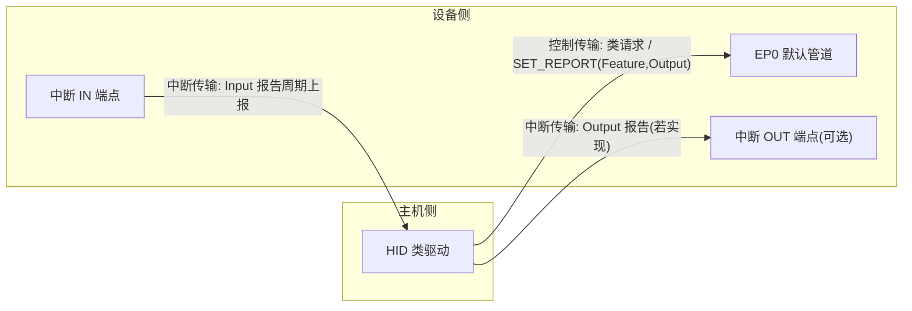
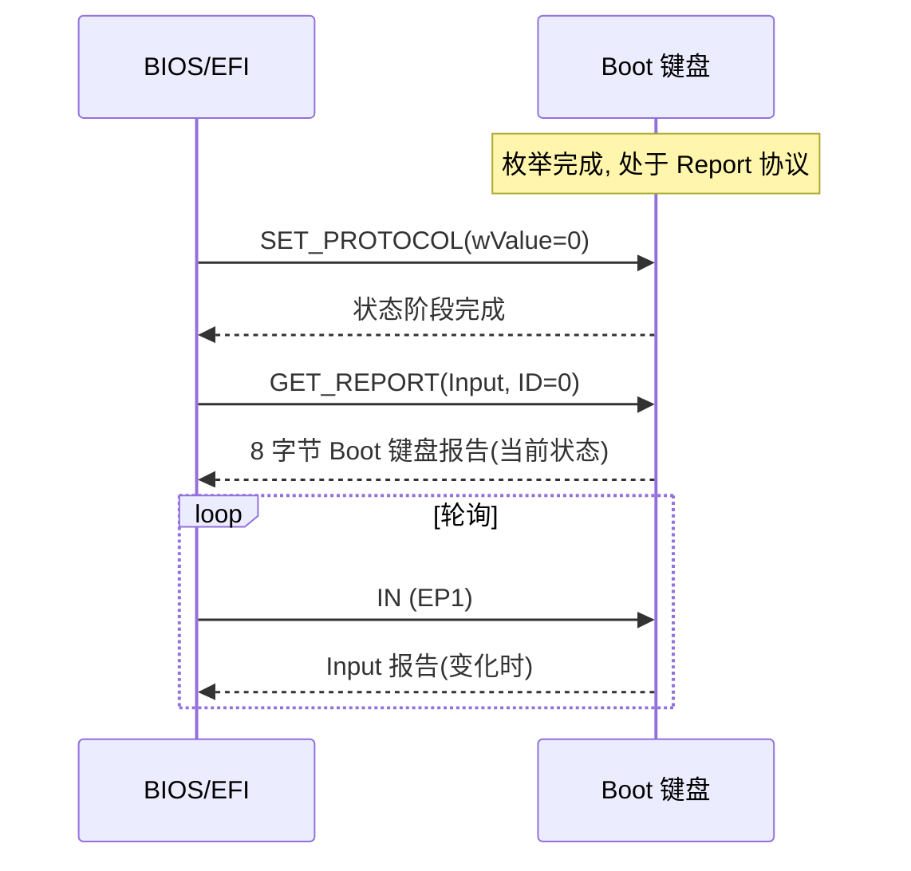
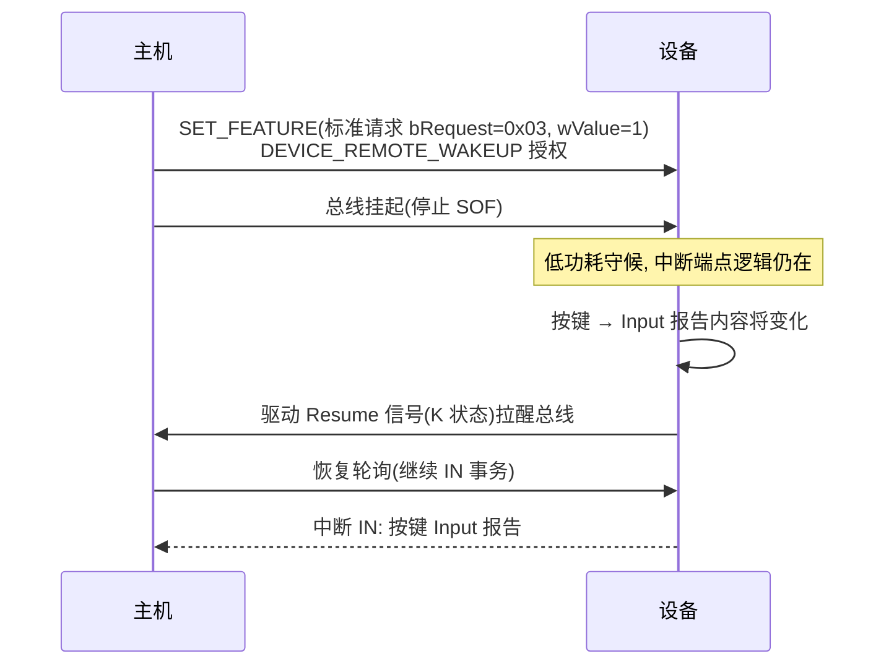

# 传输与类特定请求

> 🌿 知识树位置: 树干 → 枝干[设备类] → 分枝[HID] → 叶[类请求]
> ⬆️ 父节点: [00-HID概述与定位.md](00-HID概述与定位.md)

## 1. HID 的三条通道

HID 接口的数据通路只有三条，与三类报告一一对应：



| 通道 | 承载内容 | 特点 |
|---|---|---|
| 控制管道(EP0) | 六个类特定请求、**Feature 报告**、未实现中断 OUT 时的 Output 报告 | 按需、双向、无周期保证 |
| 中断 IN | **Input 报告** | 主机按 `bInterval` 轮询，延迟有上界 |
| 中断 OUT | Output 报告 | 可选；把"主机→设备"数据从控制管道分流出去 |

**Feature 报告为什么只能走控制通道**：Feature 报告是"配置语义"的数据（设备状态读写），事件性弱、频率低、需要主机主动拉取或推送——控制传输的"请求-响应"模型正合适；而中断端点被定义为周期性数据流，不适合"主机随机读取"的模式。因此 HID 1.11 规定 Feature 报告只通过 `GET_REPORT/SET_REPORT`（类型 3=Feature）在默认管道传输。

## 2. 六个类特定请求总表

| 请求 | bRequest | bmRequestType | wValue | wIndex | wLength | Data 阶段 |
|---|---|---|---|---|---|---|
| GET_REPORT | `0x01` | `0xA1` | 高字节=Report ID，低字节=报告类型 | 接口号 | 报告长度 | 报告数据 |
| GET_IDLE | `0x02` | `0xA1` | 高字节=Report ID，低字节=0 | 接口号 | 1 | 1 字节当前 Idle 率 |
| GET_PROTOCOL | `0x03` | `0xA1` | 0 | 接口号 | 1 | 0=Boot，1=Report |
| SET_REPORT | `0x09` | `0x21` | 高字节=Report ID，低字节=报告类型 | 接口号 | 报告长度 | 报告数据 |
| SET_IDLE | `0x0A` | `0x21` | 高字节=Report ID，低字节=Duration | 接口号 | 0 | 无 |
| SET_PROTOCOL | `0x0B` | `0x21` | 低字节：0=Boot，1=Report | 接口号 | 0 | 无 |

- `bmRequestType` 编码：`10100001B`=`0xA1`（Device→Host，Class，Interface）；`00100001B`=`0x21`（Host→Device，Class，Interface）。
- **wValue 中的报告类型**（低字节）：`1`=Input，`2`=Output，`3`=Feature；高字节为 Report ID（无 Report ID 设备填 0）。
- `wIndex` 恒为接口号——HID 类请求都定向到接口。
- 以上 bRequest 值与 HID 1.11 第 7.2 节一致：注意 **GET_IDLE=0x02、GET_PROTOCOL=0x03**（0x05 未分配给 GET_PROTOCOL，勿与其它类混用）。

### 2.1 GET_REPORT / SET_REPORT

- 用途：状态同步与初始化。主机开机时不知道设备当前按键/LED 状态，用 `GET_REPORT(Input)` 主动读一次；LED、背光用 `SET_REPORT(Output)`；背光亮度、灵敏度等配置用 `SET_REPORT(Feature)`。
- HID 1.11 要求：**支持 Boot 协议的键盘/鼠标必须支持对 Input 报告的 GET_REPORT**（BIOS/OS 由此轮询当前状态）。
- 无中断 OUT 端点的设备，Output 报告一律经 `SET_REPORT` 下发。

### 2.2 SET_IDLE / GET_IDLE —— Idle 率

Input 报告默认"变化才上报"，但对某些设备（如 joystick 中位）主机希望周期性拿到最新值。Idle 率解决"多久强制重发一次"：

- **单位是 4ms**：写入值 N 表示 N×4ms，即设备每 N×4ms 对该报告"无变化也重发一次"；
- **Duration=0 表示无限(Infinity)**：退回"仅状态变化时上报"（最常用默认值）；
- `SET_IDLE` 的 Duration 在 **wValue 低字节**，Report ID 在高字节；Report ID=0 表示作用于该接口全部 Input 报告；
- 典型时序：BIOS 时代常用 `SET_IDLE(0)` 关闭重发省电，全速游戏设备则常设非零 Idle 保证轮询可见性。

示例：`21 0A 04 00 00 00 00 00` 是一条完整的 SET_IDLE Setup 包：bmRequestType=0x21, bRequest=0x0A, wValue=`0x0004`（高字节 Report ID=0，低字节 Duration=4 → 16ms；wValue 线上小端，故字节序为 `04 00`），wIndex=0，wLength=0。

### 2.3 GET_PROTOCOL / SET_PROTOCOL —— 双协议切换

| wValue | 协议 | 报告格式 |
|---|---|---|
| 0 | Boot 协议 | 固定极简格式（键盘 8 字节 / 鼠标 3~4 字节），见 [05-键盘详解.md](05-键盘详解.md)、[06-鼠标详解.md](06-鼠标详解.md) |
| 1 | Report 协议 | 报告描述符描述的完整格式 |

- 协议状态**逐接口独立**（同一设备的不同接口可处于不同协议）。
- 设备枚举后默认处于 **Report 协议**；BIOS/EFI 想用键鼠时必须显式 `SET_PROTOCOL(0)`。
- 仅 `bInterfaceSubClass=1` 的接口必须响应这两个请求；普通设备收到应回 STALL。



## 3. 挂起与远程唤醒

USB 总线空闲 ≥3ms 主机即挂起总线（见树干 [10-电源管理与挂起唤醒.md](../../10-树干-USB核心/10-电源管理与挂起唤醒.md)）。键盘鼠标必须在挂起期间保持"能被按键唤醒"的能力，流程分**授权**与**触发**两步：



要点：

1. **远程唤醒必须先获得授权**：主机通过标准请求 `SET_FEATURE`，`wValue=1`（DEVICE_REMOTE_WAKEUP）；配置描述符 `bmAttributes` bit5 置 1 表示"支持远程唤醒"，两者缺一不可。
2. **触发条件是"输入状态将变化"**：按键/鼠标移动使 Input 报告待更新，即构成唤醒事件；设备发 Resume 信号（低速/全速为驱动 K 状态若干 ms），随后主机恢复总线并轮询，设备用中断 IN 交付报告。
3. 主机可随时用 `CLEAR_FEATURE(DEVICE_REMOTE_WAKEUP)` 收回授权，此后设备不得再发 Resume。

## 4. 错误处理

- **不支持/非法的类请求回 STALL**：如普通 HID 收到 `GET_PROTOCOL`，或请求类型字段非法。设备以 `STALL` 握手应答 Data 或 Status 阶段，主机清端点后继续。
- **wLength 与报告长度不符**：设备按 wLength 截断或以短包(Short Packet)结束，不得溢出。
- **Boot 接口未进入 Boot 协议时收到 Boot 语义的请求**：协议请求仅约束协议状态，报告内容仍以当前协议为准。
- 报告管道的传输错误重试由 USB 层完成（见树干 [11-错误处理与可靠性.md](../../10-树干-USB核心/11-错误处理与可靠性.md)），HID 类本身没有额外重传机制——报告是"最新状态"语义，丢一帧等下一帧即可。

## 5. 类请求的 Setup 包字节级示例

控制传输的 Setup 包恒为 8 字节：`bmRequestType, bRequest, wValue(小端2B), wIndex(小端2B), wLength(小端2B)`。

**例 1：点亮 Caps Lock（SET_REPORT, Output, 无 Report ID，1 字节数据）**

```text
21 09 02 00 00 00 01 00    ; wValue=0x0002: 低字节 2=Output, 高字节 ID=0
│  │  └─┬─┘ └─┬─┘ └─┬─┘
│  │    │    │    └─ wLength=1
│  │    │    └─ wIndex=接口0
│  │    └─ wValue: 02 00 (低字节在前!)
│  └─ bRequest=0x09 (SET_REPORT)
└─ bmRequestType=0x21 (Host→Device, Class, Interface)
Data 阶段: 1 字节 LED 位图, 点亮 Caps Lock → 02
```

**例 2：BIOS 读键盘当前状态（GET_REPORT, Input, 无 Report ID）**

```text
A1 01 01 00 00 00 08 00    ; wValue=0x0001 (1=Input), wLength=8
Data 阶段: 设备返回 8 字节 Boot 键盘报告
```

**例 3：进入 Boot 协议（SET_PROTOCOL）**

```text
21 0B 00 00 00 00 00 00    ; wValue 低字节 0=Boot; 无 Data 阶段
```

## 6. 支持矩阵：哪些请求是必须的

| 请求 | 普通 HID 设备（SubClass=0） | Boot 设备（SubClass=1） |
|---|---|---|
| GET_REPORT | 实现 Feature/Output 读取时必须 | **Input 报告的 GET_REPORT 必须**（BIOS 轮询依赖） |
| SET_REPORT | 实现 Output/Feature 时必须 | 建议（LED、模式配置） |
| GET_IDLE / SET_IDLE | 可选；不实现可回 STALL，主机应容忍 | 建议（BIOS 常用 SET_IDLE(0) 关闭重发） |
| GET_PROTOCOL / SET_PROTOCOL | 不支持（应回 STALL） | **必须** |

补充细节：`GET_IDLE` 无论选中哪个 Report ID，**返回恒为 1 字节**（该 ID 当前的 Idle 率）；`GET_PROTOCOL` 返回 1 字节当前协议号。wLength 与规范不符时设备按短包处理，不得溢出缓冲。

## 相关节点

- 父节点：[00-HID概述与定位.md](00-HID概述与定位.md)
- 端点与描述符：[01-HID描述符.md](01-HID描述符.md)
- 协议格式：[05-键盘详解.md](05-键盘详解.md) | [06-鼠标详解.md](06-鼠标详解.md)
- 树干支撑：[06-四种传输类型.md](../../10-树干-USB核心/06-四种传输类型.md) | [08-枚举流程与标准请求.md](../../10-树干-USB核心/08-枚举流程与标准请求.md) | [10-电源管理与挂起唤醒.md](../../10-树干-USB核心/10-电源管理与挂起唤醒.md)
