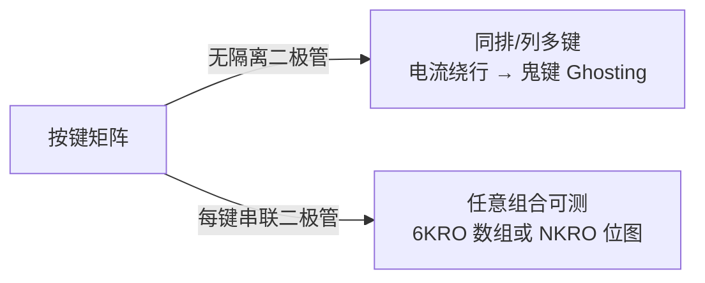

# 键盘详解

> 🌿 知识树位置: 树干 → 枝干[设备类] → 分枝[HID] → 叶[键盘]
> ⬆️ 父节点: [00-HID概述与定位.md](00-HID概述与定位.md)

## 1. Boot 协议报告：固定的 8 字节

Boot 键盘（`bInterfaceSubClass=1, bInterfaceProtocol=1`）在 Boot 协议下的 Input 报告是**固定 8 字节**，与报告描述符无关：

| 偏移 | 内容 | 说明 |
|---|---|---|
| 0 | 修饰键位图 | 8 位对应 Usage 0xE0~0xE7，见下表 |
| 1 | 保留 | 恒 0（OEM 保留字节） |
| 2~7 | 6 个键码 | 6KRO（6-Key Rollover）数组，0=无按键 |

修饰键位图（值域 0/1，Usage 0xE0 起按位对应）：

| 位 | Usage | 键 | 位 | Usage | 键 |
|---|---|---|---|---|---|
| bit0 | 0xE0 | 左 Ctrl | bit4 | 0xE4 | 右 Ctrl |
| bit1 | 0xE1 | 左 Shift | bit5 | 0xE5 | 右 Shift |
| bit2 | 0xE2 | 左 Alt | bit6 | 0xE6 | 右 Alt |
| bit3 | 0xE3 | 左 GUI | bit7 | 0xE7 | 右 GUI |

示例：按下 `Ctrl+Shift+A` 的报告序列（无按键时全 0）：

```text
按下: 03 00 04 00 00 00 00 00   (修饰键=0x03, 键码 0x04='A')
保持: 03 00 04 00 00 00 00 00   (Idle=0 时变化才发, 无需重复)
释放: 00 00 00 00 00 00 00 00   (必须显式发送"全零"释放报告)
```

Boot 协议报告**不含 Report ID 字节**，即使报告描述符中使用了 Report ID（Boot 格式由规范固定）。

## 2. Report 协议与 NKRO

进入 Report 协议（`SET_PROTOCOL(1)`，见 [04-传输与类特定请求.md](04-传输与类特定请求.md)）后，键盘可按报告描述符任意扩展：

- **NKRO（N-Key Rollover，全键无冲）**：用 1 字节 Report ID + 32 字节（256 位）键位图，每键一位，同时按下任意多键互不冲突；
- 或将键码分区，用**多个 Report ID** 分别承载不同键区（主键区/小键盘/多媒体区）；
- 6KRO 数组方案的局限：第 7 个同拍按键被丢弃或覆盖；矩阵无二极管时还会产生"鬼键"(Ghosting)——NKRO 硬件前提是每个键位串联隔离二极管。

## 3. Usage Page 0x07 键值表节选

| Usage ID | 键 | Usage ID | 键 |
|---|---|---|---|
| `0x04`~`0x1D` | a/A ~ z/Z | `0x28` | Return (Enter) |
| `0x1E`~`0x26` | 1! ~ 9( | `0x29` | Escape |
| `0x27` | 0) | `0x2A` | Backspace |
| `0x2B` | Tab | `0x39` | Caps Lock |
| `0x2C` | Spacebar | `0x53` | Keypad NumLock and Clear |
| `0x2D`~`0x31` | -_=…\ | `0x56` | Keypad - |
| `0x33`~`0x38` | ;'`,./ | `0x57` | Keypad + |
| `0x3A`~`0x45` | F1 ~ F12 | `0x58` | Keypad Enter |
| `0x46` | PrintScreen | `0x59`~`0x63` | Keypad 1~0 与 . |
| `0x47` | Scroll Lock | `0x64` | Non-US Backslash |
| `0x48` | Pause | `0x65` | Application (菜单键) |
| `0x49`~`0x4E` | Insert/Home/PgUp/Del/End/PgDn | `0x68`~`0x73` | F13 ~ F24 |
| `0x4F`~`0x52` | →←↓↑ | `0xE0`~`0xE7` | 修饰键 |

注意两处易错：`0x53` 是**小键盘 NumLock**（不是 Keypad Period，小数点在 `0x63`）；F13 从 `0x68` 开始（`0x57/0x58` 是小键盘 +/Enter）。完整表以《HID Usage Tables》Keyboard/Keypad 页为准。

## 4. LED 输出报告

键盘 Output 报告承载 5 个 LED，注意区分**Usage ID**（LED 页 0x08 分配）与**Boot 报告位掩码**两套编号：

| LED | Usage ID (页 0x08) | Boot 报告位掩码 | 报告位 |
|---|---|---|---|
| Num Lock | `0x01` | `0x01` | bit0 |
| Caps Lock | `0x02` | `0x02` | bit1 |
| Scroll Lock | `0x03` | `0x04` | bit2 |
| Compose | `0x04` | `0x08` | bit3 |
| Kana | `0x05` | `0x10` | bit4 |
| （填充） | — | — | bit5~7 |

主机在 Caps Lock 状态变化时以 `SET_REPORT(Output)` 下发 1 字节（有中断 OUT 端点则走端点）；LED 状态是**绝对状态**而非翻转指令——设备不得自行取反。

## 5. 完整 Boot 键盘报告描述符（逐行注释）

63 字节（`0x3F`），Input+LED Output 双报告，无 Report ID，逐字节十六进制：

```text
05 01    Usage Page (Generic Desktop)   ; 全局: 桌面页
09 06    Usage    (Keyboard)            ; TLC = 键盘 → 系统按键盘归类
A1 01    Collection (Application)       ; 顶层应用集合
05 07    Usage Page (Keyboard/Keypad)   ; 切键码页
19 E0    Usage Minimum (0xE0)
29 E7    Usage Maximum (0xE7)
15 00    Logical Minimum (0)
25 01    Logical Maximum (1)
75 01    Report Size (1)
95 08    Report Count (8)
81 02    Input (Data,Var,Abs)           ; [字节0] 修饰键位图 8 位
95 01    Report Count (1)
75 08    Report Size (8)
81 03    Input (Const,Var,Abs)          ; [字节1] 保留字节(常量填充)
95 06    Report Count (6)
75 08    Report Size (8)
15 00    Logical Minimum (0)            ; 数组值 0 = 无按键
25 65    Logical Maximum (101)          ; 0x65 = 最大标准键码
19 00    Usage Minimum (0)              ; 数组值 v ↔ Usage (0x07页) v
29 65    Usage Maximum (101)
81 00    Input (Data,Array,Abs)         ; [字节2~7] 6 键码数组 (6KRO)
05 08    Usage Page (LEDs)              ; ── Output 报告 ──
19 01    Usage Minimum (Num Lock)
29 05    Usage Maximum (Kana)
15 00    Logical Minimum (0)
25 01    Logical Maximum (1)
75 01    Report Size (1)
95 05    Report Count (5)
91 02    Output (Data,Var,Abs)          ; 5 个 LED 位
95 03    Report Count (3)
91 03    Output (Const,Var,Abs)         ; 3 位填充补齐整字节
C0       End Collection
```

描述符侧配套：接口描述符 `bInterfaceSubClass=1`、`bInterfaceProtocol=1`；HID 类描述符 `wDescriptorLength=0x003F`（与 [01-HID描述符.md](01-HID描述符.md) 的 34 字节配置描述符示例咬合）。

## 6. 键位无冲与鬼键



- **6KRO**：报告只有 6 个键码槽，第 7 键被丢弃——Boot 协议的先天限制；
- **NKRO**：256 位键位图 + Report ID，全键无冲，代价是报告变大（1+32 字节）且 BIOS 不认识；
- 主机侧实现注意：数组报告的"去重/乱序"要按值处理而非按位置。

## 7. 为什么 BIOS/EFI 需要 Boot 协议

BIOS/EFI 固件没有完整的 HID 解析器（无内存解析 Usage 树、无驱动框架），也不一定有时间枚举解析报告描述符。Boot 协议用三件套把键鼠降到"傻瓜模式"：

1. 接口描述符自报家门：`SubClass=1` + `Protocol=1/2`；
2. 固定格式的报告（键盘 8 字节、鼠标 3 字节），固件硬编码解析；
3. 两个请求搞定一切：`SET_PROTOCOL(0)` 进入 Boot 模式、`GET_REPORT(Input)` 主动取状态（规范要求 Boot 设备必须支持）。

因此做"支持进 BIOS 的键盘"，报告描述符必须同时满足 Boot 约束（固定字段顺序与格式）与 Report 协议扩展——通常用"Boot 字段在前 + Report ID + 扩展字段在后"的双协议描述符（鼠标实例见 [06-鼠标详解.md](06-鼠标详解.md)）。

## 8. 从键码到字符：主机的另一半工作

HID 只传递"键码"(0x04='a'位)，**字符映射是 OS 键盘布局层的事**：

| 环节 | 数据 | 例子 |
|---|---|---|
| 设备报告 | 键码 + 修饰键位图 | `02 00 0A 00...` = Shift+G 键码 |
| OS 键盘布局（中文输入法等） | 键码→字符/输入法事件 | 0x0A + Shift → "G" |

推论：

1. 设备永远不知道自己连着德语还是中文布局——`bCountryCode` 只是提示，不改变键码含义；
2. "宏键盘"实现自定义字符的正规途径是发送对应字符的键码序列（含 Shift 位图），而非发明新键码；
3. 多语言方案（如日语罗马字输入）完全由 OS 输入法完成，HID 层无感知。

## 相关节点

- 父节点：[00-HID概述与定位.md](00-HID概述与定位.md)
- 描述符与请求：[01-HID描述符.md](01-HID描述符.md) | [04-传输与类特定请求.md](04-传输与类特定请求.md)
- 键码语义与修饰键：[03-Usage体系与集合.md](03-Usage体系与集合.md)
- 报告扩展与复合：[11-实战完整报告描述符.md](11-实战完整报告描述符.md)
- 无线键盘的传输替换：[10-HID跨传输I2C与BLE.md](10-HID跨传输I2C与BLE.md)
