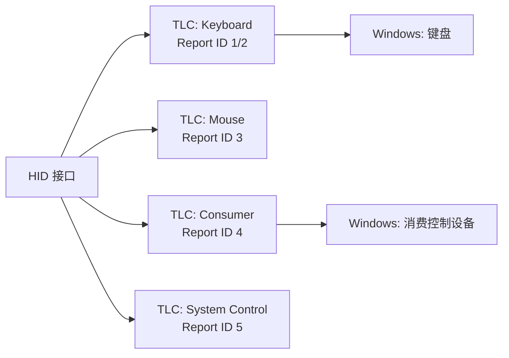
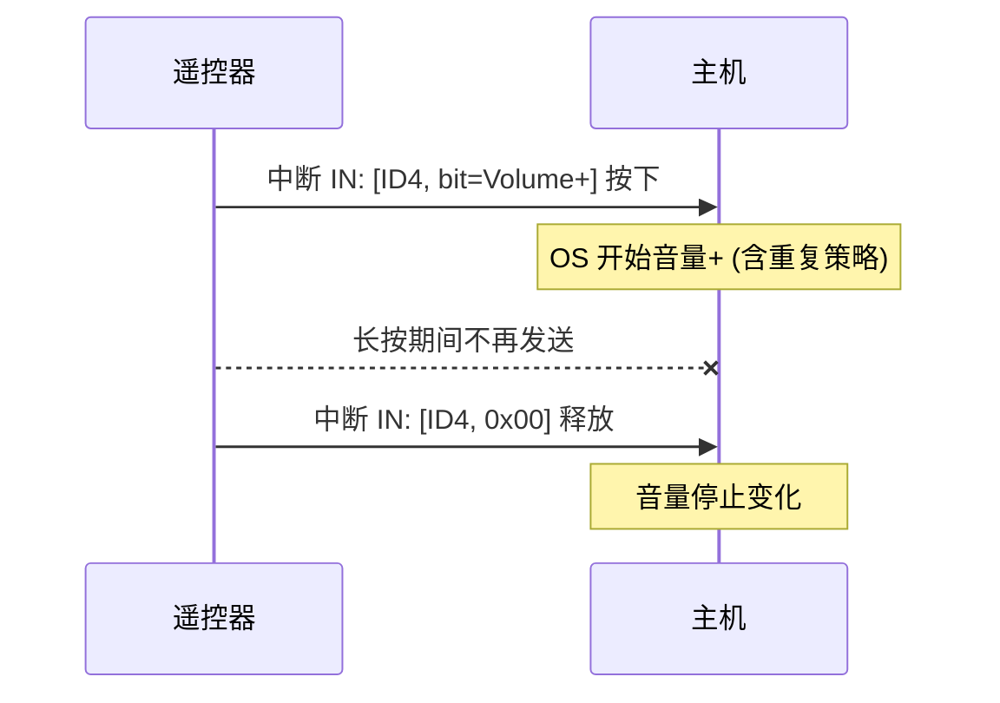

# 消费控制与多媒体

> 🌿 知识树位置: 树干 → 枝干[设备类] → 分枝[HID] → 叶[Consumer]
> ⬆️ 父节点: [00-HID概述与定位.md](00-HID概述与定位.md)

## 1. Consumer 页(0x0C)的定位

Consumer Usage Page 承载"媒体控制/遥控器/应用控制"语义：播放、音量、浏览器导航、电源、频道等。它使一个 HID 设备能表达"电视遥控器""耳机线控""多媒体键区"而不需要任何厂商驱动——OS 对这些 Usage 有内建映射。

## 2. 常用 Usage ID

| Usage ID | 名称 | 语义 |
|---|---|---|
| `0x30` | Power | 系统电源键（消费者语义） |
| `0xB5` | Scan Next Track | 下一曲 |
| `0xB6` | Scan Previous Track | 上一曲 |
| `0xB7` | Stop | 停止 |
| `0xCD` | Play/Pause | 播放/暂停切换 |
| `0xE2` | Mute | 静音 |
| `0xE9` | Volume Increment | 音量+ |
| `0xEA` | Volume Decrement | 音量− |
| `0x223` | AC Home | 浏览器主页 |
| `0x224` | AC Back | 浏览器后退 |
| `0x225` | AC Forward | 浏览器前进 |
| `0x238` | AC Pan | 水平滚动（鼠标水平滚轮复用，见 [06-鼠标详解.md](06-鼠标详解.md)） |

其余（菜单、频道、快进快退、数字键区等）以《HID Usage Tables》Consumer 页为准，此处不逐一展开。

## 3. 两种描述方式：位图 vs 数组

### 3.1 位图（Variable）——推荐

每个 Usage 独占 1 位，可**同时**表达多个键、天然支持按住/释放语义：

```text
05 0C        Usage Page (Consumer)
09 01        Usage (Consumer Control)     ; TLC
A1 01        Collection (Application)
  85 02      Report ID (2)
  09 B5      Usage (Scan Next Track)
  09 B6      Usage (Scan Previous Track)
  09 B7      Usage (Stop)
  09 CD      Usage (Play/Pause)
  09 E2      Usage (Mute)
  09 E9      Usage (Volume Increment)
  09 EA      Usage (Volume Decrement)
  15 00      Logical Minimum (0)
  25 01      Logical Maximum (1)
  75 01      Report Size (1)
  95 07      Report Count (7)
  81 02      Input (Data,Var,Abs)        ; 7 位状态位图
  95 01      Report Count (1)
  81 03      Input (Const,Var,Abs)       ; 1 位填充 → 1 字节
C0           End Collection
```

报告示例（Report ID 2）：`02 08` = Play/Pause 按下（第 4 个 Usage → bit3）；`02 00` = 释放。

### 3.2 数组（Array）

一次报告携带"当前按下的 Usage ID 值"，N 字节可放 N 个同时按键，但**同一字节内语义互斥、表达"按住集合"不如位图直观**，且空报告须填 0（0 通常映射到"无事件"Usage）：

```text
  15 00      Logical Minimum (0)
  26 FF 00   Logical Maximum (255)
  19 00      Usage Minimum (0)
  2A FF 0C   Usage Maximum (0x0CFF)      ; Consumer 页全范围
  75 08      Report Size (8)
  95 02      Report Count (2)
  81 00      Input (Data,Array,Abs)      ; 2 键并发上限的数组
```

### 3.3 对比

| 维度 | 位图 Variable | 数组 Array |
|---|---|---|
| 并发按键 | 任意多（每位独立） | 受报告字节数限制 |
| 报告大小 | 键多时位图迅速变宽 | 键多时更紧凑（每键 1~2 字节） |
| 释放语义 | 全 0 报告 | 值移除 |
| Usage 稀疏时 | 位图有大量空洞浪费位 | 按需填值，无浪费 |
| 典型场景 | 固定媒体键区 | 数百个遥控键码 |

## 4. 典型实现：复合键盘 + 媒体键

多媒体键盘的标准做法是**单接口多 Report ID 多 TLC**：键盘、鼠标、Consumer 各占一个顶层集合，Report ID 区分（详见 [11-实战完整报告描述符.md](11-实战完整报告描述符.md)）：



好处：

- 主机按 TLC 归类，媒体键走"消费控制设备"路径，与普通打字互不干扰；
- 媒体键按下产生 `ID+位图` 报告，OS 映射为系统事件（见下节）；
- 不占用宝贵的 6 键数组槽位。

## 5. OS 级映射行为

| 键 | Windows | macOS |
|---|---|---|
| Volume +/−、Mute | 系统音量（带 OSD 叠加） | 系统音量 |
| Play/Pause、Next/Prev | 媒体会话控制（SMTC） | iTunes/Music/Now Playing |
| AC Home/Back/Forward | 浏览器导航 | 浏览器导航 |
| Consumer Power | 可映射到系统电源动作 | 由系统设置决定 |

注意：映射在 OS 的 HID 输入栈完成，设备无需感知操作系统；同一描述符在两套系统上行为细节（如 OSD、应用内拦截）会有差异，这是平台行为而非协议差异。

## 6. 遥控器场景要点

遥控器/线控是 Consumer 页最重度的用户，工程上有三条硬规矩：

1. **释放必须发全 0 报告**：位图语义下，主机以"位=1 的集合"定义当前按下状态；只发按下不发释放会让音量键一直加到爆。
2. **长按重复由主机实现（Hold & Repeat）**：设备保持位=1 不重复发送，OS 依自身重复策略处理音量连加；设备侧自行连发会导致双倍速率。
3. **键码不跨界**：遥控器专用功能（频道、EPG 等）若在 Usage Tables 中查不到对应 Usage，应进厂商页或改用 array+完整 Usage 编码，不得私占标准 ID。



## 7. 字节级时序实例

以第 3.1 节描述符（7 个媒体键位图，Report ID 2）为例，用户长按"音量+"：

```text
按下:  中断 IN ← 04 20      ; ID=4, bit5=Volume Increment
长按:  (设备静默, 位保持逻辑上为 1)
       OS 依自身重复策略连续加音量
释放:  中断 IN ← 04 00      ; 位图归零, 状态结束
连击组合: Mute+音量− 同时 → 04 50   ; bit4|bit6 = 0x10|0x40
```

组合能力正是位图方案胜过数组的场景：数组一次只能表达"一个键码"，Mute+Vol− 的组合要么丢失要么需要多字节。反之若媒体键区只有三五个键，位图的浪费可忽略。

## 8. 实现陷阱清单

1. **只发按下不发释放**——主机认为键一直按着（音量加到顶、播放键反复触发）；
2. **设备自行连发**代替 OS 重复——长按时音量增速翻倍；
3. **Consumer TLC 缺失**——媒体键塞进键盘 TLC 会被部分系统当普通键处理，OSD/媒体会话不生效；
4. **Report ID 漏发**——多 TLC 设备每个报告首字节必须是 ID，固件手滑发成无 ID 报告会被整包丢弃；
5. **占用标准编号做私事**——找不到 Usage 就进厂商页，占用 Consumer 标准编号会让不同 OS 的内建映射帮倒忙。

## 相关节点

- 父节点：[00-HID概述与定位.md](00-HID概述与定位.md)
- Usage 体系：[03-Usage体系与集合.md](03-Usage体系与集合.md)
- 多 TLC 组织与 Report ID 规划：[11-实战完整报告描述符.md](11-实战完整报告描述符.md)
- AC Pan 在鼠标中的应用：[06-鼠标详解.md](06-鼠标详解.md)
- 类请求（SET_REPORT 下发配置）：[04-传输与类特定请求.md](04-传输与类特定请求.md)
