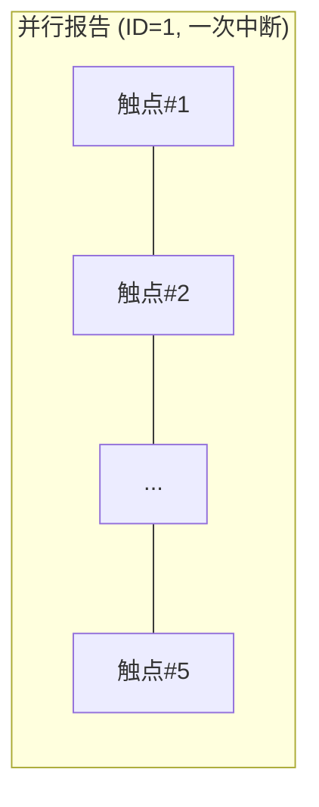
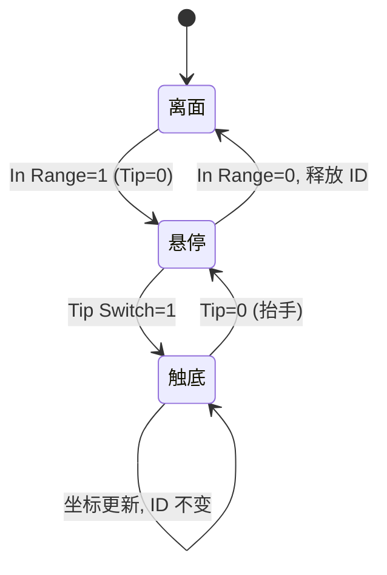

# 触摸屏、触摸板与数字化仪

> 🌿 知识树位置: 树干 → 枝干[设备类] → 分枝[HID] → 叶[Digitizer]
> ⬆️ 父节点: [00-HID概述与定位.md](00-HID概述与定位.md)

## 1. Digitizer 页(0x0D)总览

触摸屏(Touch Screen)、触摸板(Touch Pad)、数位笔(Stylus)统一使用 Digitizer Usage Page `0x0D`。核心特征：**绝对坐标** + **多触点** + **接触状态机**。

### 1.1 核心 Usage 表

| Usage ID | 名称 | 语义 |
|---|---|---|
| `0x04` | Touch Screen | 触摸屏 TLC（手指悬停不计入） |
| `0x05` | Touch Pad | 触摸板 TLC（用于 Precision Touchpad） |
| `0x20` | Stylus | 数位笔集合 |
| `0x22` | Finger | 单根手指集合（多点触控的"触点"单元） |
| `0x42` | Tip Switch | 笔尖/指尖是否接触表面（1=触底） |
| `0x32` | In Range | 触点/笔是否在感应范围内 |
| `0x44` | Barrel Switch | 笔侧键 |
| `0x45` | Eraser | 笔尾橡皮 |
| `0x30` | Tip Pressure | 笔压感（Digitizer 页自己的 0x30） |
| `0x48` | Width | 触点宽度 |
| `0x49` | Height | 触点高度 |
| `0x47` | Confidence | 该触点是否为有效触摸（防掌压） |
| `0x51` | Contact Identifier | 触点跟踪 ID（跨帧识别同一触点） |
| `0x54` | Contact Count | 本帧有效触点总数 |
| — | Touch Valid | 触点坐标有效标志；其编码在不同版本 Usage Tables 中有差异，请以最新《HID Usage Tables》为准 |

### 1.2 关于 X/Y 的页归属

触控描述符中的坐标通常取 **Generic Desktop 页的 X(0x30)/Y(0x31)**（描述符中显式 `05 01` 切页），而不是 Digitizer 页——Digitizer 页自己的 `0x30` 是 Tip Pressure。这是描述符里频繁切页的原因，也是新手最容易混淆的地方。

## 2. 绝对坐标报告

触控字段恒为 `Input(Data,Var,Abs)`；坐标域用 Logical Min/Max 声明（如 0~4095），物理尺寸用 Physical Min/Max + Unit 声明，主机据此换算屏幕位置——与相对模式鼠标（[06-鼠标详解.md](06-鼠标详解.md)）形成对照。

笔/手指集合的典型结构：

```text
05 0D        Usage Page (Digitizers)
09 04        Usage (Touch Screen)        ; TLC
A1 01        Collection (Application)
  85 01      Report ID (1)
  09 54      Usage (Contact Count)       ; 全帧触点数
  15 00      Logical Minimum (0)
  25 0A      Logical Maximum (10)
  75 08      Report Size (8)
  95 01      Report Count (1)
  81 02      Input (Data,Var,Abs)        ; [字节1]
  05 0D      Usage Page (Digitizers)     ; 切回 Digitizer 页
  09 22      Usage (Finger)              ; 触点集合
  A1 02      Collection (Logical)
    09 42    Usage (Tip Switch)
    09 32    Usage (In Range)
    15 00    Logical Minimum (0)
    25 01    Logical Maximum (1)
    75 01    Report Size (1)
    95 02    Report Count (2)
    81 02    Input (Data,Var,Abs)        ; 2 个状态位
    95 06    Report Count (6)
    81 03    Input (Const,Var,Abs)       ; 6 位填充 → [字节2]
    05 01    Usage Page (Generic Desktop)
    09 30    Usage (X)                   ; GDX 页的 X!
    09 31    Usage (Y)
    26 FF 0F Logical Maximum (4095)      ; 12 位坐标
    75 10    Report Size (16)            ; 16 位字段装 12 位值域
    95 02    Report Count (2)
    81 02    Input (Data,Var,Abs)        ; [字节3~6]
  C0        End Collection              ; Finger
C0           End Collection              ; Touch Screen TLC
```

报告：`[0]=ID1 [1]=ContactCount [2]=Tip|In|pad [3..4]=X [5..6]=Y`。

## 3. 多点触控两种上报模式

### 3.1 并行（Parallel）——一帧报全部触点

描述符中把 Finger 逻辑集合重复 N 次（N=最大触点数），一份报告携带所有触点；Windows 触摸屏要求至少 5 点并行。触点数不足时多余槽位 Tip=0。优点是时序一致；代价是报告大（5 点×7 字节）。



### 3.2 混合（Hybrid）——逐触点上报 + Contact Count

一次报告只含一个触点槽，连续发 N 份"扫描线"，每份首字段 Contact Count 表明本帧总触点数，主机攒齐 N 份后合成一帧。报告小、固件省缓冲，但帧内时序被拉长。描述符只写 1 个 Finger 集合 + Contact Count 即可。

| 维度 | 并行 | 混合 |
|---|---|---|
| 报告大小 | 大（N 触点/帧） | 小（1 触点/报） |
| 帧时序 | 各触点同帧 | 帧被拆成 N 份 |
| Windows 触摸屏认证 | 要求（≥5 点并行） | 不符合触摸屏要求 |
| 典型设备 | 电容触摸屏 | 早期触控/简单触摸板 |

### 3.3 触点跟踪：Contact Identifier

多触点的灵魂是 `Contact Identifier (0x51)`：每个触点在按下期间保持唯一 ID（递增复用），释放后 ID 作废。主机靠 ID 把"上帧的触点"和"本帧的触点"串成轨迹（单指拖动、双指捏合）。无 ID 的触控流只能按位置匹配，快速滑动时极易断轨。

## 4. Windows Precision Touchpad (PTP) 要点

PTP 是微软对触摸板的报告结构规范（配合 Generic Device Controls 页做模式切换），核心要求：

1. **绝对坐标 + 触点机制**：Touch Pad TLC，逐触点含 Tip Switch、Contact Identifier、（可选）Width/Height；
2. **单位制**：X/Y 以 **0.01mm** 级物理分辨率表达（Unit=cm 系 + Unit Exponent 负指数，配合 Physical Min/Max），主机按物理毫米计算手势速度；
3. **Tip Switch 状态机**：接触→触底(Tip=1)→离面(Tip=0, In Range=0) 的每个迁移都必须可见，主机据此合成点击/拖动；
4. **Confidence**：触点需给出置信位，掌压(大接触面)可被主机丢弃；
5. **模式切换**：通过 Feature/Input 机制在"鼠标模拟"与"PTP 原生"间切换（Generic Device Controls 页的 Input Mode 等 Usage；具体取值见微软 PTP 规范）；
6. 支持 P 的设备在 Windows 中不再走鼠标路径，手势全部由 OS 合成。



## 5. 数位板压感

数位笔集合 = `Stylus(0x20)` 内含 Tip Switch、Barrel Switch、Eraser、In Range、X/Y、**Tip Pressure（Digitizer 页 0x30）**。压感通常 10~16 位（如 0~8191），绝对值，Tip=1 时有效。压感分辨率与报告率（常见 133~266Hz 的 bInterval 折算）共同决定"压感曲线"的手感。进阶参数（倾斜、扭转等）的 Usage 编码请查阅《HID Usage Tables》。

## 6. 触屏 PTP 触摸板与鼠标模拟的关系

| 形态 | Windows 中的表现 | 实现要点 |
|---|---|---|
| 触摸屏 | 原生触摸输入（TLC=Touch Screen） | 并行 ≥5 点，绝对坐标 |
| PTP 触摸板 | 精确触摸板（TLC=Touch Pad，手势 OS 合成） | PTP 报告结构 + 模式切换 |
| 普通触摸板 | 报成"鼠标"，手势由厂商驱动合成 | 描述符就是鼠标（[06-鼠标详解.md](06-鼠标详解.md)） |
| 双模设备 | 同一接口切换模式 | Input Mode Feature 决定报告形态 |

设备固件可同时实现"鼠标报告 + PTP 报告 + Input Mode 切换"，老系统当鼠标用，新系统切 PTP——这正是很多笔记本触摸板的实际做法。

## 7. 混合模式字节级实例

用第 2 节的单触点描述符（ID1、ContactCount、单 Finger 槽）上报"三指同时触底"（混合模式）：

```text
第 1 份报告: 01 03 03 00 20 01 40 02   ; Count=3, 触点1: Tip|In=0x03, X=0x0120, Y=0x0240
第 2 份报告: 01 03 03 00 60 01 80 02   ; Count=3, 触点2: X=0x0160, Y=0x0280
第 3 份报告: 01 03 01 00 A0 01 C0 02   ; Count=3, 触点3: Tip=1,In=0
```

主机规则：连续收满 Count 份报告后合成一帧（每份的 Count 字段必须相同）。固件保证三份报告背靠背发出，不被其它报告插队。

## 8. 数位笔描述符片段

```text
05 0D        Usage Page (Digitizers)
09 20        Usage (Stylus)              ; TLC 内的笔集合(或单独 TLC)
A1 00        Collection (Physical)
  09 42      Usage (Tip Switch)
  09 44      Usage (Barrel Switch)
  09 45      Usage (Eraser)
  09 32      Usage (In Range)
  15 00      Logical Minimum (0)
  25 01      Logical Maximum (1)
  75 01      Report Size (1)
  95 04      Report Count (4)
  81 02      Input (Data,Var,Abs)        ; 4 个状态位
  95 04      Report Count (4)
  81 03      Input (Const,Var,Abs)       ; 4 位填充
  09 30      Usage (Tip Pressure)        ; Digitizer 页自己的 0x30
  15 00      Logical Minimum (0)
  26 FF 1F   Logical Maximum (8191)      ; 13 位压感
  75 10      Report Size (16)
  95 01      Report Count (1)
  81 02      Input (Data,Var,Abs)        ; 压感
  05 01      Usage Page (Generic Desktop)
  09 30      Usage (X)                   ; GDX 页的 X/Y
  09 31      Usage (Y)
  ...
C0           End Collection
```

无压感时的"点击"判定：Tip Switch 0→1 即按下；有压感时主机可按压力阈值合成点击（Wacom 式体验）。

## 相关节点

- 父节点：[00-HID概述与定位.md](00-HID概述与定位.md)
- 相对模式对照：[06-鼠标详解.md](06-鼠标详解.md)
- Usage 体系：[03-Usage体系与集合.md](03-Usage体系与集合.md)
- 报告编码规则：[02-报告描述符与Item编码.md](02-报告描述符与Item编码.md)
- 内置触控的传输层：[10-HID跨传输I2C与BLE.md](10-HID跨传输I2C与BLE.md)（笔记本触摸板多为 I2C-HID）
