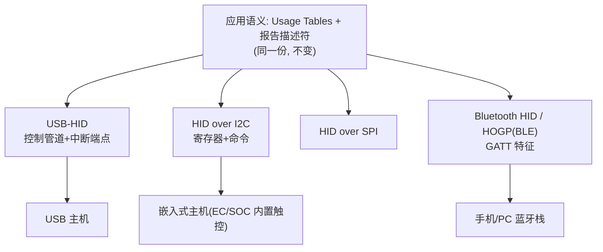
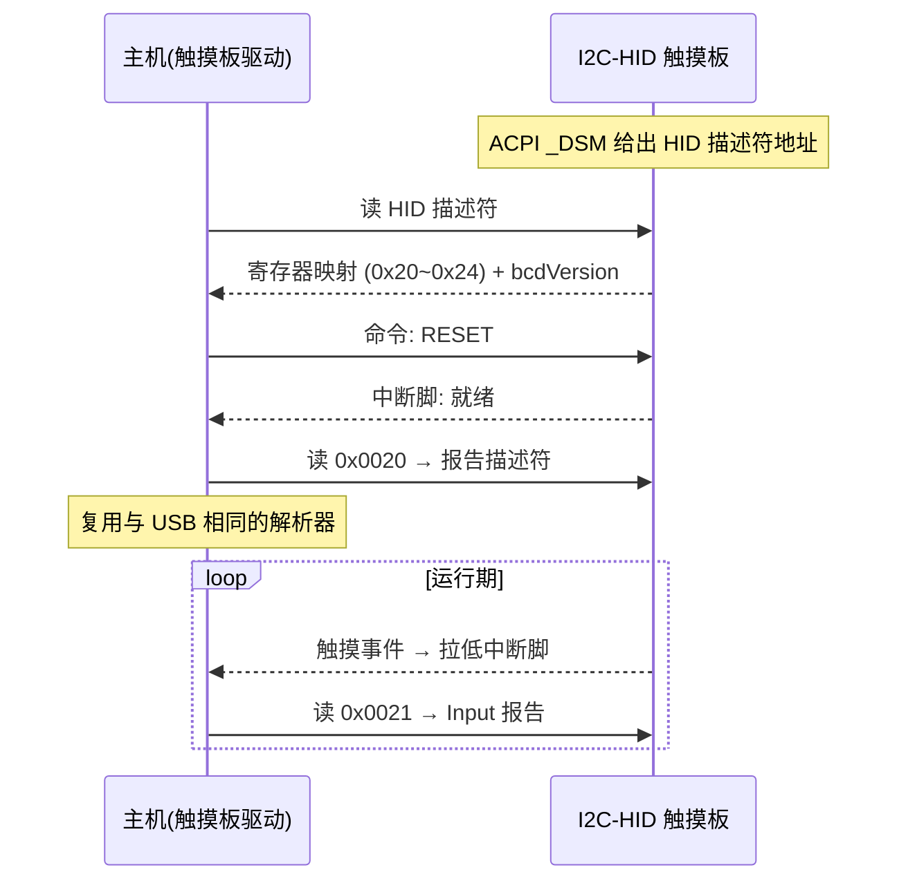
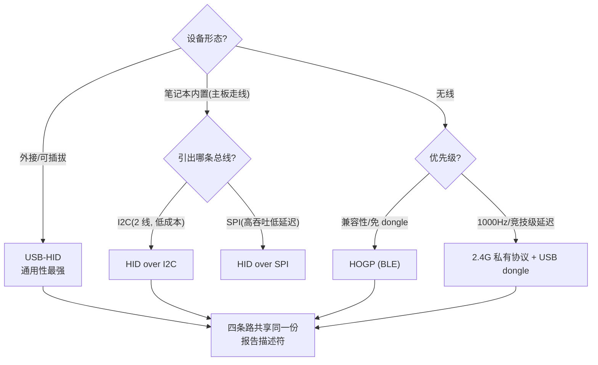

# HID 跨传输：I2C 与 BLE

> 🌿 知识树位置: 树干 → 枝干[设备类] → 分枝[HID] → 叶[跨传输]
> ⬆️ 父节点: [00-HID概述与定位.md](00-HID概述与定位.md)

## 1. 传输无关的分层模型

HID 的精髓在于：**报告描述符层与传输层解耦**。Usage/Item/报告格式定义与"字节怎么跑"完全无关，因此同一份报告描述符可以跑在四种传输上：

描述符解析器只需要三个服务：**读报告描述符、送 Input 报告、收 Output/Feature 报告**。三个传输栈各自用本地原语实现这三个服务，上层复用。

## 2. HID over I2C

笔记本内置触摸板/触摸屏/传感器中枢的事实标准（微软主导，规范《HID over I2C Protocol Specification》，随 ACPI 5.0 生态落地）。

### 2.1 设备发现与描述符定位

- 设备在 ACPI 表中声明（`_HID` 硬件 ID + `_CRS` 挂在 I2C 控制器下；描述符所在寄存器地址由 ACPI `_DSM` 函数返回）；
- 主机从该地址读出 **HID 描述符**（结构不同于 USB 的 HID 类描述符，但同样以 `wHIDDescLength/bcdVersion` 开头），其中给出各功能寄存器地址。

### 2.2 标准寄存器

规范为 I2C-HID 固定了以下 16 位寄存器地址（设备内偏移）：

| 寄存器 | 地址 | 作用 |
|---|---|---|
| 报告描述符寄存器 | `0x0020` | 从这里读出报告描述符（同一份 USB 风格描述符） |
| Input 报告寄存器 | `0x0021` | 主机读 Input 报告；设备也可用中断脚+主动读通知 |
| Output 报告寄存器 | `0x0022` | 主机写 Output 报告 |
| 命令寄存器 | `0x0023` | 主机写命令（16 位：操作码+参数） |
| 数据寄存器 | `0x0024` | 命令的参数/返回数据通道 |

### 2.3 命令集

命令集是 USB 类请求的镜像，外加电源控制：`RESET`、`GET_REPORT`、`SET_REPORT`、`GET_IDLE`、`SET_IDLE`、`GET_PROTOCOL`、`SET_PROTOCOL`、`SET_POWER`（`SET_POWER` 取值 ON/SLEEP）。工作流：上电 → RESET（设备就绪后中断）→ 读报告描述符 → 注册 Input 中断 → 正常运行。与 USB 的差异主要是**无枚举、无端点，一切皆寄存器读写**；电是常供的，靠 SET_POWER 管理功耗状态。

### 2.4 Input 报告的长度前缀

I2C-HID 的报告带"信封"：从 Input 寄存器(`0x0021`)读出的前 2 字节是 **16 位小端长度**（指其后的报告字节数），随后才是报告本体（描述符用 Report ID 时首字节为 ID）。设备以**中断脚(GPIO)拉低**通知"有新报告"，主机再发起 I2C 读——通知与数据分离，这是它与 USB 轮询模型的本质区别。

## 3. HID over SPI 简述

部分平台（尤其嵌入式触摸/传感器）以 SPI 承载 HID，协议形态与 I2C 版同源：描述符+寄存器+命令的寄存器式访问，利用 SPI 的高吞吐换更低的读取延迟。结构与细节以对应规范文本为准，本文不展开。

## 4. 蓝牙：HID Profile 与 HOGP

### 4.1 经典蓝牙 HID Profile

BR/EDR 上的 HID Profile 用 L2CAP 通道（控制通道+中断通道）承载，消息同样镜像 USB 类请求（GET_REPORT/SET_REPORT/SET_PROTOCOL...）与三类报告。无线键鼠在 BLE 普及前的主流方案。

### 4.2 HID over GATT (HOGP)

BLE 侧由 Bluetooth SIG 的《HID over GATT Specification (HOGP)》定义，把 HID 挂在 GATT 服务上：

| GATT 对象 | 作用 |
|---|---|
| HID Service (UUID 0x1812) | 承载整个 HID |
| **Report Map 特征** | **内容就是 USB 的那份报告描述符字节流** |
| Report 特征 (Input/Output/Feature) | 每个报告一个特征，由 Report Reference 描述符标注 (Report ID, 报告类型) |
| HID Information / HID Control Point | 协议状态、挂起/唤醒控制 |
| Protocol Mode 特征 | Boot/Report 协议切换 |

主机解析 Report Map 后用**同一套 HID 解析器**生成交付给系统的输入事件——USB 键盘和 BLE 键盘对 OS 输入子系统不可区分。完整 GATT 细节见 [07-HOGP-HIDoverGATT.md](../../50-枝干-无线关联/BLE-低功耗蓝牙/07-HOGP-HIDoverGATT.md)。

## 5. 2.4G 私有 dongle 与双模设备

无线键鼠的另一个常见形态是 **2.4G 私有协议 + USB dongle**：

- 鼠标↔dongle 之间是厂商私有射频协议（自定调度、重传、加密），**dongle 在 USB 侧伪装成标准 USB-HID 键鼠**（常做键盘+鼠标双接口复合设备）；
- PC 侧零驱动——翻译工作全部在 dongle 固件里（私有报告 ↔ USB-HID 报告）；
- 代价：dongle 占一个 USB 口、私有协议闭源；收益：不受蓝牙栈延迟抖动影响，容易做到 1000Hz。

**USB+蓝牙双模**设备（如主流办公键鼠的"接收器/蓝牙"两用）：设备内保存**同一份报告描述符**，USB 连接时以 USB-HID 枚举，蓝牙连接时以 HOGP 暴露 Report Map——两端报告格式逐字节一致，主机侧状态（修饰键锁定等）在传输切换时由设备复位。开关切换传输时，本质是"换管道，不换协议"。

## 6. 三种传输对比

| 维度 | USB-HID | I2C-HID | HOGP (BLE) |
|---|---|---|---|
| 设备发现 | 总线枚举 | ACPI 声明 + `_DSM` 定址 | GATT 服务发现 |
| 报告描述符获取 | GET_DESCRIPTOR(0x22) | 读寄存器 0x0020 | 读 Report Map 特征 |
| Input 报告通道 | 中断 IN 轮询 | 读寄存器 0x0021（中断脚通知） | Report 特征 Notify |
| Output/Feature | SET_REPORT / 中断 OUT | 写寄存器 0x0022 / 命令 | Write 特征 |
| 协议/Idle 控制 | 类请求 | 命令寄存器 | Protocol Mode 等特征 |
| 电源模型 | 总线供电+挂起/远程唤醒 | 常供电+SET_POWER | 连接间隔+外设功耗策略 |
| 延迟 | bInterval 下限（125µs~） | I2C 速率+主机调度 | 连接间隔(7.5ms~)+从机延迟 |
| 典型设备 | 外接键鼠/手柄 | 笔记本内置触控、传感器 hub | 无线键鼠/手柄直连 |

## 7. 传输选型决策

补充说明：

- I2C-HID 设备的 ACPI 硬件 ID 常见如 `MSFT0001`、`ACPI0C50` 等（以具体平台 ACPI 表与规范版本为准）；
- SPI-HID 的寄存器/命令模型与 I2C 版同源，选型主要看 SoC 引出哪条总线和时延预算；
- dongle 方案的"同一份报告描述符"体现在 dongle USB 侧：私有射频协议在 dongle 内翻译成标准 HID 报告。

## 8. 跨移植的工程检查单

1. 报告描述符 **逐字节复用** 前先确认传输层限制：I2C-HID 报告长度寄存器宽度、HOGP MTU（ATT_MTU 影响 Notify 载荷）；
2. Boot 协议支持与否与传输无关，但 BLE 上常省略（手机栈不需要）；
3. Report ID 规划要兼容最窄的传输（某些 I2C 主机控制器按 4 字节对齐缓冲）；
4. 远程唤醒语义映射：USB→Resume 信号；I2C→GPIO 中断；BLE→外设触发连接事件，三者的延迟/功耗预算完全不同，不要假设一致。

## 相关节点

- 父节点：[00-HID概述与定位.md](00-HID概述与定位.md)
- USB 侧机制：[01-HID描述符.md](01-HID描述符.md) | [04-传输与类特定请求.md](04-传输与类特定请求.md)
- BLE 侧细节：[07-HOGP-HIDoverGATT.md](../../50-枝干-无线关联/BLE-低功耗蓝牙/07-HOGP-HIDoverGATT.md)
- 应用分支：[09-触摸屏触摸板与数字化仪.md](09-触摸屏触摸板与数字化仪.md)（I2C-HID 的最大用户）
- 树干支撑：[02-体系架构与分层模型.md](../../10-树干-USB核心/02-体系架构与分层模型.md)
