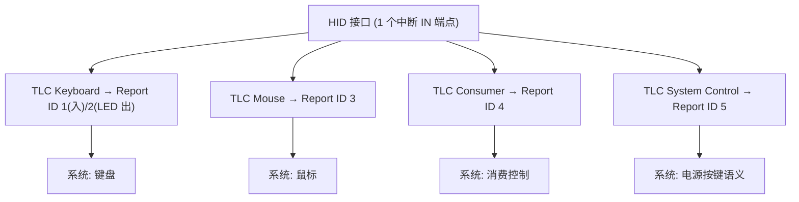

# 实战：完整报告描述符

> 🌿 知识树位置: 树干 → 枝干[设备类] → 分枝[HID] → 叶[实战]
> ⬆️ 父节点: [00-HID概述与定位.md](00-HID概述与定位.md)

## 1. 设计目标与拓扑决策

目标设备：**键盘 + 鼠标 + 消费控制 + 系统控制**四合一。两种架构：

| 方案 | 结构 | 优点 | 缺点 |
|---|---|---|---|
| A. 多接口复合 | 每功能一个 HID 接口（各自的 接口+HID+端点 描述符） | 隔离彻底，各接口独立 Boot 能力 | 端点/描述符开销大，固件状态机×N |
| B. 单接口多 TLC + Report ID | 一个接口，4 个顶层集合，Report ID 区分 | 1 个端点、1 份描述符；Windows 按 TLC 拆成多个设备 | Report ID 编号需规划；Boot 受限 |

下面采用**方案 B**（无线接收器/键鼠一体机的标准做法）。多 TLC 让 Windows 把它识别为"键盘+鼠标+消费控制设备"三件套；唯一接口只需 1 个中断 IN 端点（Output 报告走 `SET_REPORT`，见 [04-传输与类特定请求.md](04-传输与类特定请求.md)）。



**Report ID 规划**：`0` 永远不可用（保留语义=无 ID，见 [02-报告描述符与Item编码.md](02-报告描述符与Item编码.md)）；同一接口内 Input/Output/Feature 共用编号空间。本例：1=键盘入，2=LED 出，3=鼠标，4=消费，5=系统。留出间隔（如 10+ 给厂商 Feature）便于日后追加。

## 2. 完整报告描述符（逐行中文注释）

```text
; ════════ TLC1: 键盘 ════════
05 01        Usage Page (Generic Desktop)
09 06        Usage (Keyboard)
A1 01        Collection (Application)
  85 01      Report ID (1)                 ; 键盘 Input 报告
  05 07      Usage Page (Keyboard/Keypad)
  19 E0      Usage Minimum (0xE0)
  29 E7      Usage Maximum (0xE7)
  15 00      Logical Minimum (0)
  25 01      Logical Maximum (1)
  75 01      Report Size (1)
  95 08      Report Count (8)
  81 02      Input (Data,Var,Abs)          ; 修饰键位图
  95 01      Report Count (1)
  75 08      Report Size (8)
  81 03      Input (Const,Var,Abs)         ; 保留字节
  95 06      Report Count (6)
  75 08      Report Size (8)
  15 00      Logical Minimum (0)
  25 65      Logical Maximum (101)
  19 00      Usage Minimum (0)
  29 65      Usage Maximum (101)
  81 00      Input (Data,Array,Abs)        ; 6KRO 键码数组 → 报告 9 字节
  85 02      Report ID (2)                 ; LED Output 报告
  05 08      Usage Page (LEDs)
  19 01      Usage Minimum (Num Lock)
  29 05      Usage Maximum (Kana)
  15 00      Logical Minimum (0)
  25 01      Logical Maximum (1)
  75 01      Report Size (1)
  95 05      Report Count (5)
  91 02      Output (Data,Var,Abs)         ; 5 个 LED
  95 03      Report Count (3)
  91 03      Output (Const,Var,Abs)        ; 3 位填充 → 报告 2 字节
C0           End Collection

; ════════ TLC2: 鼠标 ════════
05 01        Usage Page (Generic Desktop)
09 02        Usage (Mouse)
A1 01        Collection (Application)
  85 03      Report ID (3)
  09 01      Usage (Pointer)
  A1 00      Collection (Physical)
  05 09      Usage Page (Button)
  19 01      Usage Minimum (Button 1)
  29 05      Usage Maximum (Button 5)      ; 左中右+侧键×2
  15 00      Logical Minimum (0)
  25 01      Logical Maximum (1)
  75 01      Report Size (1)
  95 05      Report Count (5)
  81 02      Input (Data,Var,Abs)          ; 5 个按钮位
  95 03      Report Count (3)
  81 03      Input (Const,Var,Abs)         ; 3 位填充 → [字节1]
  05 01      Usage Page (Generic Desktop)
  09 30      Usage (X)
  09 31      Usage (Y)
  15 81      Logical Minimum (-127)        ; 有符号!
  25 7F      Logical Maximum (127)
  75 08      Report Size (8)
  95 02      Report Count (2)
  81 06      Input (Data,Var,Rel)          ; X/Y → [字节2,3]
  09 38      Usage (Wheel)
  15 81      Logical Minimum (-127)
  25 7F      Logical Maximum (127)
  75 08      Report Size (8)
  95 01      Report Count (1)
  81 06      Input (Data,Var,Rel)          ; 滚轮 → [字节4] → 报告 5 字节
C0           End Collection
C0           End Collection

; ════════ TLC3: 消费控制 ════════
05 0C        Usage Page (Consumer)
09 01        Usage (Consumer Control)
A1 01        Collection (Application)
  85 04      Report ID (4)
  09 B5      Usage (Scan Next Track)
  09 B6      Usage (Scan Previous Track)
  09 B7      Usage (Stop)
  09 CD      Usage (Play/Pause)
  09 E2      Usage (Mute)
  09 E9      Usage (Volume Increment)
  09 EA      Usage (Volume Decrement)
  15 00      Logical Minimum (0)
  25 01      Logical Maximum (1)
  75 01      Report Size (1)
  95 07      Report Count (7)
  81 02      Input (Data,Var,Abs)          ; 7 位媒体键位图
  95 01      Report Count (1)
  81 03      Input (Const,Var,Abs)         ; 填充 → 报告 2 字节
C0           End Collection

; ════════ TLC4: 系统控制 ════════
05 01        Usage Page (Generic Desktop)
09 80        Usage (System Control)
A1 01        Collection (Application)
  85 05      Report ID (5)
  09 81      Usage (System Power Down)
  09 82      Usage (System Sleep)
  09 83      Usage (System Wake Up)
  15 00      Logical Minimum (0)
  25 01      Logical Maximum (1)
  75 01      Report Size (1)
  95 03      Report Count (3)
  81 02      Input (Data,Var,Abs)          ; 3 个电源语义键
  95 05      Report Count (5)
  81 03      Input (Const,Var,Abs)         ; 填充 → 报告 2 字节
C0           End Collection
```

报告长度速查：ID1=9B（1+8）、ID2=2B（Output）、ID3=5B、ID4=2B、ID5=2B。端点 `wMaxPacketSize` 按 16 字节即绰绰有余。

## 3. 多 TLC vs 单 TLC 决策回顾

- 要 **Boot 兼容** → 键盘/鼠标必须各占独立接口（Boot 只认"单 TLC=键盘/鼠标"的简单描述符），即方案 A；
- 要 **省端点/低带宽**（无线设备省电）→ 方案 B；
- **混合方案**（无线接收器常见）：接口 1 = Boot 键盘（单 TLC 无 ID），接口 2 = 鼠标+Consumer+System（多 TLC 有 ID）；
- TLC 的 Usage 决定 OS 归类：`Keyboard`→键盘、`Mouse`→鼠标、`Consumer Control`→媒体、`System Control`→电源键（见 [03-Usage体系与集合.md](03-Usage体系与集合.md)）。

## 4. 常见错误清单

| # | 错误 | 症状 | 正确做法 |
|---|---|---|---|
| 1 | 负数逻辑值未符号扩展：把 −127 写成 `15 FF 00` 或把 −1 写成 `15 FF` | 位移/摇杆漂到 +127 | −127=`15 81`；−1（2 字节）=`26 FF FF` |
| 2 | Report Count 与 Report Size 混淆 | 字段错位、报告长度翻倍 | 字节数=Count×Size；Count=字段个数，Size=每字段位数 |
| 3 | 忘写 `End Collection (C0)` | 解析器报"描述符不完整"，设备无法工作 | 每个 Collection 配对一个 C0 |
| 4 | Boot 描述符与 Boot 报告格式不一致 | BIOS 里键盘失灵、OS 内正常 | Boot 描述符严格按附录字段序：修饰键→保留→6 键数组 |
| 5 | 位图字段未做 Constant 填充到字节边界 | 之后所有字段整体错位 | 3 按钮+5 填充；帽开关 4 位后补 4 位 |
| 6 | 使用 Report ID 0 | 主机解析拒绝/行为未定义 | ID 从 1 开始；0 仅在 wValue 中表示"全体报告" |
| 7 | 部分报告带 ID、部分不带 | 主机分发失败 | 用 ID 则接口内所有报告（含 Output/Feature）都带 |
| 8 | Global 状态跨 TLC 串味（忘重设 Usage Page/Logical） | 第二个 TLC 字段落错页/错值域 | 每个 TLC 开头显式重设全套 Global；或用 Push/Pop |
| 9 | Array 的 Usage Min/Max 与 Logical 值域不覆盖 | 某些按键主机不认识 | Array 值域必须落在 Usage 区间内（如 0~0x65） |
| 10 | 报告长度超端点 wMaxPacketSize | 报告被截断或端点 STALL | 描述符定稿后核算最大报告字节数 |

## 5. 调试工具箱

| 工具 | 平台 | 用途 |
|---|---|---|
| usbhid-dump | Linux (libusb) | 枚举 HID 接口并十六进制倾倒报告描述符/报告流 |
| hidapi | 跨平台 C 库 | 应用层读写 HID 报告（新版可取报告描述符），写上位机联调脚本 |
| USB-IF HID Descriptor Tool (dt.exe) | Windows | USB-IF 官方 Item 级解析/校验器，逐 Item 对照规范 |
| Wireshark + USBPcap | Windows | 抓总线包：过滤 `usb.descriptor_type == 0x22` 直接看 GET_DESCRIPTOR(报告描述符) 的原始字节与设备应答 |
| lsusb -v / sysfs | Linux | 查看 HID 类描述符（报告描述符需 usbhid-dump） |
| OS 内置（Windows hidparse/设备管理器、Linux /sys/class/hidraw） | — | 验证解析结果：设备数、报告数、TLC 拆分是否符合预期 |

排查顺序建议：先抓 `GET_DESCRIPTOR(0x22)` 确认设备发出的字节与固件源码一致 → 用官方工具解析 Item → 对照 OS 解析出的设备数/报告布局 → 最后看报告流。

## 6. 报告与描述符字段的对应（C 结构体示例）

以本例 ID3 鼠标报告为例，展示"描述符 Item ↔ 内存布局"的逐字段咬合：

```c
/* 鼠标 Input 报告 (Report ID 3, 共 5 字节) */
typedef struct {
    uint8_t  report_id;      /* 85 03: Report ID(3) —— 线上首字节恒为 ID */
    union {
        uint8_t buttons;     /* 19 01/29 05, 95 05, 81 02: 5 个按钮位 */
        struct {
            uint8_t b1 : 1;  /* 左键  (Usage Button 1) */
            uint8_t b2 : 1;  /* 中键  (Usage Button 2) */
            uint8_t b3 : 1;  /* 右键  (Usage Button 3) */
            uint8_t b4 : 1;  /* 侧键  (Usage Button 4) */
            uint8_t b5 : 1;  /* 侧键  (Usage Button 5) */
            uint8_t pad: 3;  /* 95 03, 81 03: 3 位 Constant 填充 */
        };
    };
    int8_t  x;               /* 09 30, 15 81/25 7F, 81 06: 相对位移 −127..127 */
    int8_t  y;               /* 09 31: 同上 */
    int8_t  wheel;           /* 09 38, 81 06: 滚轮 −127..127 */
} mouse_report3_t;

/* 编译器需按 1 字节对齐打包, 且位域从 LSB 分配 —— 与 HID 的
   "LSB 起填、小端"规则一致; 位域顺序依赖实现, 生产代码建议用位运算 */
```

键盘与消费报告同理：`ID1 = {1, mod, rsvd, key[6]}`、`ID4 = {4, media_bits}`。注意结构体只是"人读"的镜像，**真正的契约是描述符**——改报告必须同步改描述符，主机以描述符为准。

## 相关节点

- 父节点：[00-HID概述与定位.md](00-HID概述与定位.md)
- 编码基础：[02-报告描述符与Item编码.md](02-报告描述符与Item编码.md) | [03-Usage体系与集合.md](03-Usage体系与集合.md)
- 描述符与请求：[01-HID描述符.md](01-HID描述符.md) | [04-传输与类特定请求.md](04-传输与类特定请求.md)
- 单设备细节：[05-键盘详解.md](05-键盘详解.md) | [06-鼠标详解.md](06-鼠标详解.md) | [07-消费控制与多媒体.md](07-消费控制与多媒体.md)
- 调试工具延伸：树干 [11-错误处理与可靠性.md](../../10-树干-USB核心/11-错误处理与可靠性.md)
