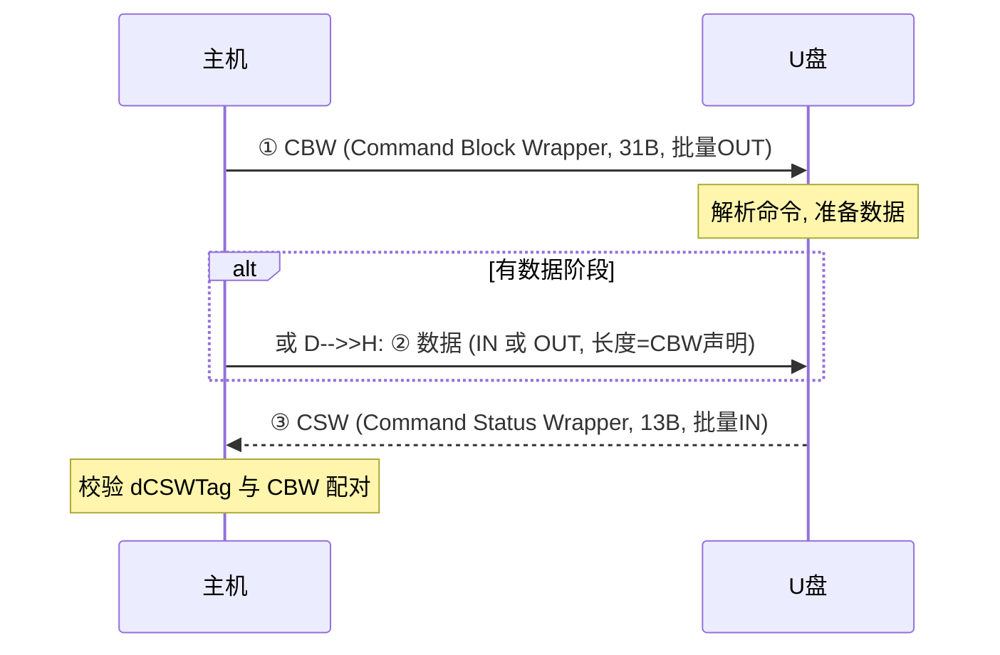

# MSC 概述与 BOT 传输

> 🌿 知识树位置: 树干 → 枝干[设备类] → 分枝[MSC] → 叶
> ⬆️ 上一级: [00-设备类索引](../00-设备类索引.md) · 树干基础: [四种传输类型](../../10-树干-USB核心/06-四种传输类型.md)

## 1. MSC 在树上的位置

大容量存储类（Mass Storage Class）= **USB 传输层 + 块设备命令集**两层拼装：

```
应用(文件系统) → 驱动 → SCSI/SBC 命令 (CDB)   ← 命令层: 借用 SCSI
                        ↓ 封装
                 BOT 或 UAS 传输协议           ← 传输层: 本篇主角
                        ↓
                 USB 批量端点 (FS 64B / HS 512B)
```

接口签名（U 盘标准形态）：`bInterfaceClass=0x08, bInterfaceSubClass=0x06 (SCSI 透明命令集), bInterfaceProtocol=0x50 (BOT)`，单接口 + 批量 IN/OUT 两个端点。

| 子类 | 命令集 | 说明 |
|---|---|---|
| 0x01 | RBC 精简块命令 | 少见 |
| 0x02 | ATAPI/MMC-2 (CBI) | 老光驱 |
| 0x04 | UFI | 软盘系，常见于老读卡器 |
| 0x05 | SFF-8070i | 老读卡器 |
| **0x06** | **SCSI 透明（SBC）** | **事实标准** |

## 2. BOT：三段式事务

Bulk-Only Transport (BOT) 把"一条命令"变成批量端点上的三段：



### CBW 31 字节逐字段

| 偏移 | 字段 | 说明 |
|---|---|---|
| 0 | dCBWSignature | 0x43425355（小端读作 "USBC"） |
| 4 | dCBWTag | 命令序号，CSW 原样带回——配对凭据 |
| 8 | dCBWDataTransferLength | 数据阶段期望长度（0 = 无数据阶段） |
| 12 | bmCBWFlags | bit7=方向（1=数据 IN，即设备→主机）；bit6~0 保留=0 |
| 13 | bCBWLUN | bit3~0：目标逻辑单元号（多分区读卡器 >0） |
| 14 | bCBWCBLength | bit4~0：命令块有效长度（1~16） |
| 15 | CBWCB[16] | 命令块本身（SCSI CDB，大端字段） |

### CSW 13 字节逐字段

| 偏移 | 字段 | 说明 |
|---|---|---|
| 0 | dCSWSignature | 0x53425355（"USBS"） |
| 4 | dCSWTag | 必须等于对应 CBW 的 Tag |
| 8 | dCSWDataResidue | 数据阶段实际未完成的字节数 |
| 12 | bCSWStatus | 0x00=命令成功；0x01=命令失败(查 REQUEST SENSE)；0x02=阶段错误(严重，需复位恢复) |

## 3. 流控与 STALL

- **设备缓冲不足** → 端点 NAK（[批量传输](../../10-树干-USB核心/06-四种传输类型.md)的天然反压），主机继续轮询——BOT 吞吐的重要参数是设备端"深度缓冲+提前预取"；
- **命令失败** → 设备在数据/状态阶段 STALL → 主机随后发 REQUEST SENSE 取错误详情 → 清 halt → 继续；
- **阶段错误 (0x02)**：主机声明的数据方向/长度与命令语义不符（驱动 bug 或线缆位损坏）→ 必须走**复位恢复**。

### 复位恢复（背下来）

1. 主机发类请求 **Bulk-Only Mass Storage Reset**（bmRequestType=0x21, bRequest=0xFF, wIndex=接口, 无数据阶段）——设备复位自己的 BOT 状态机；
2. 主机对批量 IN、批量 OUT **分别 CLEAR_FEATURE(ENDPOINT_HALT)** 清除挂起；
3. 从头重发命令。

这是 MSC 唯一的两个类请求（另一个是 GET_MAX_LUN：bmRequestType=0xA1, bRequest=0xFE，返回 1 字节 = 最大 LUN 号，单 LUN 设备返回 0）。

## 4. UAS：BOT 的继任者

USB Attached SCSI Protocol (UASP) 用**流 (Stream)** 重写传输层，与 BOT 对比：

| | BOT | UAS |
|---|---|---|
| 并发命令 | 一次一条（串行） | 多命令并发（Stream ID 区分，类 SCSI 队列深度） |
| 状态通道 | 复用批量 IN (CSW) | 独立中断 IN 端点 |
| 端点 | 批量 IN + OUT | 批量 IN + OUT + 中断 IN |
| HS 实测 | 30~38 MB/s 封顶 | 40 MB/s+（SS 更显著） |
| 接口签名 | 0x08/0x06/0x50 | 0x08/0x06/0x62 |

BOT 的性能天花板来自"一条命令未完成不能发下一条"——UAS 解除了这个限制（NCQ 式排队）。注意 UAS 依赖 HS 批量端点的 **Streams 能力**（xHCI 原生支持，EHCI 时代无 UAS）。

## 5. 多 LUN 与典型设备

- 读卡器多卡槽 = 多 LUN：GET_MAX_LUN 返回 N-1，CBW 的 bCBWLUN 选择目标；
- Android 手机"USB 大容量存储"时代已终结（挂载期间整机存储被独占），现用 [MTP](../其他设备类/03-PTP与MTP.md)；
- U 盘/移动硬盘/读卡器/车载媒体主机是 BOT 的存量主力。

## 相关节点

- 下一叶: [01-SCSI命令与UFI.md](01-SCSI命令与UFI.md)
- 树干: [错误处理与可靠性](../../10-树干-USB核心/11-错误处理与可靠性.md)（STALL/HALT 机制的总纲）
- 枝干: [高速演进](../../40-枝干-高速演进/01-USB3x与SuperSpeed.md)（UAS 为什么属于 3.x 时代）
