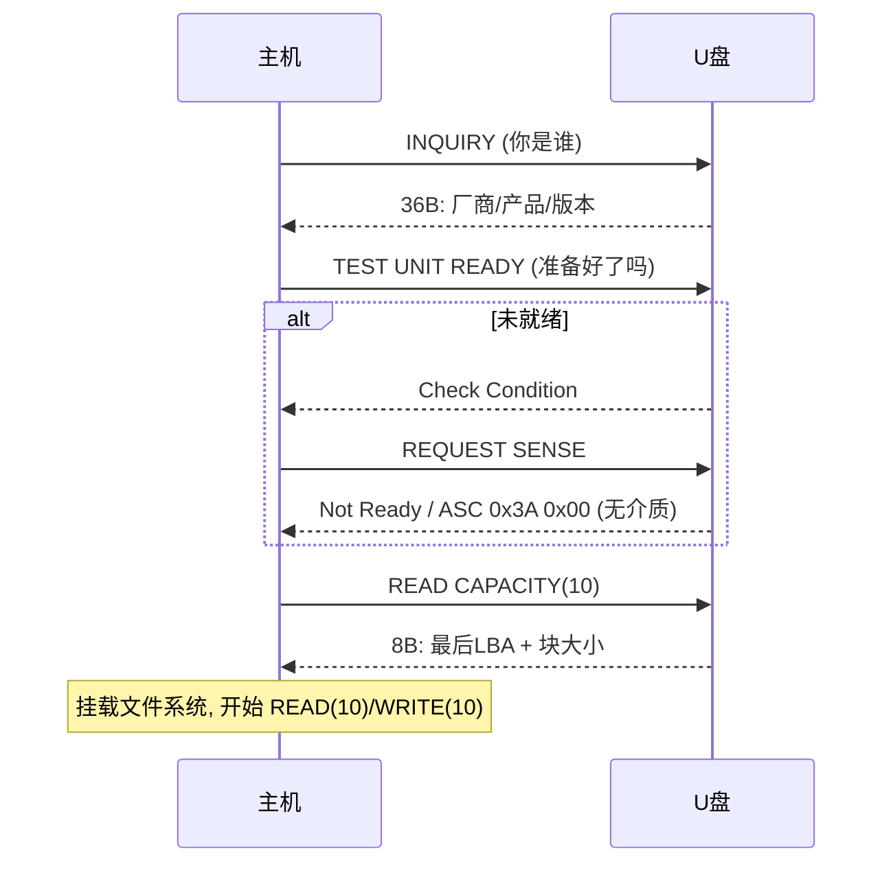

# SCSI 命令与 UFI

> 🌿 知识树位置: 树干 → 枝干[设备类] → 分枝[MSC] → 叶
> ⬆️ 父节点: [00-MSC概述与BOT](00-MSC概述与BOT.md)

BOT 只解决"命令怎么运"，命令本身是什么由这层回答：U 盘用的是 **SCSI 块命令（SBC）**的精简子集。CBWCB 里是一个 CDB（Command Descriptor Block），其中**多字节字段一律大端**——与 USB 描述符的小端相反，初学者第一坑。

## 1. 主机枚举后的标准盘问流程



## 2. 核心命令逐条

### 2.1 INQUIRY (0x12) — 标准数据 36 字节

| 偏移 | 内容 | 说明 |
|---|---|---|
| 0 | 外设限定符(高3位)\|类型(低5位) | 0x00=直连块设备 |
| 1~3 | RMB(可移除位7)/版本/数据格式 | RMB=1 是 U 盘/读卡器标志 |
| 8~15 | 厂商 (ASCII) | 如 "SanDisk " |
| 16~31 | 产品名 (ASCII) | — |
| 32~35 | 版本 (ASCII) | — |

主机驱动凭它决定挂载策略（可移除介质、写保护轮询等）。

### 2.2 REQUEST SENSE (0x03) — 错误详情

18 字节返回，关键字段：偏移 2 = Sense Key；偏移 12/13 = ASC/ASCQ。必背组合：

| Sense Key | ASC/ASCQ | 含义 |
|---|---|---|
| 0x02 Not Ready | 0x3A 0x00 | 介质不存在（没插卡） |
| 0x02 Not Ready | 0x04 0x00 | 逻辑单元未就绪（初始化中） |
| 0x05 Illegal Request | 0x20 0x00 | 不支持的命令 |
| 0x05 Illegal Request | 0x21 0x00 | LBA 越界 |
| 0x05 Illegal Request | 0x24 0x00 | CDB 字段非法 |
| 0x06 Unit Attention | 0x28 0x00 | 介质刚插入（复位"注意"状态） |
| 0x07 Data Protect | 0x27 0x00 | 写保护 |

**Unit Attention 机制**：设备状态变化（插卡、复位）后第一条命令返回 0x06，主机收 Sense 后重试原命令——"第一次必错一次"不是 bug 而是协议。

### 2.3 READ CAPACITY(10) (0x25) — 容量

返回 8 字节（大端）：偏移 0~3 = **最后一个可寻址 LBA**，偏移 4~7 = 块长度（512/4096）。容量 = (LBA+1)×块长。超过 2 TB（LBA 32 位溢出）必须换 READ CAPACITY(16)。

### 2.4 READ(10) 0x28 / WRITE(10) 0x2A

CDB 10 字节布局：

| 偏移 | 字段 |
|---|---|
| 0 | 操作码 (0x28/0x2A) |
| 1 | RDPROTECT 等标志（通常 0） |
| 2~5 | LBA（大端 32 位） |
| 6 | 组号（0） |
| 7~8 | 传输块数（大端 16 位，0=256 块 for READ(10)? 实际 READ(10) 中 0 表示 0 块/无效，65535 上限） |
| 9 | 控制字节 |

数据阶段：读 = CBW 声明 IN + 块数×块长；写 = OUT。固件把 LBA 翻译成闪存页/NAND 操作，主机视角只有线性扇区数组。

### 2.5 其它常用

| 命令 | 操作码 | 用途 |
|---|---|---|
| TEST UNIT READY | 0x00 | 零数据命令探活，轮询插卡 |
| PREVENT/ALLOW MEDIUM REMOVAL | 0x1E | 弹出保护（系统"安全弹出"前锁定） |
| READ FORMAT CAPACITIES | 0x23 | 可格式化容量（软盘/光驱时代） |
| FORMAT UNIT | 0x04 | 格式化（U 盘厂商工具用） |
| SYNCHRONIZE CACHE(10) | 0x35 | 强制刷缓存——**弹出流程的最后一条命令**，固件必须在此把易失缓冲落盘 |

## 3. UFI：软盘血统的子集

UFI（USB Floppy Interface）规范是 SBC 的祖先裁剪版，主要差异：READ(10)/WRITE(10) 存在但部分字段固定、头部多了几条软盘专用命令（如 READ DEFECT DATA）。读卡器类 MSC 设备（子类 0x04）用 UFI；现代 U 盘（子类 0x06）走 SBC。对固件作者：**实现 SBC 精简子集即可兼容 99% 主机**——INQUIRY/TEST UNIT READY/REQUEST SENSE/READ CAPACITY/READ(10)/WRITE(10)/格式容量 + SYNCHRONIZE CACHE。

## 4. BOT × SCSI：一次完整读扇区的包流

```
CBW(31B): READ(10), LBA=1000, 1 块, DataLen=512, 方向 IN
  ↓ 批量 OUT
设备解析 → 命中缓存/读闪存 → 端点 IN 送出 512B (可能 NAK 数轮)
  ↓ 批量 IN
CSW(13B): Tag 配对, Residue=0, Status=0x00
```

抓包时按 CBW→Data→CSW 三段循环读 trace，每个 CSW 的 Status=0x01 后必跟 REQUEST SENSE（[BOT 主篇](00-MSC概述与BOT.md)、[抓包方法论](../../70-枝干-调试测试与安全/01-协议分析仪与抓包.md)）。

## 5. 固件实现的常见坑

- [ ] 大端/小端混用：CDB 与 SCSI 数据大端，描述符与 CBW 头小端；
- [ ] REQUEST SENSE 必须自清：Sense 数据取走后 Check Condition 状态清除，否则死循环；
- [ ] RESXID/Residue 计算错误 → 主机判阶段错误 → 复位恢复风暴；
- [ ] 写数据落盘时机：缓存 SYNCHRONIZE CACHE 与"安全弹出"的契约，直接拔盘丢数据的根因多在固件提前回 ACK；
- [ ] 掉电保护：写中掉电导致 FAT 表撕裂——文件系统一致性是设备端责任。

## 相关节点

- 上一叶: [00-MSC概述与BOT.md](00-MSC概述与BOT.md)
- 树干: [包格式与事务](../../10-树干-USB核心/05-包格式与事务.md)
- 对比: [PTP 与 MTP](../其他设备类/03-PTP与MTP.md)（文件级访问为何取代块级）
