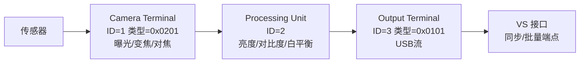
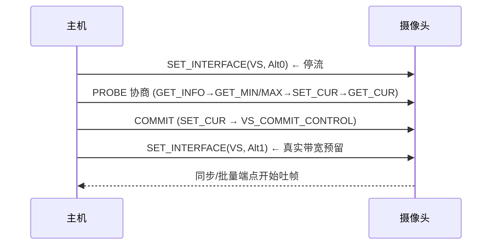

# UVC 详解：USB 视频类

> 🌿 知识树位置: 树干 → 枝干[设备类] → 分枝[UVC] → 叶
> ⬆️ 上一级: [00-设备类索引](../00-设备类索引.md) · 树干基础: [四种传输类型](../../10-树干-USB核心/06-四种传输类型.md)

## 1. UVC 的江湖地位

USB Video Class（UVC）让"摄像头"变成免驱外设：只要符合 UVC，Windows/Linux/macOS/Android 全平台即插即用。网页摄像头、采集卡（HDMI→USB）、会议一体机、工业相机（部分）、行车记录仪（部分）都是 UVC。规范代际：1.0a → 1.1（+H.264 硬件编码通告）→ **1.5**（现行，2012，+H.264 载荷、帧间隔更灵活）。

接口签名：bInterfaceClass=0x0E；子类 0x01=视频控制 (VC)，0x02=视频流 (VS)。与 [UAC](../Audio-UAC/00-UAC概述.md) 同构：**控制面（VC 接口，实体图）+ 数据面（VS 接口，同步/批量端点）**。

## 2. 实体图：摄像头的一切可调项

VC 接口内用实体描述符画图（与 UAC 同哲学）：

| 实体 | 常用控制 | 例子 |
|---|---|---|
| Camera Terminal (0x0201) | 自动曝光模式(0x02)、绝对曝光时间(0x04)、光圈(0x0A)、变焦(0x0B)、平移/俯仰(0x0D/0x0E) | 会议摄像头云台控制 |
| Processing Unit | 亮度(0x02)、对比度(0x03)、增益(0x04)、电源频率抗闪烁(0x05)、色相(0x06)、饱和度(0x07)、白平衡 | "50Hz 条纹"就是抗闪烁没调对 |
| Selector Unit | 多源选一 | 前后摄像头切换 |
| Extension Unit (0xFF) | 厂商私有 | 出厂校准、ISP 调参后门 |

控制选择子的完整编码表在 UVC 规范附录 A——此处只固化最常用的（上表数值可靠），其余按规范原文查阅。

## 3. 控制请求体系

UVC 的类请求码有特色：**读类请求直接用 bit7=1 编码**：

| bRequest | 名称 | 用途 |
|---|---|---|
| 0x01 | SET_CUR | 写设置 |
| 0x81 | GET_CUR | 读当前 |
| 0x82 / 0x83 / 0x84 | GET_MIN / GET_MAX / GET_RES | 范围协商 |
| 0x85 / 0x87 | GET_LEN / GET_DEF | 长度 / 默认值 |
| 0x86 | GET_INFO | 能力位（可读？可写？自动档？） |

寻址：wValue=控制选择子，wIndex=(实体 ID<<8)|接口。主机摄像头应用里拖动"亮度"滑条，落到总线上就是一条 `SET_CUR → Processing Unit(0x02 选择子)`。

## 4. 视频流：VS 接口与带宽换挡

### 4.1 Alternate Setting = 流水线的挡位

VS 接口永远有 **Alt0 = 零端点（零带宽）**；每个工作挡位（分辨率/帧率/格式组合）一个 Alt1..N：

**Probe/Commit 两阶段**是 UVC 的招牌：主机先在 PROBE 控制里反复试参数（bFormatIndex/bFrameIndex/dwFrameInterval），双方敲定后 COMMIT 生效。Probe 结构 ≥26 字节（版本相关），关键字段：格式索引、帧索引、帧间隔、dwMaxVideoFrameSize、dwMaxPayloadTransferSize（每包最大载荷——主机按它收包）。

### 4.2 格式与帧描述符

VS 接口类特定描述符里列全部能力：

- **格式描述符**：未压缩（GUID 定义，如 YUY2/NV12）、MJPEG、H.264、Frame-Based、DV；每种后跟**帧描述符**列表；
- **帧描述符**：wWidth/wHeight、dwMinBitRate/dwMaxBitRate、dwDefaultFrameInterval、bFrameIntervalType + **dwFrameInterval[] 数组（单位 100ns**，如 333333=30fps、166666=60fps）、可变帧间隔用 Min/Max/Step 三元组；
- 颜色匹配描述符（色彩空间元数据）。

主机摄像头枚举出的"640×480@30 / 1280×720@30 / 1920×1080@30"清单就是从这些描述符读出来的。

## 5. 载荷传输：包结构细节

每包前有**载荷头**（首字节=头长度，第二字节=标志位图）：帧起始/结束位 (FID)、呈现时间位、源时钟位、错误位。FID 翻转标志新帧开始——**丢帧检测就靠 FID 序列**。

| 传输选择 | 场景 | 特点 |
|---|---|---|
| 同步端点 | 常速流 | 带宽预留、零拷贝友好；帧间靠切 Alt0 释放带宽 |
| 批量端点 | 采集卡/高带宽设备 | 尽力而为吞吐，无需换挡；HS 下常见 |

错误处理：同步流无重传（[同步容错哲学](../../10-树干-USB核心/11-错误处理与可靠性.md)），载荷头错误位+上层丢帧；MJPEG 流常见 **DHT 缺失**（编码器省略 Huffman 表，解码器须内置默认表）——"采集卡画面花屏但部分软件正常"的经典根因。

## 6. 驱动与调试

- Linux `uvcvideo`：`v4l2-ctl --list-formats-ext` 直接对照描述符能力；`--set-ctrl=brightness=` 走 Processing Unit；
- Windows：内置 UVC 驱动（1.1/1.5 依系统版本），"相机"应用即验机；
- 抓包读法：SET_INTERFACE 切挡 → 同步 IN 数据流 → 按 FID 分帧 → 检查 dwMaxPayloadTransferSize 与实际包长是否一致（[抓包](../../70-枝干-调试测试与安全/01-协议分析仪与抓包.md)）；
- 常见故障：协商成功的分辨率实际吐帧率不足 → 多为 USB 带宽被其它同步端点占用（[带宽预算](../../10-树干-USB核心/06-四种传输类型.md)），或集线器带宽不足——换直插主机口验证。

## 7. 与"非 UVC 摄像头"的分界

厂商私有 UVC（Extension Unit 深度定制 ISP）、Android 手机当摄像头（自定义 AOA/厂商协议，非 UVC）、MIPI CSI 直连 SoC（无 USB 参与）——三者都绕开了 UVC；跨平台兼容性自然天差地别。做产品时：**能 UVC 则 UVC**，私有协议只留给 Extension Unit 的增强通道。

## 相关节点

- 姊妹枝: [UAC 概述](../Audio-UAC/00-UAC概述.md)（控制面/数据面架构同源，麦克风+摄像头会议设备常为复合设备）
- 树干: [描述符详解](../../10-树干-USB核心/07-描述符详解.md) · [IAD](../../10-树干-USB核心/07-描述符详解.md)
- 应用: [枚举失败排查手册](../../70-枝干-调试测试与安全/02-枚举失败排查手册.md)
