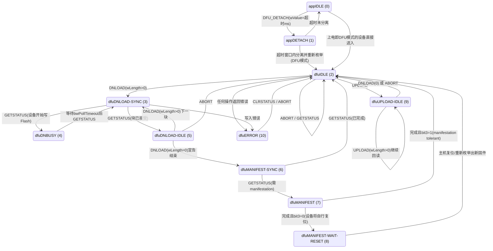
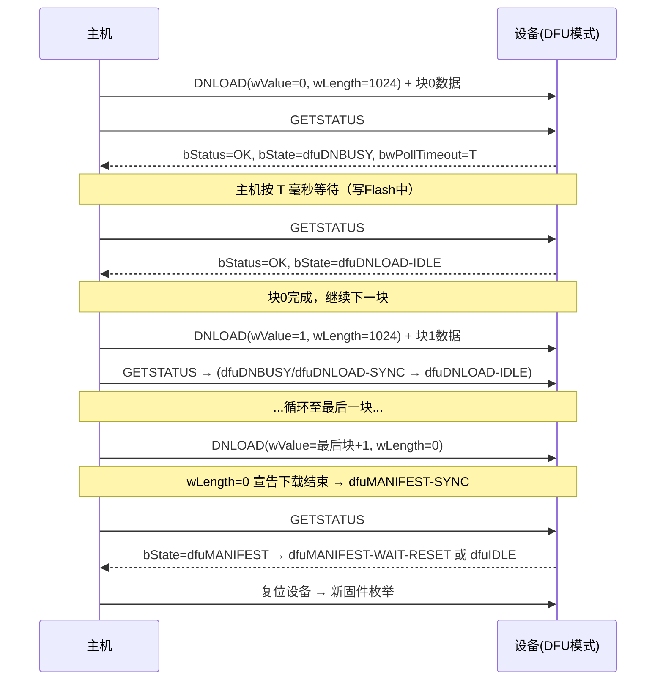

# DFU 固件升级（Device Firmware Upgrade 1.1）

> 🌿 知识树位置: 树干 → 枝干[设备类] → 分枝[其他设备类] → 叶[DFU]
> ⬆️ 父节点: 枝干[设备类]，与 [../HID-人机接口设备/00-HID概述与定位.md] 等同类兄弟分枝同级；其下载/上传事务全部跑在 USB 标准请求（控制传输）之上，参见 [../../10-树干-USB核心/08-枚举流程与标准请求.md]

## 1. 定位

DFU（Device Firmware Upgrade，设备固件升级）是 USB-IF 发布的设备类规范（当前版本 1.1），定义了一套**不依赖文件系统、仅用控制传输（Control Transfer）即可传输固件镜像**的通用升级通道。它是 MCU（微控制器）与嵌入式 USB 设备领域事实上的引导协议标准：主机侧工具（如 dfu-util）与设备侧 bootloader（引导程序）只要都实现 DFU 1.1，即可互通。

核心概念只有两个方向：

| 操作 | 方向 | 说明 |
|---|---|---|
| Download（下载） | 主机 → 设备 | 把固件镜像写入设备 Flash |
| Upload（上传） | 设备 → 主机 | 回读设备中的固件/存储内容（可选实现） |

## 2. 两种运行模式与接口标识

DFU 设备有两种工作模式，通过**不同固件里的两个同名接口**区分：

| 模式 | bInterfaceProtocol | 运行者 | 典型场景 |
|---|---|---|---|
| Runtime 模式（运行模式） | 0x01 | 应用固件 | 设备正常工作，DFU 只是其中一个接口；主机发 `DFU_DETACH` 请求"劝"设备分离复位 |
| DFU 模式（升级模式） | 0x02 | Bootloader 固件 | 复位/重启后设备重新枚举，只提供 DFU 接口，专用于升级，不能回到应用 |

接口标识：DFU 不占用正式类编号，挂在"应用特定类"（Application Specific）之下：

| 字段 | 取值 | 说明 |
|---|---|---|
| bInterfaceClass | 0xFE | Application Specific（应用特定类） |
| bInterfaceSubClass | 0x01 | DFU |
| bInterfaceProtocol | 0x01 / 0x02 | Runtime 模式 / DFU 模式（见上表） |

典型升级流程：Runtime 模式收到 `DFU_DETACH` → 设备从总线分离 → 复位进 bootloader → 以 DFU 模式重新枚举（PID 往往变化，如 STM32 体现为 PID 0xDF11）→ 主机与 DFU 模式接口执行下载。

## 3. DFU 功能描述符（DFU Functional Descriptor）

每个 DFU 接口都跟随一个类专属描述符：

| 偏移 | 长度 | 字段 | 说明 |
|---|---|---|---|
| 0 | 1 | bLength | 固定 9 |
| 1 | 1 | bDescriptorType | 0x21（DFU_FUNCTIONAL） |
| 2 | 1 | bmAttributes | 能力位图，见下表 |
| 3 | 2 | wDetachTimeOut | `DFU_DETACH` 后等待主机完成分离/复位的超时（毫秒，小端） |
| 5 | 2 | wTransferSize | 单次 DNLOAD/UPLOAD 的最大块字节数（小端），如 STM32 常为 1024 |
| 7 | 2 | bcdDFUVersion | BCD 版本号，1.1 规范为 0x0110 |

`bmAttributes` 位定义：

| 位 | 名称 | 含义 |
|---|---|---|
| 0 | bitDownloadCapable | 支持下载（固件写入） |
| 1 | bitUploadCapable | 支持上传（回读） |
| 2 | bitWillDetach | Runtime 模式下收到 `DFU_DETACH` 会自行总线分离并重新枚举 |
| 3 | bitManifestationTolerant | 编程完成后设备能自行切回 dfuIDLE 并继续响应 USB（=1）；否则需复位（=0） |
| 4~7 | 保留 | 必须为 0 |

## 4. 类专属请求（全部为接口请求）

所有 DFU 请求的 bmRequestType 均为 **0x21**（主机→设备、类请求、接口接收者），wIndex = DFU 接口号：

| bRequest | 名称 | wValue | 数据阶段 | 作用 |
|---|---|---|---|---|
| 0x00 | DFU_DETACH | 分离超时（毫秒） | 无 | 仅 Runtime 模式有效；请求设备分离并进入 DFU 模式（DFU 模式下收到会 STALL） |
| 0x01 | DFU_DNLOAD | 块号 wBlockNum | wLength 字节数据 | 发送一块固件数据；wLength=0 表示"下载结束" |
| 0x02 | DFU_UPLOAD | 块号 | IN 数据 | 回读一块数据 |
| 0x03 | DFU_GETSTATUS | 0 | 返回 6 字节 | 查询状态/设备状态机状态/预计等待时间（轮询的主力） |
| 0x04 | DFU_CLRSTATUS | 0 | 无 | 清除错误，从 dfuERROR 回到 dfuIDLE |
| 0x05 | DFU_GETSTATE | 0 | 返回 1 字节 | 仅查询 bState |
| 0x06 | DFU_ABORT | 0 | 无 | 放弃当前操作，回到 dfuIDLE |

## 5. GETSTATUS 的 6 字节响应

`DFU_GETSTATUS` 是整个协议的"心跳"，返回固定 6 字节：

| 偏移 | 长度 | 字段 | 说明 |
|---|---|---|---|
| 0 | 1 | bStatus | 错误码（见第 7 节） |
| 1 | 3 | bwPollTimeout | 完成当前操作主机还需等待的毫秒数（**LSB 在前**，24 位） |
| 4 | 1 | bState | 设备当前状态机状态（见第 6 节） |
| 5 | 1 | iString | 错误描述的字符串描述符索引（可为 0） |

## 6. 状态机全图

DFU 定义了 11 个状态（bState 取值）：

| bState | 状态名 | 含义 |
|---|---|---|
| 0 | appIDLE | Runtime 模式空闲，正常工作 |
| 1 | appDETACH | 已收到 DFU_DETACH，等待总线分离/复位（超时则退回 appIDLE） |
| 2 | dfuIDLE | DFU 模式空闲，可开始下载/上传 |
| 3 | dfuDNLOAD-SYNC | 已收到下载块，等待主机 GETSTATUS 同步 |
| 4 | dfuDNBUSY | 正在写 Flash，不可响应除 GETSTATUS 外的请求 |
| 5 | dfuDNLOAD-IDLE | 一块写完，可继续 DNLOAD 下一块 |
| 6 | dfuMANIFEST-SYNC | 下载结束，等待主机确认 manifestation（编程收尾）进度 |
| 7 | dfuMANIFEST | 正在完成编程（重映射/校验/收尾） |
| 8 | dfuMANIFEST-WAIT-RESET | 收尾完成，等主机复位（设备将重新枚举为新固件） |
| 9 | dfuUPLOAD-IDLE | 上传就绪/进行中 |
| 10 | dfuERROR | 发生错误，需 CLRSTATUS 或 ABORT 恢复 |

## 7. 错误码（bStatus）

DFU 1.1 规范（表 4.2）定义了 0x00~0x0F 共 16 个错误码（下表描述为意译，原文措辞见规范）：

| bStatus | 名称 | 含义（意译） |
|---|---|---|
| 0x00 | OK | 无错误 |
| 0x01 | errTARGET | 文件与本设备目标不匹配 |
| 0x02 | errFILE | 文件本身不适用于本设备 |
| 0x03 | errWRITE | 写 Flash 失败 |
| 0x04 | errERASE | 擦除失败 |
| 0x05 | errCHECK_ERASED | 擦除后校验失败（未真正擦净） |
| 0x06 | errPROG | 编程（烧写）失败 |
| 0x07 | errVERIFY | 编程后校验失败 |
| 0x08 | errADDRESS | 地址非法/越界 |
| 0x09 | errNOTDONE | 编程操作未完成 |
| 0x0A | errFIRMWARE | 固件镜像不合法（如校验和/签名错误） |
| 0x0B | errVENDOR | 厂商自定义错误 |
| 0x0C | errUSBR | 检测到 USB 复位 |
| 0x0D | errPOR | 检测到掉电（上电复位） |
| 0x0E | errUNKNOWN | 未知错误 |
| 0x0F | errSTALLEDPKT | 设备仍在 STALL 状态（上一请求被拒绝） |

## 8. 下载一个块的完整时序

固件按 `wTransferSize` 分块；每块的流程是 **DNLOAD → 轮询 GETSTATUS 直到 bState 回到 dfuDNLOAD-IDLE**。DFU_DNLOAD 的 wValue 为块号（0、1、2…），数据阶段携带本块内容：

要点：
- 上传（UPLOAD）对称：dfuIDLE 发 UPLOAD → 进入 dfuUPLOAD-IDLE，逐块回读，ABORT 或 DNLOAD(0) 退出。
- 出错时任一环节可能返回 bStatus≠OK 且 bState=dfuERROR，主机用 CLRSTATUS 恢复。
- 全部事务都是控制传输，无中断/批量端点参与（传输类型背景见 [../../10-树干-USB核心/06-四种传输类型.md]）。

## 9. DFU 文件格式

### 9.1 通用 DFU 后缀（DFU 1.1，16 字节，置于文件末尾）

| 偏移 | 长度 | 字段 | 说明 |
|---|---|---|---|
| 0 | 2 | bcdDevice | 适配的设备版本（0xFFFF 常表通配，由工具决定） |
| 2 | 2 | idProduct | 适配的产品 PID |
| 4 | 2 | idVendor | 适配的厂商 VID |
| 6 | 2 | bcdDFU | 后缀格式版本标识 |
| 8 | 3 | ucDfuSignature | 签名 "DFU"，即 0x44 0x46 0x55 |
| 11 | 1 | bLength | 后缀总长 0x10（16） |
| 12 | 4 | dwCRC | CRC-32，覆盖文件本体加上前 12 字节后缀 |

主机工具靠这个后缀校验"文件与哪台设备匹配"。

### 9.2 DfuSe（ST 变体）

STMicroelectronics 扩展出 DfuSe 格式，在文件**头部**增加多镜像/多目标（Target）结构：

- 文件头：签名 "DfuSe"（5 字节）+ bVersion（1 字节，0x01）+ DFUImageSize（4 字节，全文件大小）+ bTargets（1 字节）；
- 每个 Target 前缀：签名 "Target"（6 字节）+ bAlternateSetting（1 字节）+ 是否命名标志（4 字节）+ 255 字节目标名 + dwTargetSize（4 字节）；
- 元素（Element）：dwElementAddress（4 字节，目标 Flash 地址）+ dwElementSize（4 字节）+ 数据；
- 文件尾仍是 9.1 的 16 字节通用后缀，ST 设备约定 idVendor=0x0483、idProduct=0xDF11。

DfuSe 还在 DNLOAD 载荷里扩展了命令语义（如擦除、按地址写、`:leave` 跳转），与 DFU 1.1 纯数据语义不同，具体编码见 ST 官方应用笔记 AN3156。

## 10. 工具链

| 工具 | 说明 |
|---|---|
| dfu-util | 通用开源工具（Linux/macOS/Windows），支持 DFU 1.1 与 DfuSe，常用 `-l` 列设备、`-a 0 -D fw.bin` 下载、`-U` 上传、`-s :leave`（DfuSe 跳转） |
| dfu-programmer | 面向 Atmel/Microchip AVR/UC3 系列片上 DFU bootloader |
| DfuSe Utility | ST 官方图形工具，配合 STM32 DfuSe |
| Teensy Loader | PJRC Teensy 的下载工具；其板载 bootloader（HalfKay）用的是私有协议而非 DFU，功能定位相近 |

## 11. 平台实例

| 平台 | 现状 |
|---|---|
| STM32 | 内置系统 bootloader（ROM），按 BOOT0 引脚进入，可提供 USART/I2C/USB 等接口；USB DFU 枚举为 VID 0x0483 / PID 0xDF11，采用 DfuSe 协议。**这是业界最广泛使用的 USB DFU 实现** |
| Nordic nRF52/nRF52840 | 官方/开源 bootloader（Open DFU bootloader）使用 Nordic 私有 DFU 协议；nRF52840 的 USB 方案经 **USB CDC ACM**（串口形态）承载该协议，**并非 USB DFU 类** |
| ESP32 | 不使用 USB DFU：原生 USB 表现为 CDC/JTAG-Serial；固件下载走 UART 上的 esptool（ROM bootloader）或 OTA 空中升级 |
| 其他 | 大量自制设备（键盘、无人机飞控、开发板）直接用开源 DFU bootloader（如基于 STM32 的方案）实现"插 USB 就能刷机" |

### WebUSB + DFU 的现代组合

借助 WebUSB（见 [06-WebUSB与厂商自定义类.md]），浏览器页面可以经 `navigator.usb` 直接执行 DFU 状态机——开源项目 webdfu 把 dfu-util 移植到 WebUSB 上，实现"打开网页即可刷固件"，用户无需安装任何驱动或工具。这已成为开发者工具与教程页面的常见形态。

## 12. 实践要点

- `wTransferSize` 决定分块，主机不得超发；块边界对齐要求由 bootloader 实现决定。
- 写 Flash 慢：务必按 bwPollTimeout 等待，否则 GETSTATUS 在 dfuDNBUSY 期间可能被拒绝。
- bit3（manifestation tolerant）=0 的设备（如多数 STM32）在收尾阶段"消失"再以新固件出现，主机脚本要处理枚举等待。
- DFU 请求被拒（如 DFU 模式下收 DFU_DETACH）表现为 STALL，错误恢复路径见 [../../10-树干-USB核心/11-错误处理与可靠性.md]。

## 相关节点

- [../../10-树干-USB核心/08-枚举流程与标准请求.md]（标准请求与枚举，DFU 请求均在其框架内）
- [../../10-树干-USB核心/06-四种传输类型.md]（控制传输：DFU 的唯一数据通道）
- [../../10-树干-USB核心/07-描述符详解.md]（接口与类专属描述符结构）
- [../../10-树干-USB核心/11-错误处理与可靠性.md]（STALL 与错误恢复）
- [../HID-人机接口设备/00-HID概述与定位.md]（同为设备类枝干的兄弟分枝）
- [06-WebUSB与厂商自定义类.md]（浏览器内执行 DFU 的通道）
