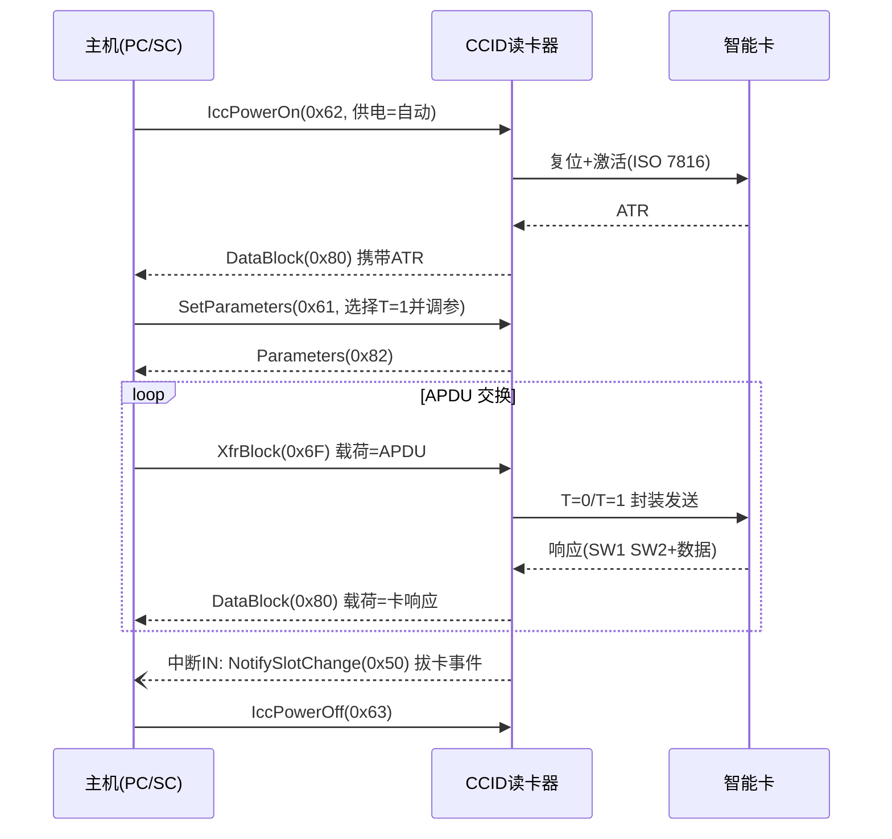

# CCID 智能卡读卡器（USB Chip/Smart Card Interface Devices 1.1）

> 🌿 知识树位置: 树干 → 枝干[设备类] → 分枝[其他设备类] → 叶[CCID]
> ⬆️ 父节点: 枝干[设备类]，与 [../HID-人机接口设备/00-HID概述与定位.md] 等同类兄弟分枝同级；批量/中断传输的底层机制见 [../../10-树干-USB核心/06-四种传输类型.md]

## 1. 定位

CCID（USB Chip/Smart Card Interface Devices，USB 芯片/智能卡接口设备）是 USB-IF 发布的智能卡读卡器类规范（常见版本 1.1，又称 CCID 1.10）。它把"读卡器 + 卡"抽象成一组**槽（Slot）**，主机通过批量端点收发标准化消息，消息载荷即 ISO 7816 的 **APDU**（Application Protocol Data Unit，应用协议数据单元），从而让任何操作系统免驱动地访问智能卡。

一句话模型：**CCID = 智能卡协议（ISO 7816-3/4）的 USB 封装层**；主机侧的 PC/SC 框架（Personal Computer/Smart Card）通过 CCID 与卡对话。

## 2. 接口标识与端点构成

| 字段 | 取值 |
|---|---|
| bInterfaceClass | 0x0B（智能卡类） |
| bInterfaceSubClass / bInterfaceProtocol | 规范未细分，通常为 0 |
| bNumEndpoints | 3 |

| 端点 | 类型 | 方向 | 用途 |
|---|---|---|---|
| 批量 OUT | Bulk | 主机 → 读卡器 | PC_to_RDR_* 命令消息 |
| 批量 IN | Bulk | 读卡器 → 主机 | RDR_to_PC_* 响应消息 |
| 中断 IN | Interrupt | 读卡器 → 主机 | 插拔卡等异步状态事件 |

## 3. 消息模型：10 字节级消息头

CCID 批量消息以公共头开始，核心字段如下（偏移对两类方向一致）：

| 偏移 | 长度 | 字段 | 说明 |
|---|---|---|---|
| 0 | 1 | bMessageType | 消息类型码（方向不同编号空间不同，见下表） |
| 1 | 4 | dwLength | 后续数据 abData 长度（**小端**） |
| 5 | 1 | bSlot | 槽号（0 ~ bMaxSlotIndex，多数读卡器仅 1 槽取 0） |
| 6 | 1 | bSeq | 主机分配的序号，响应原样带回，用于配对 |
| 7 | 1 | bStatus | 仅 RDR_to_PC_* 有效：命令状态 + ICC 状态（见第 4 节） |
| 8 | 1 | bError | 仅 RDR_to_PC_* 有效：错误码/时间扩展参数 |

PC_to_RDR_* 消息在 bSeq 之后是消息专属字节（多数为保留，XfrBlock 等有 bBWI/wLevelParameter 等，具体见 CCID 规范第 6 章各消息表）。完整字段定义以规范原文为准。

### 常用消息类型码（bMessageType）

| 方向 | 消息 | 码 | 用途 |
|---|---|---|---|
| PC → RDR | IccPowerOn | 0x62 | 上电并获取 ATR；附带供电选择（0x00 自动 / 0x01 5.0V / 0x02 3.0V / 0x03 1.8V） |
| PC → RDR | IccPowerOff | 0x63 | 下电 |
| PC → RDR | GetSlotStatus | 0x65 | 查询槽/卡状态 |
| PC → RDR | XfrBlock | 0x6F | **APDU 透传**核心消息（含 bBWI、wLevelParameter） |
| PC → RDR | SetParameters | 0x61 | 设置协议参数（T=0 / T=1 参数结构） |
| PC → RDR | GetParameters | 0x6C | 读取协议参数 |
| PC → RDR | ResetParameters | 0x6D | 恢复默认协议参数 |
| PC → RDR | Secure | 0x69 | PIN 板输入等安全操作（可选） |
| PC → RDR | Abort | 0x72 | 中止槽上处理（配合 Abort 控制请求） |
| RDR → PC | DataBlock | 0x80 | 数据响应（ATR、APDU 响应都从这里返回） |
| RDR → PC | SlotStatus | 0x81 | 槽状态响应 |
| RDR → PC | Parameters | 0x82 | 协议参数响应 |
| RDR → PC | Escape | 0x83 | 厂商私有 Escape 命令的响应 |
| RDR → PC | NotifySlotChange | 0x50 | 中断端点消息：报告各槽卡在位状态位图 |

## 4. bStatus 编码

RDR_to_PC_* 消息的 bStatus 拆为两部分：

| 位 | 含义 |
|---|---|
| bit7~6 | 命令状态：00b 处理成功；01b 失败（bError 给出原因）；10b 请求时间扩展（Time Extension，处理未完，稍后再查） |
| bit5~0 | ICC 状态：0x00 卡在位且激活；0x01 卡在位未激活；0x02 卡不在位 |

时间扩展是 CCID 对慢操作（如密钥生成）的标准应对：读卡器不阻塞批量通道，而是先回"还要等"，主机稍后重询。

## 5. 时钟/协议选择：T=0 与 T=1

ISO 7816-3 定义了卡与终端间的两种传输协议，CCID 用 SetParameters 的协议数据结构选择并调参：

| 协议 | 特点 | 参数要点 |
|---|---|---|
| T=0 | 面向字节的异步半双工，早期 SIM 卡常用 | 保护时间、字符等待整数（CWT）等 |
| T=1 | 面向块的异步半双工，现代银行卡/证件常用 | 块等待时间（BWT）、校验方式 CRC/LRC 等 |

上电成功后读卡器以 DataBlock 返回 **ATR**（Answer To Reset，复位应答），ATR 中的 TAi/TBi 接口字节声明可用协议与时钟频率，主机据此用 SetParameters 完成协商。参数结构的具体编码见 CCID 规范表 6.02 系列。

## 6. 一次典型读卡流程



## 7. 字节级示例

主机让槽 0 上电（自动电压），第 1 条命令（bSeq=0x01）：

```
62 00 00 00 00  00  01  00 00
│  └─dwLength=0─┘ │   │  └─消息专属(RFU/供电选择)
│                 │   └─bSeq=01
│                 └─bSlot=0
└─IccPowerOn
```

读卡器返回 ATR（示例，实际 ATR 因卡而异）：

```
80 0D 00 00 00  00  01  00  3B F8 13 00 00 ...
│ └─dwLength=13─┘ │   │   │  └─abData: ATR
│                 │   │   └─bError
│                 │   └─bStatus: 0x00=成功+卡激活
│                 └─bSeq(回带01)
└─DataBlock
```

APDU 透传（发 SELECT 一条应用，APDU 例：`00 A4 04 00 07 A0 00 00 00 03 10 10 00`）走 XfrBlock，dwLength = APDU 长度。

## 8. 应用场景

| 场景 | 说明 |
|---|---|
| 安全密钥 | YubiKey 等以 CCID 模式提供 PIV（NIST SP 800-73，美国政府个人身份验证接口）、OpenPGP 卡应用；同一设备常做成 **HID+CCID 复合**（FIDO 走 HID、PIV/OpenPGP 走 CCID） |
| 银行 U 盾/网银 | 国内 U 盾、电子签名卡普遍以 CCID 免驱接入 |
| 身份证/电子护照 | 终端经 CCID 发 APDU 读取芯片数据 |
| NFC 读卡器 | 常见 NFC 读写器内置非接前端芯片，CCID 消息透传 ISO 14443 层之上的 APDU；也常见 CCID+HID 复合设备形态 |
| 电信 SIM 管理 | 写卡器以 CCID 管理可插拔 SIM/USIM |

## 9. 驱动与主机侧架构


| 平台 | 方案 |
|---|---|
| Linux | 内核不提供通用 CCID 驱动；由 **pcscd**（PC/SC 守护进程）+ **libccid**（经 libusb 访问设备）承担，应用走 PC/SC Lite API |
| Windows | 内置 CCID 类驱动与系统智能卡服务（SCardSvr / WinSCard），插入即用，无需厂商驱动 |
| macOS | 内置 CCID 支持与 CryptoTokenKit/PCSC 框架 |

## 10. 相关联的类与易混概念

| 名称 | 与 CCID 的关系 |
|---|---|
| ICCD（Integrated Circuit Card Device，USB-IF） | 面向**卡片本身**（而非读卡器）原生 USB 接口的规范，卡片省去读卡器中介；分 Type A/B 两类，复用 CCID 消息并配合少量控制请求，细节见其规范原文 |
| SDIO（Secure Digital I/O，SD 协会） | 属于 SD 协会的总线接口标准，**不是 USB 设备类**，与 CCID 无直接对应关系；SD 存储卡接入 USB 主机时走 MSC 类，多合一读卡器则常以 CCID 管理卡槽、以 MSC 暴露存储 |

## 11. 实践要点

- bSeq 配对：批量管道严格按序，但多槽/时间扩展场景下仍应以 bSeq 核对响应归属。
- 中断 IN 不可省：不轮询 GetSlotStatus 的读卡器依赖 NotifySlotChange 上报插拔。
- 时间扩展（bStatus 命令状态=10b）期间不要重发原命令，稍后重询即可。
- Abort 需要控制请求 + 消息配合（规范定义了 Abort 控制请求与 PC_to_RDR_Abort 的成对流程），具体见规范原文。

## 相关节点

- [../../10-树干-USB核心/06-四种传输类型.md]（批量/中断传输机制）
- [../../10-树干-USB核心/07-描述符详解.md]（接口描述符与端点描述符）
- [../../10-树干-USB核心/11-错误处理与可靠性.md]（STALL 与错误恢复）
- [../HID-人机接口设备/00-HID概述与定位.md]（复合设备中与 CCID 并列的 HID 接口）
- [../MSC-大容量存储/](../MSC-大容量存储/)（多合一读卡器中 SD 卡所在的兄弟分枝）
