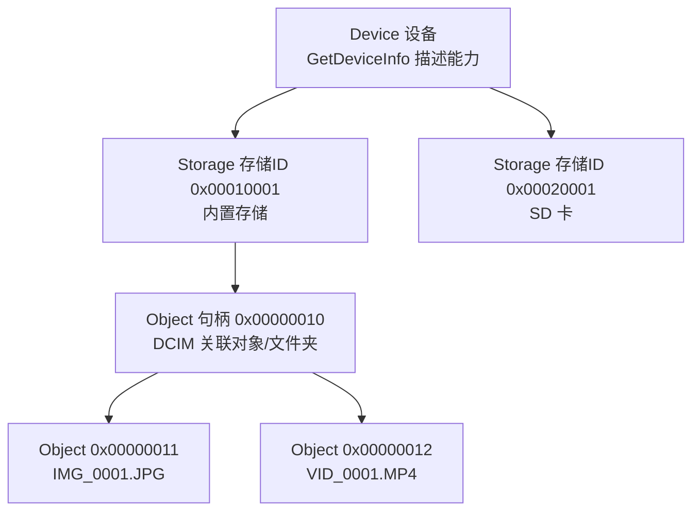
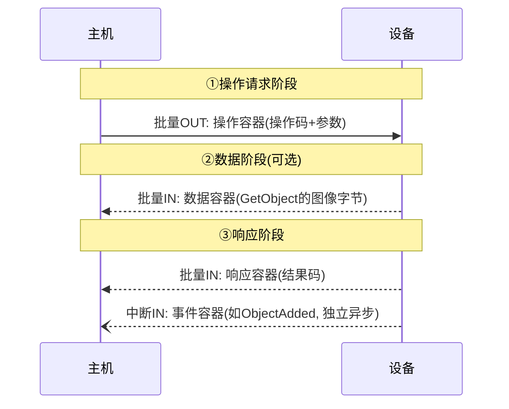

# PTP 与 MTP（图像传输协议 / 媒体传输协议）

> 🌿 知识树位置: 树干 → 枝干[设备类] → 分枝[其他设备类] → 叶[PTP/MTP]
> ⬆️ 父节点: 枝干[设备类]，与 [../HID-人机接口设备/00-HID概述与定位.md] 等同类兄弟分枝同级；批量/中断端点机制见 [../../10-树干-USB核心/06-四种传输类型.md]

## 1. 定位

USB "Still Image Capture Device"（静态图像采集设备）类把 **PTP**（Picture Transfer Protocol，图像传输协议，即 ISO 15740 / PIMA 15740）承载在 USB 上，用于相机向主机传输图片与元数据。微软在此基础上扩展出 **MTP**（Media Transfer Protocol，媒体传输协议），把"图像"推广为任意媒体/文档对象。今天 MTP 已是 Android 手机连接 PC 的默认方式，也是 Windows 手机/播放器生态的标准协议。

三者关系：**ISO 15740（PTP）+ USB Still Image 类 = USB 上的 PTP；PTP + 微软扩展 = MTP**。

## 2. 接口标识与端点构成

| 字段 | 取值 | 说明 |
|---|---|---|
| bInterfaceClass | 0x06 | Image（图像类） |
| bInterfaceSubClass | 0x01 | Still Image Capture（静态图像采集） |
| bInterfaceProtocol | 0x01 | PIMA 15740（PTP） |

端点构成（共 3 个）：

| 端点 | 类型 | 方向 | 用途 |
|---|---|---|---|
| 批量 OUT | Bulk | 主机 → 设备 | 操作请求容器、数据容器（上传） |
| 批量 IN | Bulk | 设备 → 主机 | 数据容器（下载）、响应容器 |
| 中断 IN | Interrupt | 设备 → 主机 | 事件容器（ObjectAdded 等异步通知） |

## 3. 对象模型：Device → Storage → Object

PTP 把设备抽象成三层树：



| 概念 | 载体 | 说明 |
|---|---|---|
| StorageID | 32 位 | 一个存储卷（内置存储/SD 卡）；0x00000000 表示"所有存储" |
| ObjectHandle | 32 位 | 对象句柄；0x00000000 表示"根"；0xFFFFFFFF 表示"所有对象" |
| 关联对象（Association） | ObjectFormatCode 0x3001 等 | 文件夹就是格式为"关联"的对象，父子关系由 ParentObject 决定 |
| ObjectFormatCode | 16 位 | 对象类型：0x3000 未定义关联、0x3001 文件夹关联、0x3801 EXIF/JPEG、0x3808 TIFF、0xB982 MP4（MTP 常用）、0xB901 WMA 等 |

## 4. 事务模型与容器格式

每个 PTP 操作都是三阶段事务（可无数据阶段）：



USB 上的 PTP 容器（Container）统一以 12 字节头开始：

| 偏移 | 长度 | 字段 | 说明 |
|---|---|---|---|
| 0 | 4 | dwLength | 容器总长（小端） |
| 4 | 2 | 容器类型 | 0x0001 操作/请求、0x0002 数据、0x0003 响应、0x0004 事件 |
| 6 | 2 | 代码 | 操作码 / 响应码 / 事件码（数据容器回带当前操作码） |
| 8 | 4 | TransactionID | 事务号，同一事务三阶段一致；事件容器该位回带相关事务号（无需关联则为 0） |

数据阶段长度超限或主机想提前放弃时，用 `CancelTransaction`（0x64 控制请求）配合事件码 0x4001 取消（控制请求细节见规范）。

## 5. 核心操作码表（OperationsSupported）

| 操作码 | 名称 | 参数要点 |
|---|---|---|
| 0x1001 | GetDeviceInfo | 无；返回设备能力描述（版本、扩展、支持的操作/事件/属性/格式清单、厂商型号） |
| 0x1002 | OpenSession | 参数 SessionID（通常 1）；其余操作前必须先开会话 |
| 0x1003 | CloseSession | 结束会话 |
| 0x1004 | GetStorageIDs | 返回存储 ID 数组 |
| 0x1005 | GetStorageInfo | 按 StorageID 返回容量/文件系统类型/描述 |
| 0x1006 | GetNumObjects | 按存储/格式统计对象数 |
| 0x1007 | GetObjectHandles | **列出对象**：存储 ID + 关联句柄 + 格式码筛选 |
| 0x1008 | GetObjectInfo | 返回 ObjectInfo：文件名、大小、格式、父对象、时间戳等 |
| 0x1009 | GetObject | **下载对象本体**（文件字节） |
| 0x100A | GetThumb | 下载缩略图 |
| 0x100B | DeleteObject | 删除对象（关联对象可递归） |
| 0x100C | SendObjectInfo | 上传前登记对象信息（配合 SendObject） |
| 0x100D | SendObject | 上传对象本体 |
| 0x100E | InitiateCapture | 触发拍摄 |
| 0x1014 / 0x1015 / 0x1016 | GetDevicePropDesc / GetDevicePropValue / SetDevicePropValue | 设备属性（电池电量、拍摄模式等）的读取/设置 |

完整操作码清单见 ISO 15740 及设备 GetDeviceInfo 返回值。

## 6. 事件（中断端点）

设备经中断 IN 发送事件容器（12 字节头，类型 0x0004），常用事件码：

| 事件码 | 名称 | 场景 |
|---|---|---|
| 0x4002 | ObjectAdded | 拍照后新对象出现（相机侧生成照片时主机实时感知） |
| 0x4003 | ObjectRemoved | 对象被删除 |
| 0x4004 / 0x4005 | StoreAdded / StoreRemoved | 存储卡插拔 |
| 0x4006 | DevicePropChanged | 设备属性变化 |
| 0x4007 | ObjectInfoChanged | 对象元数据变化 |
| 0x4009 | RequestObjectTransfer | 设备主动请求主机取走对象（"拍摄后即传"流程） |
| 0x400D | CaptureComplete | 拍摄完成 |

事件由设备在任意时刻主动发出，无需请求——这正是中断 IN 端点存在的意义。完整事件表见规范。

## 7. 响应码（ResponseCode，常用）

| 响应码 | 名称 |
|---|---|
| 0x2001 | OK |
| 0x2002 | General_Error |
| 0x2003 | Session_Not_Open |
| 0x2005 | Operation_Not_Supported |
| 0x2009 | Invalid_ObjectHandle |
| 0x200F | Access_Denied |
| 0x2019 | Device_Busy |

## 8. MTP：微软扩展

MTP 在 PTP 命令集之上增加**对象属性系统**（Object Property System），让元数据查询/设置不随文件本体传输：

- 设备在 GetDeviceInfo 中声明厂商扩展 ID = 6（Microsoft）及扩展描述 "microsoft.com: 1.0;"，由此进入 MTP 兼容模式；
- 新增操作码：GetObjectPropsSupported 0x9801、GetObjectPropDesc 0x9802、GetObjectPropValue 0x9803、SetObjectPropValue 0x9804、GetObjectPropList 0x9805（批量属性查询）等；
- 对象属性码（ObjectPropCode）常用：StorageID 0xDC01、ObjectSize 0xDC04、ObjectFileName 0xDC07、ParentObject 0xDC0B、PersistentUniqueObjectIdentifier 0xDC41、Artist 0xDC46、Title 0xDC48；
- MTP 还扩展了设备属性（如 DeviceFriendlyName 0xD402）与大量媒体格式码。

背景：MTP 脱胎于微软 Windows Media Device Manager（WMDM）体系，设计目标之一是支持受 DRM（数字版权管理）保护的媒体资产安全传输，手机/播放器至今沿用其权限模型。

## 9. Android 为什么从 USB Mass Storage 转向 MTP

| 对比项 | MSC（大容量存储/块级） | MTP（文件级） |
|---|---|---|
| 访问粒度 | 主机独占**块设备**，直接读写分区 | 主机按**文件**请求，文件系统仍在设备手中 |
| 挂起行为 | 挂上 USB 后手机自身**必须卸载**该分区，App 全部无法访问存储 | 手机存储全程可用，两边可同时工作 |
| 文件系统 | 要求双方都能读的文件系统（FAT/exFAT），损坏风险在主机侧写坏 | 设备可用 ext4 等自有文件系统，一致性由设备保证 |
| 权限/DRM | 无 | 可按对象控制访问，保护受版权内容 |
| 驱动 | 简单通用 | 主机需 MTP 栈（现代系统均内置） |

MSC 的"分区锁"问题在智能机上不可接受（连 USB 就等于 SD 卡被拔走），这是 Android 4.x 起全面转向 MTP 的根本原因。MSC 分枝细节见 [../MSC-大容量存储/](../MSC-大容量存储/)。

## 10. 主机侧生态

| 组件 | 说明 |
|---|---|
| gphoto2 / libgphoto2 | Linux/macOS 相机访问事实标准，其 ptp2 camlib 支持 PTP/MTP 相机遥控与下载 |
| libmtp / libptp2 | 纯用户态 MTP/PTP 协议库，libmtp 衍生出大量播放器工具 |
| Windows WPD | Windows Portable Devices API + 内置 MTP 驱动（Vista 起随系统提供） |
| macOS | "图像捕捉"（Image Capture）原生支持 PTP；MTP 需第三方工具（如 OpenMTP） |
| GNOME/KDE | gvfs-mtp、kio-mtp 让文件管理器直接挂载 MTP 设备 |

iPhone 连 PC 传照片走的也是 PTP，但叠加了苹果专有扩展；完整文件访问走的是另一套专有体系（usbmuxd/lockdownd 之上的 AFC，Apple File Conduit），与 USB 设备类无关，仅在此备注区分。

## 11. 字节级示例：OpenSession

主机打开会话（SessionID=1）：

```
0C 00 00 00  01 00  02 10  01 00 00 00
│  总长12    │类型1  │操作码   │TransactionID=1
│           │操作容器 │0x1002  │
```

设备响应成功：

```
0C 00 00 00  03 00  01 20  01 00 00 00
│           │类型3   │响应码   │同事务号
│           │响应容器 │0x2001=OK│
```

## 12. 实践要点

- 批量管道是半双工串行使用的：请求 →（数据）→ 响应，顺序严格，不能并发多个事务。
- 中断 IN 事件与批量事务解耦，应用应独立监听事件端点（如 gphoto2 的 "--watch"）。
- 大文件下载靠 GetObject 数据容器的多包批量传输，主机按容器 dwLength 累积拼接。
- 会话未开（0x2003）时除 GetDeviceInfo/OpenSession 外的操作都会被拒。

## 相关节点

- [../../10-树干-USB核心/06-四种传输类型.md]（批量/中断传输）
- [../../10-树干-USB核心/05-包格式与事务.md]（事务与包结构基础）
- [../../10-树干-USB核心/07-描述符详解.md]（接口/端点描述符）
- [../MSC-大容量存储/](../MSC-大容量存储/)（对照：块级 vs 文件级）
- [../HID-人机接口设备/00-HID概述与定位.md]（同类兄弟分枝）
