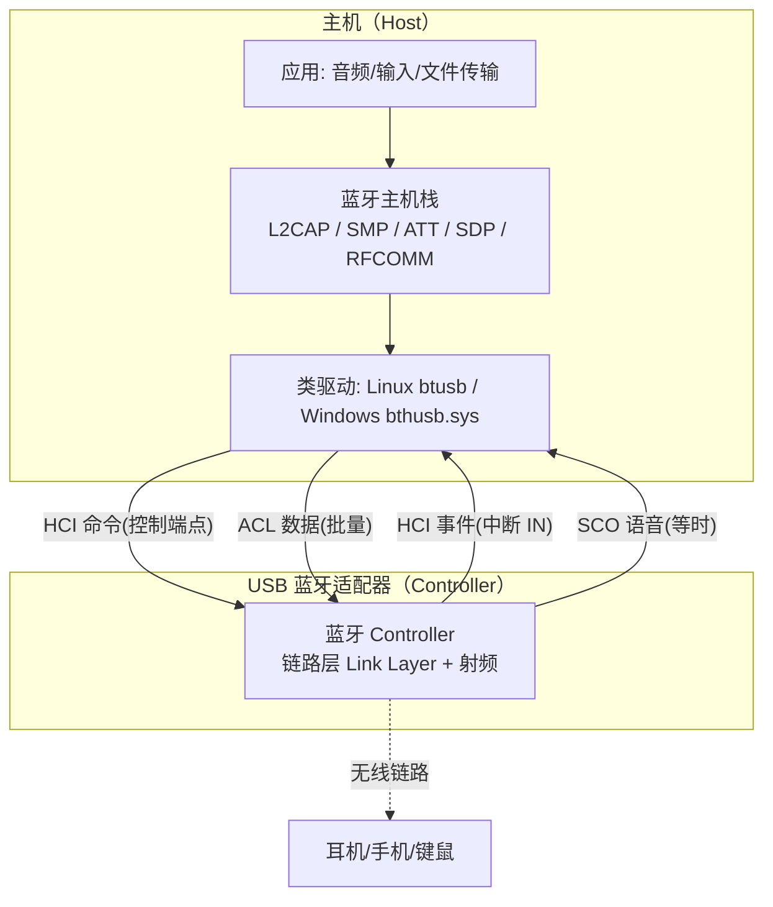
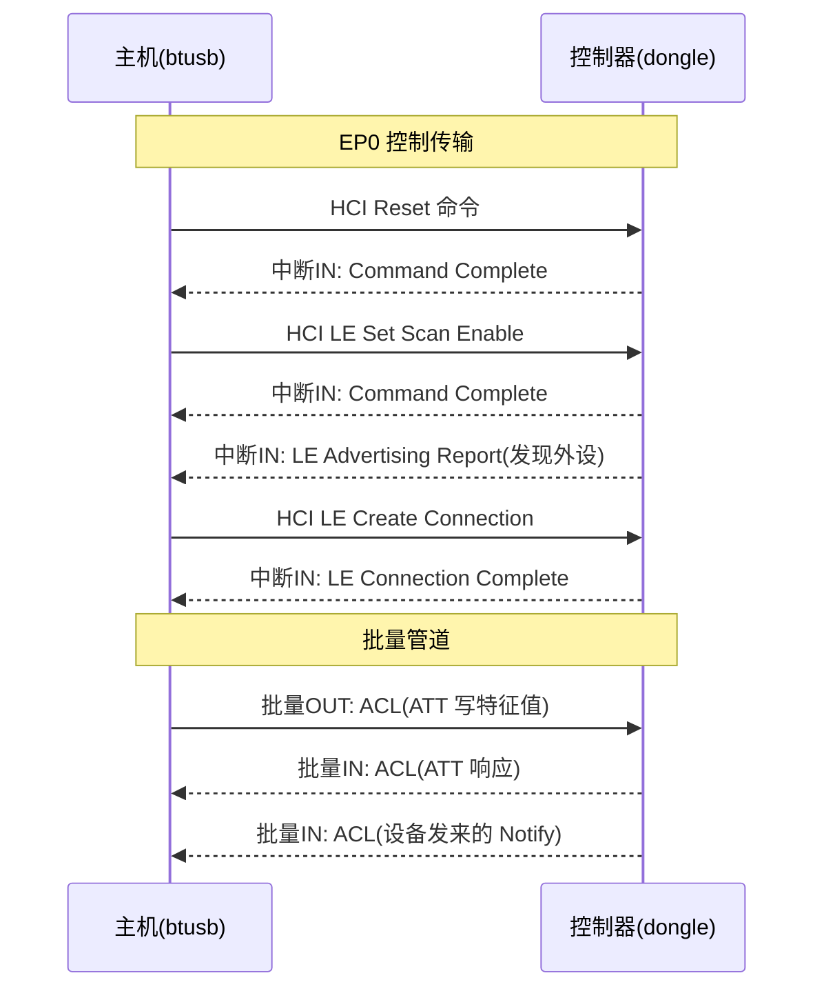

# 蓝牙控制器类（HCI over USB）

> 🌿 知识树位置: 树干 → 枝干[设备类] → 分枝[其他设备类] → 叶[蓝牙 HCI]
> ⬆️ 父节点: 枝干[设备类]，与 [../HID-人机接口设备/00-HID概述与定位.md] 等同类兄弟分枝同级；HCI 协议本身的树内延伸阅读见 [../../50-枝干-无线关联/BLE-低功耗蓝牙/01-蓝牙体系架构与HCI.md]

## 1. 定位：USB 蓝牙适配器到底是什么

一个"USB 蓝牙适配器（dongle）"在 USB 总线上呈现为一个 **Wireless Controller（无线控制器）类**设备，其实质是：**设备内固化了一个完整的蓝牙 Controller（链路层 Link Layer + 射频），主机通过 USB 上的 HCI（Host Controller Interface，主机控制器接口）传输层与它对话**。

| 字段 | 取值 | 说明 |
|---|---|---|
| bInterfaceClass | 0xE0 | Wireless Controller（无线控制器类） |
| bInterfaceSubClass | 0x01 | Radio Frequency（射频） |
| bInterfaceProtocol | 0x01 | Bluetooth（蓝牙编程无线电） |

因此主机端只需要**蓝牙 Host（主机栈）**，不需要知道射频细节；dongle 即插即用的原因正是：三大操作系统都内置了识别 0xE0/0x01/0x01 并自动绑定蓝牙栈的类驱动。

HCI over USB 的规范出处是蓝牙核心规范（Bluetooth Core Specification）卷 4 的 HCI 传输层章节之 USB Transport Layer；历史上蓝牙早期文档曾把 USB 传输层称为 **H2**（H4 即常见 UART 传输层）。

## 2. Host/Controller 分工



HCI 是蓝牙规范划定的 Host 与 Controller 边界：命令、事件、ACL 数据、SCO 数据四类 HCI 包分别映射到不同的 USB 管道。

## 3. 端点布局：包类型由管道隐含

典型 dongle 的描述符含两个接口：**接口 0**（中断 IN + 批量 OUT + 批量 IN）与**接口 1**（等时 OUT + 等时 IN，带多个备用设置用于按需切换语音带宽）。常见端点编号如下（以实际描述符为准）：

| 端点（典型编号） | 类型 | 方向 | 承载的 HCI 包 |
|---|---|---|---|
| EP0 | 控制 | 双向 | **HCI 命令**（类专属控制请求：bmRequestType=0x21、bRequest=0x00，wIndex=接口号，数据为命令包） |
| 0x81 | 中断 | IN | **HCI 事件**（Connection Complete、Command Complete 等） |
| 0x02 / 0x82 | 批量 | OUT / IN | **ACL 数据**（主机↔控制器双向各一个） |
| 0x03 / 0x83 | 等时 | OUT / IN | **SCO/eSCO 语音**（同步数据流） |

关键规则：**USB 上不使用 H4 的 1 字节包类型前缀**——包类型不再写在数据里，而是由"走哪条管道"隐含。这与 UART H4 传输层的根本差异如下表：

| 对比项 | H4（UART） | HCI over USB |
|---|---|---|
| 类型标识 | 每包前置 1 字节：命令 0x01 / ACL 0x02 / SCO 0x03 / 事件 0x04 | 无前缀；命令走控制端点、事件走中断 IN、ACL 走批量、SCO 走等时 |
| HCI 命令 | 与事件、数据共用一条 UART | 控制传输（EP0，类请求） |
| HCI 事件 | 共用 UART | 中断 IN |
| 流控 | H4 本身无流控（依赖低层），H5 才补充 | USB 原生 NAK/信用机制 |
| 语音通道 | 常外接 PCM 线（HCI 外路由） | 等时端点原生承载 SCO |

SCO 等时接口的多个 **Alternate Setting** 对应不同同时语音链路数下的包尺寸（如 1 条 SCO 时小包、多条时大包）；主机按当前活动 SCO 连接数切换 alt setting（Linux btusb 正是这样做）。不少音频设备固件也支持把 SCO 路由到 PCM 引脚而非 USB（HCI 之外的路由，属控制器配置选项）。

## 4. 四类 HCI 包与 USB 管道的映射总表

| HCI 包类型 | H4 类型码 | USB 管道 | 传输类型 | 方向 |
|---|---|---|---|---|
| HCI Command | 0x01 | EP0 类专属请求 | 控制 | 主机 → 控制器 |
| HCI Event | 0x04 | 中断 IN 端点 | 中断 | 控制器 → 主机 |
| ACL Data | 0x02 | 批量 OUT/IN | 批量 | 双向 |
| SCO Data | 0x03 | 等时 OUT/IN | 等时 | 双向 |

HCI 包的内部格式（命令头 3 字节 = Opcode 2 字节 + 参数长度 1 字节；事件头 2 字节；ACL 头 4 字节含连接句柄；SCO 头 3 字节）属于 HCI 协议本体，详见 [../../50-枝干-无线关联/BLE-低功耗蓝牙/01-蓝牙体系架构与HCI.md]，此处不展开。

### 4.1 典型描述符布局示例

老牌 dongle（如 CSR8510 方案）的接口描述符通常长这样（数值以实物为准，此处为常见取值）：

```
接口 0:
  bInterfaceClass=0xE0, SubClass=0x01, Protocol=0x01, bNumEndpoints=3
  EP 0x81  中断 IN   bInterval=1        ← HCI 事件
  EP 0x02  批量 OUT  wMaxPacketSize=64   ← ACL（主机→控制器）
  EP 0x82  批量 IN   wMaxPacketSize=64   ← ACL（控制器→主机）
接口 1（多个备用设置）:
  bAlternateSetting=0: 0 端点（无语音时省带宽）
  bAlternateSetting=1: EP 0x03 等时 OUT / EP 0x83 等时 IN, wMaxPacketSize=9~49 等 ← SCO
  bAlternateSetting=2..5: 等时包尺寸逐步加大（支持多条 SCO 同时活动）
```

主机在建立 SCO 连接时按需 `SetInterface(接口1, alt=N)` 切换语音带宽——这就是等时接口带备用设置的意义。

### 4.2 HCI 初始化序列（首次进入 dongle）

| 步骤 | HCI 命令 | 目的 |
|---|---|---|
| 1 | Reset (0x0C03) | 复位链路层至已知状态 |
| 2 | Read Local Version Information | 读取 HCI/LL 版本、厂商，决定是否需加载固件补丁 |
| 3 | Read Buffer Size / LE Read Buffer Size | 获取 ACL 缓冲大小与数量，规划分包 |
| 4 | Set Event Mask / LE Set Event Mask | 订阅关心的事件 |
| 5 | 扫描/广播/连接 | 进入正常工作 |

## 5. 一次连接的时序示例



## 6. 驱动与栈绑定

| 平台 | 传输驱动 | 说明 |
|---|---|---|
| Linux | **btusb**（内核驱动） | 承接 HCI 到 USB 管道的映射，向 hci_core 注册通用 HCI 设备；上层 BlueZ 栈（bluetoothd）提供 profile/服务 |
| Windows | bthusb.sys / bthport.sys | Microsoft 蓝牙栈的 USB 传输与端口驱动，枚举 0xE0/0x01/0x01 后自动接管 |
| macOS | 系统蓝牙栈 | 内置对蓝牙 USB 控制器的支持（部分 Mac 平台已改用 PCIe/UART 形态，协议仍是 HCI） |

即插即用的完整链条：类代码匹配 → 栈绑定 → （可能先加载固件）→ HCI Reset → 开始扫描/广播，全程无需用户操作。

## 7. 典型芯片与固件加载

并非所有 dongle 出厂即全功能：不少 Controller 需要**主机在 HCI 正常工作前下载固件补丁（patch/ROM 补丁）**。Linux 侧由 btusb 与各厂商子模块（btintel/btbcm/btrtl）从 linux-firmware 拉取：

| 家族 | 典型芯片 | 固件特征 |
|---|---|---|
| CSR（高通前身） | CSR8510 A10 | 老款多为 Flash 版免加载；市场上存在大量"克隆 CSR8510"，行为异常，Linux 内核内置了识别/标记机制 |
| Realtek | RTL8761A/B 等 | btusb 经 btrtl 请求 `rtl_bt/rtl8761b_fw.bin` 等 ROM 补丁后 HCI 才完整可用 |
| Intel | 7265/8265/AX200/AX210 等 | 需加载 `intel/ibt-*.sfi`（与 .ddc 调节数据），由 btintel 完成下载与校验 |
| Broadcom | BCM20702 等 | 需 `brcm/*.hcd` 固件文件（老型号 BCM2033 曾有专门的 bcm203x 加载驱动） |

固件加载的通用流程：设备以 USB 枚举（此时厂商命令/下载模式接口可用）→ 主机发送厂商私有 HCI/厂商命令载入镜像 → 芯片复位/重枚举 → 正式进入标准 HCI 模式。各厂商的私有命令各不相同，细节以其 SDK/内核驱动实现为准。

## 8. 自制蓝牙 Host 的实用价值

正因为接口是纯标准化 HCI，自己写一个 USB 主机就能获得完整蓝牙能力，常见用途：

- 嵌入式 USB Host（如带 USB OTG 的 MCU、树莓派 Zero）通过 dongle 为产品加入 BLE；
- 安全研究/嗅探：主机侧完全控制 HCI，可注入自定义扫描/连接/广播参数；
- 协议学习：用 Python（pyusb/libusb）几十行代码即可收发 HCI 命令与事件（免驱用户态访问见 [../../60-枝干-主机侧与实现/04-libusb与用户态访问.md]）；
- 蓝牙网关：把 BLE 外设数据经 USB 采集后转 MQTT/以太网上报。

## 9. 实践要点

- HCI 命令走控制传输意味着命令速率受控制管道吞吐限制（不过每包 ≤64 字节、命令频率不高，实践中不构成瓶颈）。
- 事件端点的 bInterval 很小（通常 1ms 框架），保证事件低延迟上报。
- 等时管道无重传，SCO 音频丢包靠编码冗余容忍；USB 复位/挂起会打断语音链路。
- 克隆 CSR 与"假 dongle"是Linux 社区著名坑：枚举正常但行为怪异，更换芯片批次通常可解。

## 相关节点

- [../../50-枝干-无线关联/BLE-低功耗蓝牙/01-蓝牙体系架构与HCI.md]（HCI 命令/事件本体）
- [../../10-树干-USB核心/06-四种传输类型.md]（控制/中断/批量/等时四种传输，本文件是四者并用的最佳实例）
- [../../10-树干-USB核心/07-描述符详解.md]（双接口 + 备用设置描述符结构）
- [../../60-枝干-主机侧与实现/04-libusb与用户态访问.md]（自制 Host 的用户态路径）
- [../HID-人机接口设备/00-HID概述与定位.md]（同类兄弟分枝；蓝牙键鼠即经本类入栈后再映射为 HID）
