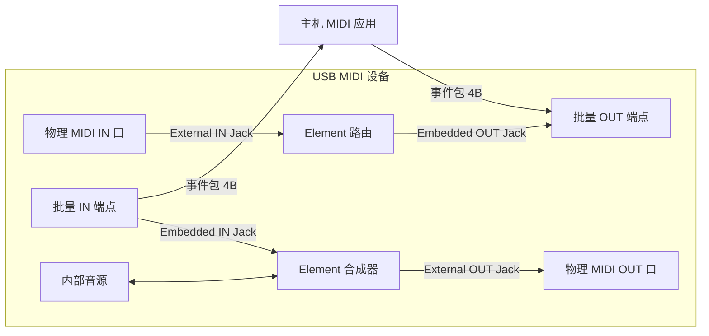

# USB MIDI 类（Device Class Definition for MIDI Devices 1.0 / 2.0）

> 🌿 知识树位置: 树干 → 枝干[设备类] → 分枝[其他设备类] → 叶[MIDI]
> ⬆️ 父节点: 枝干[设备类]；MIDI 类隶属 Audio（音频）类家族，与 [../Audio-UAC/](../Audio-UAC/) 分枝同源；与 [../HID-人机接口设备/00-HID概述与定位.md] 常以复合设备形式共存

## 1. 定位

USB MIDI 设备类规范（Universal Serial Bus Device Class Definition for MIDI Devices, Version 1.0，1999 年发布）把传统 MIDI 1.0（音乐数字接口，Musical Instrument Digital Interface，5 针 DIN、31250 bps 串行）搬到 USB 上。它在架构上**隶属音频类（Audio Device Class）家族**，以"音频类 + MIDI 流送（MIDIStreaming）接口"的方式实现——音频口（Audio Interface）负责时钟与能力声明，MIDIStreaming 接口负责事件流。

| 字段 | 取值 | 说明 |
|---|---|---|
| bInterfaceClass | 0x01 | Audio（音频类） |
| bInterfaceSubClass | 0x03 | MIDIStreaming |
| bInterfaceProtocol | 0x00 | 兼容音频类 1.0 协议约定 |

传统 DIN MIDI 的物理层是 31.25 kbps 电流环串口；USB-MIDI 改用 USB 批量管道承载，带宽与并接能力大幅提高，同时消息体仍是经典 MIDI 字节流，因此"USB MIDI 键盘"对应用而言等价于一台传统 MIDI 设备。

## 2. 端点构成

| 端点 | 类型 | 方向 | 用途 |
|---|---|---|---|
| 批量 IN | Bulk | 设备 → 主机 | USB-MIDI 事件包（演奏数据/系统消息上传） |
| 批量 OUT | Bulk | 主机 → 设备 | USB-MIDI 事件包（下发音序/控制） |

MIDI 1.0 类**只使用批量传输**，不需要等时（同步）端点——MIDI 数据本质是低速率事件流，不需要音频流的时钟同步框架（音频本体由同一设备里的 AudioStreaming 接口 0x02 承担，见 [../Audio-UAC/](../Audio-UAC/)）。

## 3. 核心：USB-MIDI 事件包（USB-MIDI Event Packet）

批量管道上的最小单元是**固定 4 字节**的事件包：

| 字节 | 内容 | 说明 |
|---|---|---|
| 字节 0 | 高 4 位 = Cable Number（线缆号 CN，0~15） | 设备内部虚拟 MIDI 线编号（多音轨/多端口设备用） |
| 字节 0 | 低 4 位 = Code Index Number（CIN，代码索引） | 声明后续字节的含义与长度 |
| 字节 1~3 | MIDI_1 / MIDI_2 / MIDI_3 | MIDI 消息本体；不足 3 字节用 0 补齐 |

### CIN 常用取值表

关键规律：**通道语音消息的 CIN 恰好等于其 MIDI 状态字节的高 4 位**，一眼可读。

| CIN | 长度 | 含义 |
|---|---|---|
| 0x8 | 2 字节数据 | Note Off（音符关） |
| 0x9 | 2 字节数据 | Note On（音符开） |
| 0xA | 2 字节数据 | Poly KeyPress（复音触后） |
| 0xB | 2 字节数据 | Control Change（控制改变） |
| 0xC | 1 字节数据 | Program Change（音色改变） |
| 0xD | 1 字节数据 | Channel Pressure（通道触后） |
| 0xE | 2 字节数据 | Pitch Bend（弯音轮） |
| 0x2 | 2 字节数据 | 双字节系统通用消息（如 MTC 四分之一帧 0xF1） |
| 0x3 | 3 字节数据 | 三字节系统通用消息（如乐曲位置指针 0xF2） |
| 0xF | 1 字节 | 单字节系统消息（实时消息、Tune Request 等；可穿插在数据流中） |
| 0x4 | 3 字节数据 | SysEx 开始或继续（3 字节均有效） |
| 0x5 | 1 字节 | SysEx 结束（含 1 字节） |
| 0x6 | 2 字节数据 | SysEx 结束（含 2 字节） |
| 0x7 | 3 字节数据 | SysEx 结束（含 3 字节） |
| 0x0 / 0x1 | — | 保留（杂项/线缆事件扩展，规范预留） |

### 字节级示例

按 C4 键（Note On，通道 0，力度 0x40）：MIDI 消息 `90 3C 40`，事件包为：

```
09 90 3C 40
│  │  │  └─力度 0x40
│  │  └─音符 C4=60=0x3C
│  └─状态字节 0x90(通道0 Note On)
└─0x09: CN=0, CIN=9(Note On)
```

一条 SysEx `F0 7E 7F 09 01 F7`（6 字节）需拆成两个事件包：

```
包1: 04 F0 7E 7F   ; CIN=0x4 SysEx开始，载 3 字节
包2: 07 09 01 F7   ; CIN=0x7 SysEx结束，载 3 字节
```

## 4. 描述符模型：Jack 与 Element

MIDI 类用"插孔（Jack）"描述数据通路，类似音频类拓扑建模：

| 描述符（MIDIStreaming 接口下） | 子类型码 | 说明 |
|---|---|---|
| MS 接口头（MS_HEADER） | 0x01 | bcdADC、wTotalLength（拓扑描述总长） |
| MIDI IN Jack | 0x02 | MIDI 数据流入 USB 的源：**Embedded**（内嵌=由 USB 端点供给/输出到端点，类型码 0x01）或 **External**（外置=物理 DIN 口等，类型码 0x02） |
| MIDI OUT Jack | 0x03 | MIDI 数据流出 USB 的目的地，同样分 Embedded/External |
| Element | 0x04 | 设备内部的信号处理单元（如合成器引擎、路由器），有若干 Pin 输入输出 |

端点描述符之后还有**类专属端点描述符**（子类型 0x01），声明该端点关联的内嵌 Jack 列表（bNumEmbMIDIJack + 各 JackID），主机据此把"Cable Number ↔ Jack ↔ 物理端口"连接成路由表。Jack/Element 的完整字段表见规范原文（描述符总体结构背景见 [../../10-树干-USB核心/07-描述符详解.md]）。



### 4.1 描述符链布局（MIDIStreaming 接口内部）

```
标准接口描述符        bInterfaceClass=0x01, SubClass=0x03
└─类专属 MS 接口头     子类型 0x01: bcdADC=0x0100, wTotalLength=拓扑描述总长
   ├─MIDI IN Jack 1   子类型 0x02: 类型=Embedded(0x01), JackID=1
   ├─MIDI OUT Jack 2  子类型 0x03: 类型=External(0x02), JackID=2, 输入Pin=1
   └─批量端点描述符
      └─类专属端点描述符 子类型 0x01: bNumEmbMIDIJack=1, baAssocJackID=[1]
```

字节级示例（MS 接口头，共 7 字节）：

```
07 24 01 00 00 42 00
│  │  │  └─bcdADC=0x0100
│  │  └─子类型 0x01 (MS_HEADER)
│  └─bDescriptorType=0x24 (CS_INTERFACE)
└─bLength           └─wTotalLength 低字节=0x42(示例值)
```

## 5. 主机侧驱动：全平台免驱

| 平台 | 驱动 | 说明 |
|---|---|---|
| Linux | ALSA **snd-usb-audio**（历史上的独立模块 snd-usb-midi 已并入） | 枚举为标准 ALSA RawMIDI/Sequence 端口，与音频流统一管理 |
| Windows | 内置 **usbaudio.sys**（Windows XP 起支持 USB MIDI） | 枚举为标准 MIDI 端口，DirectMusic/WinMM/MIDI API 可用 |
| macOS | **CoreMIDI** | 系统级免驱，Audio MIDI Setup 里可视化接线 |

因为驱动全部内置，USB MIDI 键盘/音源是"插上就能弹"的典范设备类。

## 6. MIDI 2.0 / UMP 与 USB MIDI 2.0 类

2020 年 MIDI 协会发布 **MIDI 2.0**，其核心是 **UMP**（Universal MIDI Packet，通用 MIDI 包）：

- UMP 是 4/8/12/16 字节（32/64/96/128 位）四种长度的包格式，首 32 位的**高 4 位为消息类型、次 4 位为组号（Group 0~15）**——每组内再含 16 个通道，容量从"16 通道"扩展为"16 组 × 16 通道"；各组各类消息的具体类型编码见 MIDI 2.0 规范原文；
- UMP 兼容封装 MIDI 1.0 通道语音消息，也定义 MIDI 2.0 专属消息（更高分辨率控制、按音符属性等）；
- **USB MIDI 2.0 类**（USB Device Class Definition for MIDI Devices 2.0）把 UMP 流放在 **USB Audio Class 2.0（UAC 2.0）描述符框架**之上：MIDIStreaming 接口子类仍为 0x03、数据仍走批量端点，但声明版本为 2.0，并可同时提供 MIDI 1.0 传统端点，做到新旧主机通吃。

工程现状：新款键盘/音频接口开始同时暴露"MIDI 1.0 端口 + MIDI 2.0 端口"，主机栈（Windows MIDI 2.0 服务、Linux ALSA UMP 支持、macOS CoreMIDI 2.0 API）逐步完善中。

## 7. 典型设备形态

| 设备 | USB 形态 |
|---|---|
| MIDI 键盘 / 电钢琴 | MIDI 类；若带音频输出则与 UAC 复合；面板常含多个 Cable Number（多音轨） |
| 硬件合成器 / 音源 | MIDI 类 + AudioStreaming 复合（MIDI 收指令、USB 音频回传声音） |
| DJ 控制器 | MIDI（或 HID）承载推子/转盘，UAC 承载双立体声通道；部分机型同时暴露 MIDI+HID 两种模式，游戏/映射软件走 HID |
| MIDI 接口盒 | 1 进多出 DIN 口，用多个 Jack 对扩展 CN |
| 鼓机/打击垫 | 常为 MIDI + HID 复合（打击垫供 DAW 直读） |

## 8. 实践要点

- 事件包永远 4 字节对齐：短消息补 0，长度信息只看 CIN，不要按字节流扫描。
- CN 与端点是两层概念：一个批量端点可复用 16 个 CN；路由由描述符的 Jack/Element 拓扑决定。
- 实时消息（0xF8 时钟、0xFE 活动感知）单字节即可成包（CIN=0xF），高频时注意批量端点轮询间隔带来的时延上限。
- 自制乐器固件（如 Teensy、RP2040、ESP32-S3）实现"接口 0=音频控制 + 接口 1=MIDIStreaming"即可全平台免驱，是 DIY 音频设备最常见路线。

## 相关节点

- [../Audio-UAC/](../Audio-UAC/)（音频类本体，MIDI 类的描述符框架来源）
- [../../10-树干-USB核心/06-四种传输类型.md]（批量传输）
- [../../10-树干-USB核心/07-描述符详解.md]（类专属描述符与拓扑建模思想）
- [../HID-人机接口设备/00-HID概述与定位.md]（DJ 控制器等复合设备中的兄弟接口）
- [06-WebUSB与厂商自定义类.md]（浏览器内访问 MIDI 的替代路径讨论）
