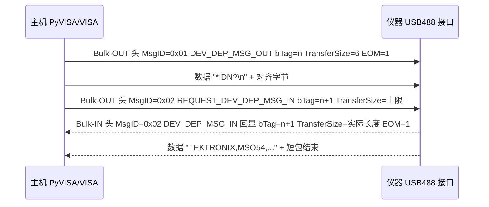

# USBTMC 测试测量类（USB Test & Measurement Class）

> 🌳 知识树位置: 树干 → 枝干[设备类] → 分枝[其他设备类] → 叶[USBTMC/USB488]
> ⬆️ 兄弟目录参考: [../HID-人机接口设备/00-HID概述与定位.md](../HID-人机接口设备/00-HID概述与定位.md)
> 规范原文缓存索引: [../../80-参考资料/README.md](../../80-参考资料/README.md)

## 1. 定位：把 GPIB 搬到 USB 上

USBTMC（USB Test & Measurement Class，USB 测试测量类，USB-IF 规范 1.0，2003-04-14 发布）为示波器、电源、万用表、频谱仪、电子负载等可编程仪器定义了一条**基于批量传输（Bulk Transfer）的消息通道**。它的历史使命是替代 GPIB（IEEE 488 总线）：只要仪器和主机软件都讲 USBTMC，仪器的"编程消息"（program message，即 SCPI 命令文本）就能像当年走 GPIB 一样收发，但物理层换成了便宜的 USB。

USBTMC 本身**不含任何仪器语义**——它只负责把字节流可靠地双向搬运并标记"消息结束"；命令内容的语义由上层生态决定：

| 层 | 名称 | 职责 |
|---|---|---|
| 应用 | IVI 驱动 / 测试程序 | 面向仪器的可互换驱动与自动化脚本 |
| 命令 | SCPI（Standard Commands for Programmable Instruments） | `*IDN?`、`:MEAS:VOLT?` 等标准命令文本 |
| API | VISA（Virtual Instrument Software Architecture，VPP-4.3） | 统一的会话/资源寻址与读写接口 |
| 传输 | **USBTMC**（本文） | USB 批量通道上的消息帧、中止、状态 |
| 物理 | USB 2.0/3.x 批量端点 | 可靠的字节管道 |

规范族共两份：**USBTMC 1.0 基础规范** + **USB488 子类规范**（同日发布）。USB488 子类在基础之上补齐 IEEE 488.1/488.2 的遗留语义（触发、状态字节、SRQ 服务请求、远地/本地切换），完整表见 USBTMC 1.0 规范与 USB488 子类规范原文。

## 2. 接口标识与端点要求

| 字段 | 取值 | 说明 |
|---|---|---|
| bInterfaceClass | 0xFE | 应用特定类（Application Specific，与 [01-DFU固件升级.md](01-DFU固件升级.md) 同挂 0xFE 下） |
| bInterfaceSubClass | 0x03 | USBTMC |
| bInterfaceProtocol | 0x00 | 纯 USBTMC，无子类适用 |
| bInterfaceProtocol | 0x01 | USBTMC + USB488 子类 |

端点配置（基础规范强制）：

| 端点 | 数量 | 用途 |
|---|---|---|
| 批量 OUT（Bulk-OUT） | 恰好 1 个 | 主机 → 仪器：命令消息（SCPI 文本、TRIGGER 等） |
| 批量 IN（Bulk-IN） | 恰好 1 个 | 仪器 → 主机：响应消息 |
| 中断 IN（Interrupt-IN） | 至多 1 个 | 基础规范中可选；USB488 子类若声明 SR1（可发服务请求）则**必须**有，用于 SRQ/状态字节通知 |

细节约束：Bulk-OUT 的 `wMaxPacketSize` 必须是 4 的倍数；基础规范要求设备描述符 `bcdUSB ≥ 0x0200`、iManufacturer/iProduct/iSerialNumber 三个字符串索引**必须非零**（VISA 靠"VID+PID+序列号"唯一定位一台仪器）。`lsusb` 里一行 `bInterfaceClass 254 App. Specific, bInterfaceSubClass 3, bInterfaceProtocol 1` 就是典型的 USB488 仪器接口。

## 3. 消息模型：12 字节头定天下

USBTMC 的所有批量通信都以一个 **12 字节消息头**开头，之后紧跟消息数据：

| 偏移 | 字段 | 大小 | 说明 |
|---|---|---|---|
| 0 | MsgID | 1 | 消息类型（见第 4 节表） |
| 1 | bTag | 1 | 传输标识，主机每发新头 +1，取值 1~255 |
| 2 | bTagInverse | 1 | bTag 的反码（如 0x5B ↔ 0xA4），用于帧完整性校验 |
| 3 | Reserved | 1 | 必须 0x00 |
| 4-7 | TransferSize | 4 | 消息数据字节数（不含头与对齐字节），小端（LSB 在前） |
| 8-11 | bmTransferAttributes 等 | 4 | 各消息专属，见下 |

**bTag/bTagInverse 配对校验**是同步机制的灵魂：

- 主机发出的每个批量 OUT 头携带新 bTag；设备的批量 IN 响应头必须**原样回显**引起该响应的命令的 MsgID/bTag/bTagInverse；
- 若响应头与请求不匹配（bTagInverse ≠ bTag 反码、bTag 对不上、MsgID 不认识），主机按规范丢弃数据并走中止（INITIATE_ABORT_BULK_IN）恢复同步；设备侧发现参数非法则停转（Halt）批量端点；
- 主机发送的每笔批量 OUT 事务总长须为 **4 字节对齐**（末尾补 0~3 个对齐字节）；设备的批量 IN 传输**必须以短包（short packet，含零长包）结束**。

一次典型的 `*IDN?` 查询（USB488 设备）：



## 4. 核心消息表（MsgID）

| MsgID | 方向 | 宏名 | 用途 |
|---|---|---|---|
| 0x00 | — | 保留 | 保留 |
| 0x01 | OUT | DEV_DEP_MSG_OUT | 设备相关命令消息：主机向仪器写数据（SCPI 命令文本就坐在这里） |
| 0x02 | OUT | REQUEST_DEV_DEP_MSG_IN | 请求响应：主机通知仪器"请在批量 IN 上回送数据"，TransferSize = 主机最多愿收多少 |
| 0x02 | IN | DEV_DEP_MSG_IN | 对 REQUEST_DEV_DEP_MSG_IN 的响应消息（**与请求共用 MsgID 2**，靠方向与 bTag 区分） |
| 0x03~0x7D | — | 保留 | USBTMC 保留 |
| 0x7E | OUT | VENDOR_SPECIFIC_OUT | 厂商自定义命令消息 |
| 0x7F | OUT/IN | REQUEST_VENDOR_SPECIFIC_IN / VENDOR_SPECIFIC_IN | 厂商自定义请求/响应 |
| 0x80~0xBF | — | 保留 | **留给 USBTMC 子类**：USB488 子类在此定义了 0x80 TRIGGER |
| 0xC0~0xFF | — | 保留 | 留给 VISA 规范 |

> 注意两个易错点：其一，**响应消息 MsgID=2 而不是 3**（0x03 起均为保留值，Linux 内核 usbtmc 驱动即校验 `MsgID == 2`）；其二，主机一次必须把整条命令消息用**一笔传输**发完（DEV_DEP_MSG_OUT 例外，允许多笔传输续传）。完整表见 USBTMC 1.0 规范 Table 2。

三条主力消息的字段差异：

| 消息 | 偏移 8 | 偏移 9 |
|---|---|---|
| DEV_DEP_MSG_OUT | bmTransferAttributes：D0=**EOM**（本传输最后一个数据字节即整条 USBTMC 消息的最后一个字节），D1~D7 保留 | 保留 |
| REQUEST_DEV_DEP_MSG_IN | bmTransferAttributes：**D1=TermCharEnabled**（须设备在 GET_CAPABILITIES 中声明支持），D0 必须 0 | TermChar（终止字符值） |
| DEV_DEP_MSG_IN | bmTransferAttributes：D0=EOM；D1=确实因 TermChar 而截断 | 保留 |

## 5. EOM 与传输终止语义

USBTMC 规范用 **EOM（End Of Message，消息结束位）**承担 GPIB 中 **EOI（End Or Identify）**线的角色——这也是 USB488 子类名字里"488"的呼应点：

| 终止条件 | 谁判定 | 语义 |
|---|---|---|
| EOM=1 的最后一个数据字节 | 主机写 / 设备读 | 整条 USBTMC 消息到此结束，仪器可开始解析执行 |
| 收满 TransferSize 个字节 | 双方 | 本笔 USB 传输的数据量额度（注意：设备可能一次只交出一部分，剩余部分主机须再发一次 REQUEST_DEV_DEP_MSG_IN 续读） |
| TermChar 匹配 | 设备 | 仅当请求中 TermCharEnabled=1 且设备支持；设备回送时置 D1=1 |
| 短包 | 设备 | 批量 IN 传输的 USB 层终止条件（可用最多 wMaxPacketSize-1 个对齐字节避免零长包） |

主机侧的正常读循环是：发 REQUEST_DEV_DEP_MSG_IN → 收 DEV_DEP_MSG_IN → 若 EOM=0 且还没收够，继续发新的请求读剩余字节。

## 6. 类专属请求（控制传输）

USBTMC 的"管理面"走控制传输，全部为类请求、接收者为接口（0xA1）或端点（0xA2）。中止与清除采用 **INITIATE + CHECK_STATUS 分步事务**（split transaction）：INITIATE 返回 0x02 PENDING 时主机须轮询对应 CHECK_STATUS 直到非 PENDING。

| bRequest | 名称 | bmRequestType | wValue | 数据阶段（IN） | 必选 |
|---|---|---|---|---|---|
| 0x01 | INITIATE_ABORT_BULK_OUT | 0xA2 | bTag | 2 字节：状态 + 当前 bTag | 必选 |
| 0x02 | CHECK_ABORT_BULK_OUT_STATUS | 0xA2 | 0 | 8 字节：状态 + 保留3 + NBYTES_RXD(4B) | 必选 |
| 0x03 | INITIATE_ABORT_BULK_IN | 0xA2 | bTag | 2 字节：状态 + 当前 bTag | 必选 |
| 0x04 | CHECK_ABORT_BULK_IN_STATUS | 0xA2 | 0 | 8 字节：状态 + bmAbortBulkIn + 保留 + NBYTES_TXD(4B) | 必选 |
| 0x05 | INITIATE_CLEAR | 0xA1 | 0 | 1 字节：状态 | 必选 |
| 0x06 | CHECK_CLEAR_STATUS | 0xA1 | 0 | 2 字节：状态 + bmClear（D0=Bulk-IN FIFO 仍有残包） | 必选 |
| 0x07 | GET_CAPABILITIES | 0xA1 | 0 | 24 字节能力包（见下） | 必选 |
| 0x40 | INDICATOR_PULSE | 0xA1 | 0 | 1 字节：状态 | 可选（点亮指示灯便于找仪器） |

语义速记：INITIATE_ABORT_BULK_OUT/BULK_IN 只"中止 USB 传输"并恢复帧同步；**INITIATE_CLEAR 才是"丢弃仪器内整条未完成消息"**（对应 IEEE 488 的器件清除语义，USB488 下等同 Selected Device Clear）。

**GET_CAPABILITIES 24 字节响应**（合并基础规范与 USB488 子类的扩展字段）：

| 偏移 | 字段 | 含义 |
|---|---|---|
| 0 | bStatus | 状态，见下表 |
| 1 | 保留 | 0x00 |
| 2-3 | bcdUSBTMC | 规范版本 0x0100 起 |
| 4 | USBTMC 接口能力 | D2=接受 INDICATOR_PULSE，D1=talk-only，D0=listen-only |
| 5 | USBTMC 器件能力 | D0=支持 TermChar 截断 |
| 6-11 | 保留 | 0 |
| 12-13 | bcdUSB488 | 0x0100 起（仅 USB488 接口） |
| 14 | USB488 接口能力 | D2=488.2 接口，D1=接受 REN_CONTROL/GO_TO_LOCAL/LOCAL_LOCKOUT，D0=接受 TRIGGER |
| 15 | USB488 器件能力 | D3=理解全部强制 SCPI，D2=SR1（可发 SRQ），D1=RL1，D0=DT1 |
| 16-23 | 保留 | 0 |

**USBTMC_status 状态值**（所有类请求响应的第一字节）：

| 值 | 宏 | 含义 |
|---|---|---|
| 0x01 | STATUS_SUCCESS | 成功 |
| 0x02 | STATUS_PENDING | 分步事务处理中，继续轮询 |
| 0x80 | STATUS_FAILED | 失败（未细分） |
| 0x81 | STATUS_TRANSFER_NOT_IN_PROGRESS | 要中止的传输不在进行 |
| 0x82 | STATUS_SPLIT_NOT_IN_PROGRESS | 收到意外 CHECK_STATUS |
| 0x83 | STATUS_SPLIT_IN_PROGRESS | INITIATE 未完成又收到新类请求 |
| 0x20 | STATUS_INTERRUPT_IN_BUSY | USB488 专属：中断 IN FIFO 满，状态字节暂无法投递 |

## 7. USB488 子类：让 SCPI 直通、补齐 488 语义

USB488 子类（bInterfaceProtocol=0x01）的核心设计是"**SCPI/IEEE 488.2 编程消息原样直通**"：批量 OUT 上的 DEV_DEP_MSG_OUT 数据就等价于 GPIB 上 ATN=FALSE 时的程序消息（如 `*IDN?\n`），设备里名为 Function Layer 的功能层把它直接喂给命令解析器。子类额外补充：

| 机制 | 载体 | 说明 |
|---|---|---|
| TRIGGER 触发 | 批量 OUT，**MsgID=0x80**，12 字节头后无数据 | 等效 IEEE 488 的 GET（Group Execute Trigger），与批量 OUT 消息保持时序同步；能力位 D0（接口）/D0（器件 DT1）声明支持 |
| 半双工规则 | 协议约束 | 批量 IN 传输未完成前，主机不得再发 DEV_DEP_MSG_OUT/TRIGGER——继承 IEEE 488.2 消息交换协议（MEP），违反时设备执行 UNTERMINATED 动作 |
| SRQ 服务请求 | 中断 IN 端点 | **bNotify1=0x81**（D7=1 子类格式，D6..D0=bTag=0x01）+ **bNotify2=状态字节（Status Byte）**；入队后设备须清除状态字节中的 RQS 位。主机读到 SRQ 即可串行轮询（serial poll）查明是谁在求助 |
| READ_STATUS_BYTE | 控制请求 0x80 | 主机指定 bTag（2~127），响应 3 字节；**状态字节本体从中断 IN 端点回送**（bNotify1 的 bTag 字段回显请求 bTag，bNotify2=状态字节）；无中断端点时才直接在控制响应里给（RQS 恒 0） |
| 远地/本地 | 控制请求 0xA0/0xA1/0xA2 | REN_CONTROL（wValue=1/0 置位/复位 REN）、GO_TO_LOCAL（面板解锁）、LOCAL_LOCKOUT（本地锁定），能力位 RL1 |
| 状态字节 MAV 位 | — | 488.2 接口在"输出队列有数据待读"时必须置 MAV，供主机同步等待 |

实现提示：Linux 内核 usbtmc 驱动的 ioctl（`USBTMC488_IOCTL_TRIGGER`、`USBTMC488_IOCTL_READ_STB`、`USBTMC488_IOCTL_WAIT_SRQ` 等）正是对上述机制的封装；标准 SCPI 仪器几乎都实现到"488.2 + SR1 + SCPI"全能力。

## 8. 主机侧实战路径

**Linux（内核驱动）**：`usbtmc` 内核模块按 0xFE/0x03/0x00 或 0x01 自动绑定，生成 `/dev/usbtmc0`；直接 `echo "*IDN?" > /dev/usbtmc0` 也能跑，但 EOM/分帧由内核 ioctl（`USBTMC_IOCTL_EOM_ENABLE` 等）管理。sysfs 下该接口目录暴露 `interface_capabilities` 等能力文件可读。

**VISA 层（推荐）**：PyVISA / NI-VISA / Keysight IO Libraries 把设备包装成 VISA 资源。资源名格式 `USB[板卡]::制造商ID::型号码::序列号[::接口]::INSTR`，例如（Tektronix，VID 0x0699）：

```python
import pyvisa
rm = pyvisa.ResourceManager()          # 纯 Python 后端用 ResourceManager("@py")
print(rm.list_resources())             # 'USB0::0x0699::0x0368::C000001::INSTR'
scope = rm.open_resource("USB0::0x0699::0x0368::C000001::INSTR")
print(scope.query("*IDN?"))            # 写 *IDN? 并等待响应
```

open_resource 时 VISA 完成：枚举 → 匹配 0xFE/0x03 → GET_CAPABILITIES → 后续读写全部映射为本文第 3~5 节的消息。调试看门道可用 Wireshark + usbmon（Linux）或 BusBee/硬件抓包仪，重点看 bTag 是否递增、EOM 位置、短包结尾。

**Windows**：多数仪器装厂商 VISA（NI-VISA/Keysight/ TekVISA）后由其驱动接管；系统自带的 usbtmc.sys 也支持基本通道。

## 9. 典型设备与识别

| 设备 | 常见形态 | 例子（VID） |
|---|---|---|
| 示波器/逻辑分析仪 | 台式仪器，USB Device 口"USB 2.0 高速" | Tektronix 0x0699、Keysight/Agilent 0x0957、RIGOL 0x1AB1 |
| 可编程电源/电子负载 | 台式或半台式 | Keysight、RIGOL、ITECH 等 |
| 数字万用表 | 台式 6½ 位及以上 | Keysight 344xx 系列 |
| 函数/任意波发生器、频谱仪 | 台式 | 同上厂商生态 |

不少仪器是"复合设备"：一个配置里同时有 USBTMC 接口 + U盘（MSC）接口 + 厂商自定义接口，接口间互不干扰。

## 10. 与 WebUSB/厂商自定义类的取舍

面对"主机软件直连仪器"的需求，常见疑问是：能不能绕开 VISA，用 WebUSB 或 libusb 直接谈？对比：

| 维度 | USBTMC/USB488 | 厂商自定义 + WebUSB/libusb（见 [06-WebUSB与厂商自定义类.md](06-WebUSB与厂商自定义类.md)） |
|---|---|---|
| 驱动占用 | 内核 usbtmc/VISA 驱动自动绑定 | 可做成 WinUSB/libusb 绑定，浏览器可访问 |
| 生态兼容 | PyVISA/LabVIEW/IVI 生态开箱即用 | 全部自研，无第三方软件能识别 |
| 协议成本 | 帧格式固定，实现门槛低 | 自定义协议，自由但自担 |
| 互操作性 | 跨品牌统一（SCPI 直通） | 每家一套 |
| 浏览器场景 | 难：接口已被系统驱动占用 | 是其主场（仪器厂商网页调试工具） |

结论：**标准仪器选 USBTMC 是唯一正解**；只有当设备本身不是可编程仪器、或需要网页零安装访问且能提供独立厂商接口时，才考虑 WebUSB 方案。

## 11. 设备侧实现要点（嵌入式视角）

- 最小可用实现：1 个批量 IN + 1 个批量 OUT + GET_CAPABILITIES + INITIATE/CLEAR/ABORT 组，即可被 Linux/Windows 识别为可用仪器；
- bTag 递增到 0xFF 后回绕到 1（跳过 0）；响应头必须严格回显请求头三元组；
- 批量 OUT 收到不认识的 MsgID：停转端点等待主机恢复（规范 Table 7）；
- 需要主动上报（如测量完成、超限告警）才实现 USB488 SR1 + 中断 IN；只做被动查询可省中断端点；
- 固件栈参考：TinyUSB 的 usbtmc 类、libusb_stm32、以及 ST/NXP 各家 USB 库的 TMC 例程。

## 相关节点

- 上级索引：[../00-设备类索引.md](../00-设备类索引.md)
- 同为 0xFE 应用特定类：[01-DFU固件升级.md](01-DFU固件升级.md)
- 批量传输与短包语义：[../../10-树干-USB核心/06-四种传输类型.md](../../10-树干-USB核心/06-四种传输类型.md)
- 用户态直连的替代路线：[06-WebUSB与厂商自定义类.md](06-WebUSB与厂商自定义类.md)
- 同为"主机与外设间应用层协议"的参考：[03-PTP与MTP.md](03-PTP与MTP.md)
