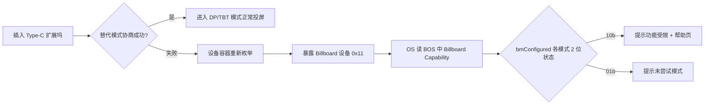
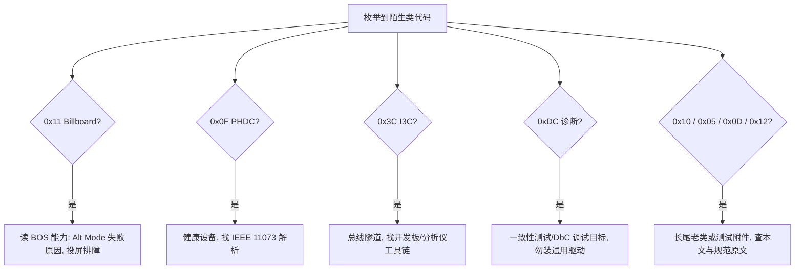

# 长尾设备类速览（AV / Billboard / Personal Healthcare / Type-C Bridge / I3C / Physical / Content Security 等）

> 🌳 知识树位置: 树干 → 枝干[设备类] → 分枝[其他设备类] → 叶[长尾类合集]
> ⬆️ 兄弟目录参考: [../HID-人机接口设备/00-HID概述与定位.md](../HID-人机接口设备/00-HID概述与定位.md)
> 规范原文缓存索引: [../../80-参考资料/README.md](../../80-参考资料/README.md)

## 1. 为什么要认识"长尾类"

USB-IF 分配了 20 多个基础类代码（Base Class Code），但日常 95% 以上的流量集中在 HID（0x03）、CDC（0x02/0x0A）、MSC（0x08）、Hub（0x09）、UVC（0x0E）、UAC（0x01）、打印机（0x07）等少数类上。剩下的"长尾"类各有分工：有的在 Type-C 时代翻身成了关键角色（Billboard），有的发布即巅峰、如今只活在枚举日志里（AV、Physical）。

对工程师的实际价值是"**知道有它、遇到能认出来**"：

- 抓包/枚举时看到陌生 bInterfaceClass，能立刻判断"这是什么、要不要装驱动、还是设备在报错"；
- 排查 Type-C 投屏失败时，知道去找 Billboard 而不是反复换线；
- 避免把厂商自定义（0xFF）与某个冷门标准类混淆（类代码速查见文末总表）。

## 2. AV 设备类 0x10（Audio/Video Devices）

| 项目 | 内容 |
|---|---|
| 类代码 | bInterfaceClass 0x10（接口级），子类 0x01=AVControl、0x02=AVData 视频、0x03=AVData 音频，协议 0x10（IP_VERSION_01_00） |
| 定位 | USB-IF 试图用一套"控制面 + 数据面分离"的类统一音视频设备（公开规范为 AV Devices 1.0，2011-12-07）。控制面 = AVControl 接口上的**命令块管道（CBP）**：一对批量 IN/OUT 承载 16 字节定长头的 Command/Response/Notify/Null 消息（32 字节粒度）；设备能力用 **AVDD（XML，avschema.xsd）** 描述——注意它**不是** 1394 的 AVC 命令集（常见误传，已按 AV 1.0 原文核实） |
| 描述符要点 | AVControl 与 AVData 为不同接口，靠 IAD 组成复合功能；详细消息模型与 AVDD 结构见 [10-AV设备类详解](10-AV设备类详解.md) |
| 驱动支持 | 主流操作系统**均无内置驱动**，需厂商驱动；Windows/Linux 生态几乎空白 |
| 何时会遇到 | 几乎不会——市场上音视频设备早已被 **UAC + UVC 组合**通吃（见 [../Audio-UAC/00-UAC概述.md](../Audio-UAC/00-UAC概述.md) 与 [../Video-UVC/00-UVC详解.md](../Video-UVC/00-UVC详解.md)）：UVC 管摄像头、UAC 管音频，简单、驱动齐、免安装。AV 类采用率极低，可视为"标准化的失败尝试"；枚举见到 0x10 基本可判定为老设备或特殊定制 |

## 3. Billboard 0x11：Type-C 拓扑告示牌

Billboard（USB Billboard Device Class，当前版本 1.2.2）是长尾类里**最重要的一个**——它是 Type-C/USB4 时代解决"插了扩展坞投屏却没反应"问题的关键机制。

### 3.1 它解决的问题

Type-C 设备容器（Device Container，如扩展坞、转接器）支持一种或多种替代模式（Alternate Mode，AUM，如 DisplayPort、Thunderbolt）。当**线缆太老、端口不支持、供电不足或 PD 协商失败**导致替代模式进不去时，设备容器会重新枚举，额外暴露一个 Billboard 设备，用标准 USB 的方式告诉主机："我其实支持哪些模式、为什么现在没进去"。语义链路：USB PD Discover Identity/Discover SVIDs/Discover Modes 的结果 → 被翻译进 Billboard 描述符 → 操作系统读取后提示用户。

### 3.2 类代码与描述符要点

| 项目 | 内容 |
|---|---|
| 类代码 | **设备级** bDeviceClass 0x11、bDeviceSubClass 0x00、bDeviceProtocol 0x00（USB-IF 规定 0x11 只能出现在设备描述符） |
| 设备形态 | 独立 Billboard 设备只有端点 0（纯控制传输），没有批量/中断端点；也可作为复合设备的一个功能与主功能共存 |
| bcdUSB | ≥ 0x0201（必须支持 BOS 描述符），高速设备还须提供 Device Qualifier |
| BOS 必备 | **Container ID**（跨枚举唯一标识设备容器）+ **Billboard Capability**（bDevCapabilityType = **0x0D**） |

Billboard Capability 描述符（挂在 BOS 下）核心字段：

| 偏移 | 字段 | 说明 |
|---|---|---|
| 3 | iAdditionalInfoURL | 厂商帮助页 URL 字符串索引 |
| 4 | bNumberOfAlternateOrUSB4Modes | 支持的模式个数 |
| 5 | bPreferredAlternateOrUSB4Mode | 首选模式索引（支持 USB4 时须为 0；0xFF=无偏好） |
| 6-7 | VCONN Power | 适配器需要的 VCONN 功率档位（2~0 位：000b=1W 至 110b=6W；bit15=不需要 VCONN 供电） |
| 8-39 | bmConfigured（32 字节位图） | **每个模式 2 位状态**：00b=未指明错误，01b=未尝试/已退出，10b=尝试了但**未成功进入**，11b=配置成功——系统软件据此决定给用户显示什么 |
| 40-41 | bcdVersion | 描述符版本（1.2.2 规范为 0x0122；0x0000=第一版设备） |
| 42 | bAdditionalFailureInfo | bit0=因供电不足失败，bit1=无 USB PD 通信 |
| 44 起 | 模式数组（每项 4 字节） | wSVID[n]（标准/厂商 ID，USB4 用 **0xFF00**）+ bAlternateOrUSB4Mode[n]（模式序号）+ iAlternateOrUSB4ModeString[n]（说明字符串） |

每个模式还可跟随一个 8 字节的 **Billboard AUM Capability 描述符**（bDevCapabilityType = **0x0F**，即 USB-IF BOS 类型表里的 "Billboard Ex capability"）：模式索引 + 该模式的 Mode VDO（Vendor Defined Object，厂商定义对象）原文。

### 3.3 主机行为与调试价值

操作系统读取 Billboard 后的表现（以 Windows 为例，按微软 USB4 系统要求文档）：发现 Billboard 设备即弹出"**设备功能可能受限**"类通知（设置页可看到每个模式的状态），macOS/Linux 亦有对应解析逻辑。因此它是**调试 Type-C 投屏失败的第一入口**：

实操：失败场景下在设备管理器/`lsusb` 里看到的"新设备"往往就是 Billboard（设备级 0x11），用 `usbdev`/`lsusb -v` 展开 BOS 即可看到"线缆/设备支持哪些 Alt Mode、哪一项失败"。不少 USB3/USB4 扩展坞主控（如 TI、Realtek、Cypress/Infineon 方案）在失败时自动切换 Billboard 形象。驱动无需用户安装——各系统内置。

## 4. Personal Healthcare 0x0F（PHDC）

| 项目 | 内容 |
|---|---|
| 类代码 | bInterfaceClass 0x0F（接口级），子类/协议 0x00 |
| 定位 | PHDC（Personal Healthcare Device Class，个人健康设备类，USB-IF 1.0，2009 年）定义健康/医疗外设与主机间的数据交换框架：血压计、体重秤、血糖仪、体温计、健身传感器等 |
| 协议模型概貌 | PHDC 本身只做**传输框架**：消息按**元数据（metadata）**标注的服务质量（QoS，如"实时性/可靠性优先"）与分帧信息打包收发；应用层语义委托给 **IEEE 11073**（xHealth：11073-20601 优化交换协议 + 10101 术语/对象编码）——设备先与主机"关联"（association），再上报 MDS（Medical Device System，医疗设备系统）对象及其度量属性 |
| 描述符要点 | 接口级 0x0F/00/00 + 类功能描述符声明能力；批量端点承载数据，中断端点用于低延迟事件提示（细节见规范原文） |
| 驱动支持 | 主流桌面系统无内置驱动，多见于专用网关/嵌入式 Linux；跨平台对应物是蓝牙的 HDP 健康设备（同样基于 IEEE 11073） |
| 何时会遇到 | 拆解老的健康外设、医疗设备固件时。现状：该生态已被 **BLE GATT 健康类 profile**（Health Thermometer、Blood Pressure 等）大幅替代——BLE 免网关、直连手机，PHDC 的"USB 健康设备"路线实际采用很少 |

## 5. USB Type-C Bridge 0x12

一句话：USB-IF 定义的 **USB Type-C Bridge Device**（类代码 0x12，接口级，子类/协议 0x00），用于把两个 USB/Type-C 端口"桥"在一起的调试/互通测试类设备（如双头桥接器、端口对端口直通测试附件），规范与产品都极少见，遇到能认出即可，细节见规范原文。

## 6. I3C 设备类 0x3C（USB I3C Device Class）

| 项目 | 内容 |
|---|---|
| 类代码 | bInterfaceClass 0x3C（接口级），子类/协议 0x00 |
| 定位 | USB-IF 与 MIPI 合作推出的较新规范：把 **I3C 总线（MIPI I3C，Improved Inter-Integrated Circuit，向下兼容 I2C）隧道化（tunneling）到 USB 上**，让主机软件像操作本地总线一样访问设备侧挂接的 I3C/I2C 外设（传感器、PMIC、触控等） |
| 描述符要点 | 接口级 0x3C/00/00；总线上挂了哪些从设备、各自的动态地址与能力，通过类专属描述符/请求上报（细节见规范原文） |
| 驱动支持 | 需厂商或开源栈支持，主流系统无通用内置驱动 |
| 何时会遇到 | **调试/原型场景**为主：开发板/评估板的 USB 桥接器（把板载 I3C 传感器暴露给 PC）、协议分析仪、传感器枢纽产测工具。消费产品里几乎不会作为"用户可见类"出现 |

## 7. Physical 0x05（Physical Interface Device）

| 项目 | 内容 |
|---|---|
| 类代码 | bInterfaceClass 0x05，物理接口设备（Physical Interface Device，PID） |
| 定位 | 上世纪末（规范 1.0，1997 年）为"有物理维度的输入"设计的类：力反馈（force feedback）设备、运动/康复训练器械、3D 跟踪器等，曾配套定义了物理效果描述机制 |
| 描述符要点 | 自带一套类专属的向量/效果描述体系（细节见规范原文，且与 HID 报告并行使用） |
| 驱动支持 | 几乎无现代系统支持；生态已消亡 |
| 何时会遇到 | 现代力反馈设备实际都走 **HID**（见 [../HID-人机接口设备/08-游戏手柄与摇杆.md](../HID-人机接口设备/08-游戏手柄与摇杆.md)）或厂商自定义；0x05 现在主要存在于教材与老规范引用中 |

## 8. Content Security 0x0D

一句话：**Content Security**（类代码 0x0D，接口级，子类/协议 0x00）为内容保护/数字版权管理（DRM，Digital Rights Management）委托场景定义的类，规范发布于 2000 年代初、采用极少。值得注意的是，实际落地的 USB 内容保护传输协议 **STEP**（Stream Transport Efficient Protocol for content protection）并不挂在 0x0D，而是 Miscellaneous 类下的 **EFh/06h/01h**——遇到内容保护相关枚举先查 0xEF。

## 9. 诊断与无线的长尾补充

### 9.1 诊断设备类 0xDC（Diagnostic Device）

诊断不是 CDC 的子类，而是**独立顶级类 0xDC**，主流形态两个：

| 子类/协议 | 名称 | 用途 |
|---|---|---|
| DCh/01h/01h | USB2 Compliance Device | USB 2.0 电气一致性测试的"标准载荷"设备形态（一致性测试仪模拟的就是它） |
| DCh/02h/01h | Debug Target | xHCI **DbC（Debug Capability）**调试目标：USB3 端口级别的调试直连（如 Intel DCI 方案、内核调试器经 USB3 直连目标机） |

另有 DCh/03h~08h 预留给在 DbC/DvC 上跑的厂商追踪（trace）协议（如 Intel Trace Hub 相关），属于硅厂调试基础设施，普通产品不出现。

### 9.2 无线控制器类 0xE0 的非蓝牙子类

0xE0 无线控制器类下除了最常见的蓝牙（E0h/01h/01h，见 [05-蓝牙控制器类-HCIoverUSB.md](05-蓝牙控制器类-HCIoverUSB.md)），还有一排"友军"：

| 子类/协议 | 名称 | 现状 |
|---|---|---|
| E0/01/02 | Ultra WideBand Radio Control（UWB 无线电控制） | 随 Certified Wireless USB 消亡 |
| E0/01/03 | RNDIS（无线承载上的 RNDIS） | 罕见组合 |
| E0/01/04 | Bluetooth AMP Controller | 蓝牙高速旁路控制器（802.11 AMP），未成气候 |
| E0/02/01~03 | Wireless USB Wire Adapter（主机/设备线适配器） | Certified Wireless USB 的"无线转 USB"适配器，已淘汰 |

### 9.3 CDC 的无线相关子类

CDC（0x02）下除 ACM/ECM/NCM 等通信子类外，还有面向无线终端的长尾子类：**无线手持控制模型 WHCM（Wireless Handset Control Model，子类 0x08）**、设备管理（0x09）、移动直接线（0x0A）等，源自功能机时代"手机当 USB 外设"的形态；细节见 CDC 1.2 规范，现代智能机上已基本绝迹（相关 CDC 主线见 [../CDC-通信设备类/00-CDC概述.md](../CDC-通信设备类/00-CDC概述.md)）。

## 10. 长尾类速查总表

| 类代码 | 名称 | 一句话用途 | 驱动现状 | 常见载体设备 |
|---|---|---|---|---|
| 0x05 | Physical Interface Device | 力反馈/运动/康复设备的物理效果描述 | 无现代驱动，已消亡 | 上古力反馈摇杆 |
| 0x0D | Content Security | DRM/内容保护委托 | 无通用驱动 | 罕见；内容保护实际多用 EFh/06h STEP |
| 0x0F | Personal Healthcare (PHDC) | 基于 IEEE 11073 的健康数据交换 | 需专用栈/网关 | 血压计、体重秤（已被 BLE 健康类大幅替代） |
| 0x10 | Audio/Video (AV) | AVControl 批量命令块管道（CBP）+ AVData 流接口，能力用 AVDD(XML) 描述 | 无主流内置驱动 | 采用率极低；音视频已由 UAC+UVC 通吃；详见 [10-AV设备类详解](10-AV设备类详解.md) |
| 0x11 | Billboard | Type-C 替代模式协商失败的"告示牌" | 各系统内置 | USB-C 扩展坞/转接器（失败时枚举出） |
| 0x12 | USB Type-C Bridge | 双端口桥接的调试/互通测试附件 | 无通用驱动 | 罕见测试附件 |
| 0x13 | Bulk Display Protocol | VESA 的 USB 批量显示协议 | 需厂商驱动 | 少量便携屏/扩展方案 |
| 0x14 | MCTP over USB | DTMF MCTP 管理组件消息端点 | BMC/服务器管理栈 | 服务器管理（BMC）通道 |
| 0x3C | USB I3C Device Class | I3C/I2C 总线隧道化给主机访问 | 需厂商/开源栈 | 开发板桥接器、协议分析仪 |
| 0xDC | Diagnostic Device | USB2 一致性测试载荷；xHCI DbC 调试目标 | 测试仪/调试栈 | 一致性测试仪、DCI/DbC 调试链路 |
| 0xE0 | Wireless Controller | 无线电控制器（蓝牙只是其中之一） | 蓝牙内置；其余淘汰 | 蓝牙控制器、（历史）Wireless USB 适配器 |

## 相关节点

- 上级索引：[../00-设备类索引.md](../00-设备类索引.md)
- Billboard 的上下文（Type-C/Alt Mode/PD）：[../../30-枝干-接口与供电/02-USBType-C详解.md](../../30-枝干-接口与供电/02-USBType-C详解.md) 与 [../../30-枝干-接口与供电/05-AlternateMode与E-marker.md](../../30-枝干-接口与供电/05-AlternateMode与E-marker.md)
- 音视频的正统路线：[../Audio-UAC/00-UAC概述.md](../Audio-UAC/00-UAC概述.md)、[../Video-UVC/00-UVC详解.md](../Video-UVC/00-UVC详解.md)
- 0xE0 的蓝牙主角：[05-蓝牙控制器类-HCIoverUSB.md](05-蓝牙控制器类-HCIoverUSB.md)
- 自定义接口的兜底方案：[06-WebUSB与厂商自定义类.md](06-WebUSB与厂商自定义类.md)
- 冷门标准类之外的测试测量主力：[08-USBTMC测试测量类.md](08-USBTMC测试测量类.md)
