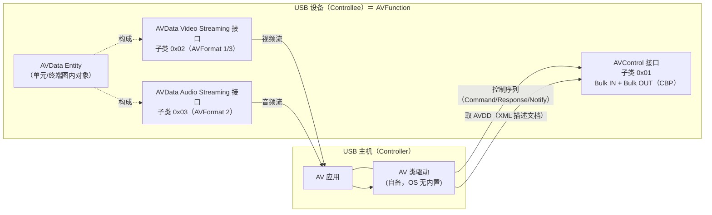
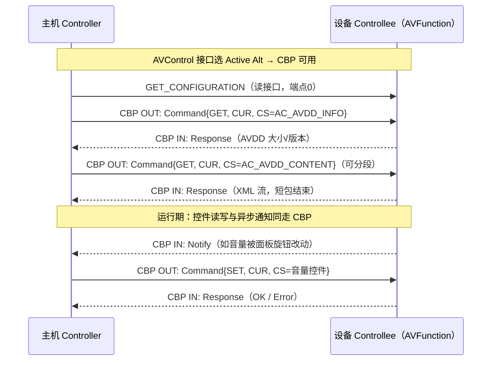

# AV 设备类详解（Audio/Video Devices，bInterfaceClass 0x10）

> 🌳 知识树位置: 树干 → 枝干[设备类协议] → 分枝[其他设备类] → 叶[10-AV设备类详解]
> 本文是 [09-长尾设备类速览](09-长尾设备类-AV-Billboard-Healthcare-I3C.md) 中"AV 设备类"一节的完整展开。
> 规范原文缓存: [../../80-参考资料/device-classes/AV-1.0.zip](../../80-参考资料/device-classes/AV-1.0.zip)（含 AVFunction 1.0 + AVFormat 1/2/3，usb.org 公开版）、[../../80-参考资料/device-classes/AV-BDP-1.0.pdf](../../80-参考资料/device-classes/AV-BDP-1.0.pdf)（Basic Device Profile 1.0）；提取文本 AV-1.0-AVFunction.txt / AV-BDP-1.0.txt 同目录。缓存索引: [../../80-参考资料/README.md](../../80-参考资料/README.md)
> 描述符/传输基础: [../../10-树干-USB核心/07-描述符详解.md](../../10-树干-USB核心/07-描述符详解.md)、[../../10-树干-USB核心/06-四种传输类型.md](../../10-树干-USB核心/06-四种传输类型.md)

## 1. 版本与定位：一个"生不逢时"的类

| 项目 | 内容（来源：缓存规范封面与正文） |
|---|---|
| 正式名称 | Universal Serial Bus Device Class Definition for Audio/Video Devices |
| 公开版本 | **Release 1.0，2011-12-07**（usb.org 文档库当前公开下载的即此版；常被引用的 "1.01" 修订未在公开库出现——见规范原文未缓存部分，建议补） |
| 出身 | 扉页注明"Developed pursuant to USB-IF IP agreement for **Video Display** and subsequently renamed"——由 Video Display 工作组规范改名而来；编辑 Geert Knapen（MCCI），参与者含 DisplayLink、Intel、AMD、Dolby、Broadcom、Cypress 等 |
| 配套文档 | AVFunction 1.0（主体）+ AVFormat 1（Video over Bulk）/ AVFormat 2（Isochronous Audio）/ AVFormat 3（Isochronous Video）+ Video & USB Timings（xlsx）+ BDP 1.0（2012-06-12） |
| 类代码 | **0x10**（接口级；USB-IF Defined Class Codes 列为 "Audio/Video"，用法注明 Video Devices） |
| 命运 | 无主流 OS 内置驱动、无消费级采用，音视频外设市场被 UAC + UVC 组合通吃（见第 8 节对比），可视为"标准化的失败尝试" |

**一个需要纠正的常见误解**：包括本文上游 [09 篇](09-长尾设备类-AV-Billboard-Healthcare-I3C.md)在内的不少资料把 0x10 描述为"承载 IEEE 1394 的 AVC（AV/C）命令集"。但**公开的 1.0 版规范全文没有任何 AVC 命令集内容**（全文检索无 "AVC" 字样）——它是一套自研的控制模型：批量端点承载 Command/Response/Notify 消息 + XML 描述文档（下文详述）。若早期草案曾借用过 AV/C，那也只存在于未公开的历史版本中（见规范原文未缓存，建议补早期草案对照）。

## 2. 架构总览：AVFunction = 控制面 + 数据面

规范的核心抽象是 **AVFunction**（音视频功能）：**必须且只需暴露 1 个 AVControl 接口**（合规底线），可选挂 0~n 个 AVData 流接口。多个接口用 **IAD（接口关联描述符）** 绑成一个功能，IAD 的 Function Class 码 = AV 接口类码 0x10，Function Subclass/Protocol 均为 0x00（AVFunction 1.0 §7.1.1）。

角色模型：USB 主机一侧叫 **Controller**（控制者），设备一侧叫 **Controllee**（被控者）；流动的媒体数据叫 **AVStream**。

## 3. 类码/子类/协议编码表（核实自规范附录 A）

| 字段 | 编码 | 名称 | 出处 |
|---|---|---|---|
| bInterfaceClass | 0x10 | AV（"assigned by USB"） | 附录 A.4 Table A-4 |
| bInterfaceSubClass | 0x00 | INTERFACE_SUBCLASS_UNDEFINED | 附录 A.5 Table A-5 |
| bInterfaceSubClass | **0x01** | **AVCONTROL**（控制接口） | 同上 |
| bInterfaceSubClass | **0x02** | **AVDATA_VIDEO_STREAMING** | 同上 |
| bInterfaceSubClass | **0x03** | **AVDATA_AUDIO_STREAMING** | 同上 |
| bInterfaceProtocol | 0x00 | INTERFACE_PROTOCOL_UNDEFINED | 附录 A.6 Table A-6 |
| bInterfaceProtocol | **0x10** | **IP_VERSION_01_00**（规范版本 1.0） | 同上 |
| IAD bFunctionClass | 0x10 | AV_FUNCTION（=AV 接口类码） | 附录 A.1 Table A-1 |
| IAD bFunctionSubClass / Protocol | 0x00 | 未用，填 UNDEFINED | 附录 A.2/A.3 |

> 规范自身的"褶皱"：BDP 1.0 附录的示例描述符里，AVControl 接口（Alt 0/1）却填了 SubClass 0x00、Protocol 0x00（AV-BDP-1.0.pdf §4.2.1.3.2）——与 AVFunction 附录编码不自洽。工程上以附录 A 的编码表为准，抓包遇到 0x10/0x00/0x00 也别急着否定是 AV 类。

## 4. AVControl 接口与 Control Bulk Pair（CBP）

与 UAC/UVC"类请求走端点 0 + 中断端点上报"的套路不同，AV 类的**所有类专属控制交互都走一对批量端点**（AVFunction 1.0 §7.2）：

- 端点 0（默认管道）：只处理标准请求（Set Interface 等 USB 通用事务）；
- **CBP（Control Bulk Pair）**：1 个 Bulk OUT + 1 个 Bulk IN，存在于 AVControl 接口的每个 Active Alternate Setting；Command/Response/Notify 消息、以及 AVDD 描述文档的取回，全部走这对管道。

Alternate Setting 语义（§7.2）：**Alt 0 = 整个 AVFunction 关闭态**（所有 AVData 接口同步回 Alt 0，可进低功耗）；至少还需一个 Active Alt 1。选择 Active Alt 时功能复位重启。

### 4.1 四种消息与传输规则

| 消息 | 方向 | 用途 |
|---|---|---|
| Command | Controller → Controllee | 执行一次 SETR/SET/GET 请求（§9.3.1） |
| Response | Controllee → Controller | 对 Command 的应答（成功结果或 Error Response，§9.3.2） |
| Notify | Controllee → Controller | 设备主动通知（如控制值变化），承载 NOTIF 请求码（§9.3.3） |
| Null | 双向 | 无内容的填充消息，用于凑齐短包结束传输（§9.3.4） |

传输规则（§7.3）：消息按 **32 字节粒度（AV_MESSAGE_GRANULARITY）** 对齐拼接，可多条消息合并进一次批量传输；每次传输必须以短包收尾——若恰好填满 wMaxPacketSize，则补一条 Null 消息制造短包。高速下无额外流控；SuperSpeed 下用标准 NRDY-ERDY（§7.3.1）。

### 4.2 消息头与寻址字段（16 字节定长头，AV_MESSAGE_INVAR_SIZE）

| 字段 | 含义 |
|---|---|
| EID | EntityID：目标实体（终端/单元/AVData 实体）编号，未知 EID → Error Response |
| TYPE | 请求类型：SETR=0b0001、SET=0b0010、GET=0b0011、NOTIF=0b0100（附录 A.9） |
| PROP | 属性码：CUR=0b0001（当前值）、NEXT=0b0010（链表遍历下一项）（附录 A.10） |
| V | 0=类专属消息，1=厂商自定义消息（§9.3.6） |
| CS | Control Selector：控件类型（附录 A.11，随实体类型而异） |
| IPN / ICN / OCN | 输入引脚号 / 输入通道号 / 输出通道号（Master 通道为 0），无关字段清零 |
| DATALEN | 变长参数块长度；总长 = 16 + DATALEN，再按 32 字节粒度补齐（§9.3） |

## 5. AVDD（XML 描述文档）与 Legacy View 描述符

AV 类的"自描述"有两条并行路径（§8）：

1. **AVDD（AV Description Document）**：一个 XML 文档，完整描述 AVFunction 的所有类专属能力；模式定义公开在 `avschemas.usb.org/v1/avschema.xsd`（规范引用 [AVSCHEMA]）。主机经 CBP 用 AVControl 接口控件 **AC_AVDD_INFO（0x0001）** 询问大小/版本、**AC_AVDD_CONTENT（0x0002）** 分段取回；**AC_COMMIT（0x0003）** 提交配置。另有 AC_POWER_LINE_FREQ（0x0004）、AC_REMOTE_ONLY（0x0005）。
2. **Legacy View 描述符**：把同样的信息塞回传统配置描述符层级（为不解析 XML 的老式主机准备），类专属描述符类型码（附录 A.13.1 Table A-18）：

| 类型码 | 名称 | 作用（正文 §8.4） |
|---|---|---|
| 0x21 | AVCONTROL_IF | AVControl 接口描述符，4 字节，仅 bcdAVFunction（规范版本 BCD） |
| 0x22 | TERMINAL | 终端描述符，10 字节：wTerminalType（INPUT 0x0001/OUTPUT 0x0002）、wEntityID、wAssocEntityID、wSourceID |
| 0x23 | UNIT | 单元描述符，10 字节：wUnitType、wEntityID、wSourceID1/2（Legacy View 最多暴露 2 个输入引脚） |
| 0x24 | AVDATA | AVData 实体描述符 |
| 0x25 | AVCONTROL | 控件描述符：wControlSelector + wRWN（CUR 权限 R/RW/W + NEXT 实现位） |
| 0x26 | RANGES | 取值范围（RANGE 区间 / VALUELIST 枚举两种） |
| 0x27 / 0x28 / 0x29 | VIDEOBULK / VIDEOISO / AUDIOISO | 三种流接口的载荷描述（对应 AVFormat 1/3/2） |

## 6. 单元/终端模型：与 UAC 的异同

AV 类的拓扑语义明显"师承" UAC1 的 Unit/Terminal 模型（同一批编辑者），但重新洗了牌：

| 对比项 | UAC 1.0（Audio 类） | AV 类 1.0 |
|---|---|---|
| 顶层抽象 | Audio Function → 控制接口 + 流接口 | AVFunction → AVControl 接口 + AVData 接口 |
| 实体类型 | Terminal（In/Out）+ Unit：Mixer/Selector/Feature/Effect/Processing/Extension | Terminal（INPUT 0x0001/OUTPUT 0x0002）+ Unit：Mixer(1)/Selector(2)/Feature(3)/**Effect(4)/Processing(5)/Converter(6)/Router(7)**（附录 A.13.3；把 UAC 的 Extension 换成了 Converter/Router，Router 负责视频/音轨/元数据轨选择——RU_VIDEOTRACK_SELECTOR 等，附录 A.11.10） |
| 控制寻址 | 实体 ID + 控制通道 + 接口号 | EID + IPN/ICN/OCN + CS，再加 CUR/NEXT 属性 |
| 描述 | 静态类描述符（u16 字段） | XML（AVDD）为第一等公民，Legacy View 为兼容层 |
| 控制通道 | 控制端点 0（类请求）+ 中断 IN | **批量端点对 CBP**（无中断通道） |
| 时钟/同步 | Clock Source/Entity（UAC2 起独立实体） | AVData 控件 AD_REFERENCE_CLOCK / AD_CLOCK_CONNECTOR / AD_CLOCK_VALID（附录 A.11.11） |
| 视频语义 | 无 | 全面覆盖：AD_EDID、AD_CEC_READ/WRITE（HDMI CEC 隧道）、AD_CONNECTOR、AD_TUNNEL、AD_STREAM_SELECTOR 等 |

音频终端类型概念也与 UAC 互通（附录 B 的 Audio Types：MICROPHONE/SPEAKER/HEADPHONES/HANDSET/HEADSET/SPEAKERPHONE…，MIC_ARRAY、EC_SPEAKERPHONE 等回声消除形态一应俱全）。

### 6.1 控件选择子速查（附录 A.11 核实值节选）

控件（AVControl）挂在"实体+输入引脚+通道"上，选择子按实体类型分族：

| 实体族 | 选择子（值） | 语义 |
|---|---|---|
| AVControl 接口 | AC_AVDD_INFO(0x0001)、AC_AVDD_CONTENT(0x0002)、AC_COMMIT(0x0003)、AC_POWER_LINE_FREQ(0x0004)、AC_REMOTE_ONLY(0x0005) | XML 文档取回/提交、电源频纹抑制、"仅遥控"开关 |
| Terminal | TE_CONTROL_UNDEFINED(0x0000)、TE_CLUSTER(0x0001) | 端子簇（多端子编组） |
| Router 单元 | RU_VIDEOTRACK/AUDIOTRACK/METADATATRACK_SELECTOR(0x0001~3)、RU_VIDEO/AUDIO/METADATA_INPUT_PIN_SELECTOR(0x0004~6)、RU_CLUSTER(0x0007) | 节目轨/输入源路由——机顶盒类设备的"换台换源" |
| AVData 实体 | AD_CONNECTOR(0x0001)、AD_OVERLOAD(0x0002)、AD_ACT_ALT_SETTING(0x0003)、AD_TUNNEL(0x0004)、AD_AUDIO_LANGUAGE(0x0005)、AD_CEC_WRITE/WRITE_STATUS/READ(0x0006~8)、AD_SOURCEDATA/SINKDATA(0x0009/A)、AD_STREAM_SELECTOR(0x000B)、AD_EDID(0x000C)、AD_REFERENCE_CLOCK/CLOCK_CONNECTOR/CLOCK_VALID(0x000D~F)、AD_PITCH(0x0010) | 连接器管理、HDMI-CEC 隧道、EDID 读写、参考时钟、变速（pitch） |

Mixer/Selector/Feature/Converter 单元各有专属选择子（MU_*/SU_*/FU_*/CU_*，如 CU_AUDIO_MODE_SELECTOR=0x0004），完整表见规范附录 A.11——本表只收全值核实过的族。

## 7. AVData 实体与三种 AVFormat

**AVData Entity** 是流的功能语义标签（附录 B 摘录）：

| 类别 | 标识符举例 |
|---|---|
| 视频 | GENERIC、CAMERA、WEBCAM、PC_MONITOR、TV_MONITOR、IN_CAR_DISPLAY、COMPOSITE/S_VIDEO/COMPONENT、DP、DVI、VGA、HDMI-IN、TV_TUNER、SAT/CABLE/DSS_TUNER、RECORDER、DVD、BLURAY |
| 音频 | GENERIC、MICROPHONE、DESKTOP_MIC、PERSONAL_MIC、OMNIDIRECTIONAL_MIC、MIC_ARRAY、SPEAKER、DESKTOP/PERSONAL/ROOM_SPEAKER、LFE_SPEAKER、HEADPHONES、HANDSET、HEADSET、SPEAKERPHONE |

三种载荷格式（各自独立成册）：

| 文档 | 传输 | 内容要点 |
|---|---|---|
| AVFormat 1：Video over Bulk | 批量 OUT/IN | 未压缩 VideoSample（RGB565/RGB888/RGB8888/IYU2/YUY2 等，§3.3）+ 压缩 NAL 单元载荷（§3.8.3）；无带宽保证，靠 USB 3.0 吞吐 |
| AVFormat 2：Isochronous Audio | 等时 | 音频样本流 |
| AVFormat 3：Isochronous Video | 等时 | **仅未压缩**视频样本（§"exclusively addresses VideoStreams … uncompressed VideoSamples"），引用 HDMI 与 CEA 时序（720x480p 等逐行格式表） |

**典型拓扑场景**：一台带 USB Device 口的电视/显示器/机顶盒类设备，向主机（Controller）暴露：Input Terminal（HDMI-IN，AD_EDID 控件让主机改写 EDID）→ Router（选 HDMI/调谐器/文件播放源）→ Converter/Feature（缩放、亮度）→ AVData HDMI-Out/Video Streaming-Out 实体 → 等时/批量流接口把像素流送进主机；音频并行走 Audio Streaming 实体。**BDP（Basic Device Profile 1.0，2012-06-12）** 就是给这类设备定的最小档：适用对象明确列举为"能经 USB 或 HDMI 等外部接口交换音视频内容的设备，典型如 PC 显示器、带 USB Device 能力的电视机、带麦克风的一体化摄像头、带 USB Device 能力的手机"，并规定 Mixer 单元、AVData Generic-Out/HDMI-Out 实体等必备对象（BDP §1.1、§3.2）。

## 8. 与"UAC + UVC 组合"对比：为什么 AV 类输了

| 维度 | AV 类 0x10 | UAC（0x01）+ UVC（0x0E）组合 |
|---|---|---|
| 发布时间 | 2011（BDP 2012）——USB 3.0 时代才来 | UAC 1998 / UVC 2003——早了近十年，生态已成 |
| OS 内置驱动 | 无（见第 9 节） | Windows/macOS/Linux 全内置，即插即用 |
| 复杂度 | AVDD XML + CBP 消息 + 双册规范 + BDP，实现门槛高 | 各自独立、结构扁平，固件实现成熟 |
| 音视频统一拓扑 | 强项：跨音视频的路由/缩放/CEC/EDID 统一建模 | 短板：音频视频两套模型，靠应用层缝合 |
| 视频传输 | AVFormat 1 批量（无 QoS）/ AVFormat 3 **仅未压缩**等时，带宽压力巨大 | UVC 等时+批量并重，H.264 等压缩格式从 1.1 起原生支持 |
| 带宽定位 | 未压缩 1080p 逼着用户上 USB 3.0 | 压缩流 USB 2.0 即可 |
| 结局 | 无消费产品采用，仅活在规范与论文里 | 摄像头/声卡事实标准 |

一句话：AV 类想一步到位做"USB 上的 HDMI"（含路由、CEC、EDID、显示拓扑），赌注压在未压缩流与 XML 自描述上；市场却用"UVC 摄像头 + UAC 声卡"这个更土但更简单的组合投了票。它留下的唯一"遗产"是枚举表里的 0x10。

## 9. 驱动与调试现状

| 系统 | 现状（核实来源） |
|---|---|
| Windows | 微软官方"Windows 内置 USB 类驱动"表（learn.microsoft.com，USB device classes）中 **Audio/Video Devices (10h) 一行完全空白**——连"推荐 WinUSB"的待遇都没有（对比 0x05/0x0F/0xDC 等类均有 WinUSB 推荐）。要驱动它只能自写驱动，或手工给接口绑 Winusb.sys 再按规范实现 CBP 消息机 |
| Linux | 内核无 AV 类驱动（drivers/usb/class 无对应条目）；libusb 用户态可枚举与绑定 |
| macOS | 无内置驱动（公开系统信息，未缓存，建议补版本对照） |

调试提示：

- `lsusb -v` / Usbview 认接口：IAD 类 0x10 + 接口 0x10/0x01（或 0x00/0x00，见第 3 节"B褶皱"）即 AVFunction；
- 类描述符里 0x21~0x29 类型码是强特征（与 CDC/HID 的同名类型码值域不同，别按通用表硬解）；
- CBP 上的 Command/Response 可直接当批量流抓包分析，消息头 16 字节定长，TYPE/PROP 位段见第 4.2 节；
- 若目标只是"识别"，读到 bInterfaceClass=0x10 即可下结论：老设备或特殊定制，正牌音视频走 UAC/UVC。

## 相关节点

- 上游速览：[09-长尾设备类-AV-Billboard-Healthcare-I3C.md](09-长尾设备类-AV-Billboard-Healthcare-I3C.md)（本篇展开其 AV 节）
- 音视频正统路线：[../Audio-UAC/00-UAC概述.md](../Audio-UAC/00-UAC概述.md)、[../Audio-UAC/03-UAC规范级-实体与请求全表.md](../Audio-UAC/03-UAC规范级-实体与请求全表.md)（Unit/Terminal 模型的活着的版本）、[../Video-UVC/00-UVC详解.md](../Video-UVC/00-UVC详解.md)
- 描述符与传输基础：[../../10-树干-USB核心/07-描述符详解.md](../../10-树干-USB核心/07-描述符详解.md)、[../../10-树干-USB核心/06-四种传输类型.md](../../10-树干-USB核心/06-四种传输类型.md)
- 同目录：[11-PHDC健康医疗类.md](11-PHDC健康医疗类.md)、[05-蓝牙控制器类-HCIoverUSB.md](05-蓝牙控制器类-HCIoverUSB.md)
- 缓存索引：[../../80-参考资料/README.md](../../80-参考资料/README.md)
