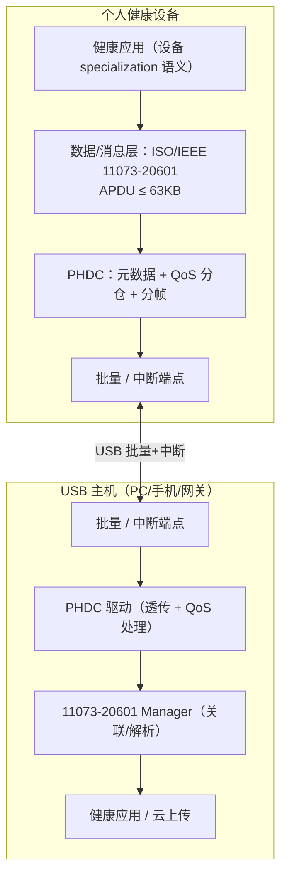
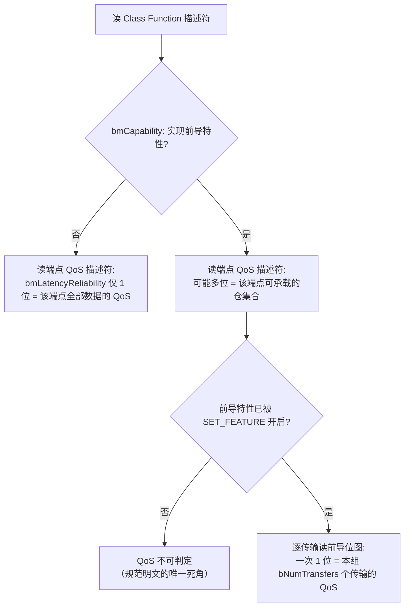
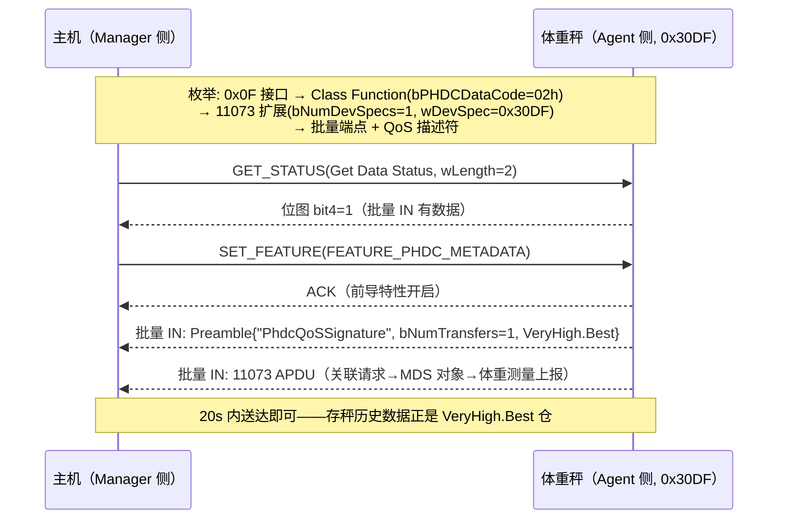

# PHDC 健康医疗类详解（Personal Healthcare Device Class，bInterfaceClass 0x0F）

> 🌳 知识树位置: 树干 → 枝干[设备类协议] → 分枝[其他设备类] → 叶[11-PHDC健康医疗类]
> 本文是 [09-长尾设备类速览](09-长尾设备类-AV-Billboard-Healthcare-I3C.md) 中"Personal Healthcare"一节的完整展开。
> 规范原文缓存: [../../80-参考资料/device-classes/PHDC-1.0.zip](../../80-参考资料/device-classes/PHDC-1.0.zip)（PHDC 1.0 + 2008-02-15 Errata，usb.org 公开版）；提取文本 PHDC-1.0.txt / PHDC-1.0-errata.txt 同目录。缓存索引: [../../80-参考资料/README.md](../../80-参考资料/README.md)
> 传输基础: [../../10-树干-USB核心/06-四种传输类型.md](../../10-树干-USB核心/06-四种传输类型.md)、[../../10-树干-USB核心/08-枚举流程与标准请求.md](../../10-树干-USB核心/08-枚举流程与标准请求.md)

## 1. 定位与版本：给健康外设一根"标准 USB 线"

| 项目 | 内容（来源：缓存规范封面/正文，另注者除外） |
|---|---|
| 正式名称 | USB Device Class Definition for Personal Healthcare Devices |
| 版本 | **Release 1.0，2007-11-08**；Errata 2008-02-15（修正 Get Data Status 的 wLength=2、FEATURE_PHDC_METADATA 命名） |
| 类代码 | **0x0F**——`bInterfaceClass` 或 `bDeviceClass` **二选一必须**填 0x0F；子类/协议均为 0x00（不分子类）（规范 §5.1.1/§5.1.3） |
| 目标设备 | 血压计、血糖仪、体重秤、体温计、脉搏血氧仪、心率带、健身手表、动感单车、运动/跌倒传感器、药盒（pill monitor）等 |
| 核心思想 | PHDC 只做**传输框架**（透明搬运"消息帧 + 元数据"），医疗语义全部委托给 **ISO/IEEE 11073** 家族（20601 优化交换协议 + 10101 术语编码）——"有线 USB 版的 Continua 健康网关" |

规范 §2.1 把用例归入三大主题：

| 主题 | 场景举例 |
|---|---|
| Health & Wellness（健康健身） | 运动手表/心率带/健身车数据传 PC，转教练或社区 |
| Disease Management（慢病管理） | 血压计/血糖仪/体重秤/血氧仪 → PC 或健康终端 → 上传医疗机构 |
| Aging Independently（独立养老） | 运动传感器、药盒等日常生活监测 → 上传护理方/家人 |

数据到达主机的三种形态（§3.1）：**发作式**（踩一次体重秤传一次，甚至传完即断开）、**存储转发**（运动手表回家插 PC 批量上传）、**连续流**（血氧仪夹着手指持续监测）。

## 2. 架构：分层与"不解释数据"

PHDC 刻意保持在传输层，对载荷**完全透明**：应用层把消息打成 **APDU（应用协议数据单元，≤ 63KB）** 交给 PHDC，附带元数据（QoS 等）；PHDC 负责选端点、排队、分帧（§4.1/§4.2）。安全性依赖有线的物理安全，规范不定义加密。



一台设备有**多个健康功能**（如血压+心率）时的两种组织方式（§5.1.3，必须二选一）：① **多接口**——每个功能一个 0x0F 接口，各自带端点；② **组合设备**——单接口承载多功能，由数据/消息层在同一信道内区分（11073 场景即靠 specialization 编码列表声明）。

## 3. QoS 六仓：PHDC 的灵魂

规范分析用例后归纳出六种"延迟×可靠性"组合（QoS Bins，§3.2/§4.2 Table 4），并映射到 USB 端点类型——这是整个类唯一"聪明"的地方：

| QoS Bin | 延迟上限 | 可靠性 | 典型载荷 | 端点映射 |
|---|---|---|---|---|
| Low.Good | < 20 ms | Good | 连续生理流（心电/血氧原始波形） | **中断端点**（仅允许此仓） |
| Medium.Good | < 200 ms | Good | 设备状态/告警 | 批量 |
| Medium.Better | < 200 ms | Better | | 批量 |
| Medium.Best | < 200 ms | Best | | 批量 |
| High.Best | < 2 s | Best | 配置/查询 | 批量 |
| VeryHigh.Best | < 20 s | Best | 存储转发的大块历史数据 | 批量 |

原始数据率范围约 50 bit/s ~ 1.2 Mbit/s、模拟采样周期 1~50 ms（Table 4）——所以 USB 批量/中断完全够用，不需要等时传输。

## 4. 描述符链（核实自规范 §5.2、§8 Table 15~17）

类专属描述符类型码：**CLASSFUNCTION=0x20、QOS=0x21、METADATA=0x22**。

| 描述符 | 位置 | 关键字段 |
|---|---|---|
| PHDC Class Function（0x20） | 跟在其所属接口描述符后 | `bPHDCDataCode`：**0x01=PHDC_VENDOR**（厂商自定义格式）、**0x02=PHDC_11073_20601**（ISO/IEEE 11073-20601 优化交换协议）；`bmCapability` bit0 = 是否实现 Meta-Data Message Preamble 特性 |
| Function Extension（0x20 系） | Class Function 之后、端点之前 | 按数据/消息标准分别定义；11073 场景即下述 11073 PHD Function Extension |
| PHDC QoS（0x21） | **每个端点描述符之后各跟一个** | `bQoSEncodingVersion`=01h；`bmLatencyReliability` 位图 bit0~bit5 对应上表六仓：批量端点可按支持的组合置多位置 1，**中断端点只能置 bit0**（规范 §5.2.3 + Table 9） |
| PHDC Meta-Data（0x22） | 可选，跟在 QoS 描述符后 | 枚举期一次性下发"静态元数据"，内容由厂商定义（规范不规定格式） |
| 11073 PHD Function Extension | 实现 11073 扩展的设备必备 | `bNumDevSpecs` + `wDevSpecializations[]`（**小端 16 位**设备 specialization 码，取自 ISO/IEEE 11073-10101 术语 MDC_PART_INFRA 的设备 specialization 段；不支持任何 specialization 则填 0）——主机据此识别"这是血压计还是体重秤" |

**11073 设备 specialization 编码概貌**（取值见于 Continua/11073-10101 公开资料；规范正文只给出取码规则，数值本身以 11073-10101/20601 命名法附录为最终依据——见规范）：

| 设备 | 码（16 位） |
|---|---|
| 血压计（BP meter） | 0x3060 |
| 体温计（thermometer） | 0x30A4 |
| 体重秤（weighing scale） | 0x30DF |

血糖仪、脉搏血氧仪、心率传感器等同样有对应 specialization 码（数值未逐一核实，见规范 11073-10101），描述符支持一接口声明多个（bNumDevSpecs > 1）。

### 4.1 配置描述符骨架（11073 体重秤单接口为例）

```text
设备描述符        bDeviceClass=0x0F（或留 00，改在接口级声明）
└─ 配置描述符
   └─ 接口描述符  bInterfaceClass=0x0F, SubClass=0x00, Protocol=0x00
      ├─ PHDC Class Function 描述符 (0x20)
      │    bPHDCDataCode=02h (PHDC_11073_20601)
      │    bmCapability.bit0=1  → 支持元数据前导
      ├─ 11073 PHD Function Extension 描述符
      │    bNumDevSpecs=1, wDevSpecializations=0x30DF (体重秤)
      ├─ 批量 IN 端点描述符
      │  └─ PHDC QoS 描述符 (0x21)   bmLatencyReliability=bit4(High.Best)…
      │     └─ （可选）PHDC Meta-Data 描述符 (0x22)
      ├─ 批量 OUT 端点描述符
      │  └─ PHDC QoS 描述符 (0x21)
      └─ （可选）中断 IN 端点描述符
         └─ PHDC QoS 描述符 (0x21)  仅 bit0 (Low.Good)
```

### 4.2 主机如何确定一条流的真实 QoS（规范 Figure 10 的文字化）



## 5. 消息模型：元数据前导 + 两个类请求

### 5.1 Meta-Data Message Preamble（元数据消息前导）

把"每个 USB 传输的 QoS 语义"内嵌进数据流的机制（§5.2.4/§6）。特性初始**关闭**，由主机用类请求开启；开启后，**每个新的传输组之前必须先发一个前导包**：

| 偏移 | 字段 | 内容 |
|---|---|---|
| 0 | aSignature（16B） | 常量字符串 **"PhdcQoSSignature"**（防伪验签） |
| 16 | bNumTransfers | 本前导之后跟随的数据传输个数（回放历史数据时可填大值提效；不得为 0） |
| 17 | bQoSEncodingVersion | 01h |
| 18 | bmLatencyReliability | 六仓位图，**一次只允许置 1 位** |
| 19 | bOpaqueDataSize + bOpaqueData | 0~（MaxPacket−21）字节的不透明元数据 |

错误处理（§6.3）：期望前导而未收到、或位图非法 → 设备 STALL 端点 / 主机 SET_FEATURE ENDPOINT_HALT，随后主机 CLEAR_FEATURE，双方重新同步前导。

### 5.2 类专属请求（§7）

| 请求 | 编码 | 作用 |
|---|---|---|
| SET_FEATURE / CLEAR_FEATURE（扩展） | feature 值 **FEATURE_PHDC_METADATA = 0x01**（Errata 更名，原误作 FEATURE_PHDC_QOS） | 开/关前导特性；wIndex=目标接口。发起前应先确认设备无挂起传输 |
| GET_STATUS（扩展为 Get Data Status） | bRequest=0x00，bmRequestType=10100001B（接口收方），wLength=2 | 返回 16 位**端点数据位图**：bit n=1 表示端点 n 有数据待收（EP0 不跟踪）——主机可据此"免轮询"地知道该读谁（Errata 明确 wLength 非 2 行为未定义） |



## 6. 与 IEEE 11073-20601 的分工，及 BLE 健康服务的替代关系

11073-20601 定义设备与主机（**Agent/Manager**）间的"关联建立 → MDS（Medical Device System）对象上报 → 测量事件"语义，本身体积优化过（专为低功耗网关设计）；PHDC 把它的 APDU 原样搬过 USB。同一套 11073 语义也被蓝牙 **HDP**（经典蓝牙 Health Device Profile）承载——三者是"同一数据、三种管道"。

而消费市场最终选择的却是第四条路：**BLE GATT 健康服务**——把 11073-20601 的数据模型（浮点/SFLOAT 格式沿用）拆进各个 GATT Service，手机直连免网关。替代关系一览：

| 健康设备 | USB PHDC 路线 | BLE GATT 路线（现行主流） |
|---|---|---|
| 体温计 | 0x0F + 11073（specialization 0x30A4） | **Health Thermometer Service**（0x1809，Temperature Measurement 特征） |
| 血压计 | 0x0F + 11073（0x3060） | **Blood Pressure Service**（0x1810，含 Feature/Measurement） |
| 体重秤 | 0x0F + 11073（0x30DF） | **Weight Scale Service**（0x181D） |
| 血氧仪 | 0x0F + 11073 | **Pulse Oximeter Service（PLX，0x1822）** |
| 心率带 | 0x0F + 11073 | **Heart Rate Service**（0x180D） |
| 血糖仪 | 0x0F + 11073 | Glucose Service（0x1808）+ Record Access |

BLE 路线胜出的原因与 USB 拓扑无关而与生态有关：免网关直连手机、功耗低、iOS/Android 原生支持（服务细节见 [../../50-枝干-无线关联/BLE-低功耗蓝牙/04-ATT与GATT.md](../../50-枝干-无线关联/BLE-低功耗蓝牙/04-ATT与GATT.md)）。PHDC 的"USB 健康外设"路线实际采用很少，多见于：医疗级设备经网关/底座上传、把测量数据导入 PC 的专用仪器、嵌入式教学/研究项目。

### 6.1 一台 PHDC 设备上电后发生了什么（11073 视角速览）

以血压计插入 PC 为例，USB 层之下还有一层 11073-20601 的"业务建立"（语义细节见规范/11073-20601，此处给工程概貌）：

1. 主机读描述符确认 0x0F + PHDC_11073_20601 + specialization 0x3060 → 加载/唤起对应"血压计 Manager"；
2. Agent（血压计）发出**关联请求**（Association Request，含本机配置列表）；Manager 校验后回**关联响应**（接受/拒绝/转研发送）；
3. Manager 读 Agent 的 **MDS 对象**属性（系统类型、电源状态、时钟、配置对象）；
4. 测量发生时，Agent 以事件报告（含时间戳、SFLOAT/INT 编码的收缩压/舒张压/脉率）上送，经 PHDC 批量端点出线；
5. 断开时走**解除关联**；若前导特性开启，PHDC 层还要按 QoS 仓打包上述 APDU。

这五步在 BLE 健康服务里被拆成 GATT 连接 + 特征值通知，语义同源——所以两者间做网关（如"血压计 USB → 手机 BLE"桥）时协议转换几乎无损，这正是当年 Continua 的设计意图。

## 7. OS 驱动与生态现状（如实描述"小众"）

| 环节 | 现状（来源标注） |
|---|---|
| Windows | **无专属类驱动**；微软官方内置驱动表对 Personal Healthcare (0Fh) 的建议是通用 **WinUSB（Winusb.sys）**。UWP 提供 `Windows.Devices.Usb.UsbDeviceClasses.PersonalHealthcare` 类，应用可直接经 WinUSB 与 0x0F 设备通信（learn.microsoft.com）。历史坑：Win 8.1/Server 2012 R2 曾因 0x0F 与 SuperSpeed 端点伴随描述符冲突导致无法枚举（微软 KB 修复） |
| Linux | **主线上无 PHDC 类驱动**（drivers/usb/class 无条目）；libusb 用户态访问是常态 |
| 设备侧协议栈 | 嵌入式厂商栈活跃过一阵：NXP/MCU（原 Freescale）USB 栈、TI MSP430 USB API、Micrium µC/USB-Device、Weston Embedded Cs/USB 等都带 PHDC 组件（各厂商公开文档） |
| 一致性 | ITU-T H.810 系列（个人健康系统接口）与 H.840（USB 主机侧一致性）引用 PHDC 1.0 + 11073-20601 作规范性参考（itu.int 公开目录） |
| 市场结局 | 未等到规模化即被 BLE 健康服务 + Wi-Fi/云直连绕过；今天拆到 0x0F 设备，多半是 2010 前后的 Continua 试点产品或医疗专用网关 |

## 8. 调试建议

1. **枚举识别**：`lsusb -v` / Usbview 中看到 bInterfaceClass=0x0F（或设备级 0x0F），先读它后面的 0x20 类功能描述符——`bPHDCDataCode=02h` 即 11073 设备；再数 11073 扩展描述符里的 specialization 码，可直接判设备类型（0x3060 血压计…）。
2. **QoS 校验**：每个端点描述符后应紧跟 0x21 QoS 描述符；中断端点只允许 bit0。位图乱填是常见固件 bug，主机行为即未定义。
3. **抓包**：通用 USB 分析仪均可；载荷即 11073-20601 APDU，配合开源 11073-20601 解析库（或按 MDER 编码规则手解）可还原测量值。前导特性开启后，先定位 "PhdcQoSSignature" 字符串再切分消息。
4. **驱动绑定**：Windows 下无类驱动是"正常现象"，手工绑 Winusb.sys / 用 UWP PersonalHealthcare 类即可开始通信；Linux 下 libusb claim 接口。
5. **一致性参照**：ITU-T H.840 免费公开了 USB 主机侧行为的验收思路，比啃 USB-IF 原始规范更快入门。

## 相关节点

- 上游速览：[09-长尾设备类-AV-Billboard-Healthcare-I3C.md](09-长尾设备类-AV-Billboard-Healthcare-I3C.md)（本篇展开其 PHDC 节）
- 姊妹篇：[10-AV设备类详解.md](10-AV设备类详解.md)（同为 0x10/0x0F 时代的"类失败者"对照组）
- 无线竞争者：[../../50-枝干-无线关联/BLE-低功耗蓝牙/04-ATT与GATT.md](../../50-枝干-无线关联/BLE-低功耗蓝牙/04-ATT与GATT.md)、[../../50-枝干-无线关联/BLE-低功耗蓝牙/08-经典蓝牙与BLE对比.md](../../50-枝干-无线关联/BLE-低功耗蓝牙/08-经典蓝牙与BLE对比.md)（HDP 与 GATT 健康服务的承载对照）
- 主机侧通信：[06-WebUSB与厂商自定义类.md](06-WebUSB与厂商自定义类.md)（WinUSB/libusb 用户态路线）
- 描述符与请求基础：[../../10-树干-USB核心/07-描述符详解.md](../../10-树干-USB核心/07-描述符详解.md)、[../../10-树干-USB核心/08-枚举流程与标准请求.md](../../10-树干-USB核心/08-枚举流程与标准请求.md)
- 缓存索引：[../../80-参考资料/README.md](../../80-参考资料/README.md)
