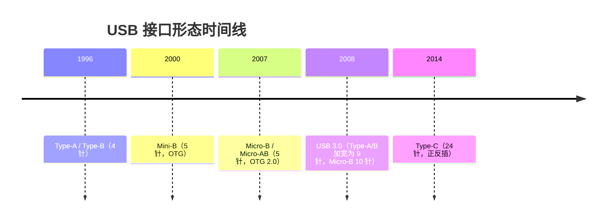
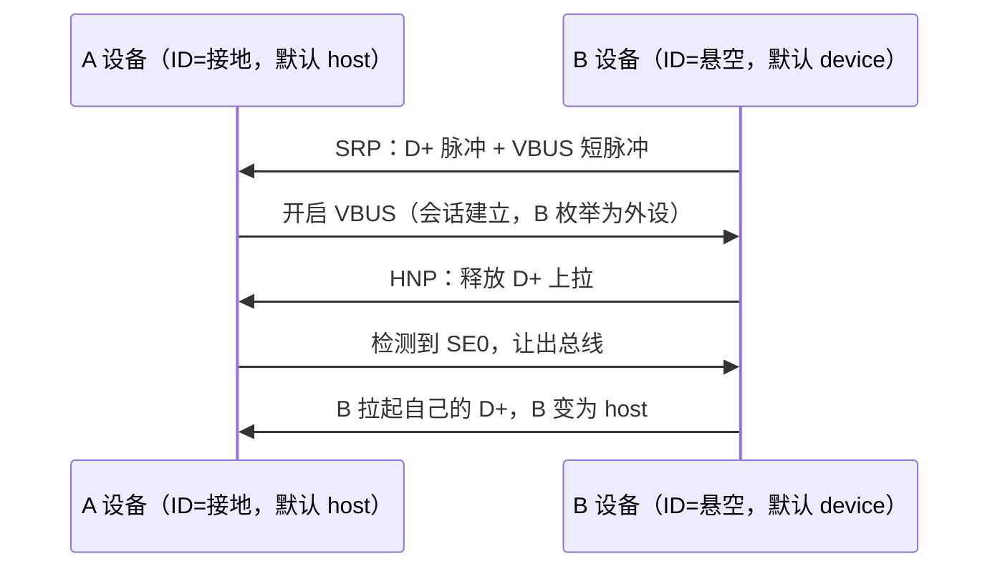

# 接口形态演进

> 🌿 知识树位置: 树干 → 枝干[接口与供电] → 叶
> ⬆️ 返回: [../10-树干-USB核心/03-物理层与电气特性.md](../10-树干-USB核心/03-物理层与电气特性.md) ｜ 同级: [02-USBType-C详解.md](02-USBType-C详解.md)

USB 接口的物理形态（Physical Connector）经历了 Type-A/B → Mini → Micro → Type-C 四代演进。形态演进的主线只有两条：**更小**（适配便携设备）与**更多功能**（高速差分对、供电协商、正反插）。本叶梳理各形态的引脚定义、OTG 角色、机械寿命与供电能力演进，并指出转接中的常见陷阱。

## 一、各形态引脚定义

### 1.1 Type-A 与 Type-B（4 针，USB 1.x/2.0）

Type-A 为下行端口（主机/Hub 侧）插座，Type-B 为上行端口（设备侧）插座，两者引脚编号与信号相同，仅外形不同（A 扁平、B 方形）。

| 引脚 | 信号 | 说明 |
| --- | --- | --- |
| 1 | VBUS | +5 V 电源（主机输出） |
| 2 | D− | 差分数据负端 |
| 3 | D+ | 差分数据正端（全速/高速上拉判速，见树干） |
| 4 | GND | 地 |

> 引脚序号以插座接触面定义为准；A 座为母端（针在插头上），B 座同理。

### 1.2 Mini-B 与 Micro-B（5 针，OTG 时代）

Mini-B（2000，用于早期 MP3/相机）与 Micro-B（2007，更薄、寿命更长）引脚布局一致：在 4 针基础上中央插入 **ID 引脚**，用于 OTG 角色识别。

| 引脚 | 信号 | 说明 |
| --- | --- | --- |
| 1 | VBUS | +5 V 电源 |
| 2 | D− | 差分数据负端 |
| 3 | D+ | 差分数据正端 |
| 4 | ID | OTG 角色识别（见下节） |
| 5 | GND | 地 |

USB 3.0 时代另有 **Micro-B 3.0**（10 针）：原 5 针保留，另一侧再加 5 针（SSRX±、GND_DRAIN、SSTX±），外形上宽下窄，兼容 2.0 Micro-B 插头。

### 1.3 OTG、ID 引脚与 Micro-AB

USB On-The-Go (OTG) 允许两台设备直连，摆脱"必须有主机"的限制。角色由 ID 引脚电平决定：

| ID 引脚状态 | 插头 | 角色 |
| --- | --- | --- |
| 接地（低） | Micro-A 插头 | A 设备（A 角色，默认为主机 host） |
| 悬空（内部上拉） | Micro-B 插头 | B 设备（B 角色，默认为外设 device/peripheral） |

- **Micro-AB 插座**：同时兼容 Micro-A 与 Micro-B 插头的"两用座"，仅 OTG 设备使用；普通外设只装 Micro-B 座。
- **SRP (Session Request Protocol, 会话请求协议)**：A 设备为省电可在会话结束时关断 VBUS。B 设备需要通信时，先在 D+ 上产生脉冲、再向 VBUS 注入短脉冲请求开启会话；A 设备检测到后重新供 VBUS。这是电池供电外设"反向唤醒主机"的机制。
- **HNP (Host Negotiation Protocol, 主机协商协议)**：SRP 建立会话后，若 B 设备实际更适合当主机（如向 A 设备拷文件），可通过 HNP 透明地交换主从角色——插头不动，总线上的 host/device 身份互换：B 先释放 D+ 上拉，A 检测到总线 SE0 后让出总线，B 再以自己的 D+ 上拉成为主机。

### 1.4 USB 3.0 时代：Type-A/B 加宽为 9 针

USB 3.0 (SuperSpeed) 在 4 针之外新增 **2 对全双工 SuperSpeed 差分对 + 1 根地**，Type-A/B 外观总体兼容但内部加宽：

| 引脚 | 信号 | 说明 |
| --- | --- | --- |
| 1 | VBUS | +5 V 电源 |
| 2 | D− | USB 2.0 差分负端 |
| 3 | D+ | USB 2.0 差分正端 |
| 4 | GND | 地 |
| 5 | SSRX− | SuperSpeed 接收负端 |
| 6 | SSRX+ | SuperSpeed 接收正端 |
| 7 | GND_DRAIN | SuperSpeed 信号地 |
| 8 | SSTX− | SuperSpeed 发送负端 |
| 9 | SSTX+ | SuperSpeed 发送正端 |

9 针 Type-B 同序；USB 3.0 Micro-B 为 10 针（原 5 针 + 5 针 SS 组）。注意 **SSTX/SSRX 全双工**：A 口（主机侧）的 SSTX 对接设备（B 口）的 SSRX，这也是转接线交叉问题的根源（见第六节）。链路与编码细节见 [../40-枝干-高速演进/01-USB3x与SuperSpeed.md](../40-枝干-高速演进/01-USB3x与SuperSpeed.md)。

## 二、机械寿命对比

| 形态 | 插拔寿命（规范量级） | 备注 |
| --- | --- | --- |
| Type-A / Type-B | 约 1 500 次 | USB 2.0 规范要求 |
| Mini-B | 约 5 000 次 | 早期便携设备，易坏座 |
| Micro-B | 约 10 000 次 | Micro-B 曾因"安卓时代标配"出货量极大 |
| Type-C | 10 000 次 | 且正反插消除"插三次才对"的损耗 |

### 2.1 Mini-B 与 Micro-B 的工程对比

| 维度 | Mini-B | Micro-B |
| --- | --- | --- |
| 定位 | 早期便携设备（MP3、相机） | 手机/平板标准，OTG 2.0 载体 |
| 高度 | 较高 | 更薄，适配超薄机身 |
| 寿命 | ~5 000 次 | ~10 000 次 |
| 结构弱点 | 插座焊盘小、受力易脱焊 | 加宽固定脚，受力改善 |
| 遗留影响 | 基本淘汰 | 存量巨大；其 ID 引脚与 Type-C 的 CC 角色机制一脉相承 |

工程提示：寿命数字是规范要求的机械循环次数，实际失效率更多取决于**插座焊盘在整机的应力**（侧向插拔力），维修统计里"充不进电"的第一根因就是 Micro-B 插座脱焊，而非线缆本身。

## 三、供电能力演进

| 阶段 | 机制 | 电流/功率 |
| --- | --- | --- |
| USB 1.x/2.0 | 单元负载 (Unit Load) 100 mA，配置后最高 5×100 mA | 500 mA @5 V（2.5 W） |
| USB 3.0 | 单元负载提升到 150 mA | 900 mA @5 V（4.5 W） |
| BC 1.2（见同级 03 叶） | SDP/CDP/DCP 端口分类 | DCP/CDP 最高 1.5 A |
| Type-C（Rp 广播） | 默认 / 1.5 A / 3.0 A 三档 | 最高 3 A @5 V（15 W） |
| USB PD 2.0/3.0 | CC 上 BMC 协商电压电流 | 最高 20 V/5 A = 100 W |
| USB PD 3.1 | 扩展功率范围 (EPR) | 最高 48 V/5 A = 240 W |

演进逻辑：从"固定 5 V + 被动限流"走到"协议协商电压电流"。协商机制详见 [02-USBType-C详解.md](02-USBType-C详解.md) 与 [04-USBPD协议.md](04-USBPD协议.md)。

## 四、为何 Type-C 一统江湖

1. **正反插**：24 针镜像对称，消除插反问题；10 000 次寿命。
2. **速率与形态解耦**：同一外形可承载 USB 2.0 到 USB4/雷电，四条高速通道还可重映射给 DisplayPort 等（Alt Mode）。
3. **供电协商内建**：CC 引脚天然承载供电广播与 PD 通信，无需 D+/D- 上的专有快充协议。
4. **双角色**：DFP/UFP/DRP 三态让手机、平板、笔记本都能"既当源又当汇"。
5. **生态收敛**：欧盟等法规统一充电接口，加速淘汰 Micro-B 与 Lightning。

代价是"同形不同能"：Type-C 只是形态，速率、供电、Alt Mode 全看实现，这成为选购与排障的最大坑（见 05 叶的排查清单）。

## 五、非 USB 对照：Lightning

Apple Lightning（2012）为 8 针专有接口，正反插但非 USB 规范，经 MFi 认证体系封闭授权。其"数字身份认证"思路与 Type-C 的 E-marker 芯片（见 05 叶）异曲同工；2023 年后 iPhone 转向 Type-C，Lightning 退居历史节点。对照意义在于：接口形态的竞争力最终取决于开放生态与法规，而非单点专利。

## 六、转接的坑

| 现象 | 根因 |
| --- | --- |
| USB-C 转 USB 3.0 A 口，某些设备插上只能跑 2.0 或识别异常 | C-A 线一端只有 1 对 SSTX/1 对 SSRX，而 C 端收发方向与 A 口相反（SSTX 必须接 C 端的 RX 对、SSRX 接 TX 对）；劣质线未按规范交叉焊接或未考虑插头正反两面，导致 SuperSpeed 对断路 |
| "只充电"线插电脑完全不识别数据 | 无源 C-C 线缺少 D+/D-（甚至只有 VBUS/GND），USB 2.0 通信无从建立；规范并不允许，但市场大量存在 |
| 标称"10 Gbps"线实测只有 480 Mbps | 只有 2.0 差分对、无 SuperSpeed 线对，或无 E-marker 的伪 5 A 线（见 05 叶） |
| 2.0 设备经 3.0 口转接后走 2.0 | 正常现象：3.x 设备内含两套总线接口，2.0 设备只能走 D+/D-（详见 [../40-枝干-高速演进/03-各版本对比速查.md](../40-枝干-高速演进/03-各版本对比速查.md)） |
| Micro-USB 转 Type-C 小转接头无法快充/OTG 异常 | ID/CC 逻辑完全不同，简单物理转接无法映射角色，且无 Rp/Rd 电阻编码 |

排查思路：先分层（供电→USB 2.0 数据→SuperSpeed 线对→协议协商），再逐项验证线材。

## 相关节点

- 树干: [../10-树干-USB核心/03-物理层与电气特性.md](../10-树干-USB核心/03-物理层与电气特性.md)（差分与速率）
- 树干: [../10-树干-USB核心/10-电源管理与挂起唤醒.md](../10-树干-USB核心/10-电源管理与挂起唤醒.md)（总线供电与挂起）
- 同级: [02-USBType-C详解.md](02-USBType-C详解.md)（24 针与 CC 机制）
- 同级: [03-BC1.2与专有快充.md](03-BC1.2与专有快充.md)（Type-C 之前的供电与快充）
- 邻枝: [../40-枝干-高速演进/01-USB3x与SuperSpeed.md](../40-枝干-高速演进/01-USB3x与SuperSpeed.md)（SSTX/SSRX 链路）
