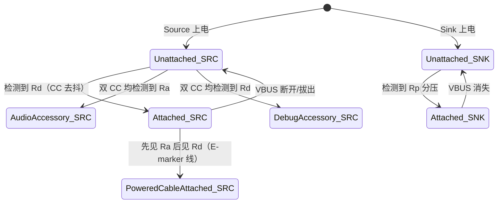
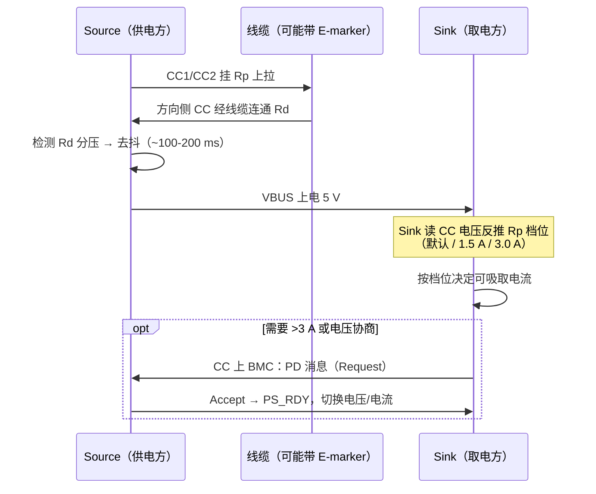

# USB Type-C 详解

> 🌿 知识树位置: 树干 → 枝干[接口与供电] → 叶
> ⬆️ 返回: [../10-树干-USB核心/03-物理层与电气特性.md](../10-树干-USB核心/03-物理层与电气特性.md) ｜ 同级: [01-接口形态演进.md](01-接口形态演进.md) ｜ [04-USBPD协议.md](04-USBPD协议.md)

Type-C（USB Type-C Cable and Connector Specification，USB-IF）是 24 针、可正反插的对称接口。它的核心创新不在"针多"，而在 **CC 引脚体系**：方向检测、连接检测、供电广播、PD 通信全部由两根 CC 线承载。本叶拆解引脚、电阻编码、角色与连接状态机。

## 一、24 针全引脚表

插座 (Receptacle) 分 A/B 两排各 12 针：

| 针 | 信号 | 针 | 信号 |
| --- | --- | --- | --- |
| A1 | GND | B1 | GND |
| A2 | TX1+ | B2 | RX1+ |
| A3 | TX1− | B3 | RX1− |
| A4 | VBUS | B4 | VBUS |
| A5 | CC1 | B5 | CC2 |
| A6 | D+ | B6 | D+ |
| A7 | D− | B7 | D− |
| A8 | SBU1 | B8 | SBU2 |
| A9 | VBUS | B9 | VBUS |
| A10 | RX2+ | B10 | TX2+ |
| A11 | RX2− | B11 | TX2− |
| A12 | GND | B12 | GND |

要点：

- **VBUS ×4 / GND ×4**：提高载流与降低压降，支撑 3 A、5 A（PD EPR 时代）供电。
- **2 对 TX + 2 对 RX**：4 条高速通道，USB 3.x/USB4/Alt Mode 复用（见 05 叶）。
- **D+/D−**：USB 2.0 差分对，在任何方向下始终直连。
- **CC1/CC2**：控制与协商，本叶主角。
- **SBU1/SBU2**：低速副边信号，Alt Mode 中常用作 DisplayPort AUX，音频配件模式中用作麦克风。

## 二、正反插原理

线缆内部**只有一条物理通道**：一组 TX 对、一组 RX 对、一条 CC 线直通（带 E-marker 时经芯片）、D+/D−、SBU。插座两排引脚 A/B 完全镜像。插头插入方向不同时，插头触点与插座 A 排或 B 排接触：

1. Source 在 CC1、CC2 上各挂一个 Rp 上拉；
2. 插头内只有**一条 CC 线经 Rd 下拉**接到设备，另一条接 GND 或线缆芯片；
3. Source 检测到哪根 CC 出现 Rd 分压，即知道线缆的插入方向与连接；
4. 数据通路随之切换：方向 A 时用 TX1/RX2 对，方向 B 时用 TX2/RX1 对（由 PD 或链路训练前后的 MUX 切换）。

方向是**协议级自适应**的，无需用户感知。

## 三、CC 引脚的四大功能

| 功能 | 机制 |
| --- | --- |
| 方向检测 (Orientation Detection) | 哪根 CC 检测到 Rd 分压 → 判定正/反插 |
| 连接检测 (Attach Detection) | Rp 与 Rd 建立分压回路 → 双方确认连接，再决定 VBUS 供电 |
| 供电能力广播 (Power Advertisement) | Source 用 Rp 阻值广播 5 V 下的可吸取电流档位 |
| PD 通信载体 | 连接后 CC 变为 BMC 半双工通信线路，承载全部 USB PD 消息（见 04 叶） |

## 四、电阻编码体系

Type-C 用**上拉/下拉电阻组合**在供电协商发生前完成"谁供电、供多少"的低成本广播。

### 4.1 Source 端上拉 Rp

| 供电档位（5 V 下 Sink 可吸取） | Rp 接 3.3 V | Rp 接 5.0 V | 电流源方案 |
| --- | --- | --- | --- |
| 默认 USB 电流（2.0 口 500 mA / 3.0 口 900 mA） | 56 kΩ | 36 kΩ | 80 µA |
| 1.5 A | 22 kΩ | 12 kΩ | 180 µA |
| 3.0 A | 10 kΩ | 4.7 kΩ | 330 µA |

### 4.2 Device 端下拉 Rd

**Rd = 5.1 kΩ（±10%）** 接地。设备（Sink/外设）在每根 CC 上各放一个 Rd，Source 据此检测连接与方向。

### 4.3 线缆中的 CC 与 Ra

- **无源线缆**：CC 线直通（一进一出），不接任何电阻；
- **带 E-marker 的线缆**（5 A、USB4 40 Gbps、雷电等）：线缆内芯片把**一端** CC 经 **Ra ≈ 1 kΩ** 钳位（规范范围约 800 Ω~1.2 kΩ），告知 Source "这是一根带芯片的线缆，请给我 VCONN 供电"；
- Source 随后通过该 CC 提供 **VCONN** 电源，与线缆芯片用 **SOP'** 通道通信（读电流档位、速率能力，见 05 叶）。

> 记忆锚点：Rp 在"供电方"，Rd 在"取电方"，Ra 在"线缆芯片"。三者的电压窗口区分严格，误装（如设备端误用 Rp）会烧口或拒连。

## 五、角色三态与线缆角色

| 角色 | 英文 | 行为 |
| --- | --- | --- |
| 下行端口 | DFP (Downstream Facing Port) | 供电方（Source）+ 主机侧，等效传统 host |
| 上行端口 | UFP (Upstream Facing Port) | 取电方（Sink）+ 设备侧，等效传统 peripheral |
| 双角色端口 | DRP (Dual-Role Port) | 上电后以周期在 DFP/UFP 之间交替尝试，直到对端确定角色；手机/笔记本普遍采用 |
| 供电线缆 | Powered Cable | 带 E-marker、由 VCONN 供电的线缆芯片，不是数据端点 |

DRP 切换周期与占空比规范给出范围（tDRP 约 50~100 ms 量级，具体见 Type-C 规范），两个 DRP 相连时靠随机抖动避免死锁。

## 六、连接状态机概述

Type-C 状态机（Connection State Machine）分 Source/Sink/Audio Accessory（R2.5 起移除，见第九节注记）/Debug Accessory 等状态集，核心骨架如下：

关键去抖参数：tCCDebounce 约 100~200 ms（连接确认），具体见规范。E-marker 线的连接多一个 VCONN 分配子状态。

## 七、电流确定时序

要点：**不跑 PD 时，Sink 通过测量自己 CC 上的电压来"读"Rp 档位**——这就是为什么同一台设备插不同充电器会显示"慢充/快充"。超过 3 A 的电流必须走 PD 协商，且需 5 A 线缆（E-marker）。

## 八、速率与接口解耦宣言

**C 口 ≠ USB 3.x+**。Type-C 只规定形态与 CC 机制；速率取决于：

1. 线缆内是否有 SuperSpeed 线对（充电线可能只有 2.0 对，甚至无数据对）；
2. 两端芯片是否支持对应速率；
3. E-marker 的线缆代次（USB4 40 Gbps 线必须带 marker）。

工程后果：全功能线、充电线、雷电线的物理外形完全相同，验收必须实测（见 05 叶选购指南与排查清单）。

## 九、音频配件模式 (Audio Accessory)

> ⚠️ 规范版本注记（evolve #6）：模拟音频配件模式在 **Type-C R2.5（2026-03）中已被弃用移除**（为缓解液体腐蚀问题，AudioAccessory 状态从 Source 状态机删除，改行液体检测/缓解机制，见 [09-TypeC规范级](09-TypeC规范级-状态机与CC时序.md)）。下表描述的是 R2.1 及更早版本的机制，现网旧设备/旧固件仍按此行为。

模拟音频附件 (Analog Audio Accessory) 让耳机/转接器复用 Type-C 引脚：

| 引脚 | 复用信号 |
| --- | --- |
| CC1 / CC2 | 各挂 Ra（双 Ra 是触发特征） |
| D+ | 右声道（或左声道，按规范映射） |
| D− | 左声道（或右声道） |
| SBU1 | 麦克风 |
| SBU2 | 模拟地 AGND |

Source 检测到**双 CC 均为 Ra** 时进入 Audio Accessory 状态：不供 VBUS 主电、把 D+/D−/SBU 切给音频编解码器。此时该连接不是 USB 数据连接（USB 2.0 通信不可用）。

## 十、Debug Accessory 模式简介

当 Source 检测到**双 CC 均为 Rd** 时进入 Debug Accessory 模式：数据引脚可重映射为调试通道（典型如 SBU1/SBU2 承载 UART/JTAG，用于平台级调试，如手机/平板的板级调试口）。该模式面向开发者，不承载正常 USB 流量。

## 相关节点

- 树干: [../10-树干-USB核心/03-物理层与电气特性.md](../10-树干-USB核心/03-物理层与电气特性.md)
- 树干: [../10-树干-USB核心/02-体系架构与分层模型.md](../10-树干-USB核心/02-体系架构与分层模型.md)（DFP/UFP 与总线拓扑）
- 同级: [01-接口形态演进.md](01-接口形态演进.md)
- 同级: [04-USBPD协议.md](04-USBPD协议.md)（CC 上的 PD 协议）
- 同级: [05-AlternateMode与E-marker.md](05-AlternateMode与E-marker.md)（SOP'/线缆芯片）
- 邻枝: [../40-枝干-高速演进/03-各版本对比速查.md](../40-枝干-高速演进/03-各版本对比速查.md)
