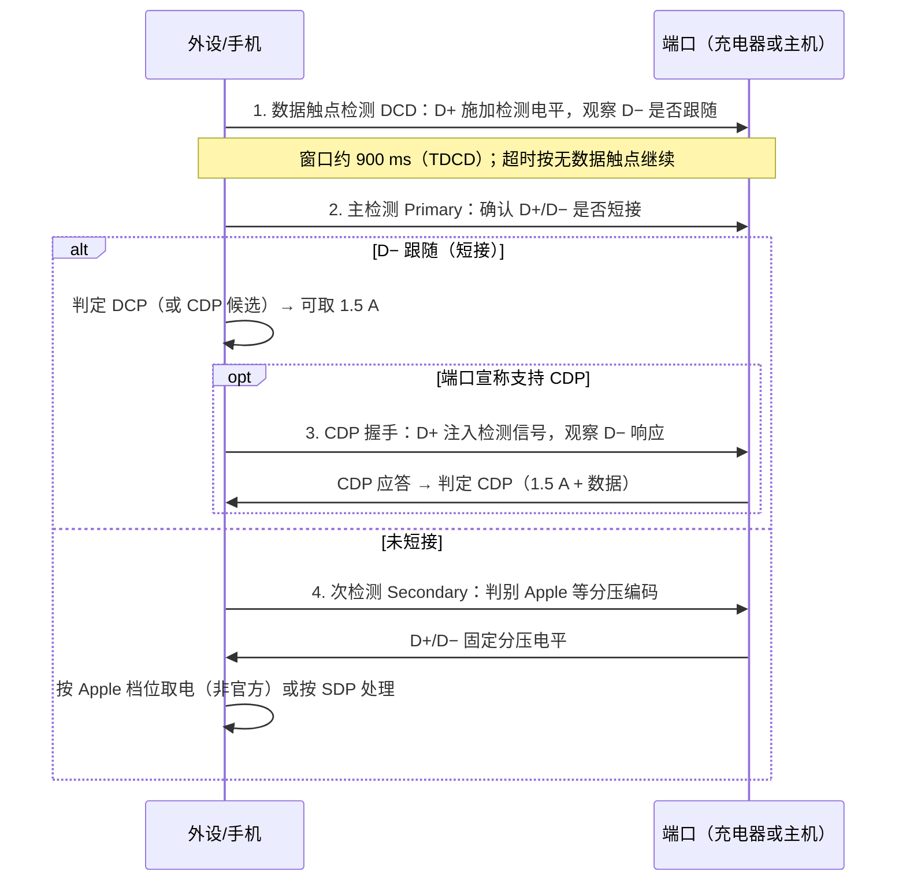

# BC 1.2 与专有快充

> 🌿 知识树位置: 树干 → 枝干[接口与供电] → 叶
> ⬆️ 返回: [../10-树干-USB核心/10-电源管理与挂起唤醒.md](../10-树干-USB核心/10-电源管理与挂起唤醒.md) ｜ 同级: [02-USBType-C详解.md](02-USBType-C详解.md) ｜ [04-USBPD协议.md](04-USBPD协议.md)

在 Type-C 普及前，USB 充电的主要规范是 USB-IF 的 **Battery Charging Specification 1.2 (BC 1.2)**；各芯片厂则在 D+/D− 上发明了各自的快充协议。理解这一层，才能看懂充电宝、车充、老充电器的行为，以及"假快充"的成因。

## 一、BC 1.2 的三种端口

| 端口类型 | 全称 | 数据 | 最大电流 | 识别特征 |
| --- | --- | --- | --- | --- |
| SDP | Standard Downstream Port（标准下行口） | 有（传统 USB） | 500 mA（USB 2.0 配置后；3.0 口为 900 mA） | 行为等同普通 USB 口，需枚举 |
| CDP | Charging Downstream Port（充电下行口） | 有 | 1.5 A | 内部 D+/D− 经开关短接，但保留与主机数据通路；通过**检测握手**与 DCP 区分 |
| DCP | Dedicated Charging Port（专用充电口） | 无 | 1.5 A | **D+ 与 D− 短接**（短路阻抗不超过 200 Ω），墙上充电器典型形态 |

设计动机：墙上充电器没有主机，若沿用 SDP 规则（必须枚举才能取 500 mA），手机永远只能慢充。DCP 用"D+/D− 短接"这一物理特征让设备**无需枚举**即可判定"可安全取 1.5 A"。

## 二、检测流程

设备侧（PD/充电管理芯片）上电后执行如下序列，避免枚举也能识别端口类型：

要点：

- **DCD (Data Contact Detect)** 解决"充电器可能没接数据线"导致的检测挂起；时序细节（各阶段电平、阈值、定时器）见 BC 1.2 规范原文。
- 主检测在未检测到短接时进入次检测，识别"不短接 D+/D− 但有固定分压"的专有充电器（Apple 模式）。
- 主机侧 hub/芯片（如 CDP 实现）同样要实现对应的检测与握手逻辑，两端时序不匹配是"充电慢且无数据"类故障的常见根因。

## 三、Apple 分压编码（非官方，业界通行）

Apple 从未公开该规范，但手机/充电器产业广泛实现。充电器在 D+/D− 上接精密电阻分压，输出两档固定电压（约 2.0 V 与 2.7 V），设备测量组合决定可吸取电流：

| D+ 电压 | D− 电压 | 设备可取电流（业界通行值） |
| --- | --- | --- |
| 2.0 V | 2.0 V | 0.5 A |
| 2.0 V | 2.7 V | 1.0 A（iPhone 类） |
| 2.7 V | 2.0 V | 2.1 A（iPad 10 W 类） |
| 2.7 V | 2.7 V | 2.4 A（iPad 12 W 类） |

> **注意**：此表来自产业界与第三方充电芯片数据手册的逆向一致结果，非 USB-IF 或 Apple 官方规范；不同资料对个别档位（如 2.1 A 与 2.4 A 的边界）表述略有出入。BC 1.2 的次检测正是为了兼容这类分压器而设计。

两个工程细节：

- 分压由充电器内**精密电阻到 5 V** 实现，因此 D+/D− 上会有持续的静态漏电流——这也是部分老充电器空载功耗偏高的原因之一；
- 设备端判定只需比较两路电压落在哪一档窗口，故任何"能输出这两个电压"的第三方芯片都可伪装成 Apple 充电器（众多多协议识别芯片的必备功能）。

## 四、高通 Quick Charge 2.0 / 3.0

QC 走另一条路：**用 D+/D− 电平组合命令充电器改变输出电压**，从"5 V 定压大电流"转向"高电压小电流"（线损更小，但机内需二次降压）。

### 4.1 进入握手

设备将 D+ 拉至约 0.327 V 并保持 ≥1.25 s（此数值来自业界逆向资料与充电芯片手册），充电器（HVDCP）检测到后断开 D+/D− 短接，进入命令模式，随后接受电平组合指令。

### 4.2 QC 2.0 电压档位电平表

| D+ | D− | 输出电压 |
| --- | --- | --- |
| 0.6 V | 0 V | 5 V（默认） |
| 3.3 V | 0.6 V | 9 V |
| 0.6 V | 0.6 V | 12 V |
| 3.3 V | 3.3 V | 20 V（仅 Class B） |
| 0.6 V | 3.3 V | 进入 QC 3.0 连续调压模式 |

- **Class A**：最高 12 V（手机/平板生态）；
- **Class B**：最高 20 V（笔记本等，市面少见）。

### 4.3 QC 3.0

在 2.0 基础上改为**连续调压**：3.6 V~20 V、**200 mV 步进**，设备通过 INCREMENT/DECREMENT 电平脉冲逐级升降电压，可寻最优效率点。QC 3.0 兼容 2.0 档位。

## 五、其他专有快充（一句话档案）

| 协议 | 厂商 | 特征 |
| --- | --- | --- |
| AFC (Adaptive Fast Charging) | 三星 | 9 V/1.67 A（15 W）量级，信令与 QC 2.0 同源 |
| FCP (Fast Charge Protocol) | 华为 | 9 V/2 A（18 W）高压方案，类 QC |
| SCP (Super Charge Protocol) | 华为 | 低压大电流直充（4.5 V/5 A、5 V/4.5 A，22.5 W 起步），需专用线缆与芯片 |

另注意：**充电宝/车充里的多协议识别芯片**（BC 1.2 + Apple 分压 + QC + AFC/FCP/SCP 全家桶）已成为独立品类，其作用就是"把每种设备的检测逻辑都应答对"，让任意设备都能取到最大电流——这也是同一充电宝不同手机快慢差异的直接解释。

## 六、协议世代总览与对比

| 协议 | 通道 | 档位 | 最高功率 | 数据可并行 |
| --- | --- | --- | --- | --- |
| BC 1.2 SDP | 枚举+总线规则 | 5 V 固定 | 2.5 W（500 mA） | 是 |
| BC 1.2 CDP | D± 握手 | 5 V 固定 | 7.5 W（1.5 A） | 是 |
| BC 1.2 DCP | D± 短接特征 | 5 V 固定 | 7.5 W（1.5 A） | 否 |
| Apple 分压 | D± 固定电平 | 5 V 固定 | 12 W（2.4 A） | 否 |
| QC 2.0 | D± 电平命令 | 5/9/12 V（Class B 加 20 V） | 18~60 W（按档） | 否 |
| QC 3.0 | D± 电平脉冲 | 3.6~20 V 连续，200 mV 步进 | 同上 | 否 |
| AFC / FCP | D±（类 QC） | 9 V 档为主 | 15~18 W | 否 |
| SCP | 专有信令+专用线 | 低压大电流直充 | 22.5 W 起步 | 否 |
| USB PD 2.0/3.0 | CC（BMC） | Fixed + PPS 连续 | 100 W | 是（完整 USB 3.x） |
| USB PD 3.1 | CC（BMC） | + EPR 28/36/48 V | 240 W | 是 |

横向看：只有 BC 1.2 的 SDP/CDP 与 PD 同时满足"大电流 + 完整数据"，其余快充本质都是**牺牲数据换充电**（D± 被快充信令占用或只有 2.0 通路）。

## 七、常见故障与误区

- **CDP 名存实亡**：真正实现 CDP 握手的主机极少，市场把"D± 短接的 1.5 A 口"统称 DCP；设备若坚持等 CDP 握手，反而可能识别异常——成熟设备都做成"检测到短接即按 DCP 取电"。
- **开机变慢**：BC 1.2 检测序列（DCD 窗口 + 主/次检测）发生在每次插入时，实现不佳的充电管理芯片会把开机/唤醒拖慢数百毫秒至秒级。
- **多口充电器降档**：多口 PD 充电器在两个口同时插入时常把单口 100 W 拆成 60 W+30 W；这与线缆无关，是电源预算策略（读 PDO 即可验证）。
- **DCP 判定被滥用**：部分主机口对 2.0 设备按 DCP 短接处理以加速充电，导致该口数据功能失效——诊断时先确认端口宣称的类型。
- **A 口线冒充快充线**：Apple 分压与 QC 信令都在 D± 上，假线只要通断正确就能"握手成功"，但线阻过大导致实际限流——最终解释权在压降测量。

## 八、为何 Type-C + PD 终结了专有快充

1. **专用通道**：PD 在 CC 上通信，不占用也不破坏 D+/D−，与 USB 2.0 数据互不干扰；
2. **标准化档位**：PDO 广播-请求模型可表达任意电压/电流/功率档（含 PPS 连续调压），表达能力全面超过 QC 2.0/3.0；
3. **双向与角色**：支持 PR_Swap、FRS 等专有协议没有的能力（见 04 叶）；
4. **认证体系**：USB-IF 对线缆（E-marker）与电源的认证解决了专有快充"线不对就慢"的碎片化。

专有协议至今仍存在于存量配件与国内厂商生态（私有 PPS 变体），但新设计已收敛到 PD。

## 九、识别"假快充线"的原理

| 检查点 | 原理 |
| --- | --- |
| 测 D+/D− 通断 | 只有 DCP 短接或分压而无数据通路的线，无法完成 PD（Type-C 线）或专有握手（A 口线） |
| 测 Type-C 线内 CC 是否直通、是否带 E-marker | 5 A 档（>60 W）必须有 E-marker；无 marker 而标 5 A 即假标，Source 会限流到 3 A 甚至默认档 |
| 用 PD 诱骗器/触发器读 PDO | 充电器广播的 PDO 列表是硬事实；线缆/协议芯片问题会让 Request 失败或回落 5 V |
| 测线阻压降 | 标 4.5 A/5 A 的 A-to-C 线若线径过细，大电流下压降超标会触发保护降流 |

排查顺序建议：先读 PDO（协议层）→ 再验线缆 CC/E-marker（物理层）→ 最后测压降（线材质量）。

## 相关节点

- 树干: [../10-树干-USB核心/10-电源管理与挂起唤醒.md](../10-树干-USB核心/10-电源管理与挂起唤醒.md)
- 树干: [../10-树干-USB核心/03-物理层与电气特性.md](../10-树干-USB核心/03-物理层与电气特性.md)
- 同级: [02-USBType-C详解.md](02-USBType-C详解.md)（Rp/Rd 电阻编码）
- 同级: [04-USBPD协议.md](04-USBPD协议.md)（PD 消息与 PDO）
- 同级: [05-AlternateMode与E-marker.md](05-AlternateMode与E-marker.md)（E-marker 与线缆认证）
