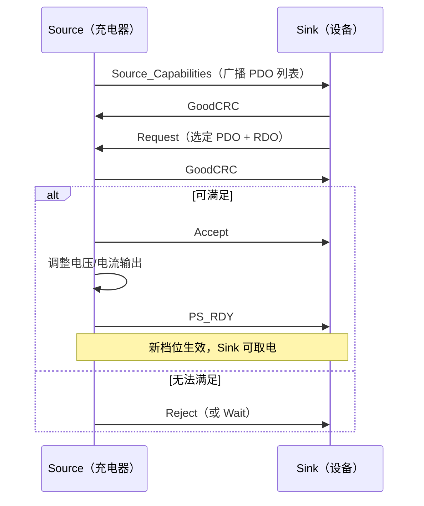
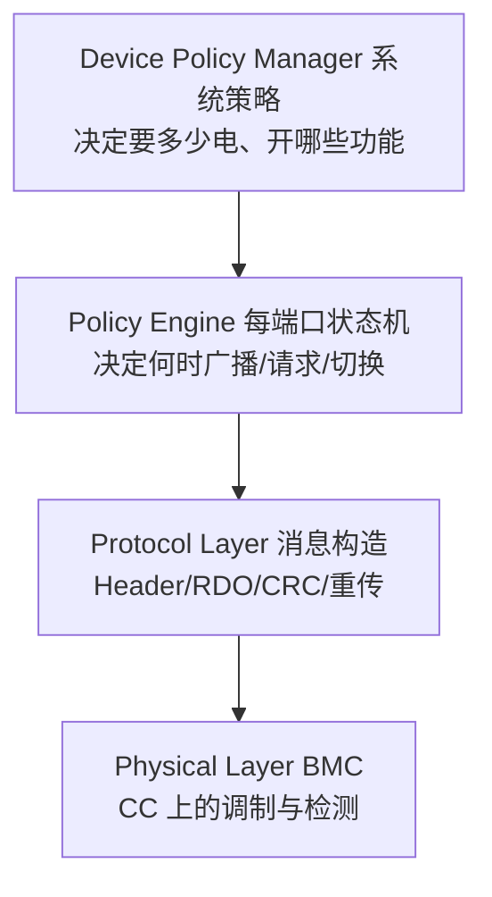

# USB PD 协议

> 🌿 知识树位置: 树干 → 枝干[接口与供电] → 叶
> ⬆️ 返回: [../10-树干-USB核心/05-包格式与事务.md](../10-树干-USB核心/05-包格式与事务.md) ｜ 同级: [02-USBType-C详解.md](02-USBType-C详解.md) ｜ [05-AlternateMode与E-marker.md](05-AlternateMode与E-marker.md)

USB Power Delivery (PD) 是运行在 **CC 线**上的供电协商协议：Source 广播自己能提供什么（PDO），Sink 按需请求（RDO），双方以消息帧对话。PD 同时承担角色管理（电源/数据角色交换）与线缆芯片（E-marker）通信，是现代 Type-C 生态的中枢。

## 一、物理层：CC 上的 BMC

- 连接建立后，CC 线从"电阻编码"切换为 **BMC (Biphase Mark Coding, 双相标记编码)** 调制通信，速率约 **300 kbps**；
- **半双工**：同一时刻 CC 上只有一个发送方，每次发送必须收到对方的 GoodCRC 应答（超时重发）；
- 线路编码为 4b5b + BMC，帧内带 CRC-32；只在与连接方向一致的**一根** CC 线上传输；
- PD 1.0 曾改用 VBUS 上的 BPSK 载波通信，因实现复杂已弃用，PD 2.0 起统一为 CC+BMC。

## 二、协议版本演进

| 版本 | 年份 | 关键变化 |
| --- | --- | --- |
| PD 1.0 | 2012 | VBUS 载波通信，市场弃用 |
| PD 2.0 | 2014 | 迁移到 CC+BMC；消息**定长**（Header + 固定最多 7 个数据对象，按最大长度发送） |
| PD 3.0 | 2015/2016 | 消息**变长**（按对象数发送）；引入 PPS (APDO)；扩展消息 (Extended Messages)；增强消息安全基础 |
| PD 3.1 | 2021 | 引入 **EPR** (Extended Power Range)：28/36/48 V，最高 240 W；AVS 扩展至 EPR 档 |
| PD 3.2 | 2023 | 整合 3.1 与各 ECN（含安全、EPR 模式进入流程），成为现行单一规范 |

工程影响：PD 2.0 与 3.0 报文结构不同（定长 vs 变长），双方通过 Header 中的 Specification Revision 位协商降级到共同版本。

## 三、消息帧结构

每条 PD 消息 = **16 位 Header** + 0~7 个 **32 位数据对象**。

### 3.1 Header 位段表

| 位 | 字段 | 说明 |
| --- | --- | --- |
| 15 | Extended | 1 = 扩展消息（可跨多块，PD 3.0 分块传输） |
| 14:12 | Number of Data Objects | 后续 32 位对象个数（0~7） |
| 11:9 | Message ID | 消息序号（0~7 循环），配合 GoodCRC 去重/确认 |
| 8 | Port Power Role / Cable Plug | SOP 消息：电源角色（0=Sink,1=Source）；SOP'/SOP''：线缆插头端标识 |
| 7:6 | Specification Revision | 00=Rev1, 01=Rev2（PD2.0）, 10=Rev3（PD3.0） |
| 5 | Port Data Role | 0=UFP, 1=DFP |
| 4:0 | Message Type | 消息类型（见下表） |

### 3.2 常用消息类型

| 类型 | 编号 | 方向/含义 |
| --- | --- | --- |
| GoodCRC | 1（控制） | 对任何收到的消息立即应答 |
| Accept / Reject | 3 / 4（控制） | 接受/拒绝请求 |
| PS_RDY | 6（控制） | 电源已切换完成（电压/电流就位） |
| Get_Source_Cap | 7（控制） | Sink 主动索要 PDO 列表 |
| Soft_Reset | 13（控制） | 协议层软复位 |
| Source_Capabilities | 1（数据） | Source 广播 PDO 列表（最多 7 个） |
| Request | 2（数据） | Sink 请求某个 PDO（含 RDO） |
| Sink_Capabilities | 4（数据） | Sink 能力上报 |
| Vendor_Defined (VDM) | 15（数据） | 厂商扩展：Discover Identity、Alt Mode、线缆能力等 |

## 四、PDO 类型表

Source_Capabilities 中的每个 32 位对象是一个 PDO (Power Data Object)：

| PDO 类型 | 内容 | 说明 |
| --- | --- | --- |
| Fixed Supply | 固定电压 + 最大电流 | 5 V 必为第 1 个；常用 9/15/20 V 档 |
| Battery | 电压范围 + 最大功率 | 按功率请求，电池供电系统 |
| Variable Supply（非电池） | Vmin/Vmax + 电流 | 电压可漂移的适配器 |
| APDO: PPS (Augmented) | 3.3~21 V 内连续、**20 mV 步进**、电流 50 mA 步进、可随时再协商 | 直充/恒压恒流闭环，游戏手机快充主力 |
| APDO: EPR | 28/36/48 V 固定档 | PD 3.1，需 5 A E-marker 线，进入 EPR 模式须专门流程 |
| APDO: AVS | 连续可调电压（100 mV 步进量级） | SPR 档 15~20 V，EPR 档更高，档位细节见规范 |

### 功率档位速查

| 档位 | 功率 | 档位 | 功率 |
| --- | --- | --- | --- |
| 5 V/3 A | 15 W | 20 V/3 A | 60 W |
| 9 V/3 A | 27 W | 20 V/5 A | 100 W（PD 2.0/3.0 上限） |
| 12 V/3 A | 36 W | 28 V/5 A | 140 W |
| 15 V/3 A | 45 W | 36 V/5 A | 180 W |
| 9 V/5 A | 45 W | 48 V/5 A | **240 W（EPR 上限）** |

## 五、RDO 关键位

Request 消息中的 32 位对象是 RDO (Request Data Object)，核心字段：

| 位段 | 字段 | 说明 |
| --- | --- | --- |
| 9:0 | 最大工作电流 (10 mA/LSB) | 本档位允许的最大电流 |
| 19:10 | 工作电流 (10 mA/LSB) | 当前实际需要的电流 |
| 24 | No USB Suspend | 不允许挂起时置 1 |
| 23 | USB Comm Capable | 具备 USB 数据通信能力 |
| 27 | Capability Mismatch（能力不匹配位） | 1 = Source 无一档完全满足 Sink 需求，仅按最接近档位供电 |
| 31:28 | EPR Mode（PD 3.1） | 0001 = 请求进入 EPR 模式（仅 Fixed/PPS RDO） |

**能力不匹配位**是诊断"能充但不满速"的关键证据；**EPR 模式位**说明 240 W 不是普通 Request 一步可达，需先经 EPR Mode Entry 消息序列。

## 六、协商流程时序

- Source 周期性重广播 Source_Capabilities（连接后与超时重发定时见规范）；Sink 变更需求可再次 Request；
- **Hard Reset**：协议僵死时的兜底——VBUS 掉到 vSafe0V 再回 5 V，设备可能重启充电会话；
- 请求新档位时 Source 先发 Accept、调整完再发 PS_RDY，Sink 在 PS_RDY 前不得假设电压已切换。

## 七、双向角色与三种 Swap

| 操作 | 全称 | 作用 |
| --- | --- | --- |
| PR_Swap | Power Role Swap | 交换供电方向（如手机给显示器供电 ↔ 显示器给手机反充），插头与数据角色不变 |
| DR_Swap | Data Role Swap | 交换 DFP/UFP 数据角色（如手机向 PC 传文件时仍由 PC 供电） |
| VCONN_Swap | VCONN 交换 | 交换由哪一端向 E-marker 线缆芯片供 VCONN（角色交换后必须处理，否则线缆芯片断电） |

PD 3.0 另引入 **FRS (Fast Role Swap)**：Source 掉电时 Sink 在毫秒级接管供电，用于对接 UPS 型设备/双口互备场景。

## 八、SOP / SOP' / SOP'' 通信对象

| 通道 | K 码序列（4b5b Sync 码） | 通信对象 |
| --- | --- | --- |
| SOP | Sync-1, Sync-1, Sync-1, Sync-2 | 对端端口（Source↔Sink） |
| SOP' | Sync-1, Sync-1, Sync-3, Sync-3 | 近端线缆芯片（E-marker, VCONN 供电） |
| SOP'' | Sync-1, Sync-3, Sync-1, Sync-3 | 远端线缆芯片（仅主动线缆） |

对线缆的经典消息是 **Discover Identity (VDM)**：读取 E-marker 的厂商、电流档位（3 A/5 A）、线缆类型（被动/主动、电/光）与速率代次（详见 05 叶）。

## 九、策略层分层概念

PD 规范以逻辑分层描述实现（与树干的分层模型同构）：

| 层 | 职责 |
| --- | --- |
| Device Policy Manager (DPM) | 系统级策略：预算、多口分配、热管理 |
| Policy Engine (PE) | 端口级 PD 状态机（Source/Sink 状态集） |
| Protocol Layer | 消息编码、MessageID、定时器、重传 |
| Physical Layer | BMC 收发、CC 检测、连接状态机 |

## 十、PD 3.0 起的扩展消息与安全

- **扩展消息 (Extended Messages)**：超过 7 个对象的负载用分块 (Chunked) 传输，如 Get_Source_Cap_Extended、电池状态、固件信息等；
- **EPR Mode Entry**（PD 3.1）：进入 28 V+ 档前的专门握手（EPR_Mode/EPR_SourceCap 消息组），并要求 5 A 线缆；
- **安全消息组**：PD 3.2 阶段把认证/签名类要求（Type-C Authentication、防诱骗）逐步并入规范体系，实现细节见规范与安全叶。

## 十一、实测工具（一句话档案）

- **PD 协议分析仪**：GRL、Total Phase、Ellisys、LeCroy 等均支持 CC BMC 解码（USB4 时代需支持隧道解析，见 40 枝干）；
- **开源抓包器**：Chromium OS EC 项目的 Twinkie 可在线旁听 CC 消息；
- **PD 诱骗器/触发器**（如 ZY12OGG、CH224 模块）：模拟 Sink 请求指定 PDO，快速验证充电器真实输出档位。

## 相关节点

- 树干: [../10-树干-USB核心/05-包格式与事务.md](../10-树干-USB核心/05-包格式与事务.md)（消息/重传思想同构）
- 树干: [../10-树干-USB核心/10-电源管理与挂起唤醒.md](../10-树干-USB核心/10-电源管理与挂起唤醒.md)
- 同级: [02-USBType-C详解.md](02-USBType-C详解.md)（CC、Rp/Rd、状态机）
- 同级: [03-BC1.2与专有快充.md](03-BC1.2与专有快充.md)（被 PD 取代的前代机制）
- 同级: [05-AlternateMode与E-marker.md](05-AlternateMode与E-marker.md)（SOP'/VDM 的主要用户）
- 邻枝: [../40-枝干-高速演进/02-USB4与雷电整合.md](../40-枝干-高速演进/02-USB4与雷电整合.md)（PD 承载 USB4 带宽协商入口）
