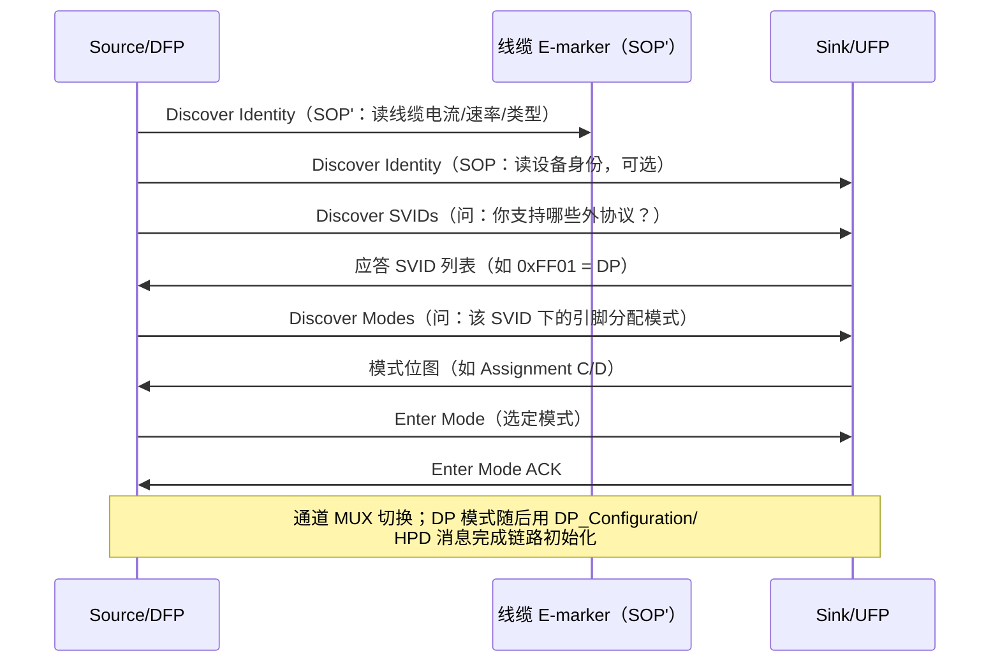

# Alternate Mode 与 E-marker

> 🌿 知识树位置: 树干 → 枝干[接口与供电] → 叶
> ⬆️ 返回: [../10-树干-USB核心/03-物理层与电气特性.md](../10-树干-USB核心/03-物理层与电气特性.md) ｜ 同级: [02-USBType-C详解.md](02-USBType-C详解.md) ｜ [04-USBPD协议.md](04-USBPD协议.md)

Type-C 有 4 条高速差分通道。**Alt Mode (Alternate Mode, 替代模式)** 允许把它们整体或部分重映射给非 USB 协议（DisplayPort、Thunderbolt 等）；**E-marker (Electronic Marker)** 则是线缆里的"身份证"，让 Source 知道这根线到底能跑多大电流、多高速率。两者共同决定了"一根 C 线到底能干什么"。

## 一、Alt Mode 原理

插座上的 4 条高速通道（2 对 TX + 2 对 RX）默认组成 USB 3.x/USB4 链路。经 PD 协商后可重新分配：

| 分配 | 通道占用 | 结果 |
| --- | --- | --- |
| 纯 USB | 4 通道全部 | USB 3.x Gen 2 / USB4 40 Gbps |
| 2 通道外借 | 2 通道给外协议 + 2 通道留 USB 3.x | 视频+数据并行（典型全功能坞） |
| 4 通道全借 | 全部给外协议 | 最大显示带宽，USB 高速数据不可用（USB 2.0 的 D+/D− 仍可用） |

协议标识用 **SVID (Standard or Vendor ID)**：VESA 为 0xFF01，Intel（Thunderbolt）为其分配的 SVID。SBU1/SBU2 通常被借作 DisplayPort AUX/HPD 等低速信号。

## 二、进入 Alt Mode 的流程

全部借助 PD 的 **VDM (Vendor Defined Message, 消息类型 15)** 完成：

要点：先查**线缆**（SOP'，确认线是否拖后腿），再查**设备**（SOP），任何一步无应答都不会切换 MUX——这是投屏失败排查的理论基础（见第七节）。

同一时刻一条链路上可有多个 Alt Mode（如 DP + Thunderbolt 并存注册），但 4 条通道的**物理分配互斥**：同一通道不能既跑 USB 又跑外协议，切换即 MUX 换向；退出模式（Exit Mode）后通道归还给 USB 3.x/USB4。

## 三、DP Alt Mode（SVID 0xFF01）

DisplayPort Alt Mode 是最普及的 Alt Mode。VESA 定义了多种 **Pin Assignment（引脚分配）**：

| 引脚分配 | DP 通道 | 并行高速 USB | 典型用途 |
| --- | --- | --- | --- |
| C | 4 通道 | 无（仅 USB 2.0 并行） | 直连显示器、满带宽视频 |
| D | 2 通道 | USB 3.x 并行 | **最常见**：全功能坞/扩展坞"视频+数据同传" |
| A / B | 2 通道变体 | 按规范映射 | 早期定义，实际产品少见 |
| E | 4 通道（映射面向适配器） | 无 | Type-C→DP/HDMI 适配器（转传统 DP 排布） |
| F | DP Alt Mode v2.0 新增 | 按规范 | 配合 DP 2.0 UHBR 高速率 |

> 精确的 ML0~ML3 与 TX/RX 对、AUX/HPD 的逐引脚映射见 VESA《DP Alt Mode on USB Type-C》规范。工程上记住主线即可：**C/E = 4 通道纯显示；D = 2 通道显示 + USB 3.x 并行**。

- **2 通道（D）能力**：DP 1.4 下约可支撑 4K@60（视压缩/DSC 而定）；若显示器带宽不足，检查是否落在 2 通道模式；
- **MST (Multi-Stream Transport)**：DP Alt Mode 支持多流传输，可经显示器/坞站菊花链扩展多屏（各屏共享总带宽）；
- HPD（热插拔检测）经 PD 消息在 CC 上传递，不占独立引脚。

### 与 USB4 的关系

USB4 用**隧道化 (Tunneling)** 原生承载 DisplayPort，不再依赖 DP Alt Mode 的引脚重映射（见 [../40-枝干-高速演进/02-USB4与雷电整合.md](../40-枝干-高速演进/02-USB4与雷电整合.md)）。USB4 主机也可能同时支持 DP Alt Mode 作为兼容路径；"2 通道 DP + USB 3.x"的 D 分配与 USB4 不兼容，USB4 系统走隧道。

### HDMI Alt Mode 的失败与 DP 转换的现实

HDMI 论坛也发布过 HDMI Alt Mode（2016），但因带宽档位（HDMI 1.4b 级）不如"DP Alt Mode + 协议转换芯片"灵活，**几乎没有产品落地**。市场上所有"C 转 HDMI"实际都是 DP Alt Mode 或 USB4 DP 隧道 + 内置转换器（DP→HDMI）实现，线缆/坞内的转换芯片（如协议转换器）才是 HDMI 输出的来源。排查 HDMI 无输出时，应按 DP 链路排查。

### DP Alt Mode 2.0 简述

VESA 后续发布 DP Alt Mode 2.0（配合 DP 2.0/2.1 的 UHBR10/13.5/20 高速率），新增引脚分配（如 F）并加强带宽管理（DisplayPort 带宽分配模式，经 PD 消息动态调整 DP 与 USB 配额）。采用 UHBR 的产品需两端与线缆共同支持，具体档位见 VESA 规范。

### Thunderbolt Alt Mode 简述

雷电 3 时代，Intel 用自己的 SVID 定义 TB Alt Mode，实现 PCIe/DP 混合链路；USB4 发布后，雷电兼容性改由 USB4 路由器协议原生提供，TB Alt Mode 主要残留在"USB4 设备直插雷电 2/3 主机"等过渡场景。

## 四、E-marker (Electronic Marker) 芯片

线缆内一颗小芯片（常在插头内），由 **VCONN** 供电，通过 **SOP'** 与 Source 通信。

### 4.1 何时必须有 E-marker

| 线缆类别 | 是否必须 | 原因 |
| --- | --- | --- |
| >60 W 供电线（5 A 档，即 100 W/240 W） | 必须 | 无 marker 时 Source 只按 3 A（60 W）甚至默认档供电 |
| USB4 40 Gbps 线 | 必须 | 长度/代次声明，主机据此配置链路 |
| Thunderbolt 3/4 线 | 必须 | 雷电认证体系要求，含芯片标识 |
| 主动线缆 (Active Cable) / 光纤线 | 必须 | 芯片需要 VCONN 供电并上报中继能力 |
| 60 W（3 A）以下普通 2.0/3.x 充电线 | 可无 | 无芯片、CC 直通即可 |

### 4.2 SOP' 能读到什么

Discover Identity 响应包含：厂商/型号、**电流档位（3 A 或 5 A）**、线缆端类型、USB4 支持（Gen 2/Gen 3、有源/无源、电/光）、最长可用长度等。USB4 主机还会用专门的 Cable Discovery VDM 进一步确认线缆代次——"插错线导致 40 Gbps 掉到 20 Gbps"的直接证据就在这里。

### 4.3 E-marker 常见误区

- **误区一**："带 E-marker = 高速线"。错：E-marker 只代表"线内有芯片并上报了身份"，身份内容可能是 2.0/3A 的低配线；速率与电流以 SOP' 读回的字段为准。
- **误区二**："无 marker 必是假线"。错：60 W（3 A）以下的合规无源线本就允许无 marker。
- **误区三**："Source 不给 VCONN 线缆就坏了"。若 Source 未按规范供给 VCONN，带 marker 的线会退化为最低能力甚至拒绝高速协商——这是主机侧缺陷，不是线的锅。
- **实践**：判断线缆真伪最快的办法是插入后让主机/分析仪读 SOP' Discover Identity，字段不会撒谎。

## 五、无源线 vs 有源线 vs 光纤

| 类型 | 结构 | 代价/限制 |
| --- | --- | --- |
| 被动线 (Passive) | 纯铜线对直连 | 高速档长度受限（40 Gbps 无源铜线一般 ≤0.8 m 量级，具体见规范/认证） |
| 有源线 (Active) | 内置 Redriver/Retimer 芯片 | 可到 2~3 m，需 VCONN 供电 |
| 光纤线（光雷电线等） | 电-光转换 | 数十米，单向供电/方向性限制，多用于长距显示/部署场景 |

> 有源与光纤线要注意**方向标记**：部分产品区分 Source 端/Sink 端（插反不工作或半速），插头上有标记；这也是它们与普通被动线在使用上最大的差别。

## 六、线缆认证与选购指南

USB-IF 认证标签会把关键能力印在插头/线上：**5 A**（功率上限）与 **40 Gbps**（USB4 代次）是两个独立维度，认证 Logo（Certified USB4、Certified Thunderbolt 等）绑定对应测试。

| 需求 | 最低要求 | 建议标注 |
| --- | --- | --- |
| 手机充电 ≤30 W | 3 A 线 | 60 W 认证 |
| 笔记本 100 W / 240 W | **5 A 线（必须 E-marker）** | 100 W / 240 W 认证 |
| 移动硬盘 10 Gbps | SuperSpeed 全对 + 至少 3 A | 10 Gbps 认证 |
| 4K/8K 扩展坞、外接显卡 | USB4 40 Gbps 或雷电认证 | 40 Gbps / TB4 认证 |
| 长距 >2 m 显示 | 有源/光纤 | 明确标注长度与代次 |

> 选购原则：功率看 **5 A**、速度看 **Gbps**、显示器看 **Alt Mode/USB4**——三者互不蕴含。

## 七、常见故障：手机投屏失败排查清单

1. **线缆**：是否为 USB 2.0 充电线（无高速线对则无法承载视频）？换成认证全功能线；
2. **手机侧**：该机型是否支持 DP Alt Mode（不少中低端机型 C 口仅供电+2.0 数据）？
3. **显示侧**：显示器/坞站/电视的 C 口是否为全功能（许多电视 C 口只能取电）？
4. **协商链路**：换线后仍失败，用 PD 分析仪看 Discover SVIDs/Enter Mode 是否应答（定位到设备不支持 0xFF01）；
5. **模式冲突**：手机正以 D 模式跑 USB 外设时，部分平台限制视频并发；拔掉外设重试；
6. **供电**：坞站供电不足会触发视频掉线；单独测 PD 协商结果；
7. **软件**：手机是否需要手动开启"桌面模式/DeX/PC 模式"，以及系统投屏开关；
8. **方向与适配器**：经过 C 转 A、A 转 C 等转接后视频必失效（Alt Mode 只存在于原生 C-C 连接）。

## 相关节点

- 树干: [../10-树干-USB核心/03-物理层与电气特性.md](../10-树干-USB核心/03-物理层与电气特性.md)
- 树干: [../10-树干-USB核心/05-包格式与事务.md](../10-树干-USB核心/05-包格式与事务.md)
- 同级: [02-USBType-C详解.md](02-USBType-C详解.md)（CC/VCONN/SOP'）
- 同级: [04-USBPD协议.md](04-USBPD协议.md)（VDM 消息与协商）
- 同级: [01-接口形态演进.md](01-接口形态演进.md)
- 邻枝: [../40-枝干-高速演进/02-USB4与雷电整合.md](../40-枝干-高速演进/02-USB4与雷电整合.md)（隧道化取代 Alt Mode 的场景）
