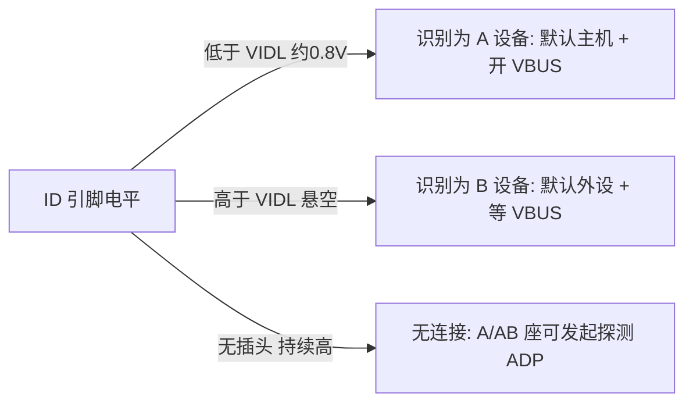
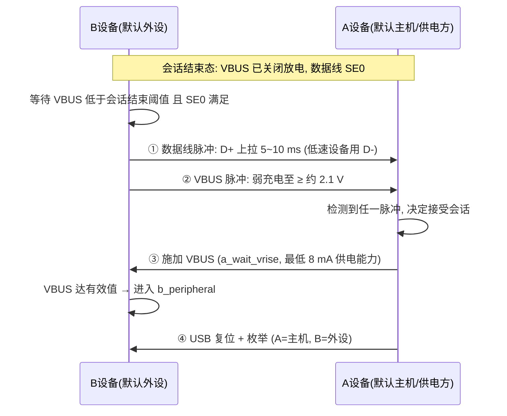
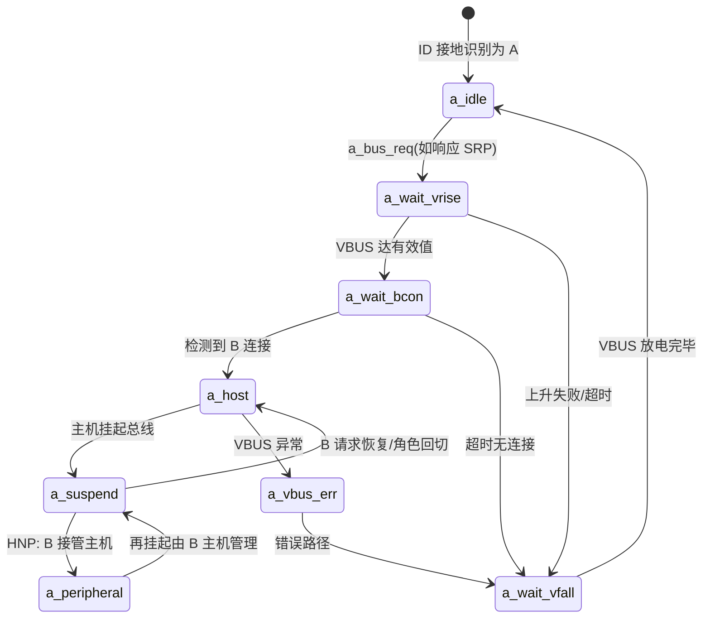
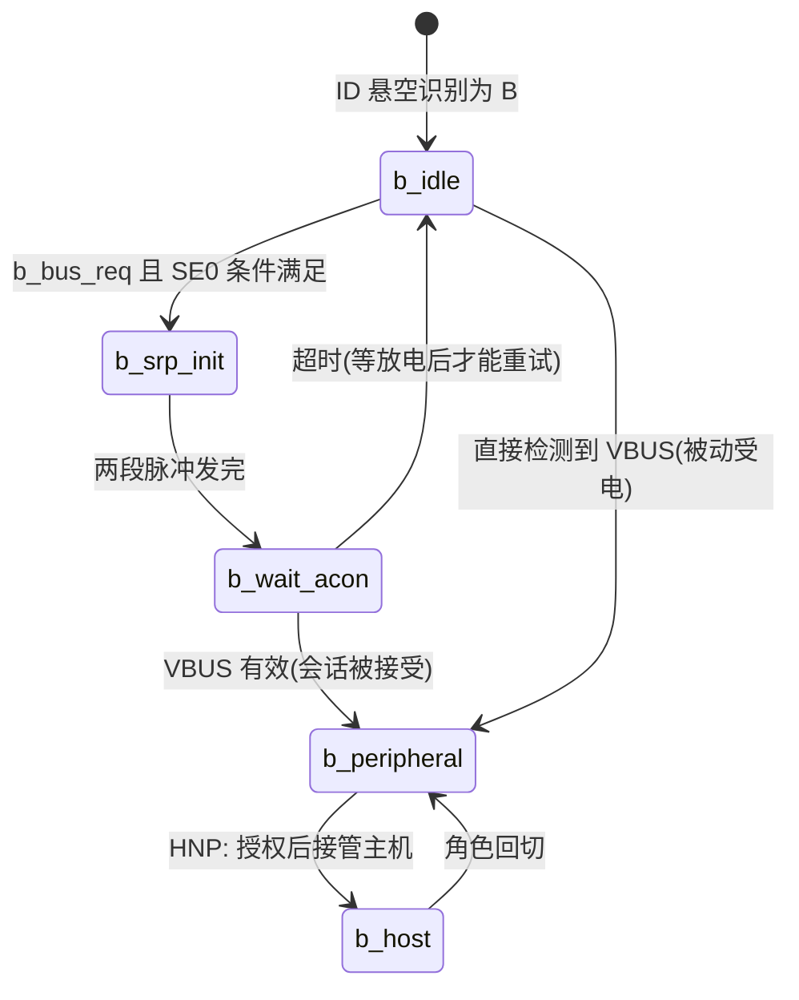

# USB OTG 与角色切换：SRP / HNP / ADP

> 🌳 知识树位置: 树干 → 枝干[接口与供电] → 叶
> ⬆️ 兄弟链接: [01-接口形态演进](01-接口形态演进.md) ｜ [02-USBType-C详解](02-USBType-C详解.md) ｜ [03-BC1.2与专有快充](03-BC1.2与专有快充.md) ｜ [04-USBPD协议](04-USBPD协议.md) ｜ [05-AlternateMode与E-marker](05-AlternateMode与E-marker.md) ｜ 树干: ../10-树干-USB核心/ ｜ 高速演进: ../40-枝干-高速演进/
> 规范原文缓存索引: [80-参考资料/README.md](../80-参考资料/README.md)

USB OTG (On-The-Go) 是 USB 2.0 的补充规范，首次让一个设备在**主机 (Host)** 与**外设 (Peripheral)** 之间动态切换：插上 U 盘时手机是主机，连上 PC 时手机是外设。为此 OTG 定义了三套机制——**SRP** (Session Request Protocol，B 设备请求供电会话)、**HNP** (Host Negotiation Protocol，不重新插拔即交换主机角色) 与 OTG 3.x 的 **ADP** (Attach Detection Protocol，VBUS 断电时探测接入)。Type-C + PD 时代它们大都被 DRP/PR_Swap/DR_Swap 取代，但在无 PD 控制器的嵌入式场景仍是主流方案。

## 一、OTG 版本演进：1.x → 2.0 → 3.0

| 版本 | 基础规范 | 关键内容 |
| --- | --- | --- |
| OTG 1.0（2001 年 12 月） | USB 2.0 | 首次定义 A/B 设备、SRP、HNP、Mini-AB 插座 |
| OTG 1.2 / 1.3（约 2005/2006） | USB 2.0 | 细化时序与错误处理（具体修订点见规范原文） |
| OTG 2.0（2012） | USB 2.0（含 L1 LPM） | 改用 Micro-AB 插座；并入**嵌入式主机** (Embedded Host) 概念与 **TPL** (Targeted Peripheral List)；本文 SRP/HNP 时序以该版为准 |
| OTG 3.x | USB 3.x | 面向 SuperSpeed 设备；引入 **ADP**（VBUS 完全断电时的接入探测），bcdOTG 特性位扩展 |

> 嵌入式主机 (Embedded Host)：不带可换线缆、用固定/标准 A 插座的主机，只声明支持 TPL 列表内的目标外设，不必实现完整的 A/B 双角色逻辑。各版本年份与修订细节以 usb.org 文档页为准。

## 二、A 设备与 B 设备：角色由插头决定

| 属性 | A 设备 (A-Device) | B 设备 (B-Device) |
| --- | --- | --- |
| 默认角色 | **主机** (Host) | **外设** (Peripheral) |
| VBUS | **供电方**（会话开始时施加 VBUS） | 受电方（可经 SRP 请求会话） |
| 插头/插座 | Micro-A 插头 ↔ **Micro-AB** 插座 | Micro-B 插头 ↔ Micro-B 插座 |
| ID 引脚 | 插头内接地 → 识别为 A | 插头内悬空 → 识别为 B |
| 典型形态 | 手机、OTG 适配器的小主机端 | U 盘、键盘、另一部手机 |

要点：

- 角色判定发生在**连接时刻**（看 ID 引脚），会话期间可通过 **HNP** 交换主机角色，但 **VBUS 始终由 A 设备供给**——OTG 2.0 只切换数据角色，不切换电源角色；
- OTG A 设备的 VBUS 供电下限仅 **8 mA**（标准主机为 100/500 mA），这是为电池设备省电与小体积刻意设定的，B 设备需大电流时在枚举后再按描述符协商；
- 双 OTG 设备（如两台手机）互联时，两端的 Micro-AB 插座由线缆两端的插头类型决定初始 A/B，**线缆本身**（Micro-A 转 Micro-B）固化了角色分配。

## 三、Micro-AB 插座与 ID 引脚

Micro-AB 插座可同时接受 Micro-A 与 Micro-B 插头，靠第 5 脚 **ID** 区分：

| 参数 | 取值（按规范，实现见电气表） | 说明 |
| --- | --- | --- |
| Micro-A 插头 | ID 经 **RA_ID（≤10 Ω 量级）接地** | 声明"我是 A 设备" |
| Micro-B 插头 | ID **悬空** | 声明"我是 B 设备" |
| 插座内部上拉 | R_IDP（约 100 kΩ，上拉至 3.3 V 量级） | 无插头时读高 |
| 判定阈值 | VIDL ≈ 0.8 V：**低于为 A，高于为 B** | 需去抖后判定 |



## 四、SRP：B 设备请求供电会话

会话结束后（A 关闭 VBUS），B 若想工作必须**请求会话**。SRP 由两段独立脉冲组成，A 检测到**任一**脉冲即可响应：

| 阶段 | 动作 | 参数 |
| --- | --- | --- |
| ① 数据线脉冲 (Data Line Pulsing) | B 打开自己的数据线上拉：全速设备拉 **D+**，低速设备拉 **D-**，持续 **5~10 ms** | 脉宽区间为规范规定（一致性测试 E22 即测此区间） |
| ② VBUS 脉冲 (VBUS Pulsing) | B 用微弱电流源给 VBUS 充电，**至少充到约 2.1 V**（A 侧检测阈值，规范记作 VA_SRP_DET 一类参数），但不允许充到 VBUS 有效值以上（避免被误判为已有供电） | 弱充电，拉不动重负载 |
| 前提 | B 发起前须确认会话确已结束：**VBUS 低于会话结束阈值**（约 0.8~2 V 区间的实现值）且数据线保持 SE0 一段时间（规范 b_se0_srp 条件） | 具体定时器名与取值见规范原文 |
| 核心定时器（evolve #26 自 OTG 2.0 v1.1a 定时表提取） | TA_AIDL_BDIS=200 ms（A-Idle→B-Detach，超时 A 可结束会话）；TA_BDIS_ACON≤100 ms（A 检出 SE0 后转主控）；TB_ASE0_BRST≥155 ms；TA_WAIT_BCON≥1.1 s；TA_BCON_SDB_WIN 典型 1.75 s | 取值单位 ms，出处 OTG 2.0 §5.3.1/§5.2.1 |
| 失败处理 | A 无响应时 B 放弃，须**等 VBUS 完全放电**到会话结束阈值以下才能重试 | 防止残余电压导致 A 误判 |



实现提示：A 侧常用比较器分别监测 D+ 电平与 VBUS 电平；B 侧 VBUS 脉冲能力受自身电容制约——**VBUS 挂大电容会充不到阈值，电容太小则脉冲维持不住**，PHY（如 ISP1362、TUSB1210 类器件）通常内置专用电流源与检测电路。

## 五、HNP：不重新插拔的主机角色交换

HNP 让"B 外设临时成为主机"（例如手机读 U 盘后反过来被 PC 读取），全程 **VBUS 不断**。前提：

1. B 的 **OTG 描述符**声明支持 HNP（见第六节）；
2. A（主机）枚举 B 时发送 `SET_FEATURE(a_hnp_support)` 告知"A 支持 HNP"；
3. A 愿意让渡时发送 `SET_FEATURE(b_hnp_enable)` **授权** B 发起交换；
4. A 挂起总线（suspend，**VBUS 必须保持**）。

### 5.1 OTG 相关 Feature Selector（USB 2.0 第 9 章）

| 值 | 名称 | 方向 | 含义 |
| --- | --- | --- | --- |
| 3 | `b_hnp_enable` | A→B | 授权 B 在挂起后可成为主机 |
| 4 | `a_hnp_support` | A→B | 告知 B：本 A 设备支持 HNP |
| 5 | `a_alt_hnp_support` | A→B | 告知 B：A 在**另一个端口**上支持 HNP（B 经集线器连接时的提示） |

### 5.2 全速 HNP 完整时序（按规范切换上拉位）

全速 (FS) 下外设身份的物理标志是"**谁把上拉电阻接在 D+ 上**"（主机侧是下拉），HNP 本质就是这颗上拉位的两次移交；高速 (HS) 设备挂起后本就回落 FS 信令，流程等同，详见规范 §6.6。

```mermaid
sequenceDiagram
    participant A as A设备(当前主机)
    participant B as B设备(当前外设, 已收 b_hnp_enable)
    A->>B: SET_FEATURE(a_hnp_support) → SET_FEATURE(b_hnp_enable)
    A->>A: 挂起总线 (VBUS 保持)
    B->>B: 想成为主机: 关闭自己的 D+ 上拉
    Note over A,B: 总线 SE0 (A 的下拉仍在场); VBUS 在 → 不是拔出而是 HNP 请求
    A->>A: 检测到挂起态持续 SE0 → 接受交换: 打开自己的 D+ 上拉 (A 变外设, 呈 J 态)
    B->>B: 检测 D+ 为高 (J) → A 已就外设位; B 切主机 (上拉改下拉)
    B->>A: USB 复位 (SE0 ≥ 10 ms) 后枚举 A
    Note over A,B: B=主机, A=外设; VBUS 仍由 A 供电
    B->>B: 用毕 → B 挂起总线
    A->>A: 想回主机: 关闭自己的 D+ 上拉 → 总线 SE0
    B->>B: 检测挂起态 SE0 (VBUS 在) → 打开自己的 D+ 上拉 (变回外设 J 态)
    A->>A: 检测 D+ 为高 → 恢复主机: 发复位/重开 SOF
```

| 步骤 | 判定条件 | 规范依据提示 |
| --- | --- | --- |
| B 关上拉 → SE0 | A 侧 SE0 持续超过普通设备断开判定阈值（约 2.5 µs 量级）**且 VBUS 在** | 仅凭 SE0 会与拔出混淆，VBUS 是区分依据 |
| A 开 D+ 上拉 | A 必须在规定时间内完成角色切换，否则 B 超时放弃（相关超时参数见规范原文） | 各超时定时器见规范 HNP 时序表 |
| B 发复位 | B 已是主机，对新外设 A 走标准复位+枚举 | 复位时长同 USB 2.0（≥10 ms） |

## 六、OTG 描述符与 bcdOTG 特性位

OTG 描述符只存在于**作为外设的 B 设备**，由 A 在枚举时经标准 `GET_DESCRIPTOR`（类型 9）读取：

| 偏移 | 字段 | 大小 | 取值 |
| --- | --- | --- | --- |
| 0 | bLength | 1 | **5** |
| 1 | bDescriptorType | 1 | **9**（OTG） |
| 2 | bcdOTG | 2 | 高字节=版本号（2.0 补充为 02h，3.x 为 03h）；低字节为特性位 |

bcdOTG 低字节特性位（OTG 3.x 起 ADP 位才有意义）：

| 位 | 特性 | 含义 |
| --- | --- | --- |
| bit0 | SRP 支持 | B 设备可发 SRP / A 设备可检测 SRP |
| bit1 | HNP 支持 | 双方可执行 HNP 角色交换 |
| bit2 | ADP 支持 | OTG 3.0 起定义，支持 VBUS 断电接入探测 |

## 七、ADP：VBUS 断电时的接入探测（OTG 3.0）

SRP 依赖 B 能给 VBUS 充电；但在 VBUS 完全断电、双方都休眠的场景（如 OTG 3.x 的 SuperSpeed 设备），需要**反向**探测：

- **A/DRP 侧主动探测**：周期性把 VBUS 放电到 0，然后停止放电观察——若对面有设备挂着 **VBUS 上拉/电流源**，VBUS 会被拉高越过探测阈值（规范 ADP 参数，典型亚伏级，见规范原文），即判定"有接入"；
- 对面若无设备，VBUS 维持 0，继续休眠轮询；
- ADP 之下才轮到开 VBUS、走正常会话；它取代的是 SRP 中"VBUS 脉冲"那一段，代价是 A 侧需周期性唤醒。

| 对比项 | SRP (OTG 2.0) | ADP (OTG 3.x) |
| --- | --- | --- |
| 发起方 | B 设备 | A/DRP 设备（探测方） |
| 物理手段 | B 拉数据线 + 给 VBUS 充电 | 探测方放电后观察 VBUS 是否被对面拉起 |
| VBUS 状态 | VBUS 已断，B 弱充电 | VBUS 完全断，探测方瞬时观测 |

## 八、OTG 状态机概貌（核心状态节选）

以下为 OTG 2.0 状态机的简化节选（完整状态、转移条件与变量 a_bus_req/b_bus_req 等以规范状态机章节为准）：





## 九、Type-C 时代的映射：OTG 概念去了哪里

| OTG 2.0 概念 | OTG 机制 | Type-C + PD 对应物 | 备注 |
| --- | --- | --- | --- |
| A 设备（默认主机+供电） | ID 接地 | DFP + Source（Rp 上拉） | CC 电阻即可宣告角色，无需 ID 引脚 |
| B 设备请求供电 | SRP 两段脉冲 | 插入检测 + PD Request | Type-C 下插入即被 Rp/Rd 检测，SRP 消亡 |
| 主机角色让渡 | HNP（挂起+SE0+上拉移交） | PD **DR_Swap**（数据角色交换） | 都不需重新插拔 |
| ——（OTG 无此能力） | — | PD **PR_Swap**（电源角色交换） | OTG 时代 VBUS 永远归 A；PD 才能换 |
| A/B 双方协商偏好 | 应用层约定 | DRP 轮换 (tDRP，约 50~100 ms) + **Try.SRC/Try.SNK** | "谁说了算"的现代解法 |
| 探测接入 | ADP / SRP | CC 线连接检测（Type-C 规范原生能力） | Type-C 恒有 CC 检测，问题天然简化 |

OTG 的剩余价值：

1. **无 PD 控制器的嵌入式主机**：MCU 的 USB OTG 外设（如 STM32 OTG_FS/HS）+ Micro-AB/转接座，零额外芯片实现"手机读 U 盘"式主机；
2. **BC1.2/专有快充共存**的旧式 micro-USB 生态（见 [03-BC1.2与专有快充](03-BC1.2与专有快充.md)）；
3. 作为理解 PD 角色交换（PR_Swap/DR_Swap/FR_Swap）的**概念底座**——状态机思想一脉相承。

## 十、调试 OTG 的常见问题

| 症状 | 根因 | 排查/处置 |
| --- | --- | --- |
| B 发了 SRP，A 不上电 | A 侧比较器阈值与 B 脉冲不匹配：VBUS 充不到约 2.1 V（B 侧负载电容过大）或数据脉冲宽度不足 5 ms | 示波器量两段脉冲；核对 PHY 检测寄存器 |
| VBUS 上升缓慢/欠压 | A 仅承诺 8 mA，线缆压降+容性负载导致达不到 VBUS 有效值（约 4.4 V） | 加软启动限流；核对 a_wait_vrise 类超时 |
| A/B 识别颠倒 | ID 上拉缺失、VIDL 阈值配置错、插头接触不良 | 量 ID 电压；加去抖 |
| B 永远成不了主机 | A 协议栈没读 OTG 描述符、没发 `b_hnp_enable`；或挂起时顺手关了 VBUS（HNP 要求 VBUS 保持） | 抓 SET_FEATURE 请求；检查挂起策略 |
| 挂起态 SE0 被判成拔出 | 判定只看了 SE0，未结合 VBUS 在场 | HNP 请求=SE0 持续 + VBUS 有效，二者缺一不可 |
| 双方同时请求角色 | 未实现规范规定的裁决与回退时序 | 严格按状态机实现，注意回切方向 |
| 断开后无法再次 SRP | VBUS 放电不完全，残留高于会话结束阈值 | 检查放电电阻与 a_wait_vfall 类时序 |

## 相关节点

- [01-接口形态演进](01-接口形态演进.md)：Mini/Micro-AB 插座形态沿革
- [02-USBType-C详解](02-USBType-C详解.md)：Rp/Rd 与 DRP 轮换，ID 引脚的现代替代
- [03-BC1.2与专有快充](03-BC1.2与专有快充.md)：OTG 同时代的供电协商方案
- [04-USBPD协议](04-USBPD协议.md) 与 [07-USBPD深入-状态机与消息全表](07-USBPD深入-状态机与消息全表.md)：PR_Swap/DR_Swap 如何取代 SRP/HNP
- ../10-树干-USB核心/08-枚举流程与标准请求.md：SET_FEATURE/GET_DESCRIPTOR 机制
- ../10-树干-USB核心/10-电源管理与挂起唤醒.md：挂起与 resume 的总线状态基础
- ../10-树干-USB核心/09-集线器与连接管理.md：连接检测与断开判定（SE0 阈值）
- ../40-枝干-高速演进/01-USB3x与SuperSpeed.md：OTG 3.x 所依附的高速规范
