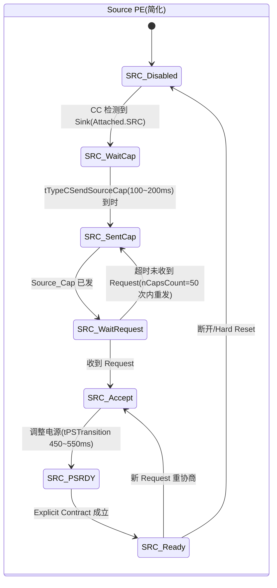
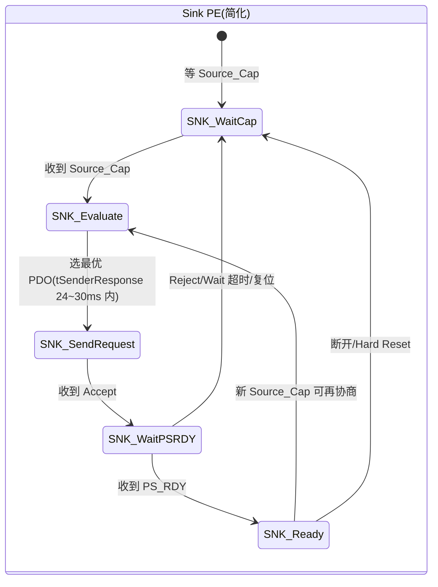
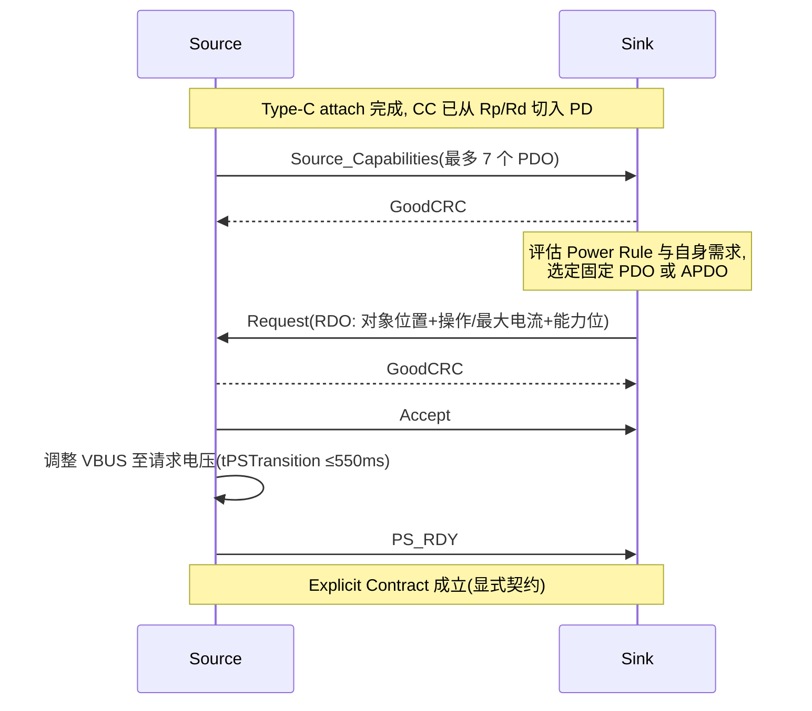
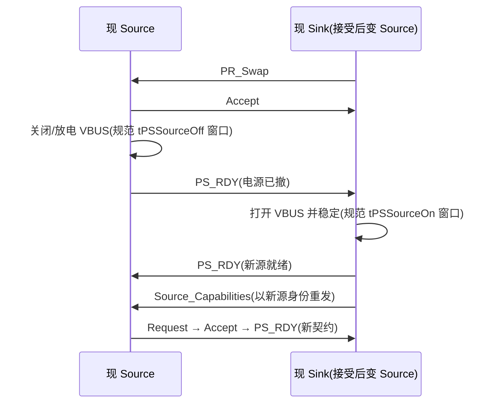

# USB PD 深入：状态机与消息全表（PD 3.1 视角）

> 🌳 知识树位置: 树干 → 枝干[接口与供电] → 叶
> ⬆️ 兄弟链接: [02-USBType-C详解](02-USBType-C详解.md) ｜ [04-USBPD协议](04-USBPD协议.md) ｜ [05-AlternateMode与E-marker](05-AlternateMode与E-marker.md) ｜ [06-OTG与角色切换-HNP-SRP](06-OTG与角色切换-HNP-SRP.md) ｜ 树干: ../10-树干-USB核心/ ｜ 高速演进: ../40-枝干-高速演进/
> 规范原文缓存索引: [80-参考资料/README.md](../80-参考资料/README.md)

本页是 [04-USBPD协议](04-USBPD协议.md) 的深入篇：以 **PD 3.1**（兼容 2.0/3.0）为准，给出物理层细节、完整消息类型表、Header 逐字段编码、Source/Sink 状态机、协商/PPS/EPR 全流程、四种角色交换时序、VDM 结构与实现者清单。消息编号以规范消息类型表为准（控制/数据消息各一张表）。

## 一、物理层速览：CC 线上的 BMC

| 项目 | 参数 |
| --- | --- |
| 传输媒介 | 连接方向一致的一根 **CC 线**（半双工，同一时刻只有一个发送方） |
| 调制 | **BMC** (Biphase Mark Coding，双相标记编码)，速率约 **200~300 kbps**（标称 300 kbps） |
| 线路编码 | 数据部分经 **4b5b** 编码（每 4 位映射 5 位码字，编码表见规范原文；另有 Sync/RST/EOP 等 K 码），LSB 先发 |
| 帧前导 | **Preamble**：64 位 0101 交替序列（不参与 4b5b），供接收方锁定时钟 |
| 校验 | **CRC-32**（多项式与以太网同族 0x04C11DB7） |
| 结束 | **EOP**（单个 K 码结束符）后发送方释放 CC |
| 前身 | PD 1.0 曾用 VBUS 上的 BPSK 载波，已弃用；PD 2.0 起统一为 CC+BMC |

## 二、SOP 序列：五张"收件人标签"

消息开头是 4 个 K 码组成的 **Ordered Set**，指明这条消息发给谁：

| 序列 | K 码组合 | 用途 |
| --- | --- | --- |
| **SOP** | Sync-1, Sync-1, Sync-1, Sync-2 | 直连的端口伙伴 (Port Partner)：源↔宿 |
| **SOP'** | Sync-1, Sync-1, Sync-3, Sync-3 | 线缆**近源端插头**（E-marker 所在处），源与宿都可寻址它 |
| **SOP''** | Sync-1, Sync-3, Sync-1, Sync-3 | 线缆**远端插头**（另一侧芯片/远端 E-marker） |
| **SOP' Debug** | （K 码组合见规范 Ordered Set 表） | 调试配件寻址近端插头 |
| **SOP'' Debug** | （K 码组合见规范 Ordered Set 表） | 调试配件寻址远端插头 |

MessageID 计数器、重传状态等均**按 SOP 类型独立维护**；E-marker 通信（Discover Identity 查询线缆能力）即经 SOP'（见 [05-AlternateMode与E-marker](05-AlternateMode与E-marker.md)）。

## 三、消息帧结构与可靠传输

```
| Preamble(64bit) | SOP(K码x4) | Header(16bit) | Payload(0~7个32bit数据对象) | CRC-32 | EOP |
```

可靠传输三件套：

1. **GoodCRC 自动应答**：接收方对收到的每条消息立即回控制消息 GoodCRC（**回显相同 MessageID**），通常由 PHY/控制器硬件自动完成；
2. **tReceive 超时**：接收方须在 **tReceive（约 0.9~1.1 ms）** 内收完整帧，否则整帧丢弃；发送方在此窗口内未等到 GoodCRC 即**重发**；
3. **MessageID 去重重传**：每端口**每 SOP 类型、每方向**维护 3 位计数器 **nMessageIDCounter（0~7 循环）**，每条新消息自增；重发沿用同一 MessageID，重试上限 **nRetryCount**（规范默认值，见 PD Timers 表）；接收方收到重复 MessageID 丢弃但**仍回 GoodCRC**。Hard Reset、Cable Reset、BIST 消息**不**回 GoodCRC，重试计数另有 **nHardResetCount（=2）**。

## 四、Header 16 位逐字段表

| 位 | 字段 | 取值/说明 |
| --- | --- | --- |
| 15 | Extended | 1 = 扩展消息（结构化扩展头跟在 Header 后，见第八节） |
| 14:12 | Number of Data Objects | 后续 32 位对象数 0~7（控制消息=0） |
| 11:9 | MessageID | 0~7 循环，配 GoodCRC 确认/去重 |
| 8 | Port Power Role | SOP 消息：0=Sink，1=Source（SOP'/SOP'' 中含义见规范） |
| 7:6 | Specification Revision | 00=Rev1.0，01=Rev2.0，10=Rev3.x（双方取共同版本） |
| 5 | Port Data Role | 0=UFP，1=DFP（SOP'/SOP'' 消息中为线缆插头标识） |
| 4:0 | Message Type | 编号见下面两表 |

**解码示例**：PD 3.0 源端发 Source_Capabilities（5 个 PDO、MessageID=0）：
`5<<12 | SRC | Rev3 | DFP | 0x01` = `0x5000 + 0x0100 + 0x0080 + 0x0020 + 0x0001` = **0x51A1**（线上低字节在前）。

## 五、控制消息类型全表（Message Type，无数据对象）

| 编号 | 消息 | 引入 | 用途 |
| --- | --- | --- | --- |
| 0x01 | **GoodCRC** | 1.0 | PHY 级确认，回显 MessageID |
| 0x02 | GotoMin | 1.0 | 请求对方降到最小电流（PD 3.2 已弃用） |
| 0x03 | **Accept** | 1.0 | 接受请求/交换 |
| 0x04 | **Reject** | 1.0 | 拒绝（契约保留） |
| 0x05 | Ping | 1.0 | 主机探活（PD 3.0 起移除） |
| 0x06 | **PS_RDY** | 1.0 | 电源切换完成（电压/电流已就位） |
| 0x07 | **Get_Source_Cap** | 1.0 | Sink 索要 PDO 列表 |
| 0x08 | **Get_Sink_Cap** | 1.0 | 索要对方 Sink 能力 |
| 0x09 | **DR_Swap** | 2.0 | 数据角色交换（DFP↔UFP） |
| 0x0A | **PR_Swap** | 2.0 | 电源角色交换（Source↔Sink） |
| 0x0B | **VCONN_Swap** | 2.0 | VCONN 供电方交换 |
| 0x0C | Wait | 1.0 | "稍等"，对方可超时后重试 |
| 0x0D | **Soft_Reset** | 1.0 | 复位协议层状态（MessageID/定时器），不动电源 |
| 0x10 | **Not_Supported** | 3.0 | 对不支持消息的规范应答（3.0 前只能回 Reject） |
| 0x11 | Get_Source_Cap_Extended | 3.0 | 索要扩展源能力（触发扩展消息应答） |
| 0x12 | Get_Status | 3.0 | 索要 Status 扩展应答（见第七节） |
| 0x13 | FR_Swap | 3.0 | 快速电源角色交换 |
| 0x14 | Get_PPS_Status | 3.0 | 索要 PPS 状态 |
| 0x15 | Get_Country_Codes | 3.0 | 索要国家/地区码 |
| 0x16+ | （PD 3.1/3.2 续有扩充，如 Get_Sink_Cap_Extended、Get_Revision 等） | — | 编号以规范控制消息类型表为准 |

## 六、数据消息类型全表（Message Type，带数据对象）

| 编号 | 消息 | 引入 | 用途 |
| --- | --- | --- | --- |
| 0x01 | **Source_Capabilities** | 1.0 | 源能力广播：最多 7 个 PDO（详见 [04-USBPD协议](04-USBPD协议.md)） |
| 0x02 | **Request** | 1.0 | Sink 请求：RDO 指明选中对象位置与操作/最大电流（10 mA 单位） |
| 0x03 | BIST | 1.0 | 一致性测试模式（BIST Carrier Mode 等不入 CRC 计数规则见规范） |
| 0x04 | **Sink_Capabilities** | 1.0 | Sink 能力上报（含自身可接受的电压档） |
| 0x05 | Battery_Status | 1.0 | 电池状态上报 |
| 0x06 | Alert | 3.0 | 异步事件告警（如外部电源插入等，见规范） |
| 0x07 | Get_Country_Info | 3.0 | 索要国家/地区相关信息 |
| 0x08 | Enter_USB | 3.0 | 请求进入指定 USB 版本/速率的数据模式（USB4 协商入口之一） |
| 0x09~0x0D | （EPR 模式专用消息，见第十一节；编号以规范为准） | 3.1 | EPR_Request / EPR_Mode 等 |
| 0x0E | 保留 | — | — |
| 0x0F | **Vendor_Defined (VDM)** | 1.0 | 厂商扩展：Alt Mode、Discover Identity、线缆查询等（见第十三节） |

## 七、扩展消息与 Chunking 分块

Header bit15=1 时，紧跟 2 字节**结构化扩展头**：

| 位 | 字段 | 说明 |
| --- | --- | --- |
| 15 | Chunked | 1 = 分块传输 |
| 14:11 | Chunk Number | 块号 0 起 |
| 10 | Request Chunk | 请求重发指定块 |
| 9:0 | Data Size | 扩展数据总字节数（规范上限 260 字节，见规范） |

- 普通消息最多 7 个 32 位对象=28 字节，减去扩展头 2 字节，**每块有效数据约 26 字节**，超过即分块，接收方按块号拼装；
- 主要扩展消息（编号以规范扩展消息类型表为准）：Source_Cap_Extended、Status、Get_Battery_Cap / Battery_Status / Battery_Cap、Get_Manufacturer_Info / Manufacturer_Info、**Security_Request / Security_Response**、FW_Update_Request / Response、PPS_Status、Country_Codes、Sink_Cap_Extended；
- Get_Source_Cap_Extended、Get_Status、Get_Country_Codes 等是**触发**扩展应答的控制消息（编号见第五节表）。

## 八、Source / Sink 电源状态机（简化）





真实规范中两者是更大的 PE_SRC/PE_SNK 状态集（含 Hard Reset、PR_Swap、BIST、EPR 子机），本图为协商主干。

## 九、协商全流程与 Explicit Contract



- **Explicit Contract**：PS_RDY 之后的电压/电流约定。契约前 Sink 只能按 Type-C 默认（5 V，Rp 声明的电流档）取电；
- **Power Rule（功率仲裁）**：两个 DRP 对连时，**能供更大功率的一方成为 Source**——这是 CC 协商与 PD 能力共同决定的仲裁规则，也解释了充电宝对插手机时的方向；
- Sink 重发 Request 可随时改电压电流（新契约覆盖旧契约）；Source 档位变化时主动重发 Source_Cap；
- Soft_Reset 只复位协议层（契约保留）；Hard Reset 是电气级：VBUS 回 vSafe0V 再回 5 V，**契约作废**。

## 十、PPS 运行循环

| 要素 | 说明 |
| --- | --- |
| 载体 | APDO (PPS)：3.3 V 起连续可调，**20 mV 电压步进**、50 mA 电流步进，上限随档位 5.9/11/16/21 V |
| 请求 | 每次都发普通 Request（RDO 指向 PPS APDO），可实时微调电压/电流（恒压/恒流闭环，直充常用） |
| 保活 | Sink 必须**周期性重发 Request** 维持 PPS（规范 PD Timers 表中的 PPS 相关超时窗口，见规范原文） |
| 回退 | Source 超时未收到新 Request，或收到异常请求，即**退出 PPS 回落 SPR 固定档契约**；Get_PPS_Status 可查询状态 |

## 十一、EPR 模式（PD 3.1）

| 功率档 | 电压/电流 | 功率 |
| --- | --- | --- |
| SPR 上限 | 20 V/5 A | 100 W |
| EPR 固定档 | 28/36/48 V，5 A | 140/180/**240 W** |
| EPR AVS | 连续可调范围（见规范 EPR AVS 定义） | 最高 240 W |

- **进入前提**：双方为 EPR capable（能力经消息能力位声明）、**线缆为 EPR capable**（5 A e-marker，经 SOP' 查询确认）、当前契约 **≥100 W**；
- **进入流程**：Sink（或 Source）发 **EPR_Mode** 消息（Entry 动作）→ 双方进入 EPR → Source 经 **EPR_Source_Cap**（分块扩展消息）发布 28/36/48 V EPR PDO（EDO）→ Sink 用 **EPR_Request** 请求 → Accept/PS_RDY 建立 EPR 契约（消息编号见规范数据消息类型表）；
- **维持**：EPR 模式要求周期性 KeepAlive 类消息（定时器与窗口见规范）；
- **退出**：收到 EPR_Mode Exit、收到普通 Request、超时、断开或 Hard Reset 时退出并**回落 SPR**（电压降回 ≤20 V）；普通 Source_Capabilities 不含 EPR PDO。

## 十二、四种角色交换对比

| 交换 | 发起方 | 消息流 | 变化 | 关键点 |
| --- | --- | --- | --- | --- |
| **PR_Swap** | Source 或 Sink | PR_Swap→Accept→(电源切换)→PS_RDY | 电源角色对调，VBUS 转移 | 双方都须能供电；完成后新 Source 重发 Source_Cap 重建契约 |
| **DR_Swap** | DFP 或 UFP | DR_Swap→Accept | 数据角色对调 DFP↔UFP | 不动电源；现 DFP 收到后即刻翻转 |
| **VCONN_Swap** | 当前 VCONN 源 | VCONN_Swap→Accept→PS_RDY | 谁给线缆 E-marker 供电对调 | 双方须具备 VCONN 供电能力 |
| **FR_Swap** | 仅 Sink | FR_Swap→Accept→(Get_Sink_Cap 校验)→快速切换 | 快速电源角色对调 | 目标把供电中断压到 **150 µs 量级**（精确指标见规范）；用于带后备电池的坞站/显示屏 |



对比 OTG：HNP 只切数据角色且 VBUS 不动（见 [06-OTG与角色切换-HNP-SRP](06-OTG与角色切换-HNP-SRP.md)），PD 的 PR_Swap 才真正完成"换谁供电"。

## 十三、VDM 结构（Vendor Defined Message）

VDM 首个 32 位对象为 **VDM Header**（结构化 SVDM）：

| 位 | 字段 | 说明 |
| --- | --- | --- |
| 31:16 | SVID | Standard or Vendor ID（16 位） |
| 15 | VDM Type | 0=结构化 SVDM，1=非结构化 UVDM |
| 14:13 | SVDM Version | 结构化版本（PD 3.0 用 10=2.0） |
| 12:11 | VDO Version | VDO 版本 |
| 10:8 | Object Position | 模式索引 1~7 |
| 7 | 保留 | — |
| 6 | ACK | 1=应答 |
| 5 | IRQ | 1=有后续消息 |
| 4:3 | Command Type | 1=REQ（发起），2=ACK，3=NAK |
| 2:0 | Command | 见下表 |

| 命令值 | 命令 | 用途 |
| --- | --- | --- |
| 1 | Discover Identity | 查身份：SOP' 可读出线缆类型/电流额定（3A/5A）/EPR 能力 |
| 2 | Discover SVIDs | 枚举对方支持的 SVID 列表 |
| 3 | Discover Modes | 枚举某 SVID 下的模式 (Modes) |
| 4 / 5 | Enter Mode / Exit Mode | 进入/退出某模式 |
| 6 | Attention | 模式内事件提示 |

后续对象为 **VDO** (Vendor Data Object)，内容随命令与产品类型（Docks/Peripherals/AMA/Cable）不同，定义见规范与各 SVID 文档。Alt Mode 进入流程（DP over Type-C 等）见 [05-AlternateMode与E-marker](05-AlternateMode与E-marker.md)。

## 十四、PD 3.x 安全消息

PD 3.0 引入 **Security_Request / Security_Response** 扩展消息对，配合 USB PD Authentication 规范完成**挑战-响应式身份认证**（证书交换与签名校验），供主机/充电器验证对端（尤其线缆电子标签与配件）真伪；PD 3.1 又为 EPR 补充配套安全要求与消息（细节以规范与安全规范文档为准）。安全能力位在能力消息中协商，未认证链路上的敏感操作（如 EPR）会被规范收紧。

## 十五、实现者清单

**架构分层**：应用（DPM, Device Policy Manager）→ **PE** (Policy Engine，每端口一个，分 PE_SRC/PE_SNK 子状态机) → **TCPM/TCPC**（策略管理器与接口控制器，常见 I²C 连接）→ PHY（BMC/4b5b/CRC，GoodCRC 自动应答最好硬件化——tReceive ≤1.1 ms 在慢速 MCU 上软件难以保证）。

| 定时器/计数器 | 取值 | 用途 |
| --- | --- | --- |
| tReceive | 0.9~1.1 ms | 收帧/GoodCRC 等待窗口 |
| tSenderResponse | 24~30 ms | 收到请求类消息后的应答时限 |
| tTypeCSendSourceCap | 100~200 ms | Source 重发 Source_Cap 间隔 |
| nCapsCount | 50 | Source_Cap 最大重发次数 |
| tNoResponseTimer | 4.5~5.5 s | 无应答总超时（之后回退/报错） |
| tPSTransition | 450~550 ms | 电源状态切换窗口 |
| tSrcRecover | 660~1000 ms | Source 恢复时间窗 |
| nHardResetCount | 2 | Hard Reset 重试上限 |
| tFirstSourceCap | 约 100~250 ms（见规范） | attach 后首包 Source_Cap 窗口 |

PE 实现要点：

1. MessageID 计数器**每 SOP 类型、每方向**独立 0~7 循环；重复 ID 丢包仍回 GoodCRC；
2. 收到 Request 时校验 RDO 对象位置、电流是否超 PDO 上限，违规回 Reject（3.0+ 可回 Not_Supported）；
3. 状态机必须处理 Wait（对方稍等）与超时重试的边界；Hard Reset 后从 vSafe0V 重新走协商；
4. SOP' 查询线缆能力在 EPR/高电流场景是前置步骤，勿遗漏；
5. 所有取值以规范 PD Timers/消息类型表为准，本表是速查不是替代。

## 相关节点

- [04-USBPD协议](04-USBPD协议.md)：PDO/RDO 编码与功率档位速查（本篇的入门篇）
- [05-AlternateMode与E-marker](05-AlternateMode与E-marker.md)：VDM/Alt Mode 与 SOP' 线缆查询的应用层
- [02-USBType-C详解](02-USBType-C详解.md)：CC 检测、Rp/Rd、VCONN 与 tDRP
- [06-OTG与角色切换-HNP-SRP](06-OTG与角色切换-HNP-SRP.md)：角色交换的前身 OTG HNP/SRP
- ../10-树干-USB核心/05-包格式与事务.md：USB 2.0 包结构与本篇 PD 帧的对照
- ../10-树干-USB核心/11-错误处理与可靠性.md：CRC/重传思想的同源设计
- ../40-枝干-高速演进/01-USB3x与SuperSpeed.md 与 02-USB4与雷电整合.md：Enter_USB 所服务的 USB4 协商
- ../70-枝干-调试测试与安全/：PD 协议分析仪与一致性测试
