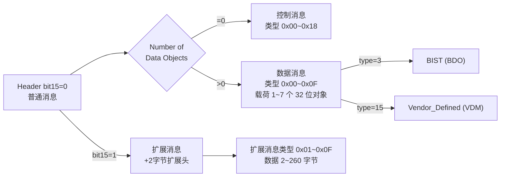

# USB PD 消息全表：权威编号与数据对象位域

> 🌳 知识树位置: 树干 → 枝干[接口与供电] → 叶
> ⬆️ 兄弟链接: [04-USBPD协议](04-USBPD协议.md) ｜ [07-USBPD深入-状态机与消息全表](07-USBPD深入-状态机与消息全表.md)（本篇是其"编号+位域"全表化延伸，叙述不再重复） ｜ [09-TypeC规范级-状态机与CC时序](09-TypeC规范级-状态机与CC时序.md) ｜ 树干: ../10-树干-USB核心/ ｜ 高速演进: ../40-枝干-高速演进/
> 规范原文缓存索引: [80-参考资料/README.md](../80-参考资料/README.md)

本篇给出 USB PD **全部消息类型编号**与**数据对象逐位定义**。消息编号与位域以 Linux 内核头文件 `include/linux/usb/pd.h`、`pd_vdo.h`、`pd_bdo.h`（torvalds/master）为权威提取源——该头文件与 USB PD 规范消息类型表一一对应，是可离线核对的"规范替身"；PD 规范本体未缓存（门控下载），涉及规范原文才能确定的内容一律标"见 PD 规范"。帧结构、GoodCRC/MessageID 可靠传输、协商时序等叙述见 [07-USBPD深入-状态机与消息全表](07-USBPD深入-状态机与消息全表.md)。

## 一、消息路由总览

## 二、控制消息类型全表（Header 中 NDO=0，类型编号 4:0 位）

来源：内核 `pd.h` 枚举 `pd_ctrl_msg_type`（编号即线上值，十六进制）。

| 编号 | 内核宏 | 消息 | 版本 | 一句话用途 |
| --- | --- | --- | --- | --- |
| 0x00 | — | Reserved | — | 保留 |
| 0x01 | PD_CTRL_GOOD_CRC | GoodCRC | 1.0 | PHY 级确认，回显 MessageID |
| 0x02 | PD_CTRL_GOTO_MIN | GotoMin | 1.0 | 请求降至最小电流（PD 3.x 弃用） |
| 0x03 | PD_CTRL_ACCEPT | Accept | 1.0 | 接受请求/交换 |
| 0x04 | PD_CTRL_REJECT | Reject | 1.0 | 拒绝（契约保留） |
| 0x05 | PD_CTRL_PING | Ping | 1.0 | 源探活（PD 3.0 移除） |
| 0x06 | PD_CTRL_PS_RDY | PS_RDY | 1.0 | 电源状态切换完成 |
| 0x07 | PD_CTRL_GET_SOURCE_CAP | Get_Source_Cap | 1.0 | 索要 Source_Capabilities |
| 0x08 | PD_CTRL_GET_SINK_CAP | Get_Sink_Cap | 1.0 | 索要 Sink_Capabilities |
| 0x09 | PD_CTRL_DR_SWAP | DR_Swap | 2.0 | 数据角色交换 |
| 0x0A | PD_CTRL_PR_SWAP | PR_Swap | 2.0 | 电源角色交换 |
| 0x0B | PD_CTRL_VCONN_SWAP | VCONN_Swap | 2.0 | VCONN 供电方交换 |
| 0x0C | PD_CTRL_WAIT | Wait | 1.0 | "稍等"，发起方可超时重试 |
| 0x0D | PD_CTRL_SOFT_RESET | Soft_Reset | 1.0 | 复位协议层（MessageID/定时器） |
| 0x0E~0x0F | — | Reserved | — | 保留 |
| 0x10 | PD_CTRL_NOT_SUPP | Not_Supported | 3.0 | 对不支持消息的规范应答 |
| 0x11 | PD_CTRL_GET_SOURCE_CAP_EXT | Get_Source_Cap_Extended | 3.0 | 触发 Source_Cap_Extended 应答 |
| 0x12 | PD_CTRL_GET_STATUS | Get_Status | 3.0 | 触发 Status 应答 |
| 0x13 | PD_CTRL_FR_SWAP | FR_Swap | 3.0 | 快速电源角色交换 |
| 0x14 | PD_CTRL_GET_PPS_STATUS | Get_PPS_Status | 3.0 | 触发 PPS_Status 应答 |
| 0x15 | PD_CTRL_GET_COUNTRY_CODES | Get_Country_Codes | 3.0 | 触发 Country_Codes 应答 |
| 0x16 | PD_CTRL_GET_SINK_CAP_EXT | Get_Sink_Cap_Extended | 3.x | 触发 Sink_Cap_Extended 应答 |
| 0x17 | — | Reserved | — | 内核 pd.h 标注保留 |
| 0x18 | PD_CTRL_GET_REVISION | Get_Revision | 3.x | 索要 Revision（触发数据消息 Revision） |
| 0x19~0x1F | — | Reserved | — | 保留 |

## 三、数据消息类型全表（NDO≥1，类型编号 4:0 位）

来源：内核 `pd.h` 枚举 `pd_data_msg_type`。

| 编号 | 内核宏 | 消息 | 载荷 | 一句话用途 |
| --- | --- | --- | --- | --- |
| 0x00 | — | Reserved | — | 保留 |
| 0x01 | PD_DATA_SOURCE_CAP | Source_Capabilities | ≤7×PDO | 源能力广播（PDO 见第六节） |
| 0x02 | PD_DATA_REQUEST | Request | 1×RDO | 请求供电（RDO 见第五节） |
| 0x03 | PD_DATA_BIST | BIST | 1×BDO | 一致性测试入口（见第十节） |
| 0x04 | PD_DATA_SINK_CAP | Sink_Capabilities | ≤7×PDO | Sink 能力上报 |
| 0x05 | PD_DATA_BATT_STATUS | Battery_Status | 1×BSDO | 电池状态（见第三节末） |
| 0x06 | PD_DATA_ALERT | Alert | 1~2 对象 | 异步事件告警（位定义见 PD 规范） |
| 0x07 | PD_DATA_GET_COUNTRY_INFO | Get_Country_Info | 1 对象 | 索要国家/地区信息 |
| 0x08 | PD_DATA_ENTER_USB | Enter_USB | 1×EUDO | 请求进入指定 USB 模式（见第八节） |
| 0x09~0x0B | — | Reserved（内核标注） | — | PD 3.1 的 EPR_Source_Cap / EPR_Request / EPR_Mode 占此区段，内核 pd.h 未给宏，编号见 PD 规范 §6.3 数据消息类型表 |
| 0x0C | PD_DATA_REVISION | Revision | 2 对象 | Get_Revision 的应答（版本协商） |
| 0x0D~0x0E | — | Reserved | — | 保留 |
| 0x0F | PD_DATA_VENDOR_DEF | Vendor_Defined | VDM | 厂商扩展：Alt Mode/线缆查询（见第九节） |
| 0x10~0x1F | — | Reserved | — | 保留 |

## 四、扩展消息类型全表（Header bit15=1）与扩展头位域

来源：内核 `pd.h` 枚举 `pd_ext_msg_type` 与 `PD_EXT_HDR_*` 宏。

| 编号 | 内核宏 | 消息 | 方向/用途 |
| --- | --- | --- | --- |
| 0x00 | — | Reserved | 保留 |
| 0x01 | PD_EXT_SOURCE_CAP_EXT | Source_Cap_Extended | Source→Sink：能力扩展（裕量等） |
| 0x02 | PD_EXT_STATUS | Status | Source→Sink：Get_Status 应答（含 PPS 状态位） |
| 0x03 | PD_EXT_GET_BATT_CAP | Get_Battery_Cap | 索要电池能力 |
| 0x04 | PD_EXT_GET_BATT_STATUS | Get_Battery_Status | 索要电池状态（触发 BSDO） |
| 0x05 | PD_EXT_BATT_CAP | Battery_Capability | 电池能力应答（内核 `batt_cap_ext_msg`：VID/PID/设计容量 0.1Wh/上次充满容量/类型） |
| 0x06 | PD_EXT_GET_MANUFACTURER_INFO | Get_Manufacturer_Info | 索要厂商信息 |
| 0x07 | PD_EXT_MANUFACTURER_INFO | Manufacturer_Info | 厂商信息应答 |
| 0x08 | PD_EXT_SECURITY_REQUEST | Security_Request | 认证挑战（配 USB PD Authentication） |
| 0x09 | PD_EXT_SECURITY_RESPONSE | Security_Response | 认证应答 |
| 0x0A | PD_EXT_FW_UPDATE_REQUEST | FW_Update_Request | 固件更新请求 |
| 0x0B | PD_EXT_FW_UPDATE_RESPONSE | FW_Update_Response | 固件更新应答 |
| 0x0C | PD_EXT_PPS_STATUS | PPS_Status | Get_PPS_Status 应答 |
| 0x0D | PD_EXT_COUNTRY_INFO | Country_Info | 国家/地区信息应答 |
| 0x0E | PD_EXT_COUNTRY_CODES | Country_Codes | Get_Country_Codes 应答（国家码列表） |
| 0x0F | PD_EXT_SINK_CAP_EXT | Sink_Cap_Extended | Sink 能力扩展（内核 `sink_caps_ext_msg`：SKEDB 版本、负载特性、SPR/EPR 的 min/op/max PDP、模式位 SINK_MODE_PPS/VBUS/AC_SUPPLY/BATT/AVS） |
| 0x10~0x1F | — | Reserved | 保留 |

**扩展头（16 位）位域**（内核 `PD_EXT_HDR_*`）：

| 位 | 字段 | 说明 |
| --- | --- | --- |
| 15 | Chunked | 1=分块传输（PD 3.0） |
| 14:11 | Chunk Number | 块号 0~15（`PD_EXT_HDR_CHUNK_NUM`） |
| 10 | Request Chunk | 1=请求重发指定块 |
| 9:0 | Data Size | 扩展数据总字节数 0~511（规范上限 260） |

每块数据固定 **26 字节**（内核 `PD_EXT_MAX_CHUNK_DATA`），即 7 个 32 位对象扣除扩展头后单块有效载荷。

**Battery Status Data Object（BSDO）位域**（内核 `BSDO_*`）：B31:16 当前电量 0.1Wh；B11:10 充电状态（0=充电，1=放电，2=空闲）；B9 电池在位；B8 无效电池引用。

## 五、RDO（Request Data Object）32 位位域表

来源：内核 `pd.h` `RDO_*` 宏。注意：**B19:10 是工作电流（10 mA 单位）、B9:0 是最大电流（10 mA 单位）**，RDO 中没有电压字段（电压由所指向的 PDO 决定）。

| 位 | 字段（Fixed RDO） | 说明 |
| --- | --- | --- |
| 31:28 | Object Position | 所选 PDO 在 Source_Cap 中的序号 1~7（`RDO_OBJ_POS`） |
| 27 | GiveBack | 支持降到最小工作电流（`RDO_GIVE_BACK`） |
| 26 | Capability Mismatch | 无完全匹配 PDO（`RDO_CAP_MISMATCH`） |
| 25 | USB Comm Capable | USB 通信能力（`RDO_USB_COMM`） |
| 24 | No USB Suspend | 不接受 USB 挂起（`RDO_NO_SUSPEND`） |
| 23:20 | 保留 | — |
| 19:10 | Operating Current | 工作电流，**10 mA 单位**（`RDO_FIXED_OP_CURR`） |
| 9:0 | Maximum Operating Current | 最大电流，**10 mA 单位**（`RDO_FIXED_MAX_CURR`） |

其余 RDO 变体（内核宏）：

| 变体 | 位域 | 单位 |
| --- | --- | --- |
| Battery RDO | B19:10 工作功率 / B9:0 最大功率（`RDO_BATT_OP_PWR`/`RDO_BATT_MAX_PWR`） | 250 mW |
| PPS RDO（`RDO_PROG`） | B19:9 输出电压（`RDO_PROG_VOLT`，11 位）/ B6:0 工作电流（`RDO_PROG_CURR`） | **20 mV / 50 mA**（内核 `RDO_PROG_VOLT_MV_STEP`/`RDO_PROG_CURR_MA_STEP`） |
| SPR AVS RDO | B20:9 输出电压（`RDO_SPR_AVS_VOLT`）/ B6:0 工作电流 | **25 mV / 50 mA**（内核 `RDO_SPR_AVS_OUT_VOLT_MV_STEP` 等） |

EPR 模式下的 Request（EPR_Request）首对象为 **RMDO（Request Message Object，PD 3.1+）**，内核 `RMDO()`：B31:28 Revision Major、B27:24 Revision Minor、B23:20 Version Major、B19:16 Version Minor、B15:0 置零；其后跟 EPR 数据对象（EDO）。EDO 位域内核未定义，见 PD 规范 §6.x。

## 六、Fixed / Variable / Battery PDO 位域表

来源：内核 `pd.h` `PDO_*` 宏。对象类型在 B31:30（`PDO_TYPE`）：00=Fixed，01=Battery，10=Variable，11=APDO。

**Fixed PDO（Source）**：

| 位 | 字段 | 说明 |
| --- | --- | --- |
| 31:30 | Fixed | 类型=00 |
| 29 | Dual-Role Power | 支持 PR_Swap（`PDO_FIXED_DUAL_ROLE`） |
| 28 | USB Suspend（Source）/ Higher Capability（Sink） | 同位复用：`PDO_FIXED_SUSPEND` / `PDO_FIXED_HIGHER_CAP` |
| 27 | Externally Powered | 外部供电（`PDO_FIXED_EXTPOWER`） |
| 26 | USB Comm Capable | USB 通信（`PDO_FIXED_USB_COMM`） |
| 25 | Dual-Role Data | 支持 DR_Swap（`PDO_FIXED_DATA_SWAP`） |
| 24 | Unchunked Extended（Source）/ FRS 当前档高位 | `PDO_FIXED_UNCHUNK_EXT`；Sink 侧 B24:23 为 FR_Swap 电流档（`PDO_FIXED_FRS_CURR`） |
| 23 | FRS 当前档低位 | 与 B24 合成 2 位 FR_Swap 电流能力 |
| 22:20 | Peak Current | 峰值电流档 0~3（`PDO_FIXED_PEAK_CURR`） |
| 19:10 | Voltage | 电压，**50 mV 单位**（`PDO_FIXED_VOLT`） |
| 9:0 | Maximum Current | 最大电流，**10 mA 单位**（`PDO_FIXED_CURR`） |

**Variable / Battery PDO**：

| 类型 | 位域 | 单位 |
| --- | --- | --- |
| Variable | B29:20 最大电压 / B19:10 最小电压（50 mV）/ B9:0 最大电流（10 mA） | `PDO_VAR_*` |
| Battery | B29:20 最大电压 / B19:10 最小电压（50 mV）/ B9:0 最大允许功率 | **250 mW**（`PDO_BATT_*`） |

首个 PDO 必为 vSafe5V 固定档（内核 `VSAFE5V`=5000 mV）；PDO 最多 7 个（`PDO_MAX_OBJECTS`）。

## 七、APDO 位域表（B31:30=11b，PPS/AVS）

来源：内核 `pd.h` `PDO_APDO_*`/`PDO_PPS_APDO_*`/`PDO_EPR_AVS_*`/`PDO_SPR_AVS_*`。APDO 子类型在 B29:28（`PDO_APDO_TYPE`）：00=PPS，01=EPR AVS，10=SPR AVS。

**PPS APDO（Source）**：

| 位 | 字段 | 说明 |
| --- | --- | --- |
| 29:28 | 00b | PPS |
| 27 | PPS Power Limited | 功率受限位——**内核 pd.h 未定义该宏**，定义见 PD 规范 §6.x（PPS APDO 表） |
| 26:25 | 保留 | — |
| 24:17 | MAX Voltage | 最大电压，**100 mV 单位**（`PDO_PPS_APDO_MAX_VOLT`，8 位） |
| 16 | 保留 | — |
| 15:8 | MIN Voltage | 最小电压，**100 mV 单位**（`PDO_PPS_APDO_MIN_VOLT`） |
| 7 | 保留 | — |
| 6:0 | MAX Current | 最大电流，**50 mA 单位**（`PDO_PPS_APDO_MAX_CURR`，7 位） |

**AVS APDO（内核已定义，可直接核对）**：

| 子类型 | 位域 | 单位 |
| --- | --- | --- |
| EPR AVS（Source/Sink） | B27:26 峰值电流档；B25:17 最大电压；B15:8 最小电压（均 100 mV）；B7:0 PDP | **1 W**（PDP） |
| SPR AVS（Source） | B27:26 峰值电流档；B19:10 9~15 V 档最大电流；B9:0 15~20 V 档最大电流 | **10 mA**；电压档 9/15/20 V（内核 `SPR_AVS_TIER*`），步进 100 mV |

PPS 电压范围 3.3 V 起、20 mV 步进及运行循环的叙述见 [07-USBPD深入-状态机与消息全表](07-USBPD深入-状态机与消息全表.md) 第十节。

## 八、Enter_USB 数据对象（EUDO）位域

来源：内核 `pd.h` `EUDO_*`。Enter_USB 消息（数据消息 0x08）载荷，用于请求 USB2/USB3/USB4 数据模式（USB4 协商入口，见 ../40-枝干-高速演进/）。

| 位 | 字段 | 取值 |
| --- | --- | --- |
| 30:28 | USB Mode | 0=USB2，1=USB3，2=USB4 |
| 26 / 25 | USB4/USB3 Dual-Route | 位方向能力 |
| 23:21 | Cable Speed | 0=USB2，1=USB3 Gen1，2=USB4 Gen2，3=USB4 Gen3 |
| 20:19 | Cable Type | 0=无源，1=重定时，2=重驱动，3=光纤 |
| 18:17 | Cable Current | 0=不支持，2=3 A，3=5 A |
| 16/15/14 | PCIe/DP/TBT 支持 | 各 1 位 |
| 13 | Host Present | 主机在场 |

## 九、VDM 头与 Discover Identity 响应结构

来源：内核 `pd_vdo.h`。VDM 首个 32 位对象为 VDM Header：

| 位 | 字段 | 说明 |
| --- | --- | --- |
| 31:16 | SVID | Standard or Vendor ID（如 DP=0xFF01） |
| 15 | VDM Type | 1=结构化 SVDM，0=非结构化 UVDM |
| 14:13 | SVDM Version | 结构化版本（内核 `VDO_SVDM_VERS`） |
| 12:11 | 保留（内核注释） | SVDM 规范中为 VDO Version——两处定义不一致，以 PD 规范为准 |
| 10:8 | Object Position | 模式索引 1~7（Enter/Exit Mode 用） |
| 7:6 | Command Type | 0=INIT 发起，1=ACK，2=NAK，3=BUSY（`CMDT_*`） |
| 5 | 保留（SVDM） | UVDM 中作为命令类型位 |
| 4:0 | Command | 1=Discover Identity，2=Discover SVIDs，3=Discover Modes，4=Enter Mode，5=Exit Mode，6=Attention，0x10+ 厂商自定义 |

**Discover Identity 应答对象布局**（内核 `VDO_INDEX_*`）：`[0]` SVDM 头 → `[1]` ID Header VDO → `[2]` Cert Stat VDO → `[3]` Product VDO（线缆则为 Cable VDO）→ `[4]` AMA VDO / Cable VDO 1 → `[5]` Cable VDO 2。PD 2.0 与无源线缆为 4 对象，PD 3.0 有源线缆 5 对象。

**ID Header VDO**（`VDO_IDH`/`PD_IDH_*`）：B31 可作 USB Host、B30 可作 USB Device；B29:27 产品类型 UFP/Cable（0=非 UFP/线缆，1=Hub，2=外设，3=PSD，3(线缆)=无源线缆，4(线缆)=有源线缆，5=AMA，6=VPD）；B26 支持 Modal 操作；B25:23 产品类型 DFP（1=Hub，2=Host，3=Power Brick）；B22:21 连接器类型（SVDM 2.0+）；B15:0 USB-IF VID。

**Cert Stat VDO**：B31:0 USB-IF 分配的 XID。**Product VDO**：B31:16 USB PID、B15:0 bcdDevice。

**Cable VDO 要点**（`pd_vdo.h`，PD 2.0 版）：B19:18 插头端类型；B16:13 线缆延迟（0001=<10 ns ≈1 m）；B12:11 端接类型（11b=两端有源需 VCONN）；B6:5 **VBUS 电流能力（01b=3 A，10b=5 A）**——E-marker 判 3A/5A 线即读此字段；B4 VBUS 直通；B3 SOP'' 控制器在场；B2:0 USB 速率。PD 3.0+ 版本增 B10:9 最大 VBUS 电压（20/30/40/50 V）。

## 十、BIST 消息概貌

来源：内核 `pd.h`（消息 0x03）与 `pd_bdo.h`。BIST 载荷为 1 个 **BDO**，模式在 B31:28（`BDO_MODE_*`）：

| 值 | 模式 | 用途 |
| --- | --- | --- |
| 0 | BDO_MODE_RECV | Receiver Mode：接收载波测试帧不回 GoodCRC |
| 1 | BDO_MODE_TRANSMIT | Transmit Mode：被测端发送载波 |
| 2 | BDO_MODE_COUNTERS | Counters Mode：回送错误/丢弃计数 |
| 3~6 | BDO_MODE_CARRIER0~3 | Carrier Mode 2~5（载波序列） |
| 7 | BDO_MODE_EYE | Eye Pattern Mode：发标称载波供眼图 |
| 8 | BDO_MODE_TESTDATA | Test Data Mode |

BIST Carrier Mode 持续 **30~60 ms**（内核 `PD_T_BIST_CONT_MODE` 典型 50 ms）；进入 BIST 后测试帧不参与 MessageID/GoodCRC 规则，用毕以 Hard Reset 或 Soft_Reset 退出。整体测试流程见 ../70-枝干-调试测试与安全/。

## 十一、PD 定时器总表

来源：内核 `pd.h` `PD_T_*`（"典型值"列）与括注的规范范围；规范范围另核对了 [07-USBPD深入-状态机与消息全表](07-USBPD深入-状态机与消息全表.md) 第十五节。Type-C 层定时器（tCCDebounce/tPDDebounce/tDRP 系）在 [09-TypeC规范级-状态机与CC时序](09-TypeC规范级-状态机与CC时序.md)。

| 定时器/计数器 | 内核典型值 | 规范范围 | 用途 |
| --- | --- | --- | --- |
| tReceive | — | 0.9~1.1 ms | 收帧/GoodCRC 窗口（见 07 篇） |
| tSenderResponse | 60（放宽实现） | 24~30 ms | 请求类消息应答时限（内核注释 "relaxed"） |
| tReceiverResponse | 15 | ≤15 ms | 接收方响应上限 |
| tTypeCSendSourceCap（PD_T_SEND_SOURCE_CAP） | 150 | 100~200 ms | Source 重发 Source_Cap 间隔 |
| tFirstSourceCap | — | 约 100~250 ms（见 PD 规范 PD Timers 表） | attach 后首包 Source_Cap 窗口 |
| nCapsCount | 50 | 50 | Source_Cap 重发上限（PD_T_NO_RESPONSE÷tTypeCSendSourceCap） |
| tNoResponse | 5000 | 4.5~5.5 s | 无应答总超时 |
| tSinkWaitCap | 310 | 310~620 ms | Sink 等 Source_Cap |
| tPSTransition | 500 | 450~550 ms | 电源切换窗口 |
| tSrcTransition | 35 | 见 PD 规范 | Source 电压调整子窗 |
| tPSSourceOff | 920 | 见 PD 规范（内核 920 ms） | PR_Swap 关源时限 |
| tPSSourceOn（PRS 用 PD_T_PS_SOURCE_ON_PRS） | 480/450 | 390~480 ms | PR_Swap 开源时限 |
| tSrcRecover | 760（上限 1000） | 660~1000 ms | Hard Reset 后恢复窗 |
| tSrcTurnOn | 275 | ≤275 ms | vSafe0V→vSafe5V |
| tSafe0V | 650 | ≤650 ms | 放电至 vSafe0V |
| tVCONNSourceOn | 100 | ≤100 ms | 接管 VCONN 供电 |
| tSinkRequest | 100 | ≥100 ms | 两次 Request 最小间隔 |
| tPPSRequest | — | 见 PD 规范 PD Timers 表（内核 pd.h 未定义） | PPS 保活重发 Request 周期，超时退出 PPS |
| tChunkNotSupp | 42 | 40~50 ms | 拒绝分块请求的应答窗 |
| tVCONNStable | 50 | 50 ms | VCONN 稳定等待 |
| tBISTContMode | 50 | 30~60 ms | BIST 载波模式时长 |
| tErrorRecovery（内核实现值） | 100 | Type-C 层 min 25 ms（见 09 篇） | 内核注释 "minimum 25 is insufficient"，实现取 100 ms |
| tSrcSwapStdby / tNewSrc | 625/250 | ≤650 / ≤275 ms | FR_Swap 相关窗 |
| tDRPTry / tDRPTryWait | 100/600 | 75~150 / 400~800 ms | 对应 Type-C tDRPTry/tDRPTryWait |
| nHardResetCount | 2 | 2 | Hard Reset 重试上限 |
| tAVSSrcTrans small/large | 50/700 | 见 PD 规范 | AVS 电压调整时限 |
| PD_I_SNK_STBY / PD_P_SNK_STDBY | 500 mA / 2500 mW | 规范常量 | Standby 电流/功率预算 |

## 相关节点

- [04-USBPD协议](04-USBPD协议.md)：PDO/RDO 入门与功率档位速查
- [07-USBPD深入-状态机与消息全表](07-USBPD深入-状态机与消息全表.md)：帧结构、GoodCRC、协商/角色交换全流程（本篇编号表的叙述底本）
- [09-TypeC规范级-状态机与CC时序](09-TypeC规范级-状态机与CC时序.md)：Type-C 层状态机、CC 电压窗口与去抖定时器（Type-C R2.5 原文提取）
- [05-AlternateMode与E-marker](05-AlternateMode与E-marker.md)：VDM/SOP' 的应用层
- ../10-树干-USB核心/08-枚举流程与标准请求.md：枚举请求与本篇 Request 消息的对照
- ../40-枝干-高速演进/05-USB4深入-路由隧道与配置.md：Enter_USB/EUDO 的去向
- ../80-参考资料/README.md：Type-C 2.5 规范缓存（本篇 PD 编号的规范出处待补 PD 本体）
