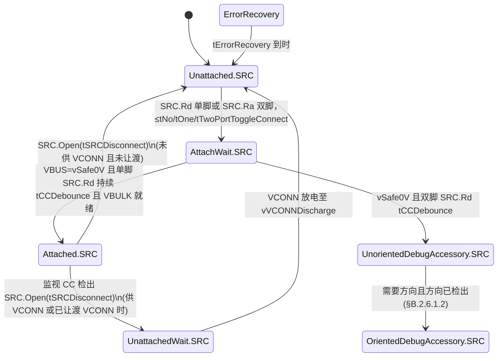
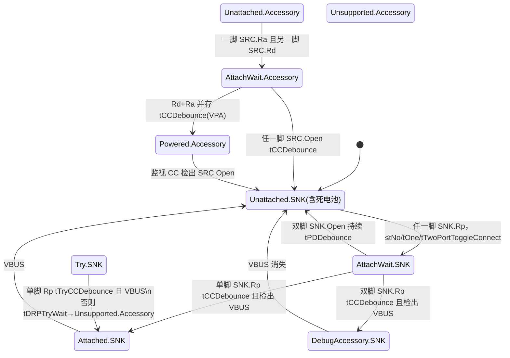

# Type-C 规范级：连接状态机与 CC 时序（Release 2.5）

> 🌳 知识树位置: 树干 → 枝干[接口与供电] → 叶
> ⬆️ 兄弟链接: [02-USBType-C详解](02-USBType-C详解.md) ｜ [07-USBPD深入-状态机与消息全表](07-USBPD深入-状态机与消息全表.md) ｜ [08-USBPD消息全表](08-USBPD消息全表.md) ｜ 树干: ../10-树干-USB核心/ ｜ 高速演进: ../40-枝干-高速演进/
> 规范原文缓存索引: [80-参考资料/README.md](../80-参考资料/README.md)

本篇从本地缓存的 **USB Type-C Spec R2.5（2026-03）** 原文提取：连接状态机状态与迁移条件、CC 电阻/电压窗口、去抖与供电时序的**全部数值**，并注规范表号（Table 4-x / Figure 4-x / §4.x）。R2.4 起电压参数一节（§4.11.3）重构为"设计方法+数值示例"，本文数值均出自该版本。

## 一、CC 引脚电气状态判定（Table 4-16 / 4-17）

| 端 | CC 引脚状态 | 对端端接 | 判定条件 |
| --- | --- | --- | --- |
| Source | SRC.Open | Open / Rp | CC 电压高于 vRd 上限 |
| Source | SRC.Rd | Rd | CC 电压在 vRd 区间内 |
| Source | SRC.Ra | Ra | CC 电压低于 vRd 下限 |
| Sink | SNK.Rp | Rp | CC 电压高于 vRd-Connected 下限 |
| Sink | SNK.Open | Open / Ra / Rd | CC 电压低于 vRd-Connected 下限 |

## 二、Source 视角的 CC1/CC2 组合（Table 4-10）

| CC1 | CC2 | 判定 | Position |
| --- | --- | --- | --- |
| Open | Open | 无连接 | N/A |
| Rd | Open | Sink 已连接（含方向） | 正面 |
| Open | Rd | Sink 已连接（含方向） | 反面 |
| Open | Ra | 有源线缆（无 Sink） | N/A |
| Ra | Open | 或液体腐蚀缓解模式（§A，见第十节） | N/A |
| Rd | Ra | 有源线缆 + Sink/VPA/VPD | N/A |
| Ra | Rd | 同上 | N/A |
| Rd | Rd | Debug 配件模式（§B，见第十节） | N/A |
| Ra | Ra | 液体腐蚀缓解模式（§A；即原"音频配件模式"） | N/A |

## 三、Rp / Rd / Ra 终端电阻全表（Table 4-27 ~ 4-31）

**Table 4-27 Source CC 端接（Rp）**——Rp 档位即"USB Type-C 电流宣告"：

| 宣告档 | 电流源（1.7~5.5 V） | 上拉电阻至 4.75~5.5 V | 上拉电阻至 3.3 V±5% |
| --- | --- | --- | --- |
| Default USB Power | 80 µA ±20% | 56 kΩ ±20%（注 1：线缆插头内 56 kΩ±5%） | 36 kΩ ±20% |
| 1.5 A @ 5 V | 180 µA ±8% | 22 kΩ ±5% | 12 kΩ ±5% |
| 3.0 A @ 5 V | 330 µA ±8% | 10 kΩ ±5% | 4.7 kΩ ±5% |

**Table 4-28 Sink CC 端接（Rd）**：

| Rd 实现 | 标称值 | 可否解析电流档 | 引脚最大电压 |
| --- | --- | --- | --- |
| ±20% 电压钳位 | 1.1 V | 否 | 1.32 V |
| ±20% 电阻到地 | 5.1 kΩ | 否 | 2.18 V |
| ±10% 电阻到地 | 5.1 kΩ | 是 | 2.04 V |

**其余端接**：

| 参数 | 数值 | 出处 |
| --- | --- | --- |
| Ra（有源线缆 VCONN 负载） | **800 Ω ~ 1.2 kΩ** | Table 4-29 |
| zOPEN（未连接判定） | 对地阻抗 ≥ **126 kΩ**（仅在 vCC-Clamp 以下有效） | Table 4-30 |
| zSBUTermination（SBU 开路态） | ≥ **950 kΩ** | Table 4-31 |
| vCC-Clamp（CC 钳位电压） | ≥ **2.9 V** | Table 4-40 |

## 四、CC 电压窗口与阈值（Table 4-35 ~ 4-39）

**Table 4-35 Sink CC 电压（Rd±20%，钳位±20%）**：vRd-connected **0.249 ~ 2.181 V**；断连检测阈值 ≤0.248 V。

**Table 4-36 Sink CC 电压与电流档解析（Rd±10%）**——vRd-USB 即旧名 vRd-Def（Default 档）：

| 窗口/阈值 | 最小 (V) | 最大 (V) |
| --- | --- | --- |
| vRd-USB | 0.277 | 0.612 |
| vRd-1.5 | 0.746 | 1.164 |
| vRd-3.0 | 1.369 | 2.042 |
| vRd-connected | 0.277 | 2.042 |
| USB↔1.5 档间阈值 | 0.613 | 0.745 |
| 1.5↔3.0 档间阈值 | 1.165 | 1.368 |
| 断连阈值 | — | 0.276 |

**Table 4-37 Source CC 电压（电流源 Rp）**：连接阈值 vCCCur-Rd-USB 0.261~1.32 V、-1.5 0.676~1.32 V、-3.0 0.88~2.181 V；Ra 窗口 vCCCur-Ra 0~0.115/0.233/0.428 V（USB/1.5/3.0）；Rd↔Ra 判定阈值 0.116~0.260 / 0.234~0.675 / 0.429~0.879 V。断连阈值 = 对应连接阈值 + vOffset（示例取 0.25 V）。

**Table 4-38/4-39 上拉电阻 Rp（@5 V / @3.3 V）**：结构同上，如 @5 V 时 vCCRes-Rd-USB 0.272~1.32 V、vCCRes-Ra-USB 0~0.143 V，判定阈值 0.144~0.271 V；@3.3 V 时 vCCRes-Rd-3.0 上限降至 2.003 V。完整列值见规范 §4.11.3.2.4/4.11.3.2.5。

## 五、去抖与超时定时器全表

**Table 4-34 CC 定时参数**：

| 参数 | 最小 | 最大 | 含义 |
| --- | --- | --- | --- |
| tCCDebounce | 100 ms | 200 ms | 判定"已连接"的去抖窗 |
> 🔍 对抗抽查（evolve #19）：tCCDebounce 100~200 ms 与 Type-C R2.5 原文 Table 4-34 比对一致（注：R2.5 原表列排布经 OCR 提取有错位，本表取跨版本稳定值）。

| tPDDebounce | 10 ms | 20 ms | 判定"已断开"的去抖窗（掩盖 CC 上 PD BMC 通信） |
| tTryCCDebounce | 10 ms | 20 ms | Try 流程中的再连接判定 |
| tErrorRecovery | 25 ms | — | 自供电端口停留 ErrorRecovery 时长（min） |
| tErrorRecovery（源供过 VCONN 时） | 240 ms | — | 同上，特殊下限 |
| tRpValueChange（CC 非 BMC Idle） | 10 ms | 20 ms | Sink 判定 Rp 档变化（无法确认 BMC Idle 时） |
| tRpValueChange（可确认 BMC Idle） | 0 ms | 5 ms | 同上（快速路径） |
| tSRCDisconnect | 0 ms | 20 ms | Source 检出 SRC.Open（应尽快） |
| tNoToggleConnect | 0 ms | 5 ms | 双方都不 toggling 时检连时限 |
| tOnePortToggleConnect | 0 ms | 80 ms | 一方 toggling（=dcSRC.DRP max+tDRP max+2×tNoToggleConnect） |
| tTwoPortToggleConnect | 0 ms | 510 ms | 双方 toggling（=5×tDRP max+2×tNoToggleConnect） |
| tVPDCTDD | 30 µs | 5 ms | CTVPD 检出 Charge-Through 源断开 |
| tVPDDisable | 25 ms | — | CTVPD 停留 CTDisabled.VPD（min） |

**Table 4-33 DRP 定时参数**：

| 参数 | 最小 | 最大 | 含义 |
| --- | --- | --- | --- |
| tDRP | 50 ms | 100 ms | 一个 Source→Sink→Source 宣告周期 |
| dcSRC.DRP | 30% | 70% | 周期内宣告 Source 的时间占比 |
| tDRPTransition | 0 ms | 1 ms | 角色切换最大耗时 |
| tDRPTry | 75 ms | 150 ms | Try.SRC/Try.SNK 等待 |
| tDRPTryWait | 400 ms | 800 ms | TryWait 等待 |
| tTryTimeout | 550 ms | 1100 ms | Try.SRC 失败转 TryWait.SNK 的超时 |
| tVPDDetach | 10 ms | 20 ms | DRP 检出 CTVPD 移除 |

**Table 4-32 VBUS/VCONN 定时参数**：

| 参数 | 最小 | 最大 | 含义 |
| --- | --- | --- | --- |
| tVBUSON | 0 ms | 275 ms | 进入 Attached.SRC 至 VBUS 达 vSafe5V 下限 |
| tVBUSOFF | 0 ms | 650 ms | Sink 移除后 Source 撤 VBUS 至 vSafe0V |
| tVsafe0V | 0 ms | 650 ms | AttachWait.SRC 中把残荷放到 vSafe0V |
| tBulkDischarge（VBUS≤21 V） | 0 ms | 275 ms | 退出 Attached.SRC 后 VBULK 放电至可重供 5 V |
| tBulkDischarge（VBUS>21 V） | 0 ms | 700 ms | 同上 |
| tVCONNON | 注 1 | 2 ms | 进入 Attached.SRC 后供出 VCONN（注 1：允许先于 VBUS） |
| tVCONNON-PA | 0 ms | 100 ms | 进入 Powered.Accessory 后供出 VCONN |
| tVCONNOFF | 0 ms | 35 ms | 断开或被要求后停供 VCONN |
| tSinkAdj | tRpValueChange(min) | 60 ms | Sink 调整电流至新宣告档 |

**Table 4-3 VBUS Sink 特性**：tSinkDisconnect ≤40 ms（Attached.SNK→Unattached.SNK）；vSinkDisconnect 窗口 **0.8 V（min）~ 3.67 V（max，5 V 合约）**，PPS ≤5 V 合约为 PPS_APDO_Min_Voltage×0.95；vSinkDisconnectPD=90% vSinkPD_min（>5 V 合约）；VBUS 电容 ≤10 µF。

## 六、Source 状态机（Figure 4-12 + §4.5.2.2）

完整回路：Unattached.SRC → AttachWait.SRC → Attached.SRC → UnattachedWait.SRC → Unattached.SRC。

状态要求速览（§4.5.2.2.7~4.5.2.2.11）：

| 状态 | 进入要求 | 关键迁出条件 |
| --- | --- | --- |
| Unattached.SRC | 不驱动 VBUS/VCONN；CC1/CC2 各挂独立 Rp（Table 4-27） | Rd 单脚或 Ra 双脚→AttachWait.SRC；DRP 另受 tDRP 切换 |
| AttachWait.SRC | 不驱动 VBUS/VCONN；给 VBUS 加负载令其 tVsafe0V 内到 vSafe0V | 单脚 Rd tCCDebounce + VBUS=vSafe0V + VBULK 就绪→Attached.SRC；双脚 Rd→调试配件；双脚 SRC.Open→Unattached.SRC |
| Attached.SRC | 仅在入口判定方向；监视 Rd 所在 CC 并供 Rp；**tVBUSON 内供 VBUS**，电流须≥Rp 宣告；VBUS 到 vSafe5V 前不得发 PD；供 VCONN 须在 tVCONNON 内 | SRC.Open（tSRCDisconnect）→UnattachedWait.SRC（VCONN 已供/已让渡）或 Unattached.SRC；VBUS ≤tVBUSOFF 内撤除 |
| UnattachedWait.SRC | 等自身 VCONN 放电 | VCONN<vVCONNDischarge→Unattached.SRC |
| Try.SRC | Rp 双脚，不驱动 VBUS/VCONN | 单脚 Rd tTryCCDebounce→Attached.SRC；tDRPTry 无 Rd 且 VBUS=vSafe0V、或 tTryTimeout→TryWait.SNK |
| TryWait.SNK | Rd 双脚 | tCCDebounce 内（或后）检出 VBUS→Attached.SNK；双脚 SNK.Open tPDDebounce→Unattached.SNK |

## 七、Sink 状态机（Figure 4-13 / 4-14 + §4.5.2.2）

| 状态 | 进入要求 | 关键迁出条件 |
| --- | --- | --- |
| Unattached.SNK | 不驱动 VBUS/VCONN；CC1/CC2 各挂独立 Rd（Table 4-28）；死电池设备在此态上电 | SNK.Rp 任一脚→AttachWait.SNK；USB 2.0-only、不支持配件/PD 的设备可直接因 VBUS→Attached.SNK |
| AttachWait.SNK | Rd 双脚；建议 SuperSpeed 设备延后使能到 Attached.SNK 再接（防 legacy 误接 USB2.0） | 单脚 Rp tCCDebounce+VBUS→Attached.SNK；双脚 Open tPDDebounce→Unattached.SNK；双脚 Rp+VBUS→DebugAccessory.SNK；强偏好 Source 的 DRP→Try.SRC |
| Attached.SNK | 入口判定方向；仅对 Rp 所在 CC 保留 Rd；不默认供 VCONN | VBUS<vSinkDisconnect 且非 PR_Swap/硬复位中→Unattached.SNK（≤tSinkDisconnect）；也可监视 CC<vRd-USB 持续 tPDDebounce 判断开；PR_Swap 收 PS_RDY→直接转 Attached.SRC |
| Powered.Accessory | 源 VCONN 于未用 CC（tVCONNON-PA 内）；作 PD Source/DFP；不驱动 VBUS | SRC.Open→Unattached.SNK；非 VPA/VPD→Try.SNK；Alt Mode 超时（tAMETimeout）→Unsupported.Accessory |

## 八、DRP 与 Try 机制（Figure 4-15 ~ 4-17）

- **简单 DRP（Figure 4-15）**：Unattached.SRC/SNK 间以 tDRP 周期翻转（dcSRC.DRP 占空比 30~70%）；两边各自走 AttachWait→Attached 回路；PR_Swap 完成时 Attached.SRC→Attached.SNK（收到 PS_RDY）或 Attached.SNK→Attached.SRC（Accept 后），保持数据角色与 VCONN 供给方不变。
- **Try.SRC（Figure 4-16，强偏好 Source）**：AttachWait.SNK 本该进 Attached.SNK 时改进 Try.SRC（Rp 双脚）；tTryCCDebounce 内检出单脚 Rd→Attached.SRC，否则 tDRPTry/tTryTimeout→TryWait.SNK（Rd 双脚等 VBUS→Attached.SNK）。
- **Try.SNK（Figure 4-17，强偏好 Sink）**：AttachWait.SRC 改进 Try.SNK（Rd 双脚）；先等 tDRPTry 再监视；单脚 Rp tTryCCDebounce+VBUS→Attached.SNK，否则 tDRPTryWait 内无 Rp→TryWait.SRC。
- 两个 DRP 对连结果不定（可能任一方进 AttachWait.SRC/SNK）；Try.SRC/Try.SNK 只能在初始连接使用一次，且同端口同时只启用其一（§4.5.1.4.1）。推荐配置见规范 Table 4-12。

## 九、VBUS/VCONN 供电时序

| 事件 | 要求 | 出处 |
| --- | --- | --- |
| Source 使能 VBUS | 进入 Attached.SRC 后 **tVBUSON（≤275 ms）** 内达 vSafe5V 下限；达 vSafe5V 前不得发起 PD | §4.5.2.2.9.1 + Table 4-32 |
| 供 VCONN | 进入 Attached.SRC 后 **tVCONNON（≤2 ms）** 内供至最低有效 VCONN 电压（Table 4-5）；允许先于 VBUS（Table 4-32 注 1） | Table 4-32 |
| VCONN_Swap | **先合后断**（make-before-break）保持线缆不断电；接管方 tVCONNON 内供出，退出方 tVCONNOFF（≤35 ms）内停供 | §4.5.2.2.9.1 |
| 撤 VBUS | 退出 Attached.SRC 后 **tVBUSOFF（≤650 ms）** 内达 vSafe0V；仅有 VPD 场景可在 Attached.SRC 内撤 VBUS | §4.5.2.2.9.2 |
| Sink 侧断开 | VBUS<vSinkDisconnect 后 **tSinkDisconnect（≤40 ms）** 内回 Unattached.SNK | Table 4-3 |
| 残压放电 | AttachWait.SRC 中以负载令 VBUS 在 tVsafe0V（≤650 ms）内到 vSafe0V | §4.5.2.2.8.1 |

## 十、音频配件与 Debug 配件检测

- **音频配件模式已弃用**：R2.5（2026-03）发布说明明确"deprecating the Audio Adapter Accessory Mode and replacing it with the Liquid Corrosion Mitigation Mode"（§A）。Ra/Ra 组合（历史音频附件的检测特征）现在映射到**液体腐蚀缓解模式**；Table 4-11 中该模式的 Source 行为仍保留 "Reconfigure for analog audio"——即模拟音频通路被并入腐蚀缓解状态机处理。旧版（≤R2.4）中 AudioAccessory.SRC 等状态已从状态图移除。
- **Debug 配件模式（§B）**：特征为 **Rd/Rd**。Source 侧：AttachWait.SRC 检出双脚 SRC.Rd tCCDebounce → UnorientedDebugAccessory.SRC（供 VBUS、双脚 Rp、不供 VCONN）→需要方向时经 §B.2.6.1.2 检出→ OrientedDebugAccessory.SRC（此后才可发起 PD）；任一脚 SRC.Open 即退出。Sink 侧：双脚 SNK.Rp tCCDebounce+VBUS → DebugAccessory.SNK（双脚 Rd），VBUS 消失退出。规范注明该模式仅限调试，不得用于商用产品互通。
- **VCONN 供电配件（VPA/VPD）**：特征为 **Rd+Ra**（一脚 SRC.Rd、另一脚 SRC.Ra）→ Powered.Accessory，VCONN 于 tVCONNON-PA（≤100 ms）内供出；仅 VCONN 供电时须协商 Alt Mode，超时 tAMETimeout 未入模式则源端撤 VCONN（§E）。

## 十一、Legacy 与非合规适配器

Type-C→Standard-A/B/Micro-B 的 Legacy 线缆/适配器在插头内以 Rp 宣告电流（Table 4-27 注 1 要求插头内取 56 kΩ±5% 以容忍线缆 IR 压降），Legacy 主机只供 VBUS 无 CC 逻辑——Sink 若在 AttachWait.SNK 一检出 VBUS 就使能 SuperSpeed，会在 legacy 主机上误接成 USB 2.0，故规范建议延后到 Attached.SNK 再接通（§4.5.2.2.4.1）；而市面非合规充电器可能 Rp 档虚标或 CC 直通 VBUS，Sink 应以 Table 4-36 阈值窗口实测判定并按 Default 档取电兜底（§4.5.3 互操作行为）。

## 相关节点

- [02-USBType-C详解](02-USBType-C详解.md)：CC/Rp/Rd/VCONN 的入门叙述
- [07-USBPD深入-状态机与消息全表](07-USBPD深入-状态机与消息全表.md)：PD 协议层状态机（PE_SRC/PE_SNK）与协商流程
- [08-USBPD消息全表](08-USBPD消息全表.md)：PD 消息编号与数据对象位域
- [05-AlternateMode与E-marker](05-AlternateMode与E-marker.md)：VCONN 供出的 E-marker 与 Alt Mode（Powered.Accessory 的去向）
- ../10-树干-USB核心/09-集线器与连接管理.md：连接/断开事件的上层处理
- ../70-枝干-调试测试与安全/：Type-C 一致性测试（CTS）对本文定时器的验证
- ../80-参考资料/README.md：USB-TypeC-Spec-2.5-2026.zip 缓存（本文全部数值出处）

## 附：R2.5 液体腐蚀缓解机制（Liquid Corrosion Mitigation，附录 A）

R2.5 移除音频配件模式的主因是**电解腐蚀**：耳机/液体残留会在 CC 引脚施加直流偏置，长期形成电蚀（附录 A.1 以电解腐蚀示例图说明）。缓解机制要点：

- **进入方式**：作为替代性附件行为定义在 Source/Sink 状态机的附录 A 状态集中（原 AudioAccessory 位置）；
- **三种液体检测方法**（A.3）：Liquid Measurement（直测法）、**Pulsed Measurement**（脉冲测量法，驱动电流脉冲测响应）、**Impedance Measurement**（阻抗测量法）；
- **检测引脚**（A.4）：复用连接器中的 CC（及 VCONN/SBU 视实现）引脚做液体探测；
- 工程含义：新设计按 R2.5 实现时，双 Ra 检测分支不再进入音频模式——旧转接器的兼容性需在产品层自行处理。
