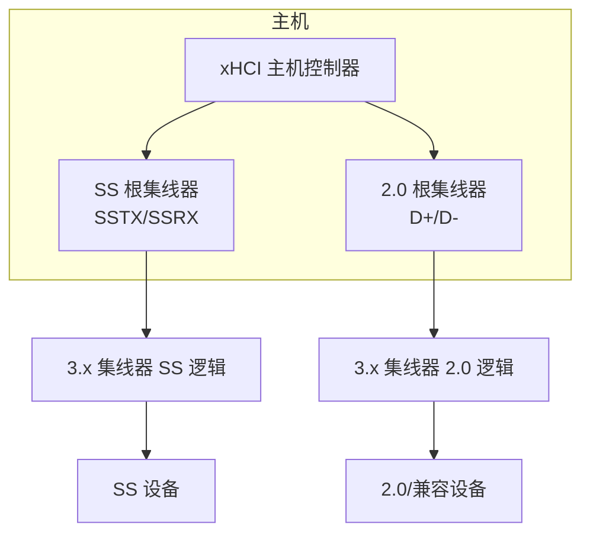
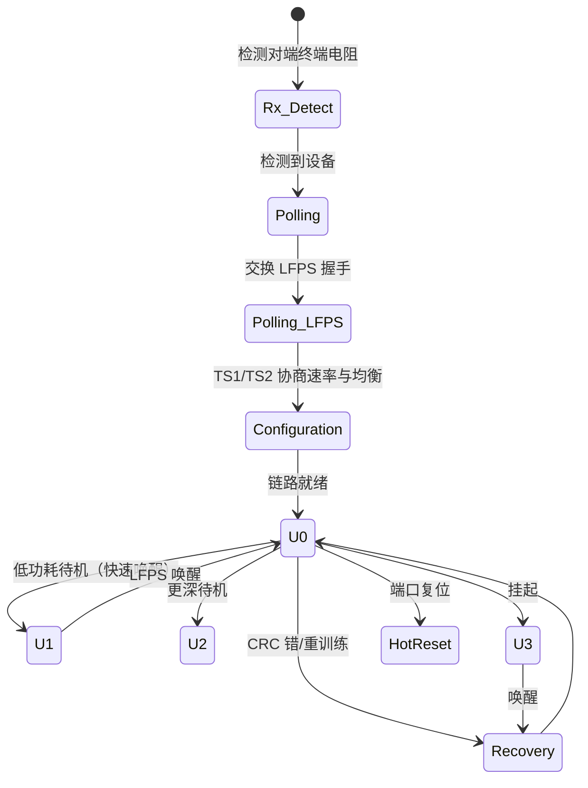

# USB 3.x 与 SuperSpeed

> 🌿 知识树位置: 树干 → 枝干[高速演进] → 叶
> ⬆️ 返回: [../10-树干-USB核心/03-物理层与电气特性.md](../10-树干-USB核心/03-物理层与电气特性.md) ｜ 同级: [02-USB4与雷电整合.md](02-USB4与雷电整合.md) ｜ [03-各版本对比速查.md](03-各版本对比速查.md)

USB 3.0 (2008) 不是"更快的 2.0"，而是一次架构革命：独立的 SuperSpeed 总线、全双工双差分对、基于信用的流控、包路由直达目标端口。2.0 的轮询式事务被整体替换。本叶按物理层→链路层→协议层→电源/Hub 拆解。

## 一、架构革命：两条总线并存的拓扑

- 每个 3.x 端口物理上有 **4 组差分线**：SSTX±/SSRX±（SuperSpeed，全双工）+ D+/D−（USB 2.0，半双工）；
- 两条总线**电气独立、协议独立**：SS 事务从不走 D+/D−，2.0 事务从不走 SS 对；
- 设备接哪条总线由自身能力与连接路径决定（详见 [03-各版本对比速查.md](03-各版本对比速查.md) 的澄清小节）；
- 3.x 集线器内部实际上是"一个 2.0 hub + 一个 3.x hub"背靠背的两套逻辑（见第六节）。

## 二、物理层

### 2.1 编码与有效带宽

| 代次 | 营销速率 | 线路编码 | 有效数据速率 | 说明 |
| --- | --- | --- | --- | --- |
| Gen 1（USB 3.0/3.1 Gen1/3.2 Gen1x1） | 5 Gbps | **8b/10b** | 4 Gbps（80%） | 每 10 bit 携带 8 bit 数据 |
| Gen 2（USB 3.1 Gen2/3.2 Gen2x1） | 10 Gbps | **128b/132b** | 约 9.7 Gbps（≈97.7%） | 开销降到约 2.3%，代价是更强的均衡需求 |

两代均使用**加扰 (Scrambling)**：以线性反馈移位寄存器对数据流扰码，展平频谱、保证时钟恢复所需的 0/1 跳变密度。Gen 2 增加接收端均衡 (EQ, FSF/BT 上调参数) 与训练。

### 2.2 全双工

2.0 是半双工：同一时刻只能主机或设备发送。SS 总线用**独立的 TX 对与 RX 对同时收发**，消除了令牌-握手往返的一半延迟，也为流控奠定基础。

## 三、链路层

### 3.1 链路训练与状态机 (LTSSM)

LTSSM (Link Training and Status State Machine) 在上电/恢复时建立链路，简化骨架：

训练以 **TS1/TS2 有序集**为语言：双方互发 TS1，对端以 TS2 确认，交换速率能力、均衡参数后进入 L0（U0）。

### 3.2 有序集 (Ordered Sets)

| 有序集 | 作用 |
| --- | --- |
| TSEQ | 训练初期的序列/均衡参考 |
| TS1 / TS2 | 链路训练与配置（速率、均衡、电源能力协商） |
| LFPS | 低频周期信令（Polling 握手、U1/U2/U3 唤醒、Reset），不依赖高速时钟 |
| Skip (SOS) | 补偿两端时钟差导致的弹性缓冲漂移，周期插入 |

另有 LGO*/LGOOD*/LBAD、IDL、EIEOS 等用于链路确认与 Gen2 均衡，见规范。

### 3.3 LCRC 与重传

- 每个链路级包带 **CRC-32 (LCRC)**；接收方校验失败即丢弃并靠**超时+重发**恢复；
- 发送方为每个 Data Packet 维护序列号，接收方以 ACK/NRDY/STALL 类链路包应答；
- 与 2.0 的区别：2.0 的握手在协议层（每个事务都有令牌+握手），3.x 把可靠性下沉到**链路层点对点**，协议层事务大幅简化。

### 3.4 基于信用的流控 (Credit-based Flow Control)

| 维度 | USB 2.0 | USB 3.x |
| --- | --- | --- |
| 机制 | 主机轮询设备端点（IN 令牌），设备没数据回 NAK | 接收方预先广播缓冲区**信用值**，发送方仅在信用充足时发包 |
| 无数据时开销 | 反复轮询+NAK，占用带宽与往返延迟 | 零开销：无信用不发，总线留给可用流量 |
| 方向 | 半双工轮询单向 | 全双工双向独立信用 |

这是 3.x 小包/低延迟性能（如 UVC 摄像头、网卡）显著改善的根源之一。

## 四、协议层

### 4.1 路由字符串：从广播到单播

2.0 的包被集线器**广播到所有下行端口**。3.x 的包头上带有 Route String (路由字符串)：每经过一级 hub，该 hub 在对应 5 位字段填入下行端口号，沿途 hub 据此**精确转发到单一端口**。总线利用率与隔离性大幅提升，也意味着 SS 链路里"sniffer 挂在中间端口"看不到别人的流量。

### 4.2 包结构

| 包 | 结构 | 作用 |
| --- | --- | --- |
| Data Packet (DP) | Link Control Word (2 B) + Header (16 B) + Data Payload (≤1024 B) + CRC-32 (4 B) | 数据载荷 |
| Transaction Packet (TP) | Link Control + Header + CRC-32 | ACK/NRDY/STALL、流控应答 |
| Link Management Packet (LMP) | 4 B | 链路两端管理（如设置链路功能） |
| ITP | 时间戳广播包 | 主机周期广播，等时传输时间戳同步 |

**宽带宽收益**：2.0 高速每事务最大 1024 B 且被微帧调度切片；3.x 单包 1024 B、链路全双工、无轮询，配合突发即可灌满 Gen1 4 Gbps 有效带宽的大部分（实测参考见 03 叶）。

## 五、链路电源状态与 LFPS

| 状态 | 名称 | 唤醒方式/延迟 |
| --- | --- | --- |
| U0 | 正常工作 | — |
| U1 | 浅待机（链路保持，收发器部分关闭） | LFPS 快速退出，微秒量级 |
| U2 | 深待机（更多电路关闭） | LFPS 退出，稍慢 |
| U3 | 挂起（等同设备级 suspend，见树干电源叶） | 主机发起唤醒，LFPS + 恢复序列 |

Polling.LFPS 是连接初始握手的低频信号（几十 MHz 量级的突发脉冲串），不要求双方先锁定高速时钟；Recovery 状态用于从 U0 出发快速重训练（如温度漂移、错误恢复）。与树干 [../10-树干-USB核心/10-电源管理与挂起唤醒.md](../10-树干-USB核心/10-电源管理与挂起唤醒.md) 的设备级挂起配合，构成 3.x 的完整低功耗体系。

## 六、集线器变化：一壳双芯

3.x hub 内部同时实现 **2.0 hub 与 3.x hub 两套逻辑**：

- 下行的每个端口都同时暴露 D+/D− 与 SSTX/SSRX；
- 2.0 设备由 2.0 逻辑服务（数据走 D+/D−，速率先经 hub 上行汇聚）；
- SS 设备由 3.x 逻辑服务；
- 结果：**同一个物理口可同时插出 2.0 与 3.x 设备而互不降速**——这是 2.0 做不到的（2.0 hub 下所有设备共享 480 Mbps）。

## 七、USB 3.2：双通道 (Gen 2x2)

| 代次 | 通道 | 速率 |
| --- | --- | --- |
| Gen 1x1 | 1 lane × 5 Gbps (8b/10b) | 5 Gbps |
| Gen 2x1 | 1 lane × 10 Gbps (128b/132b) | 10 Gbps |
| Gen 2x2 | **2 lane × 10 Gbps** | 20 Gbps |

- **Gen 2x2 仅存在于 Type-C 连接器**（需要 2 对 TX + 2 对 RX，Type-A/B 无线对可用）；
- 双通道需要**配对与同步**：两条 lane 独立加扰/训练，链路层聚合；训练中通过 **Lane Margining at Receiver** 测量每条 lane 的时序/电压余量，决定均衡参数；
- Gen 2x2 设备与 Gen 2x1 主机互通时自动退回单通道 10 Gbps。

## 八、向下兼容的物理实现

- **同一连接器，不同线对**：3.0 A/B/ Micro-B 在 2.0 引脚之外增加 SS 对；2.0 设备插入 3.0 口只接通 4 针，照常枚举；
- 2.0 主机 + 3.0 设备：设备退化为 HS 运行（SS 对悬空）；
- 3.0 线缆必须全部 9/10 针导通且 SS 对做阻抗控制，因此"3.0 线更贵"；劣质 3.0 线常见故障是 SS 对误接（SSTX/SSRX 交叉错误），见 [../30-枝干-接口与供电/01-接口形态演进.md](../30-枝干-接口与供电/01-接口形态演进.md)；
- Type-C 时代，上述所有线对被镜像化到 24 针中，但两条总线并存的架构不变，直到 USB4 才被路由器拓扑取代（见 02 叶）。

## 相关节点

- 树干: [../10-树干-USB核心/03-物理层与电气特性.md](../10-树干-USB核心/03-物理层与电气特性.md)
- 树干: [../10-树干-USB核心/05-包格式与事务.md](../10-树干-USB核心/05-包格式与事务.md)（2.0 事务对照）
- 树干: [../10-树干-USB核心/10-电源管理与挂起唤醒.md](../10-树干-USB核心/10-电源管理与挂起唤醒.md)（U3 与设备挂起）
- 同级: [02-USB4与雷电整合.md](02-USB4与雷电整合.md)（USB3 隧道的来源）
- 同级: [03-各版本对比速查.md](03-各版本对比速查.md)
- 邻枝: [../30-枝干-接口与供电/01-接口形态演进.md](../30-枝干-接口与供电/01-接口形态演进.md)（9 针接口）
