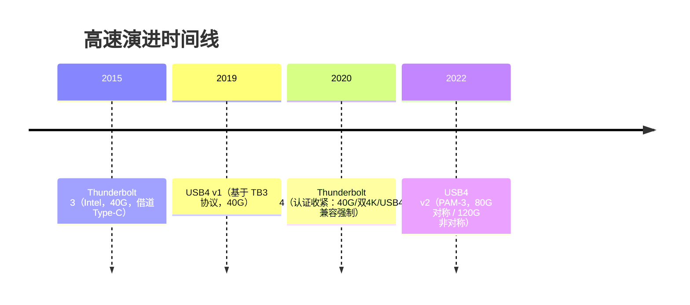
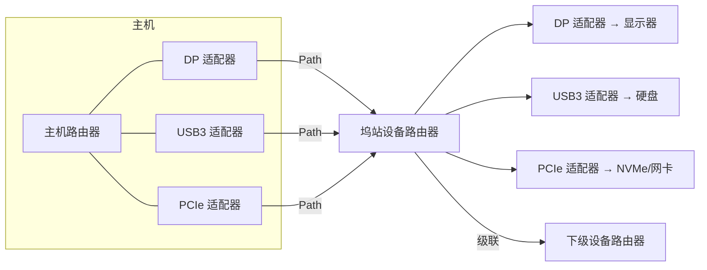

# USB4 与雷电整合

> 🌿 知识树位置: 树干 → 枝干[高速演进] → 叶
> ⬆️ 返回: [../10-树干-USB核心/02-体系架构与分层模型.md](../10-树干-USB核心/02-体系架构与分层模型.md) ｜ 同级: [01-USB3x与SuperSpeed.md](01-USB3x与SuperSpeed.md) ｜ [03-各版本对比速查.md](03-各版本对比速查.md)

USB4 (2019) 的关键决定是**直接采用 Thunderbolt 3 协议作为基础**：USB 从"共享总线"变成"分组路由器网络"。视频、存储、网络不再各自定义物理层，而是全部变成路由器之间的**隧道**。

## 一、核心范式转变：从总线到路由器拓扑

| 维度 | USB 2.0/3.x | USB4 |
| --- | --- | --- |
| 拓扑 | 主机为中心的星形总线 | 主机路由器为中心的路由网络（可级联） |
| 转发 | hub 广播（2.0）/路由字符串单播（3.x） | 逐跳路由表 + Path |
| 协议承载 | 各协议独立物理层 | 统一传输层，上层协议以**隧道**形式承载 |

四个基础概念：

- **主机路由器 (Host Router)**：USB4 域的主人（主机 SoC 内的 USB4 逻辑）；
- **设备路由器 (Device Router)**：设备/坞站内的 USB4 逻辑；
- **适配器 (Adapter)**：路由器的端口化出口——USB3 适配器、DP 适配器、PCIe 适配器、USB2 适配器等；
- **通道 (Path)**：两个适配器之间经路由器逐跳建立的单向数据通路（由传输层 Packet + 路由转发实现）。

## 二、隧道化 (Tunneling) 四类

USB4 传输层不关心载荷内容，只按 Path 转发；四种隧道覆盖既有生态：

| 隧道类型 | 承载内容 | 必备性 |
| --- | --- | --- |
| USB3 隧道 | USB 3.x 流量（Gen 2/3 速率档） | 主机与 hub 必须；这让**存量 3.x 设备在 USB4 域中直接工作** |
| PCIe 隧道 | NVMe、eGPU、万兆网卡等 | 主机可选（认证坞/雷电压场景普遍实现） |
| DisplayPort 隧道 | 显示流 + AUX/HPD（内嵌式 DP） | 主机必须；显示器/坞内解出 DP 信号 |
| 主机到主机 (Host-to-Host) | 两台主机组网（文件/网络共享） | 双端支持才可用（雷电组网场景） |

另有一个非隧道的 **USB2.0 适配器**与上述通道并行存在：每个 USB4 口都保留 D+/D− 兑现 USB 2.0 兼容（混合拓扑）。所以 USB4 域里"一根线跑五路流量"：USB3、PCIe、DP 三隧道 + USB2 适配器 + 管理通道。

## 三、TMU 时间同步

**TMU (Time Management Unit)** 是 USB4 的时间基础设施：路由器之间维护 TMU Path，周期传播时间戳，把域内所有路由器同步到统一时基（精度足够支撑音视频与测量类应用）。DP 隧道的媒体时钟、等时应用都依赖它——这是"总线"给"路由网络"补上的一块基础设施。

## 四、配置空间与配置包

每个路由器有**配置空间 (Configuration Space)**：路由表、适配器能力、Path 映射。主机通过 **Configuration Packet**（专用管理通路，不占数据 Path）读写：

1. 发现拓扑（枚举各级路由器/适配器，读取 DROM 等配置结构）；
2. 为每条隧道**建立 Path**（逐跳下发转发表项、分配带宽与缓冲）；
3. 拓扑变化（插拔）时拆除/重建。

对开发者而言，USB4 的"枚举"有两层：USB4 域的路由器发现（管理面）+ 各隧道协议自身的枚举（如 USB3 隧道里的 xHCI 枚举，形态与树干 [../10-树干-USB核心/08-枚举流程与标准请求.md](../10-树干-USB核心/08-枚举流程与标准请求.md) 一致）。

## 五、带宽管理与分配

主机是带宽预算的管理者：DP 隧道按显示器需求申请（**带宽分配模式**，含 DP Bandwidth Allocation），剩余分给 USB3/PCIe。示例预算（仅演示量级，实际按实现协商）：

| 流量 | 需求 | 40G 链路下 |
| --- | --- | --- |
| DP（双 4K60，DSC） | ~30 Gbps | 优先预留 |
| USB3 存储（SSD） | ~10 Gbps | 保障 |
| PCIe 万兆网卡 | ~10 Gbps | 排队/降速 |
| USB2 | 独立线对 | 不占上表预算 |

当 DP 需求激增（如切换 8K），主机可压缩 USB3/PCIe 配额——这与 2.0"各口共享 480 Mbps"的静态均分是完全不同的资源观。

## 六、Hub/Dock 生态与认证差异

### 6.1 USB4 域中的 Hub 与 Dock

- **USB4 Hub**：一个多端口设备路由器，把一条上行 Path 拆分为多条下行 Path（仍按隧道转发）；hub 本身可以再挂 PCIe/DP 适配器；
- **Dock（坞站）**：hub + 一组适配器的集成体（DP×2 + USB3 + PCIe + 网卡 + 音频），本质是"带外设的设备路由器"；
- 3.x 集线器在 USB4 域中不再以 3.x hub 身份出现：USB3 流量被宿主/坞的 USB3 适配器**封装为 USB3 隧道**传输，到对端再解封装成 3.x 流量；
- 级联（菊花链）是原生能力：显示器/坞站可串接，每级路由器都参与转发与带宽仲裁——2.0/3.x 的星形 hub 拓扑做不到。

### 6.2 认证差异表

| 项目 | Thunderbolt 3 | Thunderbolt 4 | USB4 v1 (40G) |
| --- | --- | --- | --- |
| 链路速率 | 40 Gbps | **保证 40 Gbps** | 20/40 Gbps |
| PCIe | 最高 32 Gbps（坞站场景保证值较低，常见 16 Gbps） | **保证 32 Gbps** | 可选隧道 |
| 显示 | 单 5K/双 4K（实现差异大） | **双 4K 或单 8K 强制** | 按实现 |
| USB4 兼容 | 否（自成体系） | **强制** | 本体 |
| 2 m 线缆 40G | 不保证 | **强制**（被动线） | 按线缆认证 |
| 最低供电 | 15 W | **15 W 强制** | 按实现 |
| DMA 攻击防护 | 可选 | **强制**（基于 IOMMU） | 可选 |

Thunderbolt 4 本质是"认证收紧的 USB4+PCIe 保障清单"；选购坞站时 TB4 标签意味着上述每一项都有下限，而裸 USB4 标签只保证协议兼容。

## 七、USB4 v2 (80G)

- **PAM-3 调制**（三电平脉冲幅度调制）取代 NRZ：每符号携带更多信息，在既有通道上把双向对称带宽推到 **80 Gbps**；
- **非对称模式**：可配为 **120 Gbps 下行 / 40 Gbps 上行**（显示占大头的场景收益最大）；
- 向下兼容 v1（同一连接器协商共存）；雷电 5（2023 年发布）即基于同代 PHY 技术。

**常见误解澄清**：

- "USB4 = 雷电 4"：错。TB4 是 Intel 的认证清单（见 6.2 表），USB4 是协议规范；USB4 主机可以不含 PCIe 隧道；
- "USB4 口都是 40G"：USB4 允许 Gen 2x2（20G）实现，认证标签才会写明代次；
- "USB4 设备需要 Alt Mode"：不需要，DP/USB3 走隧道；Alt Mode 只是兼容路径；
- "USB4 下 USB2 会消失"：不会，USB2.0 适配器是规范的强制组成部分。

## 八、拓扑发现与 DROM

主机发现 USB4 域的顺序（管理面）：

1. 入口仍是 PD/CC 协商与 USB4 就绪宣告（30 枝干）；
2. 路由器之间交换 **Discover/Read Configuration** 配置包，读取路由器能力与 **DROM**（Device Router Operation Modes，设备路由器工作模式，描述适配器组织方式）；
3. 主机为每个适配器建立内部标识，逐级构建拓扑图；
4. 后续隧道的建立/拆除都经同一配置空间通道（Path 0 级管理通路），数据 Path 与管理 Path 分离。

这层"先有网络管理、后有协议流量"的结构，是 USB4 与 3.x 排障手感差异的根源。

## 九、开发者视角：调试的变化

| 维度 | 3.x 时代 | USB4 时代 |
| --- | --- | --- |
| 抓包 | SS 总线旁路即可见明文 USB3 事务 | 需支持**隧道解析**的分析仪（把 USB3/DP/PCIe 隧道还原成各自协议视图） |
| 拓扑 | hub 树 | 路由器拓扑 + 隧道路径（分析仪需同时展示管理面配置包） |
| 典型工具 | 一般 SS 分析仪 | GRL、Ellisys、LeCroy 等的 USB4/雷电专项分析方案 |
| 故障定位 | 线缆/枚举/带宽 | 新增维度：线缆代次（E-marker）、路由器发现失败、带宽分配不足 |

实践建议：USB4 问题先分层——PD/CC 协商（30 枝干）→ USB4 路由器发现 → 隧道建立 → 各协议自身枚举。

## 相关节点

- 树干: [../10-树干-USB核心/02-体系架构与分层模型.md](../10-树干-USB核心/02-体系架构与分层模型.md)
- 树干: [../10-树干-USB核心/08-枚举流程与标准请求.md](../10-树干-USB核心/08-枚举流程与标准请求.md)
- 同级: [01-USB3x与SuperSpeed.md](01-USB3x与SuperSpeed.md)（USB3 隧道的来源协议）
- 同级: [03-各版本对比速查.md](03-各版本对比速查.md)
- 邻枝: [../30-枝干-接口与供电/05-AlternateMode与E-marker.md](../30-枝干-接口与供电/05-AlternateMode与E-marker.md)（与 Alt Mode 的关系、线缆代次）
- 邻枝: [../30-枝干-接口与供电/04-USBPD协议.md](../30-枝干-接口与供电/04-USBPD协议.md)（入口协商）
