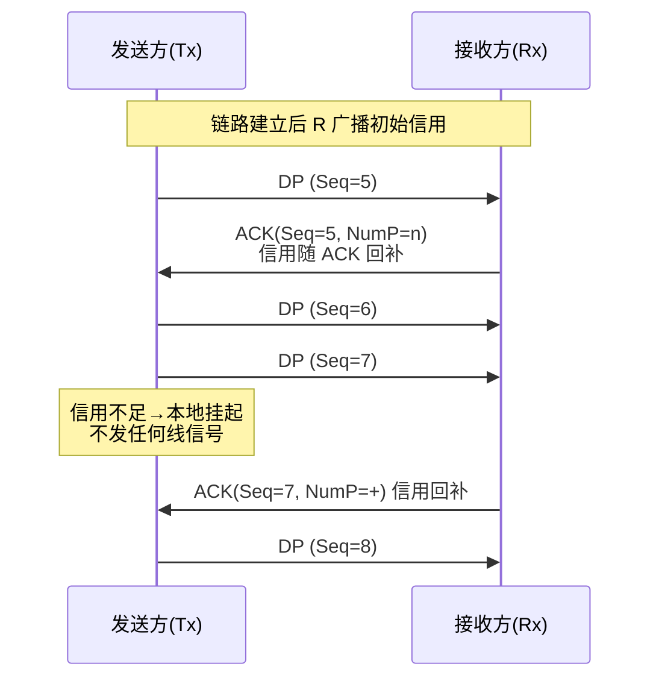
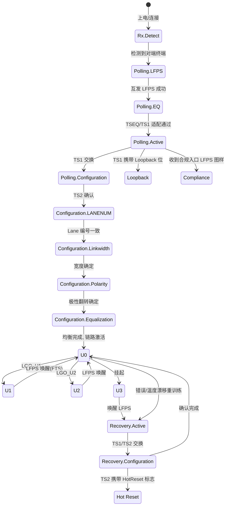

# USB 3.x 包格式与 LTSSM

> 🌿 知识树位置: 树干 → 枝干[高速演进] → 叶
> ⬆️ 兄弟: [01-USB3x与SuperSpeed.md](01-USB3x与SuperSpeed.md) · [02-USB4与雷电整合.md](02-USB4与雷电整合.md) · [03-各版本对比速查.md](03-各版本对比速查.md)
> 规范原文缓存索引: [80-参考资料/README.md](../80-参考资料/README.md)

[01 叶](01-USB3x与SuperSpeed.md)讲了 3.x 的架构革命，本叶下钻到线上协议：链路层四类包、32 字节 Header 的逐字段结构、信用流控与重传的精确机制、有序集族、LFPS 信令参数，以及把整条链路"训练"起来的状态机 LTSSM（Link Training and Status State Machine）。字段位级排布以 USB 3.2 规范第 6/8 章为准，本文不逐位复刻处均标注"见规范原文"。

## 1. 链路层包分类总表

| 类型 | 全称 | 组成 | 职责 | 子类型举例 |
|---|---|---|---|---|
| LMP | Link Management Packet | 仅链路控制字（4 B 量级） | 链路两端自身管理，不涉及协议层 | Set Link Function、U2 Inactivity Timeout、Port Configuration 等（见规范原文） |
| TP | Transaction Packet | 链路控制字 + Header(32 B) + CRC-16 | 事务层握手：流控、重传、停摆、通知 | ACK / NRDY / ERTY / STALL / PING / PING_RESPONSE / DEV_NOTIFICATION |
| DP | Data Packet | Header(32 B) + Data Packet Payload (DPP) | 承载数据；DPP = Data Payload（≤1024 B）+ LCRC-32 | — |
| ITP | Isochronous Timestamp Packet | — | 主机周期广播时间戳，等时传输跨设备时间同步 | — |
| VLPEnd | Vendor Low Power End（有序集） | — | 标识厂商自定义低功耗（VLP）操作结束，与 LGO_VLP/VLPS 配套 | — |

与 2.0 的根本差异：不再有令牌包广播；每个包都被**路由到单一链路伙伴**（Route String，见 [01 叶 §4.1](01-USB3x与SuperSpeed.md)）。

## 2. Header Packet：32 字节逐字段

所有 TP 与 DP 共用同一 32 字节头结构，靠 Type/SubType 区分：

| 字段 | 宽度 | 取值/含义 |
|---|---|---|
| Type | 4 bit | 包大类：LMP / TP / DP / ITP |
| SubType | 4 bit | 类内细分：TP 的 ACK/NRDY/ERTY/STALL/PING/DEV_NOTIFICATION 等 |
| Route String | 20 bit | 5 bit × 最多 4 级 hub 的下行端口路径；主机发包时填好，沿途 hub 按段转发（位级排布见规范原文） |
| Device Address | 7 bit | 设备地址（与 2.0 一样由 SET_ADDRESS 分配） |
| Direction | 1 bit | IN / OUT 方向 |
| Endpoint Number | 4 bit | 目标端点号 |
| Reserved | 若干 bit | 保留位，置 0 |
| CRC-16 | 16 bit | 头部校验；保护路由/寻址字段（覆盖范围见规范原文），链路层对头错误按包丢弃处理 |

DP 专用字段（同在 32 字节头内）：

| 字段 | 宽度 | 取值/含义 |
|---|---|---|
| Data Length | — | Data Payload 有效字节数指示（编码粒度与位宽见规范原文；DP 载荷最大 1024 B） |
| Sequence Number | 5 bit | 取值 0~31，DP 的序号，供 TP ACK 应答与重传判定 |
| Retry Bit | 1 bit | 重发位置 1：接收方已收过同序号 DP 时静默丢弃并补 ACK，作用类似 2.0 的 DATA0/DATA1 触发位 |

> 字段在 4 个 DW 间的精确排布（含跨 DW 拆分与保留位）见规范原文第 8 章；抓包分析时建议直接依赖分析仪解码而非手工按位拼头。

## 3. TP 类型表

| SubType | 方向 | 语义 | 关键字段 |
|---|---|---|---|
| ACK | 接收方→发送方 | "序号 n 的 DP 已收下" + 流控汇报 | Seq Number（应答号）、Retry Bit、NumP（可接收包数=信用）、PP (Packet Pending)、Dir |
| NRDY | 设备→主机 | Not Ready：端点暂不可收发（2.0 NAK 的替代） | 端点/方向 |
| ERTY | 设备→主机 | Endpoint Ready：NRDY 之后端点恢复就绪 | — |
| STALL | 设备→主机 | 端点永久性错误，需软件介入（语义同 2.0 STALL，见树干 [11 叶](../10-树干-USB核心/11-错误处理与可靠性.md)） | — |
| PING | 主机→设备 | 轻量探测：接收端是否可收（如链路低功耗态恢复后先探后发） | — |
| PING_RESPONSE | 设备→主机 | 对 PING 的应答 | — |
| DEV_NOTIFICATION | 设备→主机 | 设备通知（DN）：功能级异步事件上报 | 通知类型/数据 |

2.0 → 3.x 事务语义迁移：NAK → NRDY+ERTY 两段式（"现在不行"与"可以了"分开上报），主机无需持续轮询。

## 4. 信用流控（Credit-based Flow Control）

接收方通过 TP（ACK 的 **NumP** 字段）持续告知"我还有多少个 DP 缓冲可收"，发送方据此发送：

| 维度 | USB 2.0 轮询流控 | USB 3.x 信用流控 |
|---|---|---|
| 无数据时线上开销 | 反复 IN 令牌 + NAK（HS 还有 PING 优化，见树干 [11 叶 §7](../10-树干-USB核心/11-错误处理与可靠性.md)） | **零**：无信用不发，静默即空闲 |
| 流控信息 | 隐含在每次事务结果中 | 显式 NumP 计数，可批量授予 |
| 方向 | 半双工逐事务 | 全双工双向独立 |
| 端点未就绪 | 每次轮询都 NAK | NRDY 一次声明，ERTY 一次恢复，期间不打扰 |

信用按**接收缓冲区数量**计（不按字节），与 2.0"整包重发"的粒度一致。

## 5. 重传与 LCRC-32

两层机制并存，注意区分：

**协议层 DP 重传（Gen1/Gen2 通用）**：
- 每个 DP 的 Data Payload 尾部带 **LCRC-32**，接收方校验失败→静默丢弃、不发 ACK；
- 发送方等待 ACK 超时→**重发同一 DP，Retry Bit 置 1**；接收方若其实已收下（只是 ACK 丢失），比对序号后丢弃重发包、重新 ACK——序号 + Retry 位共同实现"零丢失、零重复"（与 2.0 toggle 的角色对照见树干 [11 叶 §2/§3](../10-树干-USB核心/11-错误处理与可靠性.md)）；
- 头部 CRC-16 失败的 TP/DP 同样按未收到处理。

**链路层 Replay（Gen2 新增）**：
- Gen2 (128b/132b) 要求更高吞吐、更少停顿，链路层把已发送的包缓存在 **Replay Buffer**，以 **LGOOD_n / LBAD_n** 有序集做批量确认：n 为 4 bit 链路序号（0~15）；收到 LBAD_n → 发送方从检查点把缓存包**整体重放**，链路层错误不再逐包上抛协议层；
- Gen1 则依赖上述协议层逐包重传。两代的目标 BER 均为 10⁻¹²，Gen2 用 Replay 把错误恢复从"微秒级往返"压缩到链路内消化。

## 6. 有序集 (Ordered Sets) 总表

有序集是不带 Header、由特定符号序列构成的"链路语言"，在训练/低功耗/补偿场景使用：

| 有序集 | 作用 |
|---|---|
| TSEQ | 训练最初期发送：接收端适配/均衡与 BER 初测的参考序列 |
| TS1 | 链路训练：速率、通道、均衡能力交换（Polling/Recovery 主角） |
| TS2 | 训练确认：对端配置确认；携带 Hot Reset / Loopback / Disable 等标志位 |
| EIEOS | 电空闲退出 (Electrical Idle Exit) 有序集；Gen2 均衡阶段夹在 TS 间，保证电空闲可靠检出 |
| SKPOS (SKP) | 时钟补偿：两端参考时钟偏差由周期插入的 SKP 符号在弹性缓冲中增删吸收（Gen1/Gen2 符号数不同，见规范原文） |
| FTS | 快速训练：从 U1/U2 返回 U0 时快速重锁时钟/位对齐，避免完整 Polling |
| LGOOD_n / LBAD_n | Gen2 链路层批量确认 / 否认（触发 Replay） |
| LGO_U1/U2/U3、LGO_Ping 等 | 链路操作请求：进入对应低功耗态或探测 |
| VLPS / LGO_VLP / VLPEnd | 厂商自定义低功耗状态的进入/请求/结束 |
| RESET（复位相关） | 链路复位信令（与 Warm/Hot Reset 流程配合；用法与编码见规范原文） |
| Sync Header | 严格说不是有序集：Gen2 每 132 bit 块前的 2 bit 块类型标记（Data 块 / Control 块） |

## 7. LFPS 信令详解

LFPS (Low Frequency Periodic Signaling) 是链路训练/唤醒期的"低频握手语言"：方波突发，标称频率约 60 MHz（相对 5/10 Gbps 线速即为"低频"），不要求双方先锁定高速 PLL，用本地环振即可产生。精确 min/max 参数见规范原文 §6.x，工程量级如下：

| 场景 | 突发形态（量级） | 说明 |
|---|---|---|
| Polling.LFPS | 约 1 µs 突发 + 数 µs 静默，连发 4 组为一代 | 上电/连接后互发，确认对端存在与基本能力 |
| Compliance 入口 | 特殊图样：突发频率/时长组合区别于 Polling | 测试仪发出后 DUT 进入 Compliance Mode（见树干 [12 叶](../10-树干-USB核心/12-TestMode与调试模式.md)） |
| Reset LFPS（Warm/Hot Reset） | 更长/更多的特定突发序列 | 端口复位信令，区分热复位与暖复位 |
| U1/U2 Wake | 短突发（1 组量级） | 低功耗态快速唤醒，微秒级回到训练 |
| Checkpoint/Recovery 相关 LFPS | 特定突发组合 | Recovery/检查点流程中的带外提示（细节见规范原文） |

设计哲学：**低速可靠信道**完成"要不要高速对话"的协商，避免鸡生蛋问题（高速接收器还没训练好时听不懂任何高速信令）。

## 8. LTSSM 全图

每个状态一句话职责：

| 状态 | 职责 |
|---|---|
| Rx.Detect | 静默期检测对端 Rx 终端阻抗，判定连接存在 |
| Polling.LFPS | 低频握手：对端在吗？ |
| Polling.EQ | 交换 TSEQ：初始均衡适配 |
| Polling.Active | 交换 TS1：能力协商（速率/通道/均衡） |
| Polling.Configuration | 交换 TS2：训练参数确认 |
| Configuration.LANENUM | 多 lane 编号排位（lane 0..n 归位） |
| Configuration.Linkwidth | 协商链路宽度（哪些 lane 参与） |
| Configuration.Polarity | 检测/翻转 RX 极性（布线可免交叉） |
| Configuration.Equalization | 均衡参数最终确认（Gen2 在此/其后做 Preset 与系数协商） |
| U0 | 正常工作（L0），包交换发生地 |
| U1 / U2 | 链路低功耗待机（浅/深），FTS 或 LFPS 快速返回 |
| U3 | 挂起，唤醒走 LFPS + Recovery |
| Recovery.Active / Recovery.Configuration | 快速重训练（错误恢复、唤醒、重均衡），TS1/TS2 再交换 |
| Loopback | 回环测试态（BER） |
| Compliance | 合规图样发送态（电气测试） |
| Hot Reset | 经 Recovery.Configuration 中 TS2 的 HotReset 标志实现的端口复位路径 |

## 9. Gen1 与 Gen2 差异点

| 维度 | Gen1 (5G) | Gen2 (10G) |
|---|---|---|
| 线路编码 | 8b/10b（80% 效率） | 128b/132b（≈97.7%，2 bit Sync Header / 块） |
| 均衡 | 训练期基础适配 | 完整 EQ 流程：Preset 与系数协商、RX LEQ（Link Equalization）过程、Lane Margining 验证 |
| 链路层纠错 | 协议层逐包重传（Seq+Retry） | 其上叠加 Replay（LGOOD/LBAD 批量确认+整段重放） |
| TSEQ/TS1/TS2 | 8b/10b 符号构成 | 128b/132b 块构成；EIEOS 更频繁介入 |
| SKP | SKP 符号对 | BM SKP（块模式下符号数不同） |
| CTLE/DFE 需求 | 较低 | 显著提高（10G 下信道损耗预算更紧） |

## 10. 电源状态 U0–U3 转换表

| 状态 | 进入条件 | 退出条件 | 退出时延（量级） |
|---|---|---|---|
| U0 | 训练完成 / Recovery 完成 | — | — |
| U1 | 任一链路伙伴发 LGO_U1；链路保持配置 | 对端 LFPS 短突发 + FTS 快速重训练 | 亚微秒~微秒级 |
| U2 | LGO_U2；关闭更多收发电路 | LFPS 唤醒 + 重训练 | 数十微秒级 |
| U3 | 系统挂起（配合设备级 suspend，见树干 [10 叶](../10-树干-USB核心/10-电源管理与挂起唤醒.md)） | 主机发起唤醒 LFPS → Recovery | 毫秒级（含重训练） |

设备在 BOS 描述符的 SuperSpeed Device Capability 中上报 U1/U2 自身退出时延（U1DeviceExitLat / U2DeviceExitLat），供主机在功耗与响应性间权衡；链路低功耗与设备功能挂起的协同（如 PING 探测）见规范原文。U1/U2 的核心收益在硬盘中途空闲、键盘鼠标敲击间隙——不退出训练就能秒级恢复，避免完整 Polling 的几十微秒代价与总线可见的"掉线感"。

## 相关节点

- 上游: [01-USB3x与SuperSpeed.md](01-USB3x与SuperSpeed.md)（架构与物理层）
- 同级: [02-USB4与雷电整合.md](02-USB4与雷电整合.md)（USB3 隧道如何被 USB4 封装）· [03-各版本对比速查.md](03-各版本对比速查.md) · [05-USB4深入-路由隧道与配置.md](05-USB4深入-路由隧道与配置.md)
- 树干: [../10-树干-USB核心/05-包格式与事务.md](../10-树干-USB核心/05-包格式与事务.md)（2.0 令牌/握手对照）· [../10-树干-USB核心/11-错误处理与可靠性.md](../10-树干-USB核心/11-错误处理与可靠性.md)（toggle→Seq+Retry 演进）· [../10-树干-USB核心/12-TestMode与调试模式.md](../10-树干-USB核心/12-TestMode与调试模式.md)（Compliance Mode 详情）
- 邻枝: [../70-枝干-调试测试与安全/03-USB-IF合规认证.md](../70-枝干-调试测试与安全/03-USB-IF合规认证.md)
