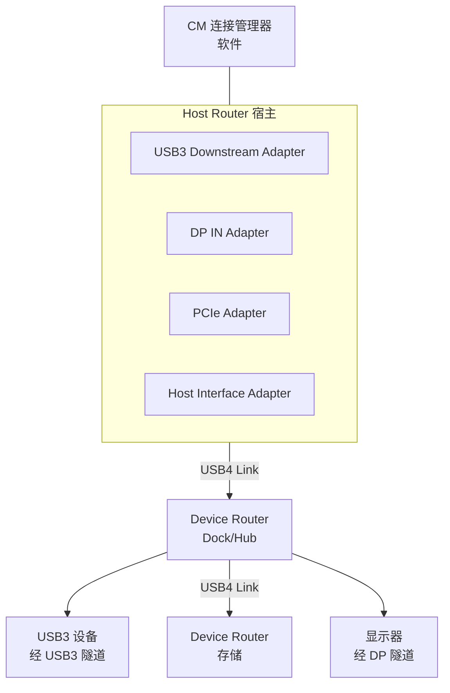
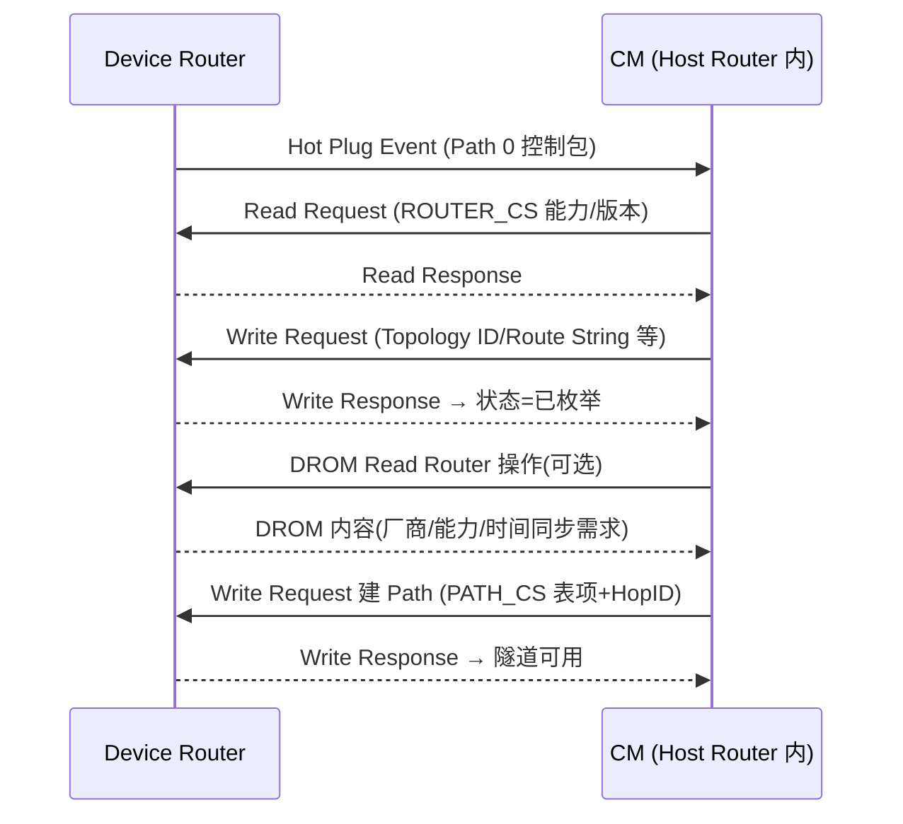

# USB4 深入：路由、隧道与配置

> 🌿 知识树位置: 树干 → 枝干[高速演进] → 叶
> ⬆️ 兄弟: [02-USB4与雷电整合.md](02-USB4与雷电整合.md) · [04-USB3x包格式与LTSSM.md](04-USB3x包格式与LTSSM.md) · [01-USB3x与SuperSpeed.md](01-USB3x与SuperSpeed.md)
> 规范原文缓存索引: [80-参考资料/README.md](../80-参考资料/README.md)

[02 叶](02-USB4与雷电整合.md)给出了 USB4 的全景：总线被替换为"路由器 (Router) + 适配器 (Adapter) + 隧道 (Tunnel)"的交换式架构。本叶下钻其运行机制：拓扑实体如何编址，控制包 (Control Packet) 如何读写配置空间，路径 (Path) 如何用 Hop ID 逐跳搭建，四类隧道各自封装什么，时间如何同步，设备如何被枚举，以及 v2 (80G) 与 TB3/TB4 兼容层的要点。依据 USB4 v2 规范（2025-11）。

## 1. 拓扑实体

| 实体 | 定义 | 说明 |
|---|---|---|
| Domain | 一个主机管理下的全部路由器集合 | 域内只有一个 CM（连接管理器） |
| CM (Connection Manager) | 枚举、配置、管理 Domain 的**软件实体** | 通常驻留宿主 OS/固件；仅通过控制包与路由器对话 |
| Host Router | 宿主侧路由器 | Domain 的根，兼任 TMU 时间源与 CM 的本地代理 |
| Device Router | 设备/集线器侧路由器 | 每台 USB4 设备一个，向下可再挂路由器 |
| Protocol Adapter | 协议适配器：USB3（Gen X/Gen T）、DP IN/OUT（含 DP OUT AUX）、PCIe、Host Interface（Host-to-Host）、厂商自定义 | 把原生协议流量封装进隧道 |
| Lane Adapter | 通道适配器 | 对接一条 USB4 链路（Gen2/3 单 lane，Gen4 经 PAM-3 聚合） |
| Control Adapter | 控制适配器 | 路由器上收发控制包的专属接口（无自己的 Adapter 配置空间） |

## 2. 控制包与配置空间

### 2.1 Control Packet

CM 与各 Router 之间的管理平面。格式：**Header + Route String High + Route String Low + Control Data（可选）+ CRC**——注意 USB4 的 Route String 是 64 位（High/Low 两个 DW），比 USB 3.x 的 20 位大得多，因为拓扑可达 64 层路由器。

| 控制包类型 | 方向 | 作用 |
|---|---|---|
| Read Request / Read Response | CM→Router / Router→CM | 读配置空间寄存器 |
| Write Request / Write Response | CM→Router / Router→CM | 写配置空间（建路径、开关适配器） |
| Notification | Router→CM | 异步事件上报（热插拔、错误、CLx 等） |
| Notification Acknowledgement / Enhanced Notification Ack | CM→Router | 事件确认（带重试限制机制） |
| Hot Plug Event | Router→CM | 下游端口插入/拔出触发枚举 |
| Inter-Domain Request / Response | 跨域 | 两台宿主互联时的域间协调 |

控制包只走 **Path 0**（Hop ID = 0 的控制路径，专用），可靠性由控制包层自身的确认/重试保证（§6.4.4）。

### 2.2 配置空间三类

| 配置空间 | 寄存器命名 | 内容举例 |
|---|---|---|
| Router 配置空间 | ROUTER_CS_n | 能力/版本、Topology ID、Upstream Adapter 指示、Depth、Router 状态机（未初始化未插入/未初始化已插入/Sleep/已枚举）、TMU 能力、厂商能力（VSC/VSEC） |
| Adapter 配置空间 | ADP_CS_n（按适配器类型有 USB3/DP/PCIe/Lane 专属能力块） | 适配器类型与状态、Max Input/Output HopID、USB4 Port 能力、唤醒/热插拔使能 |
| Path 配置空间 | PATH_CS_n（每适配器一张表） | 每 Path 一条目：Output Adapter 号、Output HopID、传输/缓冲参数；**Path 0 固定为控制路径** |

CM 的全部管理动作归结为一句话：**用 Read/Write 控制包摆弄这三张表**。

## 3. Path 建立：Hop ID 与路由表

Path（路径）= 源适配器 → 逐跳 → 目标适配器的单向数据通路。每跳路由器用**路由表**转发：Ingress Adapter 收到包，按其 Input HopID 查表得 (Egress Adapter Number, Egress HopID)，转发到下一条链路。

CM 建 Path 的规则（规范 §5.2.2，逐条核对过）：

- CM 在 Ingress Adapter 的 Path 配置空间写 **Output HopID** 来为 Path 分配 Hop ID；
- 本跳的 Output HopID 即下一跳 Ingress Adapter 的 Input HopID；
- 同一 Ingress Adapter 内 Input HopID 不得重复；同一 Egress Adapter 内 HopID 不得重复；
- 同一 Output HopID 可在不同条目复用，只要指向不同 Egress Adapter；
- **Path 经过每个路由器时 Hop ID 可以不同**（逐跳重映射）；
- 非 Host Interface 的 Egress：HopID ≥ 8 且不超过 Max Output HopID（低号段保留给控制/管理）；Host Interface Egress：HopID ≥ 1。

带宽分配：每条 Path 在入/出适配器间运行**基于信用的流控**（§5.3.2，含信用计数同步），QoS 上按优先级调度（等时类隧道优先于后台类）；Path 拆除 (Path Teardown) 由 CM 顺序清空两端适配器的表项完成。

## 4. 四类隧道

| 隧道 | 承载协议 | 路径形态 | 流控 |
|---|---|---|---|
| USB3 隧道 | USB 3.x（原生协议层+链路层） | Gen X: 单条 USB4 链路段；Gen T（v2 新增）: 端到端 | 链路段缓冲信用 / Link Credits + Burst Size |
| PCIe 隧道 | PCIe（TLP/DLLP） | 端到端 Path | 信用流控 + PCIe 自身流控 |
| DP 隧道 | DisplayPort（Main-Link + AUX） | 端到端，MAIN 与 AUX 双 Path | 带宽分配模式 + 信用 |
| Host-to-Host 隧道 | 宿主间自定义帧 | 两台 Host Router 间端到端 | E2E Credit Grant/Sync |

### 4.1 USB3 隧道

- **Gen X（v1 起即有）**：每个 USB4 链路段终止并重建一条"内部 USB3 链路"——Dock/Hub 内是真正的 USB3 构件（有自身 LTSSM），USB4 只把 TP/DP/ITP 及 LFPS/有序集**逐段封装**（§9.1.1 Encapsulation：LFPS、Ordered Set、Link Command、LMP、TP、ITP、DP 全部有封装格式）；因此沿途每跳都有 USB3 集线器语义与缓冲，物理上等同把一棵 USB3 树"装进"USB4 拓扑；
- **Gen T（v2 新增）**：端到端 Path 直达，Link Credits/Burst Size 控制突发，支持 Nullified DP（空化数据包）与 OOBM（带外消息）封装；Hub/Dock 即使没有 Gen T 端口也须以"透传"方式支持（规范 §9/Hub 章节）；
- PING TP 在隧道内同样可用（探测对端是否可收，见 [04 叶 §3](04-USB3x包格式与LTSSM.md)）。

### 4.2 PCIe 隧道

- 封装对象是 **TLP 与 DLLP**（§11.1.1），PCIe 有序集与电气空闲状态也有对应封装；PERST# 复位经 USB4 热插拔机制替代传递；
- **中断传递**：MSI/MSI-X 本质是内存写 TLP，随隧道天然透传；传统 INTx 的模拟传递细节见规范原文；
- PCIe Wake（PME 类事件）向上通知 CM/宿主；内部 PCIe 端口即宿主侧根复合体（RC）下行口与设备侧端点之间的桥；
- 可选支持 **PTM**（Precision Time Measurement），把 PCIe 精密时间戳与 USB4 TMU 时间体系对接。

### 4.3 DP 隧道

- 实体是 **DP IN Adapter**（宿主 GPU 侧）与 **DP OUT Adapter**（输出侧），两通道分离：**Main-Link Path**（视频/音频主链路数据，含 MST 的 MTP 封装与 8b/10b、128b/132b 两种封装）与 **AUX Path**（AUX 事务：DPCD 读写、链路训练指令；§10.3.4.2 AUX Path Packets）；
- **HPD（热插拔）/IRQ 事件**被抽象为 DP 适配器状态与通知在隧道内传播，下游显示器插拔对 GPU 表现为标准 HPD；
- 链路训练由 GPU 发起，可经 LTTPR（透明/非透明模式）逐段接力；HDCP 加密内容照常过隧道；
- **DP 带宽分配模式**（§10.7）：DPTX 与 CM 协商 Estimated Bandwidth，把 DP 流量纳入 USB4 带宽仲裁，避免视频挤爆其他隧道。

**DP ALT 模式 vs DP 隧道对比**（Alt Mode 见 [../30-枝干-接口与供电/05-AlternateMode与E-marker.md](../30-枝干-接口与供电/05-AlternateMode与E-marker.md)）：

| 维度 | DP Alt Mode | DP 隧道 |
|---|---|---|
| 载体 | Type-C 专用 SuperSpeed 线对直接跑 DP | USB4 结构化包经路由器转发 |
| 可否同时跑 USB/PCIe | 否（线对被 DP 独占，仅 SBU 跑 AUX） | 是，四类隧道并行共享带宽 |
| 可否中途扩展 | 否（点到点） | 是（经 Dock 再分发给多台显示器） |
| 带宽 | DP 线速率上限 | USB4 Path 预留带宽（可协商） |
| 典型场景 | 直连显示器、游戏本满血输出 | 扩展坞、多屏、需要并跑 USB 的场景 |

### 4.4 Host-to-Host 隧道

两台宿主以 USB4 线直连时，各自 Host Router 的 **Host Interface Adapter** 之间建立端到端 Path（§7 Time Sync 之外的 Inter-Domain 服务也在其上）。宿主把它暴露为网络适配器（IP over USB4，两台机器万兆级直连）或用于系统迁移/文件搬运（如 Windows 迁移与 Intel Unison 类方案的底层通道）；宿主接口以**描述符环**收发，端到端流控用 E2E Credit Grant/Sync 包（§12）。

## 5. TMU 时间同步

每台路由器内置 **TMU (Time Management Unit)**；Domain 内以 Host Router TMU 为时间源（grand master），各级 Device Router 通过**时间同步握手**测量每跳链路的传播时延与频率偏差，逐级校准本地时间——协议形态类似 PTP 的 delay-request/response（TB 语境常称 DELAY_REQ/RESPONSE；USB4 规范的载体是 Time Sync Notification 有序集 + Follow-Up 包，支持双向、单向与增强单向/HiFi 三种握手，精度指标见规范 §7）。PCIe 侧的 PTM（见 4.2）与 DP 的 Link Clock Sync（§10.6）都锚定到该时间体系。

## 6. 枚举流程

路由器状态机：未初始化未插入 → 未初始化已插入 → 已枚举（另有 Sleep 态）。全程由 CM 用控制包驱动：

要点：

- **Topology ID / Route String** 由 CM 分配写入，之后所有控制包按 64 位 Route String 寻址；
- CM 记录设备 **UUID**，热插拔时可比对识别"是不是同一台设备"；
- **DROM**（Device ROM，另有独立规范）提供厂商/名称/适配器用途/所需时间同步握手类型等补充信息；CM 读完 DROM 后若不想接纳该设备，可对其发下游端口复位（§6.9）；
- 每类隧道随后各自完成使能（如 USB3 功能在 Dock 上的开启方式、DP IN/OUT 配对、PCIe 映射表读取），之后才轮到操作系统枚举隧道另一端的原生设备（USB3 设备走 [08-枚举流程与标准请求.md](../10-树干-USB核心/08-枚举流程与标准请求.md)，PCIe 设备走 PCI 枚举）。

## 7. USB4 Hub / Dock 的路由器角色

USB4 集线器/扩展坞是一台**多下行口的 Device Router**：

- 下行 USB4 口继续挂路由器（级联），下行 USB3/DP/PCIe 口表现为对应协议适配器；
- 对 USB3 Gen T 隧道即使自身无 Gen T 端口也必须透传支持；
- 带宽仲裁在 CM 统一调度下进行：Dock 是路径的途经节点而非流量主人（区别于 TB3 时代 Dock 内"私有交换"的黑盒）；
- 常见产品形态：USB4 Hub（纯集线）、USB4 Dock（Hub + 多适配器 + 供电，供电协商走 [USB PD](../30-枝干-接口与供电/04-USBPD协议.md)）。

## 8. USB4 v2 (80G) 要点

| 项 | v1 | v2 |
|---|---|---|
| 链路速率 | Gen 3 ×2 lane = 40G（对称） | 新增 **Gen 4**：80G（对称）或**非对称链路**（如 120/40 = 3:1） |
| 调制 | NRZ（Gen1-3） | Gen 4 用 **PAM-3**（三电平），测试图样含 PRTS（伪随机三进制序列） |
| USB3 隧道 | Gen X（逐段） | 新增 **USB3 Gen T 隧道**（端到端） |
| DP | DP 1.4/2.0 级 | 支持 DP 2.1 |
| 时间同步 | 基础握手 | 增强时间同步机制 |
| 共存 | — | Gen 4 与低代次链路按训练结果协商；v2 设备接入 v1 宿主按 v1 运行 |

非对称链路的动因：下行带宽饥渴（显示器、存储）远大于上行，Type-C 四个高速差分对可按 3:1 分配，换取下行 120 Gbps。

## 9. 调试：CM 日志与分析仪

- **CM 日志**：CM 是软件，其 Read/Write 控制包流就是最好的"总线黑匣子"。Windows 提供 USB4 CM 日志/事件追踪（USB4 Connection Manager 类驱动），抓取枚举、路径建立、DROM 读取、带宽仲裁全过程；规范另发布《USB4 Connection Manager Guide》指导实现者；
- **分析仪要求**：流量按路由逐链路转发，**无全局广播**——分析仪必须串接在被测链路上（in-line），只能看到该条链路的包；跨两跳的路径行为需两台分析仪或经 Dock 级联逐段取证（对比 2.0 抓包见 [../70-枝干-调试测试与安全/01-协议分析仪与抓包.md](../70-枝干-调试测试与安全/01-协议分析仪与抓包.md)）；
- **Router Operation（规范第 8 章）**：规范内建了完整的测试操作集——SET_TX/RX_COMPLIANCE、START/END_BER_TEST、ENTER_EI_TEST、LFPS_TEST、READ/RUN_HW_LANE_MARGINING、FEC_ERRORS_STAT 等，CM 或测试工具可直接驱使路由器进入电气合规/误码/裕量测试（对照 2.0/3.x 见 [../10-树干-USB核心/12-TestMode与调试模式.md](../10-树干-USB核心/12-TestMode与调试模式.md)）。

## 10. 与 TB3 / TB4 兼容层对比

USB4 规范第 13 章专门定义与 Thunderbolt 3 系统的互操作：边带通道（Sideband Channel，含 bit-banging 接口）、TS1/TS2 链路训练、链路低功耗态 **CL0s/CL1/CL2**、Pre-Coding、适配器编号与 Max HopID、缓冲分配等均按 TBT3 语义对齐。

| 维度 | TB3 | USB4 v1 | TB4 | USB4 v2 |
|---|---|---|---|---|
| 与 USB4 规范关系 | 前身（Intel 私有为主） | 开放规范，要求兼容 TB3 设备 | **强制通过 USB4 合规认证** 的 TB 标签级 | USB4 v2 认证延续（TB5 为其对应标签级） |
| 速率 | 40G | 40G（Gen3×2） | 40G | 80G（Gen4，支持非对称） |
| PCIe 隧道 | 必选 | 可选（宿主可不做 PCIe 隧道） | 必选且 32 Gbps 起步 | 随宿主实现 |
| 双 4K 显示 | 视实现 | 视实现 | 强制要求 | 随宿主实现 |
| 最低线缆 | 视实现 | 视实现 | 强制 0.8 m 全速线缆 | 同 TB4 思路 |
| CM 角色 | 固件 CM 为主 | 软件栈 CM（规范化） | 同 USB4 | 同 USB4 |

工程记忆点：插上 TB3 设备跑的是第 13 章的兼容链路（边带+CLx），插 USB4 设备跑的是正文架构；同一台宿主两种"方言"并存。

## 相关节点

- 上游: [02-USB4与雷电整合.md](02-USB4与雷电整合.md)（全景与历史）· [01-USB3x与SuperSpeed.md](01-USB3x与SuperSpeed.md)
- 同级: [03-各版本对比速查.md](03-各版本对比速查.md) · [04-USB3x包格式与LTSSM.md](04-USB3x包格式与LTSSM.md)（被隧道封装的 USB3 线上协议）
- 树干: [../10-树干-USB核心/02-体系架构与分层模型.md](../10-树干-USB核心/02-体系架构与分层模型.md) · [../10-树干-USB核心/08-枚举流程与标准请求.md](../10-树干-USB核心/08-枚举流程与标准请求.md) · [../10-树干-USB核心/12-TestMode与调试模式.md](../10-树干-USB核心/12-TestMode与调试模式.md)
- 邻枝: [../30-枝干-接口与供电/02-USBType-C详解.md](../30-枝干-接口与供电/02-USBType-C详解.md) · [../30-枝干-接口与供电/05-AlternateMode与E-marker.md](../30-枝干-接口与供电/05-AlternateMode与E-marker.md) · [../70-枝干-调试测试与安全/01-协议分析仪与抓包.md](../70-枝干-调试测试与安全/01-协议分析仪与抓包.md)
