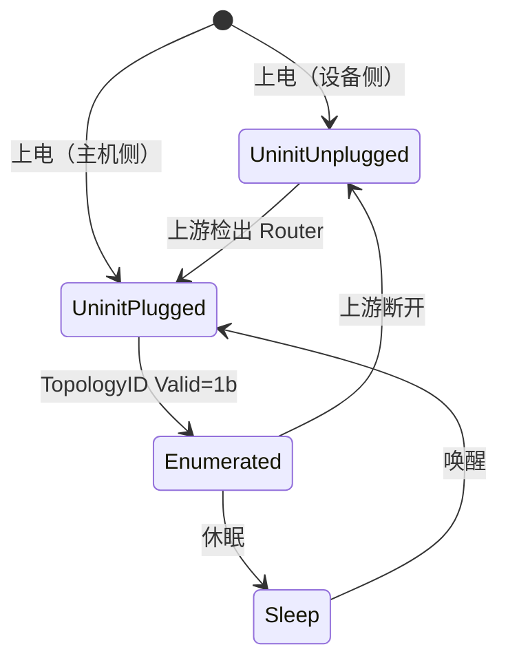
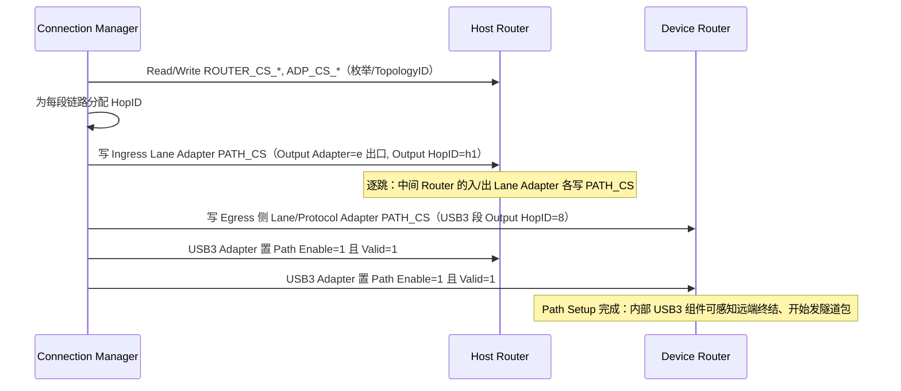

# USB4 规范级：配置空间与隧道

> 🌿 知识树位置: 树干 → 枝干[高速演进] → 叶
> 前置: [05-USB4深入-路由隧道与配置.md](05-USB4深入-路由隧道与配置.md) · 兄弟叶: [06-USB3x规范级-包格式与定时器.md](06-USB3x规范级-包格式与定时器.md)
> 树干基础: [../10-树干-USB核心/02-体系架构与分层模型.md](../10-树干-USB核心/02-体系架构与分层模型.md) · [../10-树干-USB核心/09-集线器与连接管理.md](../10-树干-USB核心/09-集线器与连接管理.md)
> 规范原文缓存索引: [../80-参考资料/README.md](../80-参考资料/README.md)

[05 叶](05-USB4深入-路由隧道与配置.md)讲了 USB4 的架构思想，本叶按 **USB4 v2 规范**（本地缓存 `80-参考资料/usb-core/USB4-Specification-v2-2025-11.zip` 内 `USB4 Specification 2.0 November 2025 - CLEAN.pdf`，下称 USB4 spec）逐寄存器、逐包下钻：传输层包头、四类配置空间、控制包类型、Path 建立流程与 USB3/PCIe/DP 三种隧道的封装细节。数值取自 PDF 解析；错位处显式标注，核实不了的不写。

## 1. 传输层包（Transport Layer Packet）包头

所有 USB4 包共享 4 字节传输层头（USB4 spec 表 5-2）：

| 位段 | 字段 | 说明 |
|---|---|---|
| 7:0 | Length | 载荷字节数（不含填充）；**00h 表示 256 B** |
| 15:8 | HEC | 头校验：8 位，多项式 07h、初值 00h、XorOut 55h，覆盖 bit31:8；可纠正**单比特**头错误 |
| 22:16 | HopID | 在一条链路上下文中唯一标识一条 Path（§5.2.2） |
| 26:23 | Rsvd | 0 |
| 27 | SuppID | 区分需要附加标识的链路管理包 |
| 31:28 | PDF | 协议定义字段：隧道包由协议适配层定义；控制包/链路管理包与 SuppID、HopID 共同决定包类型 |

载荷恒为 4 字节倍数（源适配器补 0~3 B 填充，目的端剥离，§5.1.2.2）。包分三类：Tunneled（协议适配层产生）、Control（配置层，PDF=1h~8h，见 §6）、Link Management（传输层自带，含 Time Sync，见 §11/TMU）。

## 2. 配置空间体系

| 配置空间 | 内容 | 寄存器前缀 | 章节（USB4 spec） |
|---|---|---|---|
| Router Configuration Space | 路由器全局属性 + 能力链表 | ROUTER_CS_n | §8.2.1 |
| Adapter Configuration Space | 每适配器属性 + 各协议能力 | ADP_CS_n 及 *_CS_n 能力组 | §8.2.2 |
| Path Configuration Space | 每适配器的 Path 表（每条 2 个 DW） | PATH_CS_n | §8.2.3 |
| Counters Configuration Space | 统计计数器组 | — | §8.2.4 |

- 结构均为"基本寄存器 + Next Capability Pointer 串起的 Capability 链表"（§8.2.1 图 8-1）。
- **只能通过控制包（Read/Write Request）访问**；CM（Connection Manager）即用这两个包完成全部枚举与配置（§6.4.2.3/6.4.2.5）。
- 控制包走 HopID 0（Path 0）：每个 Lane Adapter / Host Interface Adapter 必须支持（§8.2.3.1）。

### 2.1 Router 状态与枚举（§6.3）

| 状态 | 进入 | 行为 | 退出 |
|---|---|---|---|
| Uninitialized Unplugged | 上电且上游未连接 | 丢弃所有隧道包、移除全部 Path、配置空间恢复默认；Lane Adapter 处 CLd | 上游检出对端 Router（§4.1.2.2） |
| Uninitialized Plugged | 上电 / 休眠唤醒 / Host Router 复位 | 在所有已连接 Adapter 上做链路初始化 | **TopologyID Valid 位置 1** |
| Enumerated | TopologyID Valid=1b | 可在 Fabric 中路由隧道协议 | 上游断开（或 Host Router 复位） |
| Sleep | 休眠流程（§4.5） | 低功耗待机 | 唤醒事件 |

Device Router 复位/上电后配置空间回到默认值——这就是 CM 每次热插拔都要重新写一遍 TopologyID 与 Path 的原因（§6.7 枚举、§6.8 热插拔事件经 Notification Packet 上报）。

## 3. Router 配置空间寄存器组（表 8-3 摘录）

| 寄存器 | 位段 | 字段 | 属性 |
|---|---|---|---|
| ROUTER_CS_0 | 15:0 | Vendor ID（USB-IF 分配） | RO |
| ROUTER_CS_0 | 31:16 | Product ID（厂商分配） | RO |
| ROUTER_CS_1 | 7:0 | Next Capability Pointer（首个 Capability 的 DW 索引） | RO |
| ROUTER_CS_1 | 13:8 | Upstream Adapter（控制包上下行的适配器号） | RO |
| ROUTER_CS_1 | 19:14 | Max Adapter（最大适配器号） | RO |
| ROUTER_CS_1 | 22:20 | Depth（距 Host Router 跳数，须支持到 5） | R/W |
| ROUTER_CS_1 | 31:24 | Revision Number | RO |
| ROUTER_CS_2 | 31:0 | TopologyID Low | R/W |
| ROUTER_CS_3 | 23:0 | TopologyID High | R/W |
| ROUTER_CS_4 | — | Notification Timeout、CMUV、USB4 Version 等 | R/W·RO |

Router 能力链表（表 8-2）：**TMU Router Configuration（Capability ID = 03h，必选）**；Vendor Specific Capability / VSEC（可选）。

## 4. Adapter 配置空间

基本寄存器中的 ADP_CS_1 携带 **Adapter Type**（Type / Version / Sub-Type，表 8-10）。可靠配对的取值：

| 适配器 | Type | Version | Sub-Type |
|---|---|---|---|
| Unsupported Adapter | 00h | 00h | 00h |
| Lane Adapter | 00h | 00h | 01h |
| Host Interface Adapter | 10h | 01h | 01h |
| Downstream PCIe Adapter | 10h | 01h | 02h |
| Upstream PCIe Adapter | 0Eh | 01h | 01h |
| DP IN Adapter | 0Eh | 01h | 02h |
| DP OUT Adapter | 0Eh | 01h | 03h |
| USB3 Adapter（Down/Up） | 20h | 01h | 01h / 02h |
| Vendor Specific Adapter | FFh | — | — |

> **v2 结构变化（evolve #8 以 `-table` 模式重提取核实）**：v2 的 ADP_CS_2 已把旧版单字节 Adapter Type 拆为三字段——**7:0 Adapter Type Sub-type、15:8 Adapter Type Version、23:16 Adapter Type Protocol**（均 RO、编码见 Table 8-10），ADP_CS_2 的 31:24 Reserved 固定写 01h；v2 新增 **DP OUT AUX Adapter** 与 **USB3 Gen T Adapter**（21h 等新 Type 值）。上表为 v1 兼容取值；v2 三字段逐值仍以规范 Table 8-10 为准（提取文本仅见字段定义，取值行错位未定，已在 COVERAGE 记账）。

Adapter 级能力组（§8.2.2.2~8.2.2.8）：TMU Adapter Capability、Lane Adapter Configuration Capability、USB4 Port Capability、USB3 Gen X Adapter Configuration Capabilities、DP Adapter Configuration Capabilities、PCIe Adapter Configuration Capability、Vendor Specific Adapter Capability。

CM 写入约束（表 8-10 后的 CONNECTION MANAGER NOTE）：不得改 Non-Flow Controlled Buffers、Link Credits Allocated；Lane 1 Adapter 的基本寄存器不得写；Disable Hot Plug Events 等位必须在 Lock/Enable 置位**之前**写好。

## 5. Path 配置空间（PATH_CS_*）

每条 Path 在适配器里占 2 个 DW；Path 0 固定给控制包（HopID 0）。Lane Adapter 的 Path 条目 n（表 8-22，条目基址 2n）：

| DW | 位段 | 字段 | 说明 |
|---|---|---|---|
| PATH_CS_0 | 6:0 | Output HopID | 本段链路的**出方向** HopID |
| PATH_CS_0 | 10:7 | Rsvd | — |
| PATH_CS_0 | 16:11 | Output Adapter | 出方向适配器号 |
| PATH_CS_0 | 23:17 | Path Credits Allocated | Path 流控信用初值（入端生效） |
| PATH_CS_0 | 24 | PMPS（PM Packet Support） | 该 Path 是否"最后包须为 PM 包"才允许 CLx |
| PATH_CS_1 | 3:0 | Weight | 相同优先级内的加权份额 |
| PATH_CS_1 | 10:8 | Priority | QoS 优先级（RO） |
| PATH_CS_1 | 22:12 | Counter ID + CE[23] | 统计计数组选择/使能 |
| PATH_CS_1 | 26 / 27 | ISE / ESE | 入/出方向共享缓冲使能 |
| PATH_CS_1 | 31 | Valid | 条目生效位 |

协议适配器的条目结构相同（§8.2.3.3）。入端写"Output Adapter+Output HopID"，出端对称写——一条 Path 就这样逐跳"接力"。

## 6. Control Packet 类型表

控制包 = 传输层头（Length=10h、HopID=00h、SuppID=0）+ Route String High/Low + Control Data + **CRC-32**（多项式 1EDC6F41h、初值/XorOut FFFFFFFFh、RefIn/Out True，只覆盖 Route String 与数据，§6.4.2.2 表 6-1）。各类型按 PDF 区分（§6.4.2.3~6.4.2.12）：

| PDF | 包类型 | 要点 |
|---|---|---|
| 1h | Read Request / Read Response | Address（DW 地址）、Read Size（1~60 DW）、Adapter Num；响应带读回数据 |
| 2h | Write Request / Write Response | Write Size（1~60 DW）+ 写数据 |
| 3h | Notification（含 Hot Plug Acknowledgment 变体） | Event Code/Event Info，带 SN 位与防重放 Sequence |
| 4h | Notification Acknowledgement | 确认 Notification |
| 5h | Hot Plug Event | 热插拔上报（Adapter Num、PG 等） |
| 6h / 7h | Inter-Domain Request / Response | 跨 Domain 交互（v2） |
| 8h | Enhanced Notification Acknowledgement | 增强确认 |

Read Request 的 DW 级布局（表 6-2；Write Request 结构对称，数据 DW 在 Route String 之后）：

| DW | 位段 | 字段 | 说明 |
|---|---|---|---|
| 0 | 31:0 | 传输层头 | Length=10h，HopID=00h，SuppID=0b，PDF=1h |
| 1 / 2 | 31:0 | Route String High / Low | 目标 Router 的 TopologyID 路由串（§6.4.2.2） |
| 3 | 12:0 | Address | 目标配置寄存器的 **DW 地址** |
| 3 | 18:13 | Read Size | 读取的 DW 数（1~60） |
| 3 | 24:19 | Adapter Num | 目标适配器号 |
| 4… | — | Control Data / CRC | Read Response 中为读回数据 |

控制包路由：上游行包逐跳上送 CM，下行包按 Route String/TopologyID 下发（§6.4.3）；可靠性由重发机制保障（§6.4.4）。

## 7. Path 建立流程

以 USB3 隧道为例（USB4 spec §9.3.1 CONNECTION MANAGER NOTE、§8.2.3）：

要点：

- 两端协议适配器的 **Path Enable 与 Valid 都为 1** 才算建立完成（§9.3.1）。
- USB3 Gen X Path 必须用 Dedicated Flow Control Buffer Allocation 方案；USB4 端口→USB3 适配器一段的 Output HopID 固定为 **8**（§9.3.1）。
- 拆除：先把 Path Enable=0、Valid=1，CM 至少等 **500 ms** 再建新 USB3 Path（等内部端口回 Detect 态，§9.3.1/9.3.2）。

## 8. USB3 隧道

- 载体：Internal USB3 组件（xHCI 控制器 + 集成 SS hub）挂在 Router 的 USB3 Adapter 上；隧道包 PDF 取值（表 9-2）：

| PDF | 内容（Gen X） |
|---|---|
| 0h | LFPS 序列 / OOB 消息 |
| 1h | 一个 TS1、TS2 或 SDS 有序集 |
| 2h | 一个 USB3 Link Command（Gen T：1~4 个） |
| 3h | 一个 Header Packet（LMP/TP/Deferred DPH/ITP） |
| 4h / 5h / 6h | USB3 数据包的 Start / Middle / End 分段（>256 B 分段重组） |
| 7h | nullified DPH |
| Eh | 电源管理包（PM Packet） |

- 缓冲与信用：USB3 Adapter 缓冲深度由实现决定（推荐可配置，§9.1），Path 建立时以 Dedicated Flow Control Buffer Allocation 预留；credit 语义见 §8 的 Path Credits Allocated。
- 断链行为：上行口断开或 Path Enable=0 时，USB3 Adapter 移除远端终结指示，内部 hub 500 ms 内检出断开并对下行设备做复位/重连（§9.3.2）。
- **v2 新增 USB3 Gen T 隧道**（§9 相关节、表 9-12/9-13 时序），见 §12。

## 9. PCIe 隧道

- 封装 PDF（表 11-1）：1h=Ordered Set（EIOS/TS1/TS2 各一）、2h=电气空闲状态指示、3h=TLP/DLLP、4h=TLP Next（未装下的 TLP 续段）、5h/6h=PERST Active/Inactive、7h=EDB（nullified TLP）。
- TLP 封装修剪（§11.1.1.1）：去 STP 符号、4 个前导保留位与 END/EDB 符号，再追加 **TLP Pre-Header**（表 11-2）后放入隧道包载荷。
- 中断（§11）：PCIe Host Router 必须支持 MSI 或 MSI-X（或两者）；MSI 模式请求单个中断，MSI-X 模式支持至多 **16 个**中断向量，并配 ITR 中断节流寄存器。
- Downstream/Upstream PCIe Adapter 类型见 §4；CM 建立 PCIe Path 的方式与 §7 相同。

## 10. DP 隧道

- 适配器：DP IN（源侧）/ DP OUT（汇侧）；AUX 与 Main-Link 分开建 Path（§10.3.4.2 AUX Path Packets、§10.3.4.3 Main-Link Path Packets）。
- AUX 事务由适配器代为承载，AUX 延迟要求见 §10.4.4.4；DPCD 寄存器经"DPCD DP Tunneling over USB4"机制访问（§10.4.4.6）。
- **DP BW Allocation Mode**（§10.7）：以 DPCD 中的 Bandwidth Allocation 寄存器（表 10-24）协商带宽；适配器侧有 CMMS（CM BW Allocation Mode Support，R/W）等位（§10.7.1）。CM/DSC 据此在多条 DP Path 间仲裁带宽。
- v2 的 **High Speed Tunneling**（§10.5）统一承载 8b/10b SST、8b/10b MST 与 128b/132b 主链路（含 Sub-MTP TU 机制，§10.5.2.1）；MTP 帧槽位分配本叶不逐位复刻，见规范原文。

## 11. TMU 与时间同步

- 每个 Router 内含 **TMU（Time Management Unit）**负责时间同步操作；全 Fabric 以 Host Router 为时间源，同步层级沿生成树展开（§7.1、§7.1.1）。
- 同步载体 = 有序集 + **Time Sync Packet**（链路管理包，格式在 §7.3.3，不经 §8 的配置空间）；下游 Router 用本地时间戳 + 包内信息修正自身时钟（§7.1）。
- TMU 相关寄存器：Router 侧 TMU_RTR_CS_*（如 TMU_RTR_CS_12 携带 Computation Time Stamp Low）与 TMU Adapter Capability 组（§8.2.1.2/8.2.2.2）。
- **HiFi 精度配置值（evolve #8 自 v2 CLEAN PDF §8.2.2.2 提取）**：CM 在增强单向模式下应以下列值配置 TMU 至 HiFi Accuracy——Replenish Timeout=3125、Replenish Threshold=0、ReplenishN=30、DirSwitchN=255、AdapterTimeSyncInterval=16（且须在 Router Configuration Valid 置 1b 前写好）。
- v2 支持跨 Domain 时间同步（Inter-Domain，§7.1）：由各域 CM 协商选出全局时间源 Host Router。
- 具体同步精度（ns 级指标）在 §7.4 的参数表中，本地解析未提取到可靠数值，此处不列。

## 12. USB4 v2 相对 v1 的增量（速览）

一句话概括：**Gen 4 物理层（PAM-3 调制，双向对称 80 Gb/s，支持非对称链路如 120/40）+ USB3 Gen T 隧道 + 新 DP 高速隧道模式 + 跨 Domain 服务**。落点：PAM-3 星座与转换（§3，图 3-29/表 3-25）；非对称链路建立与对称↔非对称切换（§4.2.2.5/§4.2.2.6）；USB3 Gen T 隧道与新增时序参数（§9，表 9-12/9-13）；8b/10b MST 与 128b/132b 隧道（§10.5）；Gen 4 链路恢复（HEC 不可纠错时 Lane Adapter 进 Gen 4 Link Recovery 而非重训练，§5.1.2.1.1）；Inter-Domain Request/Response 控制包与 Inter-Domain Service（§6.4.2.11/6.4.2.12）。细节请直接读规范对应章节。

## 相关节点

- [05-USB4深入-路由隧道与配置.md](05-USB4深入-路由隧道与配置.md)：USB4/雷电整合的架构叙事
- [06-USB3x规范级-包格式与定时器.md](06-USB3x规范级-包格式与定时器.md)：USB3 头包与链路命令细节
- [04-USB3x包格式与LTSSM.md](04-USB3x包格式与LTSSM.md)：链路训练基础（TS1/TS2 语境）
- [../10-树干-USB核心/09-集线器与连接管理.md](../10-树干-USB核心/09-集线器与连接管理.md)：传统 hub 枚举与 USB4 Router 枚举对照
- [../30-枝干-接口与供电/05-AlternateMode与E-marker.md](../30-枝干-接口与供电/05-AlternateMode与E-marker.md)：DP Alt Mode 与 DP 隧道的关系
- [../90-附录/03-时序参数全表.md](../90-附录/03-时序参数全表.md)：跨协议定时参数总表
- [../80-参考资料/README.md](../80-参考资料/README.md)：USB4 规范缓存与获取

## 13. Inter-Domain Service：主机到主机网络（evolve #51）

USB4 v2 附带规范《Inter-Domain Service Protocol 2.0》（同一缓存 zip 内）定义了两台 Host Router 之间的服务发现与控制：典型形态是**两台 PC 用一根 USB4/雷电 线直连组网**。

- 包类型（§2）：Discovery（UUID Request/Response，双方交换域 UUID 与能力）、Properties Read（读取对端属性）、Properties Changed Notification、Link State Status/Change、Error Response；
- **USB4NET（§5.1）**：以太网帧 over USB4 隧道——支持 ≤1500B 标准帧与 **64KB 巨帧**两种封装（§5.1.5.1/5.1.5.2），Linux 侧呈现为虚拟网卡（thunderbolt-net 驱动）；
- 与 Host-to-Host 隧道的关系：Inter-Domain 协议跑在 H2H Path 之上（[05 篇](05-USB4深入-路由隧道与配置.md) §隧道四类）。
