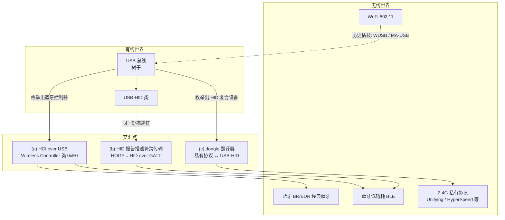
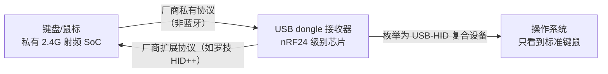
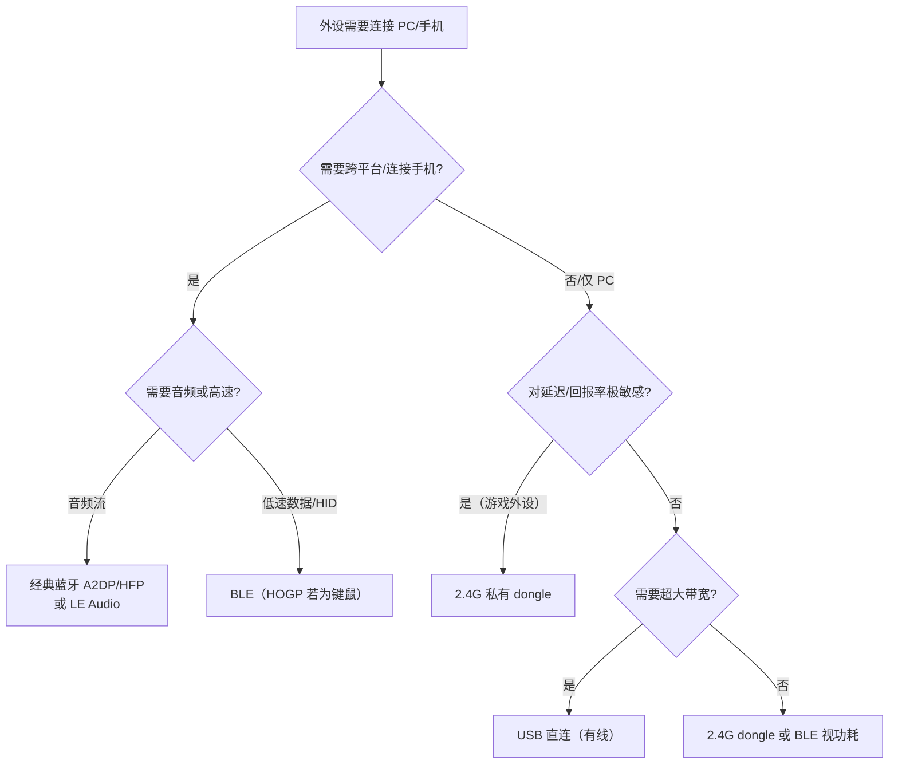

# 无线概览与 USB 交汇

> 🌿 知识树位置: 树干 → 枝干[无线关联] → 叶[00-无线概览]
> ⬆️ 父节点: 无（本枝干根节点，上承树干 [02-体系架构与分层模型](../10-树干-USB核心/02-体系架构与分层模型.md)）

---

## 一、必须先说清楚的一件事

**BLE（低功耗蓝牙，Bluetooth Low Energy）本身不依赖 USB。**它有自己的射频（RF, Radio Frequency）、链路层（LL, Link Layer）与主机协议栈（L2CAP/ATT/GATT），从协议学上看是一个独立王国。把它收进"USB 知识树"，是因为两者在现实产品中存在**三个不可回避的交汇点**：

| 交汇点 | 一句话概括 | 典型形态 |
|---|---|---|
| (a) 蓝牙适配器 | HCI（主机控制器接口，Host Controller Interface）跑在 USB 总线上 | USB 蓝牙 dongle、主板板载蓝牙 |
| (b) HID 跨传输 | 同一份 HID 报告描述符同时服务 USB 与 BLE（HOGP） | 双模键盘、蓝牙鼠标插线变有线 |
| (c) 2.4G 私有无线 dongle | 厂商私有射频协议 ↔ USB-HID 的"翻译器" | 罗技 Unifying、雷蛇 HyperSpeed 键鼠套装 |

本枝干第 1 篇即本文，专门把这三个交汇点讲透；后续 BLE 子树的 8 个文件专注 BLE 本体，只在必要处回扣 USB。

## 二、全景图

## 三、交汇点 (a)：蓝牙适配器 = HCI over USB

PC 上的蓝牙控制器几乎都挂在 USB 总线上（板载芯片内部也是 USB/PCIe 之一，USB 最普遍）。主机栈（Host）与控制器（Controller）之间通过 HCI 命令/事件/数据包交互，HCI 底层传输层（HCI Transport）选择 USB 时：

- **设备类**：无线控制器类（Wireless Controller），`bDeviceClass = 0xE0`，子类 `0x01`（RF Controller），协议 `0x01`（Bluetooth）。
- **端点布局**（惯例）：控制端点收发 HCI Command/Event，中断 IN 端点上送 HCI Event，批量端点搬运 ACL 数据，同步（ISO）端点承载经典蓝牙音频流。细节见专用文件。
- 操作系统视角：Linux 的 `btusb` 驱动、Windows 的蓝牙栈都通过这套接口加载固件（很多 dongle 枚举后还需 `bInterfaceNumber` 指定的厂商固件下载流程，如 Broadcom/Intel 的 `.hex/.dfu`）。

👉 详见：[05-蓝牙控制器类-HCIoverUSB](../20-枝干-设备类协议/其他设备类/05-蓝牙控制器类-HCIoverUSB.md)
BLE 子树中 HCI 的角色见：[01-蓝牙体系架构与HCI](BLE-低功耗蓝牙/01-蓝牙体系架构与HCI.md)

## 四、交汇点 (b)：HID 报告描述符跨传输

HID（人机接口设备，Human Interface Device）最优雅的设计之一是**报告描述符（Report Descriptor）与传输无关**：同一份描述符中的 Usage/Item 体系，既能通过 USB 中断端点传 Input/Output/Feature 报告，也能通过 BLE 的 GATT 特征（Report Map `0x2A4B`）传同样的报告字节。

- USB 侧：`GET_REPORT/SET_REPORT` 的 `wValue` = （报告类型高字节 + 报告 ID 低字节）。
- BLE 侧：HOGP（HID over GATT）用 Report Reference 描述符 `0x2908` 标注每个 Report 特征的（报告 ID + 报告类型），编码结构与 USB `wValue` **同构**。
- 于是同一颗键盘主控：USB 线插上走 USB-HID，拔线走 BLE-HOGP，描述符只维护一份。

👉 详见：[02-报告描述符与Item编码](../20-枝干-设备类协议/HID-人机接口设备/02-报告描述符与Item编码.md)、[10-HID跨传输I2C与BLE](../20-枝干-设备类协议/HID-人机接口设备/10-HID跨传输I2C与BLE.md)、本枝干 [07-HOGP-HIDoverGATT](BLE-低功耗蓝牙/07-HOGP-HIDoverGATT.md)

## 五、交汇点 (c)：2.4G 私有协议 dongle

"无线键鼠套装"（罗技 Unifying、雷蛇 HyperSpeed/Lightspeed、雷柏私有协议等）的方案结构：

要点：

1. **dongle 内是 nRF24 级别的 2.4G 私有协议芯片**（早期罗技 dongle 普遍采用 Nordic nRF24 系列），私有帧格式、私有跳频、私有加密（如 Unifying 的 AES-128），与蓝牙在空口上完全不兼容。
2. **OS 侧完全无感**：dongle 向 USB 枚举成一个标准 HID 复合设备（键盘接口 + 鼠标接口 + 厂商 HID 接口），走通用 HID 类驱动，**所以插上即用、不需要装驱动**。
3. **为什么厂商还要做私有协议**：延迟更低且可控（雷蛇 HyperSpeed 支持 8000Hz 回报率，远超 BLE HID 的常见水平）、功耗调优自由、可一对多配对（一个 dongle 带六件设备）、不受蓝牙栈版本拖累。
4. 代价：丢一个 dongle 这套设备就残废（近年罗技开始用"bolt"USB-C 接收器与跨机连接改善）；安全性曾被研究界点名（如 MouseJack 类漏洞后 Unifying 固件加入 AES）。

## 六、历史上的"正牌"无线 USB（一段话）

在 BLE 与 2.4G 私有方案胜出之前，USB-IF 推过两代正统的"无线 USB"：**Certified Wireless USB（WUSB，2005 规范，基于 UWB 超宽带，3 米 480Mbps）**和 **MA-USB（Media Agnostic USB，2014/2015，把 USB 映射到 WiGig 802.11ad 等任意介质）**，两者均未形成市场，是知识树上名副其实的"枯枝"——枯枝也要挂上去，原因见 [99-WirelessUSB与MA-USB历史](99-WirelessUSB与MA-USB历史.md)。

## 七、OS 视角：三种 dongle 的枚举形态对照

| | 蓝牙适配器 | 2.4G 私有 dongle | 双模键鼠的有线态 |
|---|---|---|---|
| 枚举出的设备 | Wireless Controller 类 0xE0/0x01/0x01 | HID 类复合设备（键+鼠+厂商接口） | HID 类复合设备 |
| 需要驱动 | OS 内置蓝牙栈（Linux btusb / Windows 蓝牙栈） | 无（通用 HID 驱动） | 无 |
| 报告从哪来 | 主机栈经 HCI→BLE 控制器→HOGP 取得 | dongle 收私有射频帧→翻译成 HID 报告 | 设备直接上报 |
| 断开形态 | 蓝牙断链，设备图标消失 | dongle 仍在，设备"永远插着" | 变回纯有线 |

## 八、常见误区澄清

1. **"Unifying 是蓝牙"** —— 错。Unifying/HyperSpeed 是私有 2.4G 协议，空口与蓝牙互不兼容；只是 dongle 恰好也是 USB 接口而已。
2. **"无线键鼠要装驱动"** —— 基础键鼠功能不需要：dongle 枚举为标准 HID，键值/滚轮/移动走标准报告。装驱动只是为了厂商扩展（宏、灯光、电量显示，如罗技 HID++ 协议，走厂商 HID 接口）。
3. **"蓝牙适配器就是个天线"** —— 它是完整的 BLE/BR-EDR 控制器（PHY+LL+HCI），协议栈另一半（L2CAP/ATT/GATT/SMP）跑在操作系统里。
4. **"BLE HID 走特殊通道"** —— 不特殊：在 PC 上 BLE 键鼠报告的路径是 `HOGP(GATT) → BLE 控制器 → HCI over USB → OS 蓝牙栈 → 内核 HID 子系统`，与 USB 有线键鼠最后汇入同一个 HID core。

## 九、选型决策树

| 维度 | USB 直连 | 经典蓝牙 BR/EDR | BLE | 2.4G 私有 dongle |
|---|---|---|---|---|
| 带宽 | 最高（GB 级） | ~2-3 Mbps（EDR） | ~0.7-1.4 Mbps 实效 | 厂商自定（通常 1-2 Mbps） |
| 延迟 | 最低 | 中 | 较高（连接间隔下限 7.5ms+） | 最低（游戏级 1ms 回报可达） |
| 功耗 | 无线外设不适用 | 高 | 极低 | 低（持续射频，比 BLE 耗电） |
| 跨手机/平板 | 否 | 是 | 是 | 否（无 dongle 槽） |
| 配对/驱动 | 即插即用 | 需配对 | 需配对 | 插 dongle 即用 |
| 典型产品 | 有线键鼠、U 盘 | 耳机、音箱 | 传感器、标签、BLE 键鼠 | 游戏键鼠、无线耳机仓 |

## 十、本枝干文件导航

| 文件 | 内容 |
|---|---|
| [00-无线概览与USB交汇](00-无线概览与USB交汇.md) | 本文：三类交汇点全景 |
| [99-WirelessUSB与MA-USB历史](99-WirelessUSB与MA-USB历史.md) | 枯枝：两代正统无线 USB 的兴亡 |
| [BLE-低功耗蓝牙/00-BLE概述](BLE-低功耗蓝牙/00-BLE概述.md) | 蓝牙版本史与 BLE 定位 |
| [01-蓝牙体系架构与HCI](BLE-低功耗蓝牙/01-蓝牙体系架构与HCI.md) | Controller/Host 架构、HCI、L2CAP |
| [02-链路层与物理层](BLE-低功耗蓝牙/02-链路层与物理层.md) | 频段、PHY、包结构、跳频、加密 |
| [03-广播与连接](BLE-低功耗蓝牙/03-广播与连接.md) | 广播 PDU、AD 结构、连接建立 |
| [04-ATT与GATT](BLE-低功耗蓝牙/04-ATT与GATT.md) | 属性协议与通用属性规范 |
| [05-GAP与连接管理](BLE-低功耗蓝牙/05-GAP与连接管理.md) | 角色、地址体系、发现与绑定 |
| [06-SMP安全与配对](BLE-低功耗蓝牙/06-SMP安全与配对.md) | 配对、密钥、加密与攻击面 |
| [07-HOGP-HIDoverGATT](BLE-低功耗蓝牙/07-HOGP-HIDoverGATT.md) | BLE 键鼠：回到 USB 知识树的主干道 |
| [08-经典蓝牙与BLE对比](BLE-低功耗蓝牙/08-经典蓝牙与BLE对比.md) | BR/EDR vs BLE、LE Audio、选型 |

## 相关节点

- [10-树干-USB核心/02-体系架构与分层模型](../10-树干-USB核心/02-体系架构与分层模型.md) —— 分层模型对照
- [10-树干-USB核心/08-枚举流程与标准请求](../10-树干-USB核心/08-枚举流程与标准请求.md) —— dongle 的枚举过程
- [20-枝干-设备类协议/其他设备类/05-蓝牙控制器类-HCIoverUSB](../20-枝干-设备类协议/其他设备类/05-蓝牙控制器类-HCIoverUSB.md)
- [20-枝干-设备类协议/HID-人机接口设备/10-HID跨传输I2C与BLE](../20-枝干-设备类协议/HID-人机接口设备/10-HID跨传输I2C与BLE.md)
- [99-WirelessUSB与MA-USB历史](99-WirelessUSB与MA-USB历史.md)
