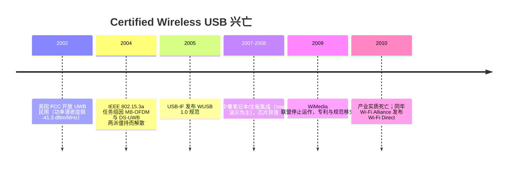

# Wireless USB 与 MA-USB 历史

> 🌿 知识树位置: 树干 → 枝干[无线关联] → 叶[99-历史枯枝]
> ⬆️ 父节点: [00-无线概览与USB交汇](00-无线概览与USB交汇.md)

---

本文记录两根"枯枝"：Certified Wireless USB（WUSB）与 MA-USB。它们是 USB-IF 官方推出、以"取代 USB 线缆"为目标的正牌无线方案，最终都没有成功。理解失败原因，比记住参数更有价值。

## 一、Certified Wireless USB（CWUSB / WUSB）

### 1.1 技术底座：UWB 超宽带

| 项目 | 内容 |
|---|---|
| 无线技术 | UWB（Ultra-Wideband，超宽带），工作频段 3.1~10.6 GHz |
| 波形方案 | WiMedia 联盟的 MB-OFDM（Multi-Band OFDM，多带正交频分复用），把频段切成 528 MHz 子带跳变 |
| 速率档位 | 53.3 / 80 / 110 / 160 / 200 / 320 / 400 / 480 Mbps（自适应），对外宣传口径"480 Mbps @ 3 m，110 Mbps @ 10 m"（标称，与 USB 2.0 对齐） |
| 规范 | USB-IF《Certified Wireless USB》1.0，2005 年 5 月发布 |
| 拓扑 | 一个主机簇（cluster）最多 127 个设备，通过 Hub-ish 的 DWA 可扩展 |
| 安全 | AES-128 链路加密，配对采用"线缆关联"（Cable Association，插一次线换密钥）或"数字关联"（输入 PIN） |

监管差异是先天硬伤：FCC（美国）2002 年开放全频段 3.1~10.6 GHz；欧盟与日本初期只批 3.1~4.8 GHz（配合 DCR 检测规避机制），上段（6~10 GHz，即 Band Group 3+）迟迟不放行——芯片要全球销售就必须多做频段组合，成本与上市时间双双恶化。

### 1.2 架构要点

WUSB 复刻了 USB 的主机中心模型：

- **HWA（Host Wire Adapter）**：主机侧适配器，把系统里的 USB 请求"搬运"到无线信道上，对操作系统表现为一个标准 USB 2.0 控制器。
- **DWA（Device Wire Adapter）**：设备侧适配器，让**普通有线 USB 设备**不用改硬件就能变成"无线设备"——这正是它的野心：存量 USB 外设免改造无线化。
- 对协议栈而言，枚举、标准请求、描述符全部沿用树干那套（见 [08-枚举流程与标准请求](../10-树干-USB核心/08-枚举流程与标准请求.md)），只是物理层从铜线换成了 UWB。

配套机制对照 USB 有线世界：

| 有线 USB | WUSB 对应物 |
|---|---|
| 集线器扩展 | 一个主机簇（cluster）直接管 127 设备 |
| 插入即枚举 | 设备"出现"在射频范围内时触发枚举 |
| 线缆即信任 | 配对即发密钥：Cable Association（插线换钥）或数字 PIN 关联 |
| 传输类型（控制/中断/批量/同步） | 同样四种，映射到 UWB 信道的时间片 |

### 1.3 UWB 阵营内战：两个"标准"

| 阵营 | 波形 | 代表厂商 | 结局 |
|---|---|---|---|
| WiMedia Alliance | MB-OFDM（多带 OFDM，528 MHz 子带跳频） | Intel、TI、NEC 等 | 被 USB-IF 采纳为 WUSB 底座 |
| UWB Forum | DS-UWB（直序列扩频） | Freescale、Motorola 等 | 另推"Cable-Free USB"，未成气候 |

IEEE 802.15.3a 任务组试图统一两者，2002 年立项、2006 年因两派无法达成 75% 多数而解散——UWB 短距高速标准在 IEEE 体系内**从未诞生**，只能靠产业联盟自治，这是后来生态失败的关键伏笔。

### 1.4 时间线

### 1.5 生态昙花

2007-2008 年间有少量真实产品：集成 WUSB 主机控制器的笔记本（以 Intel 演示与 OEM 试水为主）、D-Link/IOGEAR 等的 WUSB Hub 与适配器套件、无线外置光驱/硬盘盒。共同特征：贵（套件一两百美元级）、要插 dongle、驱动时常抽风——每一项都正好输给"一根 USB 线"。

### 1.6 失败原因（按重要性）

1. **频谱与监管先天不足**：FCC 2002 年规则把 UWB 功率压到噪声地板附近（-41.3 dBm/MHz），实际覆盖远达不到宣传的 10 米/110 Mbps；且各洲监管不一致，欧洲、日本早期只允许 3.1~4.8 GHz 下段（DCR 时代），WiMedia 方案要靠"全频段规划"（Band Group 扩展）补救，产品一再推迟。
2. **标准内战烧掉了时间窗口**：UWB 阵营自身分裂为 WiMedia（MB-OFDM，Intel/TI 阵营）与 UWB Forum（DS-UWB，Freescale/Motorola 阵营），IEEE 802.15.3a 无法统一，2006 年解散。三年黄金期耗在内斗上。
3. **芯片昂贵、功耗高**：OFDM 射频+基带早期单套 BOM 数十美元，功耗数倍于后来的 BLE 方案，笔记本厂商没有动力为一个"看不见提速"的场景埋单。
4. **对手太强**：同期 802.11n（Wi-Fi 4）把无线吞吐推到百 Mbps 实效并全面普及，"传文件"场景被 Wi-Fi 吃掉；2010 年 Wi-Fi Direct 发布，直接接管了"设备点对点直连"的定位。
5. **定位尴尬**：WUSB 主打"3 米内的高速外设线缆替代"，但键鼠需要的低功耗低延迟它给不了（那是后来 BLE 和 2.4G 私有方案的天下），显示器/硬盘需要的稳定性它又不及有线。

### 1.7 遗产

UWB 技术本身没有死，只是换赛道复活：2019 年后苹果 U1 芯片（AirDrop 定向、AirTag 精确查找）、汽车数字钥匙（CCC Digital Key 3.0 采用 FiRa 生态的 UWB/BLE 混合方案）让 UWB 以**厘米级测距/定位**的面目回归——和当年"当一根无线线缆"的定位完全不同。讽刺的是，今天的 UWB 设备普遍用 BLE 负责发现与配对、UWB 负责测距，WUSB 若地下有知，大概会承认这个分工比自己的原始设计合理。

WiMedia 联盟 2009 年停摆后，其规范在 2010 年 3 月正式移交给三家具乐部：蓝牙 SIG（想给蓝牙接高速底座）、USB-IF（WUSB 促进组）、OMA（高带宽内容分发）。蓝牙那边随后的选择颇具象征意义：**Bluetooth 3.0 + HS 最终用 802.11 做 AMP 高速通道，而不是 UWB**——"借用另一套无线做高速"这条路，蓝牙试过也放弃了，与 MA-USB 的命运互为注脚。

## 二、MA-USB（Media Agnostic USB）

| 项目 | 内容 |
|---|---|
| 全称 | Media Agnostic USB（介质无关 USB），USB-IF 规范（1.0 于 2015 年前后发布） |
| 思路 | 把 USB 的传输层语义（传输类型、数据包、流控）映射到**任意**高速介质之上，重点是 WiGig（IEEE 802.11ad，60 GHz，理论 7 Gbps） |
| 端到端 | 主机侧"MA-USB 主机控制器"对应一个 802.11ad 站点；设备侧同理；中间跑 MA-USB 协议头封装 |
| 生态 | Intel 等厂商推出过基于 802.11ad 的无线扩展坞（俗称 WiGig Dock：无线坞站同时输出显示、USB、网络），2015-2017 年短暂存在 |

MA-USB 的分层思路：USB 的端点/管道概念被映射为 MA-USB 的"通道（channel）"，控制/中断/批量/同步四种传输语义原样保留，再由底层 802.11ad 的 MAC 层搬运——即"**传输语义与介质解耦**"。同一时期 USB-IF 还推出过姊妹规范 DisplayLink 生态用的"MA-Display Port Extension"思路（把显示流也装进同一框架），但整套体系都未跨过规模化的门槛。

失败原因与 WUSB 高度同构：60 GHz 毫米波穿透性差（隔一堵墙即断）、要求收发器大致对准、模组成本高；同期 USB Type-C + USB 3.1（10 Gbps）+ DP Alt Mode 一根线全解决，"无线扩展坞"迅速退回小众。802.11ad 之后继任的 802.11ay 也未能让 MA-USB 起死回生，USB-IF 官网如今已很少再提该规范。

## 三、失败教训总结

| 教训 | WUSB | MA-USB | 后来的胜者怎么赢的 |
|---|---|---|---|
| 场景要窄而狠 | 想"全面替代 USB"，3m 高速场景太窄 | 依赖"无线坞站"单一场景 | BLE 锁死"纽扣电池十年"场景；2.4G 私有方案锁死"游戏级键鼠" |
| 成本与功耗是生死线 | UWB 芯片贵且耗电 | 60GHz 模组更贵 | BLE 单芯片几美分到几美元，µA 级睡眠 |
| 标准不能内战 | MB-OFDM vs DS-UWB 拖死 802.15.3a | 无内战但生不逢时 | 蓝牙 SIG 一家掌控，版本演进连续 |
| 有线在进步，无线要跑赢它 | USB 2.0 → USB 3.0 拉大差距 | Type-C/USB 3.1/DP Alt 合流 | 无线方案不与有线比带宽，比"无线才有的自由" |
| 生态靠存量兼容 | DWA 想兼容存量，本身成了累赘 | 坞站需专用模组 | HOGP 复用 HID 描述符，存量软件零改动 |

一句话：**无线外设市场最终被 BLE（低功耗/互操作）+ 2.4G 私有方案（低延迟/回报率）+ Wi-Fi Direct（直连传输）三方蚕食，而不是被"另一根无线线缆"接管。**

### 3.1 与最终胜者的参数对比

| 指标 | WUSB（2005） | MA-USB（2015） | BLE | 2.4G 私有方案 |
|---|---|---|---|---|
| 峰值速率 | 480 Mbps | ~Gbps（依赖 802.11ad） | 1~2 Mbps | 1~2 Mbps（私有帧） |
| 供电目标 | 外设级（有线替代） | 坞站级 | 纽扣电池数年 | 充电电池数月~数年 |
| 链路成本（当年口径） | 数十美元级 | 上百美元（模组） | 美元以下 | 美元以下 |
| 穿透/覆盖 | 差（UWB 被压到噪声级） | 极差（60 GHz 怕墙） | 好（2.4 GHz） | 好（2.4 GHz） |
| 主机侧生态 | 需要 WUSB 栈 + HWA | 需要专用驱动 | OS 内置 | 无感（枚举为 HID） |

结论一目了然：两代"无线 USB"输在成本与生态，赢家的护城河是"便宜到忽略不计 + 主机侧零驱动"。

## 四、为什么知识树保留这根枯枝

1. **完整性**：写"USB 与无线的关系"绕不开官方尝试过的路线，否则读者会误以为 2.4G dongle 或 BLE 就是"无线 USB"——它们在空口协议上都不是。
2. **避免重复发明**：WUSB 的"线缆关联配对"（插线换密钥）、MA-USB 的"传输语义与介质解耦"思想，在今天的 USB4 隧道、Wi-Fi 7 多链路等设计中仍能看到影子。
3. **决策参考**：每当有人想"再造一个无线 USB"，这两段历史就是最好的路障提示。

## 相关节点

- [00-无线概览与USB交汇](00-无线概览与USB交汇.md)
- [BLE-低功耗蓝牙/00-BLE概述](BLE-低功耗蓝牙/00-BLE概述.md)
- [10-树干-USB核心/01-概述与版本演进](../10-树干-USB核心/01-概述与版本演进.md) —— USB 自身版本演进对照
- [10-树干-USB核心/06-四种传输类型](../10-树干-USB核心/06-四种传输类型.md) —— MA-USB 封装的正是这套语义
- [10-树干-USB核心/08-枚举流程与标准请求](../10-树干-USB核心/08-枚举流程与标准请求.md)
